# exametrika

## Overview

The Exametrika package provides comprehensive test data engineering
tools, implementing the methods described in Shojima (2022). Test data
engineering analyzes test response patterns to understand item
characteristics and classify respondents.

## Features

The package implements various psychometric models and techniques:

### Basic Test Theory

- Classical Test Theory
- Item Response Theory (2PL, 3PL, 4PL models)

### Latent Structure Analysis

- Latent Class Analysis (LCA)
- Latent Rank Analysis (LRA)
- Biclustering and Ranklustering
- Infinite Relational Model (IRM) for optimal class/field determination

### Network and Dependency Analysis

- Bayesian Network Analysis
  - Structure Learning with Genetic Algorithm
  - Structure Learning with PBIL (Population-Based Incremental Learning)
- Local Dependence Models
  - Local Dependence Latent Rank Analysis (LDLRA)
  - Local Dependence Biclustering (LDB)
  - Bicluster Network Model (BINET)

## Background

Exametrika was originally developed and published as a Mathematica and
Excel Add-in. For additional information, visit:

- [Test Data Engineering Website](http://shojima.starfree.jp/tde/)
- [Package News](NEWS.md)

## Installation

The development version of Exametrika can be installed from
[GitHub](https://github.com/):

``` r
# Install devtools if not already installed
if (!require("devtools")) install.packages("devtools")

# Install Exametrika
devtools::install_github("kosugitti/exametrika")
```

## Data Format and Usage

### Basic Usage

``` r
library(exametrika)
```

### Data Requirements

Exametrika accepts both binary and polytomous response data:

- Binary data (0/1)
  - 0: Incorrect answer
  - 1: Correct answer
- Polytomous data
  - Ordinal response categories
  - Multiple score levels
- Missing values
  - NA values supported
  - Custom missing value codes can be specified

### Input Data Specifications

The package accepts data in several formats with the following features:

1.  **Data Structure**
    - Matrix or data.frame format
    - Response data (binary or polytomous)
    - Flexible handling of missing values
    - Support for various data types and structures
2.  **Optional Components**
    - Examinee ID column (default: first column)
    - Item weights (default: all weights = 1)
    - Item labels (default: sequential numbers)
    - Missing value indicator matrix

Note: Some analysis methods may have specific data type requirements.
Please refer to each function’s documentation for detailed requirements.

### Data Formatting

The `dataFormat` function preprocesses input data for analysis:

- **Functions**
  - Extracts and validates ID vectors if present
  - Processes item labels or assigns sequential numbers
  - Creates response data matrix U
  - Generates missing value indicator matrix Z
  - Handles item weights
  - Converts data to appropriate format for analysis

Example:

``` r
# Format raw data for analysis
data <- dataFormat(J15S500) # Using sample dataset
str(data) # View structure of formatted data
```

    ## List of 7
    ##  $ ID           : chr [1:500] "Student001" "Student002" "Student003" "Student004" ...
    ##  $ ItemLabel    : chr [1:15] "Item01" "Item02" "Item03" "Item04" ...
    ##  $ Z            : num [1:500, 1:15] 1 1 1 1 1 1 1 1 1 1 ...
    ##   ..- attr(*, "dimnames")=List of 2
    ##   .. ..$ : NULL
    ##   .. ..$ : chr [1:15] "Item01" "Item02" "Item03" "Item04" ...
    ##  $ w            : num [1:15] 1 1 1 1 1 1 1 1 1 1 ...
    ##  $ response.type: chr "binary"
    ##  $ categories   : Named int [1:15] 2 2 2 2 2 2 2 2 2 2 ...
    ##   ..- attr(*, "names")= chr [1:15] "Item01" "Item02" "Item03" "Item04" ...
    ##  $ U            : num [1:500, 1:15] 0 1 1 1 1 1 0 0 1 1 ...
    ##   ..- attr(*, "dimnames")=List of 2
    ##   .. ..$ : NULL
    ##   .. ..$ : chr [1:15] "Item01" "Item02" "Item03" "Item04" ...
    ##  - attr(*, "class")= chr [1:2] "exametrika" "exametrikaData"

### Sample Datasets

The package includes various sample datasets from Shojima (2022) for
testing and learning:

- **Naming Convention**: JxxSxxx format
  - J: Number of items (e.g., J15 = 15 items)
  - S: Sample size (e.g., S500 = 500 examinees)

Available datasets: - J5S10: Very small dataset (5 items, 10
examinees) - Useful for quick testing and understanding basic concepts -
J12S5000: Large sample dataset (12 items, 5000 examinees) - Suitable for
LDLRA and other advanced analyses - J14S500: Medium dataset (14 items,
500 examinees) - J15S500: Medium dataset (15 items, 500 examinees) -
Often used in IRT and LCA examples - J20S400: Medium dataset (20 items,
400 examinees) - J35S515: Large item dataset (35 items, 515 examinees) -
Used in Biclustering and network model examples

## Test Statistics

``` r
TestStatistics(J15S500)
```

    ## Test Statics
    ##                   value
    ## TestLength   15.0000000
    ## SampleSize  500.0000000
    ## Mean          9.6640000
    ## SEofMean      0.1190738
    ## Variance      7.0892826
    ## SD            2.6625707
    ## Skewness     -0.4116220
    ## Kurtosis     -0.4471624
    ## Min           2.0000000
    ## Max          15.0000000
    ## Range        13.0000000
    ## Q1.25%        8.0000000
    ## Median.50%   10.0000000
    ## Q3.75%       12.0000000
    ## IQR.75%       4.0000000
    ## Stanine.4%    5.0000000
    ## Stanine.11%   6.0000000
    ## Stanine.23%   7.0000000
    ## Stanine.40%   9.0000000
    ## Stanine.60%  11.0000000
    ## Stanine.77%  12.0000000
    ## Stanine.89%  13.0000000
    ## Stanine.96%  14.0000000

## ItemStatistics

``` r
ItemStatistics(J15S500)
```

    ## Item Statics
    ##    ItemLabel  NR   CRR  ODDs Threshold Entropy ITCrr
    ## 1     Item01 500 0.746 2.937    -0.662   0.818 0.375
    ## 2     Item02 500 0.754 3.065    -0.687   0.805 0.393
    ## 3     Item03 500 0.726 2.650    -0.601   0.847 0.321
    ## 4     Item04 500 0.776 3.464    -0.759   0.767 0.503
    ## 5     Item05 500 0.804 4.102    -0.856   0.714 0.329
    ## 6     Item06 500 0.864 6.353    -1.098   0.574 0.377
    ## 7     Item07 500 0.716 2.521    -0.571   0.861 0.483
    ## 8     Item08 500 0.588 1.427    -0.222   0.978 0.405
    ## 9     Item09 500 0.364 0.572     0.348   0.946 0.225
    ## 10    Item10 500 0.662 1.959    -0.418   0.923 0.314
    ## 11    Item11 500 0.286 0.401     0.565   0.863 0.455
    ## 12    Item12 500 0.274 0.377     0.601   0.847 0.468
    ## 13    Item13 500 0.634 1.732    -0.342   0.948 0.471
    ## 14    Item14 500 0.764 3.237    -0.719   0.788 0.485
    ## 15    Item15 500 0.706 2.401    -0.542   0.874 0.413

## CTT Example

``` r
CTT(J15S500)
```

    ## Realiability
    ##                 name value
    ## 1  Alpha(Covariance) 0.625
    ## 2         Alpha(Phi) 0.630
    ## 3 Alpha(Tetrachoric) 0.771
    ## 4  Omega(Covariance) 0.632
    ## 5         Omega(Phi) 0.637
    ## 6 Omega(Tetrachoric) 0.779
    ## 
    ## Reliability Excluding Item
    ##    IfDeleted Alpha.Covariance Alpha.Phi Alpha.Tetrachoric
    ## 1     Item01            0.613     0.618             0.762
    ## 2     Item02            0.609     0.615             0.759
    ## 3     Item03            0.622     0.628             0.770
    ## 4     Item04            0.590     0.595             0.742
    ## 5     Item05            0.617     0.624             0.766
    ## 6     Item06            0.608     0.613             0.754
    ## 7     Item07            0.594     0.600             0.748
    ## 8     Item08            0.611     0.616             0.762
    ## 9     Item09            0.642     0.645             0.785
    ## 10    Item10            0.626     0.630             0.773
    ## 11    Item11            0.599     0.606             0.751
    ## 12    Item12            0.597     0.603             0.748
    ## 13    Item13            0.597     0.604             0.753
    ## 14    Item14            0.593     0.598             0.745
    ## 15    Item15            0.607     0.612             0.759

## IRT Example

The IRT function estimates the number of parameters using a logistic
model, which can be specified using the `model` option. It supports 2PL,
3PL, and 4PL models.

``` r
result.IRT <- IRT(J15S500, model = 3)
result.IRT
```

    ## Item Parameters
    ##        slope location lowerAsym PSD(slope) PSD(location) PSD(lowerAsym)
    ## Item01 0.818   -0.834    0.2804      0.182         0.628         0.1702
    ## Item02 0.860   -1.119    0.1852      0.157         0.471         0.1488
    ## Item03 0.657   -0.699    0.3048      0.162         0.798         0.1728
    ## Item04 1.550   -0.949    0.1442      0.227         0.216         0.1044
    ## Item05 0.721   -1.558    0.2584      0.148         0.700         0.1860
    ## Item06 1.022   -1.876    0.1827      0.171         0.423         0.1577
    ## Item07 1.255   -0.655    0.1793      0.214         0.289         0.1165
    ## Item08 0.748   -0.155    0.1308      0.148         0.394         0.1077
    ## Item09 1.178    2.287    0.2930      0.493         0.423         0.0440
    ## Item10 0.546   -0.505    0.2221      0.131         0.779         0.1562
    ## Item11 1.477    1.090    0.0628      0.263         0.120         0.0321
    ## Item12 1.479    1.085    0.0462      0.245         0.115         0.0276
    ## Item13 0.898   -0.502    0.0960      0.142         0.272         0.0858
    ## Item14 1.418   -0.788    0.2260      0.248         0.291         0.1252
    ## Item15 0.908   -0.812    0.1531      0.159         0.383         0.1254
    ## 
    ## Item Fit Indices
    ##        model_log_like bench_log_like null_log_like model_Chi_sq null_Chi_sq
    ## Item01       -262.979       -240.190      -283.343       45.578      86.307
    ## Item02       -253.405       -235.436      -278.949       35.937      87.025
    ## Item03       -280.640       -260.906      -293.598       39.468      65.383
    ## Item04       -204.884       -192.072      -265.962       25.623     147.780
    ## Item05       -232.135       -206.537      -247.403       51.197      81.732
    ## Item06       -173.669       -153.940      -198.817       39.459      89.755
    ## Item07       -250.905       -228.379      -298.345       45.053     139.933
    ## Item08       -314.781       -293.225      -338.789       43.111      91.127
    ## Item09       -321.920       -300.492      -327.842       42.856      54.700
    ## Item10       -309.318       -288.198      -319.850       42.240      63.303
    ## Item11       -248.409       -224.085      -299.265       48.647     150.360
    ## Item12       -238.877       -214.797      -293.598       48.160     157.603
    ## Item13       -293.472       -262.031      -328.396       62.882     132.730
    ## Item14       -223.473       -204.953      -273.212       37.040     136.519
    ## Item15       -271.903       -254.764      -302.847       34.279      96.166
    ##        model_df null_df   NFI   RFI   IFI   TLI   CFI RMSEA    AIC    CAIC
    ## Item01       11      13 0.472 0.376 0.541 0.443 0.528 0.079 23.578 -22.805
    ## Item02       11      13 0.587 0.512 0.672 0.602 0.663 0.067 13.937 -32.446
    ## Item03       11      13 0.396 0.287 0.477 0.358 0.457 0.072 17.468 -28.915
    ## Item04       11      13 0.827 0.795 0.893 0.872 0.892 0.052  3.623 -42.759
    ## Item05       11      13 0.374 0.260 0.432 0.309 0.415 0.086 29.197 -17.186
    ## Item06       11      13 0.560 0.480 0.639 0.562 0.629 0.072 17.459 -28.924
    ## Item07       11      13 0.678 0.620 0.736 0.683 0.732 0.079 23.053 -23.330
    ## Item08       11      13 0.527 0.441 0.599 0.514 0.589 0.076 21.111 -25.272
    ## Item09       11      13 0.217 0.074 0.271 0.097 0.236 0.076 20.856 -25.527
    ## Item10       11      13 0.333 0.211 0.403 0.266 0.379 0.075 20.240 -26.143
    ## Item11       11      13 0.676 0.618 0.730 0.676 0.726 0.083 26.647 -19.736
    ## Item12       11      13 0.694 0.639 0.747 0.696 0.743 0.082 26.160 -20.223
    ## Item13       11      13 0.526 0.440 0.574 0.488 0.567 0.097 40.882  -5.501
    ## Item14       11      13 0.729 0.679 0.793 0.751 0.789 0.069 15.040 -31.343
    ## Item15       11      13 0.644 0.579 0.727 0.669 0.720 0.065 12.279 -34.104
    ##            BIC
    ## Item01 -22.783
    ## Item02 -32.424
    ## Item03 -28.893
    ## Item04 -42.737
    ## Item05 -17.164
    ## Item06 -28.902
    ## Item07 -23.308
    ## Item08 -25.250
    ## Item09 -25.505
    ## Item10 -26.121
    ## Item11 -19.714
    ## Item12 -20.201
    ## Item13  -5.479
    ## Item14 -31.321
    ## Item15 -34.082
    ## 
    ## Model Fit Indices
    ##                    value
    ## model_log_like -3880.769
    ## bench_log_like -3560.005
    ## null_log_like  -4350.217
    ## model_Chi_sq     641.528
    ## null_Chi_sq     1580.424
    ## model_df         165.000
    ## null_df          195.000
    ## NFI                0.594
    ## RFI                0.520
    ## IFI                0.663
    ## TLI                0.594
    ## CFI                0.656
    ## RMSEA              0.076
    ## AIC              311.528
    ## CAIC            -384.212
    ## BIC             -383.883

The estimated population of subjects is included in the returned object.

``` r
head(result.IRT$ability)
```

    ##       tmp$ID         EAP       PSD
    ## 1 Student001 -0.75526199 0.5805691
    ## 2 Student002 -0.17398880 0.5473601
    ## 3 Student003  0.01382147 0.5530498
    ## 4 Student004  0.57628195 0.5749107
    ## 5 Student005 -0.97449575 0.5915604
    ## 6 Student006  0.85232717 0.5820530

The plots offer options for Item Characteristic Curves (ICC), Item
Information Curves (IIC), and Test Information Curves (TIC), which can
be specified through options. Items can be specified using the `items`
argument, and if not specified, plots will be drawn for all items. The
number of rows and columns for dividing the plotting area can be
specified using `nr` and `nc`, respectively.

``` r
plot(result.IRT, type = "ICC", items = 1:6, nc = 2, nr = 3)
```

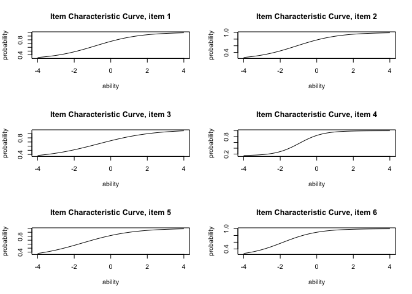<!-- -->

``` r
plot(result.IRT, type = "IIC", items = 1:6, nc = 2, nr = 3)
```

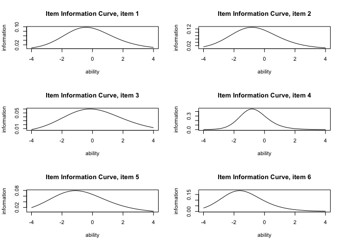<!-- -->

``` r
plot(result.IRT, type = "TIC")
```

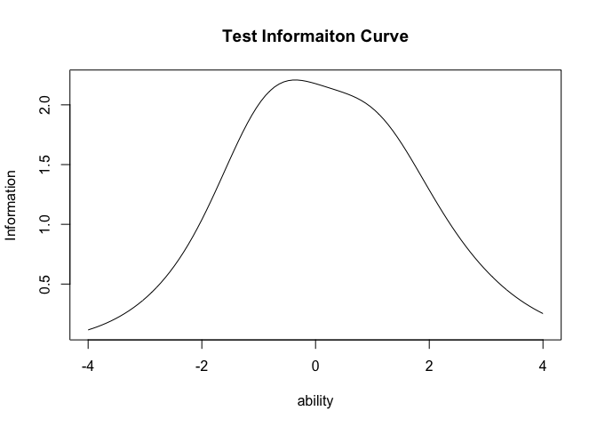<!-- -->

## LCA Example

Latent Class Analysis requires specifying the dataset and the number of
classes.

``` r
LCA(J15S500, ncls = 5)
```

    ## 
    ## Item Reference Profile
    ##          IRP1   IRP2    IRP3  IRP4  IRP5
    ## Item01 0.5185 0.6996 0.76358 0.856 0.860
    ## Item02 0.5529 0.6276 0.81161 0.888 0.855
    ## Item03 0.7959 0.3205 0.93735 0.706 0.849
    ## Item04 0.5069 0.5814 0.86940 0.873 1.000
    ## Item05 0.6154 0.7523 0.94673 0.789 0.886
    ## Item06 0.6840 0.7501 0.94822 1.000 0.907
    ## Item07 0.4832 0.4395 0.83377 0.874 0.900
    ## Item08 0.3767 0.3982 0.62563 0.912 0.590
    ## Item09 0.3107 0.3980 0.26616 0.165 0.673
    ## Item10 0.5290 0.5341 0.76134 0.677 0.781
    ## Item11 0.1007 0.0497 0.00132 0.621 0.623
    ## Item12 0.0355 0.1673 0.15911 0.296 0.673
    ## Item13 0.2048 0.5490 0.89445 0.672 0.784
    ## Item14 0.3508 0.7384 0.77159 0.904 1.000
    ## Item15 0.3883 0.6077 0.82517 0.838 0.823
    ## 
    ## Test Profile
    ##                               Class 1 Class 2 Class 3 Class 4 Class 5
    ## Test Reference Profile          6.453   7.613  10.415  11.072  12.205
    ## Latent Class Ditribution       87.000  97.000 125.000  91.000 100.000
    ## Class Membership Distribution  90.372  97.105 105.238 102.800 104.484
    ## 
    ## Item Fit Indices
    ##        model_log_like bench_log_like null_log_like model_Chi_sq null_Chi_sq
    ## Item01       -264.179       -240.190      -283.343       47.978      86.307
    ## Item02       -256.363       -235.436      -278.949       41.853      87.025
    ## Item03       -237.888       -260.906      -293.598      -46.037      65.383
    ## Item04       -208.536       -192.072      -265.962       32.928     147.780
    ## Item05       -226.447       -206.537      -247.403       39.819      81.732
    ## Item06       -164.762       -153.940      -198.817       21.644      89.755
    ## Item07       -249.377       -228.379      -298.345       41.997     139.933
    ## Item08       -295.967       -293.225      -338.789        5.483      91.127
    ## Item09       -294.250       -300.492      -327.842      -12.484      54.700
    ## Item10       -306.985       -288.198      -319.850       37.574      63.303
    ## Item11       -187.202       -224.085      -299.265      -73.767     150.360
    ## Item12       -232.307       -214.797      -293.598       35.020     157.603
    ## Item13       -267.647       -262.031      -328.396       11.232     132.730
    ## Item14       -203.468       -204.953      -273.212       -2.969     136.519
    ## Item15       -268.616       -254.764      -302.847       27.705      96.166
    ##        model_df null_df   NFI   RFI   IFI   TLI   CFI RMSEA     AIC     CAIC
    ## Item01        9      13 0.444 0.197 0.496 0.232 0.468 0.093  29.978   -7.972
    ## Item02        9      13 0.519 0.305 0.579 0.359 0.556 0.086  23.853  -14.097
    ## Item03        9      13 1.000 1.000 1.000 1.000 1.000 0.000 -64.037 -101.987
    ## Item04        9      13 0.777 0.678 0.828 0.744 0.822 0.073  14.928  -23.022
    ## Item05        9      13 0.513 0.296 0.576 0.352 0.552 0.083  21.819  -16.130
    ## Item06        9      13 0.759 0.652 0.843 0.762 0.835 0.053   3.644  -34.305
    ## Item07        9      13 0.700 0.566 0.748 0.625 0.740 0.086  23.997  -13.952
    ## Item08        9      13 0.940 0.913 1.000 1.000 1.000 0.000 -12.517  -50.466
    ## Item09        9      13 1.000 1.000 1.000 1.000 1.000 0.000 -30.484  -68.433
    ## Item10        9      13 0.406 0.143 0.474 0.179 0.432 0.080  19.574  -18.375
    ## Item11        9      13 1.000 1.000 1.000 1.000 1.000 0.000 -91.767 -129.716
    ## Item12        9      13 0.778 0.679 0.825 0.740 0.820 0.076  17.020  -20.930
    ## Item13        9      13 0.915 0.878 0.982 0.973 0.981 0.022  -6.768  -44.717
    ## Item14        9      13 1.000 1.000 1.000 1.000 1.000 0.000 -20.969  -58.919
    ## Item15        9      13 0.712 0.584 0.785 0.675 0.775 0.065   9.705  -28.244
    ##             BIC
    ## Item01   -7.954
    ## Item02  -14.079
    ## Item03 -101.969
    ## Item04  -23.004
    ## Item05  -16.112
    ## Item06  -34.287
    ## Item07  -13.934
    ## Item08  -50.448
    ## Item09  -68.415
    ## Item10  -18.357
    ## Item11 -129.698
    ## Item12  -20.912
    ## Item13  -44.699
    ## Item14  -58.901
    ## Item15  -28.226
    ## 
    ## Model Fit Indices
    ## Number of Latent class: 5
    ## Number of EM cycle: 73 
    ##                    value
    ## model_log_like -3663.994
    ## bench_log_like -3560.005
    ## null_log_like  -4350.217
    ## model_Chi_sq     207.977
    ## null_Chi_sq     1580.424
    ## model_df         135.000
    ## null_df          195.000
    ## NFI                0.868
    ## RFI                0.810
    ## IFI                0.950
    ## TLI                0.924
    ## CFI                0.947
    ## RMSEA              0.033
    ## AIC              -62.023
    ## CAIC            -631.265
    ## BIC             -630.995

The returned object contains the Class Membership Matrix, which
indicates which latent class each subject belongs to. The Estimate
includes the one with the highest membership probability.

``` r
result.LCA <- LCA(J15S500, ncls = 5)
head(result.LCA$Students)
```

    ##      Membership 1 Membership 2 Membership 3 Membership 4 Membership 5 Estimate
    ## [1,] 0.7839477684  0.171152798  0.004141844 4.075759e-02 3.744590e-12        1
    ## [2,] 0.0347378747  0.051502214  0.836022799 7.773694e-02 1.698776e-07        3
    ## [3,] 0.0146307878  0.105488644  0.801853496 3.343026e-02 4.459682e-02        3
    ## [4,] 0.0017251650  0.023436459  0.329648386 3.656488e-01 2.795412e-01        4
    ## [5,] 0.2133830569  0.784162066  0.001484616 2.492073e-08 9.702355e-04        2
    ## [6,] 0.0003846482  0.001141448  0.001288901 8.733869e-01 1.237981e-01        4

The plots offer options for IRP, CMP, TRP, and LCD. For more details on
each, please refer to Shojima (2022).

``` r
plot(result.LCA, type = "IRP", items = 1:6, nc = 2, nr = 3)
```

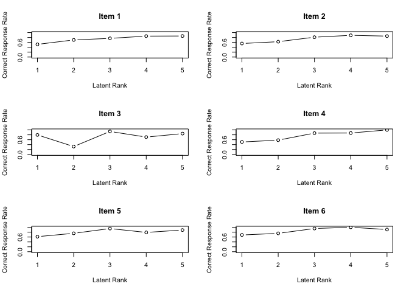<!-- -->

``` r
plot(result.LCA, type = "CMP", students = 1:9, nc = 3, nr = 3)
```

<!-- -->

``` r
plot(result.LCA, type = "TRP")
```

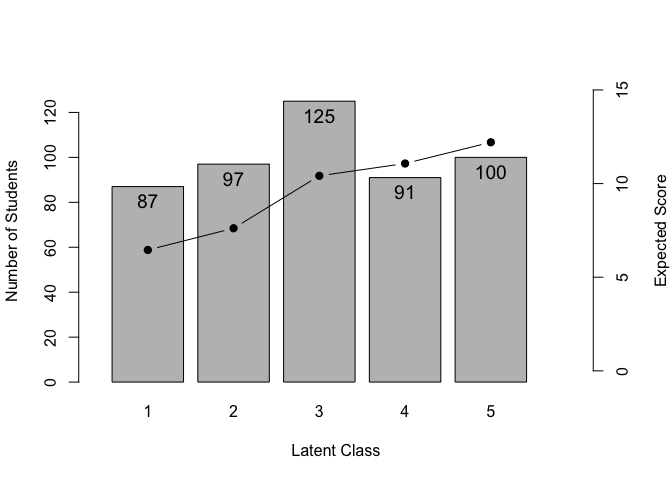<!-- -->

``` r
plot(result.LCA, type = "LCD")
```

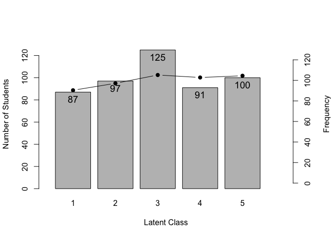<!-- -->

## LRA Example

Latent Class Analysis requires specifying the dataset and the number of
classes.

``` r
LRA(J15S500, nrank = 6)
```

    ## estimating method is  GTMItem Reference Profile
    ##          IRP1   IRP2  IRP3  IRP4  IRP5  IRP6
    ## Item01 0.5851 0.6319 0.708 0.787 0.853 0.898
    ## Item02 0.5247 0.6290 0.755 0.845 0.883 0.875
    ## Item03 0.6134 0.6095 0.708 0.773 0.801 0.839
    ## Item04 0.4406 0.6073 0.794 0.882 0.939 0.976
    ## Item05 0.6465 0.7452 0.821 0.837 0.862 0.905
    ## Item06 0.6471 0.7748 0.911 0.967 0.963 0.915
    ## Item07 0.4090 0.5177 0.720 0.840 0.890 0.900
    ## Item08 0.3375 0.4292 0.602 0.713 0.735 0.698
    ## Item09 0.3523 0.3199 0.298 0.282 0.377 0.542
    ## Item10 0.4996 0.5793 0.686 0.729 0.717 0.753
    ## Item11 0.0958 0.0793 0.136 0.286 0.472 0.617
    ## Item12 0.0648 0.0982 0.156 0.239 0.421 0.636
    ## Item13 0.2908 0.4842 0.715 0.773 0.750 0.778
    ## Item14 0.4835 0.5949 0.729 0.849 0.933 0.977
    ## Item15 0.3981 0.5745 0.756 0.827 0.835 0.834
    ## 
    ## Item Reference Profile Indices
    ##        Alpha      A Beta     B Gamma        C
    ## Item01     3 0.0786    1 0.585   0.0  0.00000
    ## Item02     2 0.1264    1 0.525   0.2 -0.00787
    ## Item03     2 0.0987    2 0.610   0.2 -0.00391
    ## Item04     2 0.1864    1 0.441   0.0  0.00000
    ## Item05     1 0.0987    1 0.647   0.0  0.00000
    ## Item06     2 0.1362    1 0.647   0.4 -0.05198
    ## Item07     2 0.2028    2 0.518   0.0  0.00000
    ## Item08     2 0.1731    2 0.429   0.2 -0.03676
    ## Item09     5 0.1646    6 0.542   0.6 -0.07002
    ## Item10     2 0.1069    1 0.500   0.2 -0.01244
    ## Item11     4 0.1867    5 0.472   0.2 -0.01650
    ## Item12     5 0.2146    5 0.421   0.0  0.00000
    ## Item13     2 0.2310    2 0.484   0.2 -0.02341
    ## Item14     2 0.1336    1 0.484   0.0  0.00000
    ## Item15     2 0.1817    2 0.574   0.2 -0.00123
    ## 
    ## Test Profile
    ##                               Class 1 Class 2 Class 3 Class 4 Class 5 Class 6
    ## Test Reference Profile          6.389   7.675   9.496  10.631  11.432  12.144
    ## Latent Class Ditribution       96.000  60.000  91.000  77.000  73.000 103.000
    ## Class Membership Distribution  83.755  78.691  81.853  84.918  84.238  86.545
    ## 
    ## Item Fit Indices
    ##        model_log_like bench_log_like null_log_like model_Chi_sq null_Chi_sq
    ## Item01       -264.495       -240.190      -283.343       48.611      86.307
    ## Item02       -253.141       -235.436      -278.949       35.409      87.025
    ## Item03       -282.785       -260.906      -293.598       43.758      65.383
    ## Item04       -207.082       -192.072      -265.962       30.021     147.780
    ## Item05       -234.902       -206.537      -247.403       56.730      81.732
    ## Item06       -168.218       -153.940      -198.817       28.556      89.755
    ## Item07       -250.864       -228.379      -298.345       44.970     139.933
    ## Item08       -312.621       -293.225      -338.789       38.791      91.127
    ## Item09       -317.600       -300.492      -327.842       34.216      54.700
    ## Item10       -309.654       -288.198      -319.850       42.910      63.303
    ## Item11       -242.821       -224.085      -299.265       37.472     150.360
    ## Item12       -236.522       -214.797      -293.598       43.451     157.603
    ## Item13       -287.782       -262.031      -328.396       51.502     132.730
    ## Item14       -221.702       -204.953      -273.212       33.499     136.519
    ## Item15       -267.793       -254.764      -302.847       26.059      96.166
    ##        model_df null_df   NFI   RFI   IFI   TLI   CFI RMSEA    AIC    CAIC
    ## Item01    9.233      13 0.437 0.207 0.489 0.244 0.463 0.092 30.146  -8.785
    ## Item02    9.233      13 0.593 0.427 0.664 0.502 0.646 0.075 16.944 -21.987
    ## Item03    9.233      13 0.331 0.058 0.385 0.072 0.341 0.087 25.293 -13.638
    ## Item04    9.233      13 0.797 0.714 0.850 0.783 0.846 0.067 11.555 -27.375
    ## Item05    9.233      13 0.306 0.023 0.345 0.027 0.309 0.102 38.264  -0.667
    ## Item06    9.233      13 0.682 0.552 0.760 0.646 0.748 0.065 10.091 -28.840
    ## Item07    9.233      13 0.679 0.548 0.727 0.604 0.718 0.088 26.504 -12.427
    ## Item08    9.233      13 0.574 0.401 0.639 0.467 0.622 0.080 20.326 -18.605
    ## Item09    9.233      13 0.374 0.119 0.451 0.156 0.401 0.074 15.751 -23.180
    ## Item10    9.233      13 0.322 0.046 0.377 0.057 0.330 0.085 24.445 -14.486
    ## Item11    9.233      13 0.751 0.649 0.800 0.711 0.794 0.078 19.006 -19.925
    ## Item12    9.233      13 0.724 0.612 0.769 0.667 0.763 0.086 24.985 -13.946
    ## Item13    9.233      13 0.612 0.454 0.658 0.503 0.647 0.096 33.037  -5.894
    ## Item14    9.233      13 0.755 0.654 0.809 0.723 0.804 0.073 15.034 -23.897
    ## Item15    9.233      13 0.729 0.618 0.806 0.715 0.798 0.060  7.593 -31.338
    ##            BIC
    ## Item01  -8.767
    ## Item02 -21.969
    ## Item03 -13.620
    ## Item04 -27.357
    ## Item05  -0.648
    ## Item06 -28.822
    ## Item07 -12.408
    ## Item08 -18.587
    ## Item09 -23.162
    ## Item10 -14.467
    ## Item11 -19.906
    ## Item12 -13.927
    ## Item13  -5.875
    ## Item14 -23.879
    ## Item15 -31.319
    ## 
    ## Model Fit Indices
    ## Number of Latent class: 6
    ## Number of EM cycle: 17 
    ##                    value
    ## model_log_like -3857.982
    ## bench_log_like -3560.005
    ## null_log_like  -4350.217
    ## model_Chi_sq     595.954
    ## null_Chi_sq     1580.424
    ## model_df         138.491
    ## null_df          195.000
    ## NFI                0.623
    ## RFI                0.469
    ## IFI                0.683
    ## TLI                0.535
    ## CFI                0.670
    ## RMSEA              0.081
    ## AIC              318.973
    ## CAIC            -264.989
    ## BIC             -264.712

The estimated subject rank membership probabilities and plots are almost
the same as those in LCA (Latent Class Analysis). Since a ranking is
assumed for the latent classes, rank-up odds and rank-down odds are
calculated.

``` r
result.LRA <- LRA(J15S500, nrank = 6)
head(result.LRA$Students)
```

    ##            Membership 1 Membership 2 Membership 3 Membership 4 Membership 5
    ## Student001 0.2704649921  0.357479353   0.27632327  0.084988078  0.010069050
    ## Student002 0.0276546965  0.157616072   0.47438958  0.279914853  0.053715813
    ## Student003 0.0228189795  0.138860955   0.37884545  0.284817610  0.120794858
    ## Student004 0.0020140858  0.015608542   0.09629429  0.216973334  0.362406292
    ## Student005 0.5582996437  0.397431414   0.03841668  0.003365601  0.001443909
    ## Student006 0.0003866603  0.003168853   0.04801344  0.248329964  0.428747502
    ##            Membership 6 Estimate Rank-Up Odds Rank-Down Odds
    ## Student001 0.0006752546        2    0.7729769      0.7565891
    ## Student002 0.0067089816        3    0.5900527      0.3322503
    ## Student003 0.0538621490        3    0.7518042      0.3665372
    ## Student004 0.3067034562        5    0.8462973      0.5987019
    ## Student005 0.0010427491        1    0.7118604             NA
    ## Student006 0.2713535842        5    0.6328983      0.5791986

``` r
plot(result.LRA, type = "IRP", items = 1:6, nc = 2, nr = 3)
```

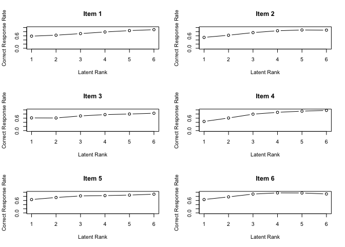<!-- -->

``` r
plot(result.LRA, type = "RMP", students = 1:9, nc = 3, nr = 3)
```

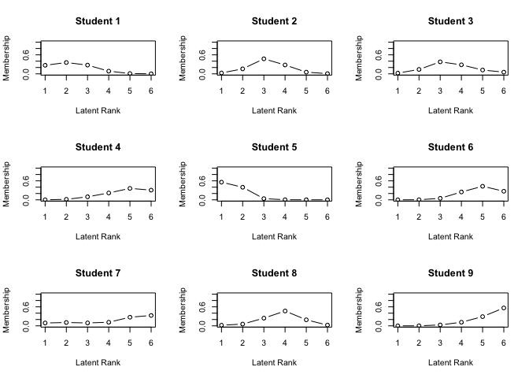<!-- -->

``` r
plot(result.LRA, type = "TRP")
```

<!-- -->

``` r
plot(result.LRA, type = "LRD")
```

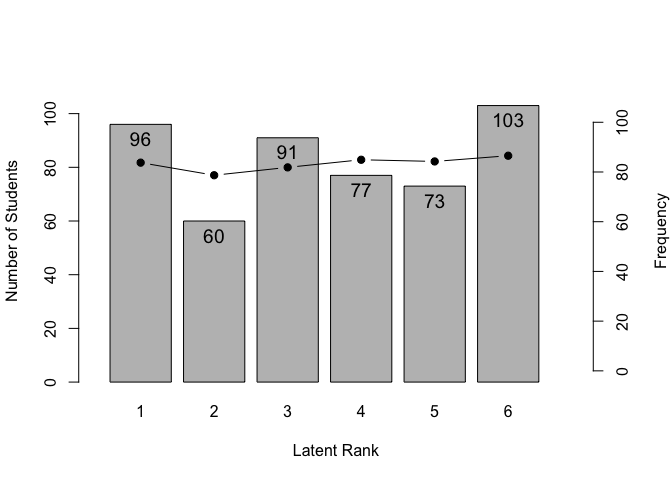<!-- -->

## Biclustering Example

Biclustering and Ranklustering algorithms are almost the same, differing
only in whether they include a filtering matrix or not. The difference
is specified using the `method` option in the `Biclustering()` function.
For more details, please refer to the help documentation.

``` r
Biclustering(J35S515, nfld = 5, ncls = 6, method = "B")
```

    ## Biclustering is chosen.

    ## iter 1 logLik -7966.66iter 2 logLik -7442.38iter 3 logLik -7266.35iter 4 logLik -7151.01iter 5 logLik -7023.94iter 6 logLik -6984.82iter 7 logLik -6950.27iter 8 logLik -6939.34iter 9 logLik -6930.89iter 10 logLik -6923.5iter 11 logLik -6914.56iter 12 logLik -6908.89iter 13 logLik -6906.84iter 14 logLik -6905.39iter 15 logLik -6904.24iter 16 logLik -6903.28iter 17 logLik -6902.41iter 18 logLik -6901.58iter 19 logLik -6900.74iter 20 logLik -6899.86iter 21 logLik -6898.9iter 22 logLik -6897.84iter 23 logLik -6896.66iter 24 logLik -6895.35iter 25 logLik -6893.92iter 26 logLik -6892.4iter 27 logLik -6890.85iter 28 logLik -6889.32iter 29 logLik -6887.9iter 30 logLik -6886.66iter 31 logLik -6885.67iter 32 logLik -6884.98iter 33 logLik -6884.58iter 33 logLik -6884.58

    ## Bicluster Matrix Profile
    ##        Class1 Class2 Class3 Class4 Class5 Class6
    ## Field1 0.6236 0.8636 0.8718  0.898  0.952  1.000
    ## Field2 0.0627 0.3332 0.4255  0.919  0.990  1.000
    ## Field3 0.2008 0.5431 0.2281  0.475  0.706  1.000
    ## Field4 0.0495 0.2455 0.0782  0.233  0.648  0.983
    ## Field5 0.0225 0.0545 0.0284  0.043  0.160  0.983
    ## 
    ## Field Reference Profile Indices
    ##        Alpha     A Beta     B Gamma       C
    ## Field1     1 0.240    1 0.624   0.0  0.0000
    ## Field2     3 0.493    3 0.426   0.0  0.0000
    ## Field3     1 0.342    4 0.475   0.2 -0.3149
    ## Field4     4 0.415    5 0.648   0.2 -0.1673
    ## Field5     5 0.823    5 0.160   0.2 -0.0261
    ## 
    ##                               Class 1 Class 2 Class 3 Class 4 Class 5 Class 6
    ## Test Reference Profile          4.431  11.894   8.598  16.002  23.326  34.713
    ## Latent Class Ditribution      157.000  64.000  82.000 106.000  89.000  17.000
    ## Class Membership Distribution 146.105  73.232  85.753 106.414  86.529  16.968
    ## Latent Field Distribution
    ##            Field 1 Field 2 Field 3 Field 4 Field 5
    ## N of Items       3       8       7      10       7
    ## 
    ## Model Fit Indices
    ## Number of Latent Class : 6
    ## Number of Latent Field: 5
    ## Number of EM cycle: 33 
    ##                    value
    ## model_log_like -6884.582
    ## bench_log_like -5891.314
    ## null_log_like  -9862.114
    ## model_Chi_sq    1986.535
    ## null_Chi_sq     7941.601
    ## model_df        1160.000
    ## null_df         1155.000
    ## NFI                0.750
    ## RFI                0.751
    ## IFI                0.878
    ## TLI                0.879
    ## CFI                0.878
    ## RMSEA              0.037
    ## AIC             -333.465
    ## CAIC           -5258.949
    ## BIC            -5256.699

``` r
result.Ranklustering <- Biclustering(J35S515, nfld = 5, ncls = 6, method = "R")
```

    ## Ranklustering is chosen.

    ## iter 1 logLik -8097.56iter 2 logLik -7669.21iter 3 logLik -7586.72iter 4 logLik -7568.24iter 5 logLik -7561.02iter 6 logLik -7557.34iter 7 logLik -7557.36iter 7 logLik -7557.36
    ## Strongly ordinal alignment condition was satisfied.

``` r
plot(result.Ranklustering, type = "Array")
```

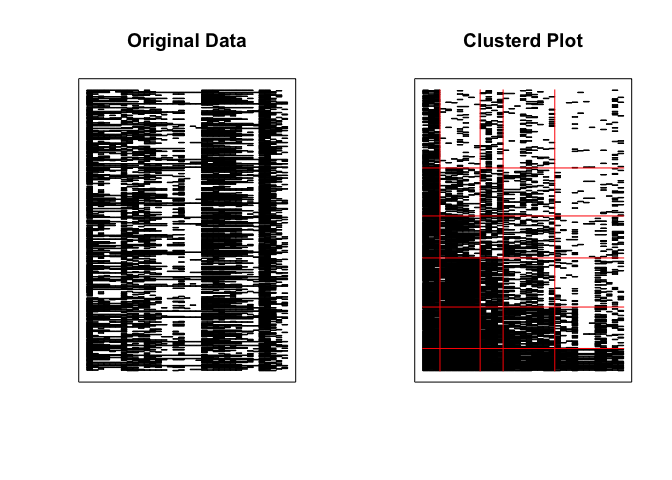<!-- -->

``` r
plot(result.Ranklustering, type = "FRP", nc = 2, nr = 3)
```

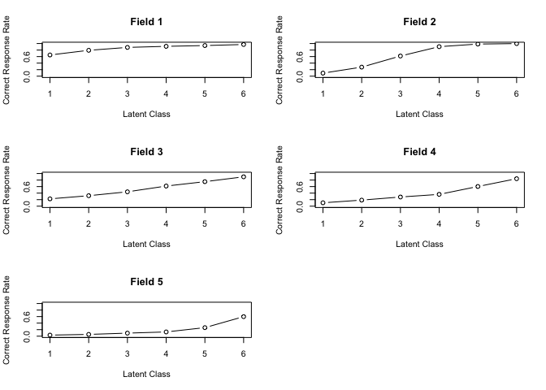<!-- -->

``` r
plot(result.Ranklustering, type = "RMP", students = 1:9, nc = 3, nr = 3)
```

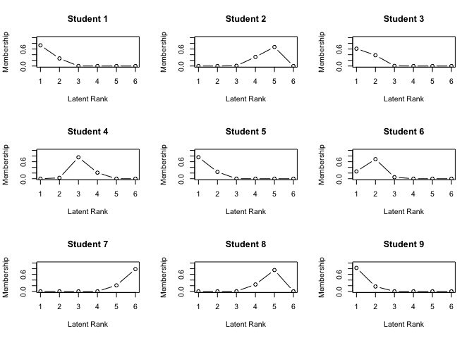<!-- -->

``` r
plot(result.Ranklustering, type = "LRD")
```

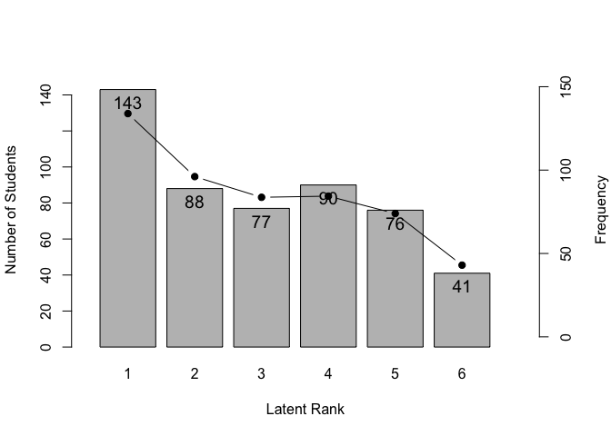<!-- -->

To find the optimal number of classes and the optimal number of fields,
the Infinite Relational Model is available.

``` r
result.IRM <- IRM(J35S515, gamma_c = 1, gamma_f = 1, verbose = TRUE)
```

    ## iter 1 Exact match count of field elements. 0 nfld 15 ncls 30

    ## iter 2 Exact match count of field elements. 0 nfld 12 ncls 27

    ## iter 3 Exact match count of field elements. 1 nfld 12 ncls 24

    ## iter 4 Exact match count of field elements. 2 nfld 12 ncls 23

    ## iter 5 Exact match count of field elements. 3 nfld 12 ncls 23

    ## iter 6 Exact match count of field elements. 0 nfld 12 ncls 23

    ## iter 7 Exact match count of field elements. 1 nfld 12 ncls 23

    ## iter 8 Exact match count of field elements. 2 nfld 12 ncls 23

    ## iter 9 Exact match count of field elements. 3 nfld 12 ncls 21

    ## iter 10 Exact match count of field elements. 4 nfld 12 ncls 21

    ## iter 11 Exact match count of field elements. 5 nfld 12 ncls 21

    ## The minimum class member count is under the setting value.
    ## bic -99592.5 nclass 21

    ## The minimum class member count is under the setting value.
    ## bic -99980.4 nclass 20

    ## The minimum class member count is under the setting value.
    ## bic -99959.7 nclass 19

    ## The minimum class member count is under the setting value.
    ## bic -99988.3 nclass 18

    ## The minimum class member count is under the setting value.
    ## bic -100001 nclass 17

``` r
plot(result.IRM, type = "Array")
```

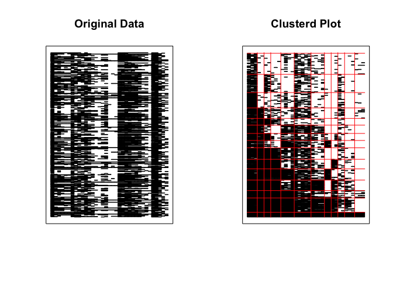<!-- -->

``` r
plot(result.IRM, type = "FRP", nc = 3)
```

<!-- -->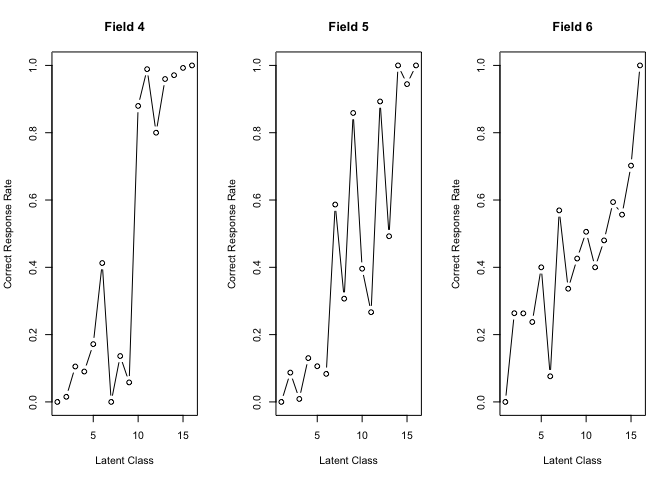<!-- -->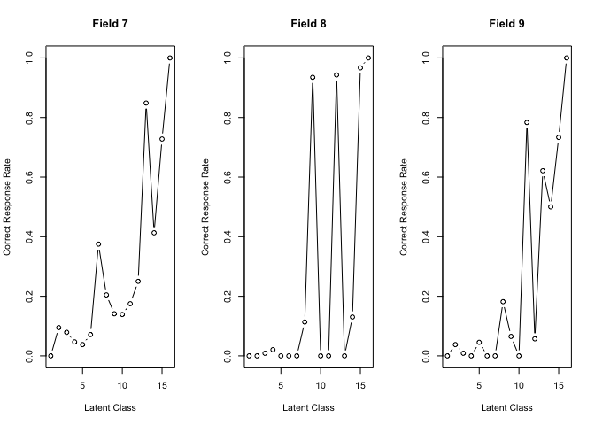<!-- -->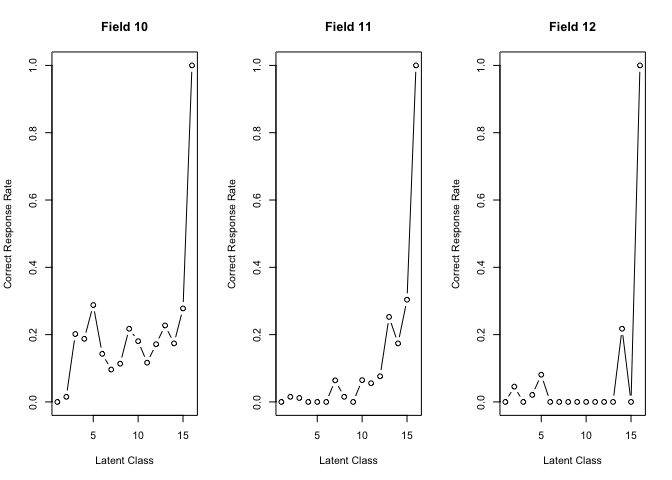<!-- -->

``` r
plot(result.IRM, type = "TRP")
```

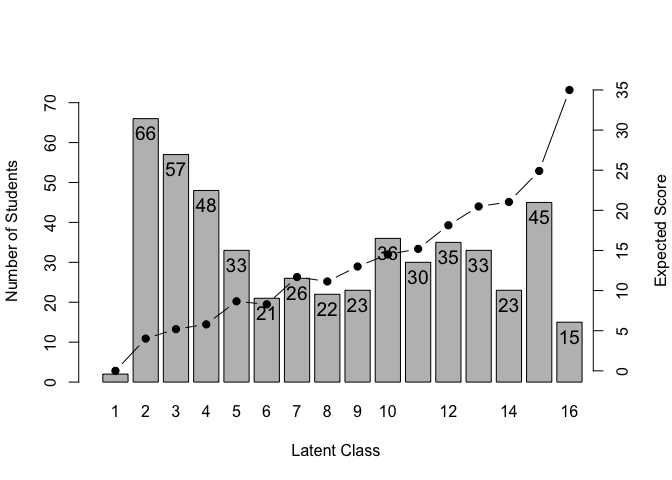<!-- -->

Additionally, supplementary notes on the derivation of the Infinite
Relational Model with Chinese restaurant process is
[here](https://kosugitti.github.io/kosugitti10/notes/IRM_memo.pdf).

## Bayesian Network Model

The Bayesian network model is a model that represents the conditional
probabilities between items in a network format based on the pass rates
of the items. By providing a Directed Acyclic Graph (DAG) between items
externally, it calculates the conditional probabilities based on the
specified graph. The igraph package is used for the analysis and
representation of the network.

There are three ways to specify the graph. You can either pass a
matrix-type DAG to the argument adj_matrix, pass a DAG described in a
CSV file to the argument adj_file, or pass a graph-type object g used in
the igraph package to the argument g.

The methods to create the matrix-type adj_matrix and the graph object g
are as follows:

``` r
library(igraph)
DAG <-
  matrix(
    c(
      "Item01", "Item02",
      "Item02", "Item03",
      "Item02", "Item04",
      "Item03", "Item05",
      "Item04", "Item05"
    ),
    ncol = 2, byrow = T
  )
## graph object
g <- igraph::graph_from_data_frame(DAG)
g
```

    ## IGRAPH d1b1bdd DN-- 5 5 -- 
    ## + attr: name (v/c)
    ## + edges from d1b1bdd (vertex names):
    ## [1] Item01->Item02 Item02->Item03 Item02->Item04 Item03->Item05 Item04->Item05

``` r
## Adj mmatrix
adj_mat <- as.matrix(igraph::get.adjacency(g))
print(adj_mat)
```

    ##        Item01 Item02 Item03 Item04 Item05
    ## Item01      0      1      0      0      0
    ## Item02      0      0      1      1      0
    ## Item03      0      0      0      0      1
    ## Item04      0      0      0      0      1
    ## Item05      0      0      0      0      0

A CSV file with the same information as the graph above in the following
format. The first line contains column names (headers) and will not be
read as data.

    ## From,To

    ## Item01,Item02
    ## Item02,Item03
    ## Item02,Item04
    ## Item03,Item05
    ## Item04,Item05

While only one specification is sufficient, if multiple specifications
are provided, they will be prioritized in the order of file, matrix, and
graph object.

An example of executing BNM by providing a graph structure (DAG) is as
follows:

``` r
result.BNM <- BNM(J5S10, adj_matrix = adj_mat)
result.BNM
```

    ## Adjacency Matrix
    ##        Item01 Item02 Item03 Item04 Item05
    ## Item01      0      1      0      0      0
    ## Item02      0      0      1      1      0
    ## Item03      0      0      0      0      1
    ## Item04      0      0      0      0      1
    ## Item05      0      0      0      0      0
    ## [1] "Your graph is an acyclic graph."
    ## [1] "Your graph is connected DAG."

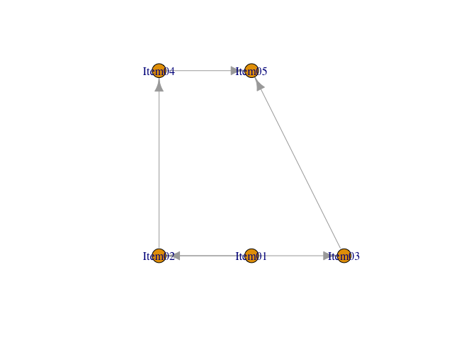<!-- -->

    ## 
    ## Parameter Learning
    ##        PIRP 1 PIRP 2 PIRP 3 PIRP 4
    ## Item01  0.600                     
    ## Item02  0.250    0.5              
    ## Item03  0.833    1.0              
    ## Item04  0.167    0.5              
    ## Item05  0.000    NaN  0.333  0.667
    ## 
    ## Conditional Correct Response Rate
    ##    Child Item N of Parents   Parent Items       PIRP Conditional CRR
    ## 1      Item01            0     No Parents No Pattern       0.6000000
    ## 2      Item02            1         Item01          0       0.2500000
    ## 3      Item02            1         Item01          1       0.5000000
    ## 4      Item03            1         Item02          0       0.8333333
    ## 5      Item03            1         Item02          1       1.0000000
    ## 6      Item04            1         Item02          0       0.1666667
    ## 7      Item04            1         Item02          1       0.5000000
    ## 8      Item05            2 Item03, Item04         00       0.0000000
    ## 9      Item05            2 Item03, Item04         01        NaN(0/0)
    ## 10     Item05            2 Item03, Item04         10       0.3333333
    ## 11     Item05            2 Item03, Item04         11       0.6666667
    ## 
    ## Model Fit Indices
    ##                  value
    ## model_log_like -26.411
    ## bench_log_like  -8.935
    ## null_log_like  -28.882
    ## model_Chi_sq    34.953
    ## null_Chi_sq     39.894
    ## model_df        20.000
    ## null_df         25.000
    ## NFI              0.124
    ## RFI              0.000
    ## IFI              0.248
    ## TLI              0.000
    ## CFI              0.000
    ## RMSEA            0.288
    ## AIC             -5.047
    ## CAIC           -13.005
    ## BIC            -11.099

### Structure Learning for Bayesian network with GA

The function searches for a DAG suitable for the data using a genetic
algorithm. A best DAG is not necessarily identified. Instead of
exploring all combinations of nodes and edges, only the space
topologically sorted by the pass rate, namely the upper triangular
matrix of the adjacency matrix, is explored. For interpretability, the
number of parent nodes should be limited. A null model is not proposed.
Utilize the content of the items and the experience of the questioner to
aid in interpreting the results. For more details, please refer to
Section 8.5 of the text(Shojima,2022).

Please note that the GA may take a considerable amount of time,
depending on the number of items and the size of the population.

``` r
StrLearningGA_BNM(J5S10,
  population = 20, Rs = 0.5, Rm = 0.002, maxParents = 2,
  maxGeneration = 100, crossover = 2, elitism = 2
)
```

    ## Adjacency Matrix
    ##        Item01 Item02 Item03 Item04 Item05
    ## Item01      0      0      0      1      0
    ## Item02      0      0      0      0      0
    ## Item03      0      0      0      0      0
    ## Item04      0      0      0      0      0
    ## Item05      0      0      0      0      0
    ## [1] "Your graph is an acyclic graph."
    ## [1] "Your graph is connected DAG."

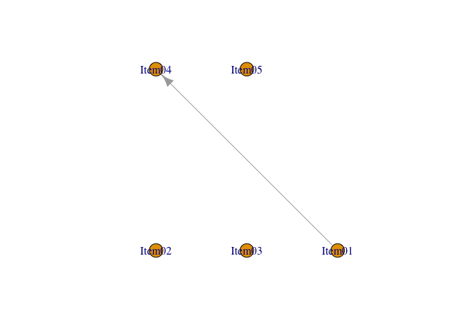<!-- -->

    ## 
    ## Parameter Learning
    ##        PIRP 1 PIRP 2
    ## Item01    0.6       
    ## Item02    0.4       
    ## Item03    0.9       
    ## Item04    0.0    0.5
    ## Item05    0.4       
    ## 
    ## Conditional Correct Response Rate
    ##   Child Item N of Parents Parent Items       PIRP Conditional CRR
    ## 1     Item01            0   No Parents No Pattern       0.6000000
    ## 2     Item02            0   No Parents No Pattern       0.4000000
    ## 3     Item03            0   No Parents No Pattern       0.9000000
    ## 4     Item04            1       Item01          0       0.0000000
    ## 5     Item04            1       Item01          1       0.5000000
    ## 6     Item05            0   No Parents No Pattern       0.4000000
    ## 
    ## Model Fit Indices
    ##                  value
    ## model_log_like -26.959
    ## bench_log_like  -8.935
    ## null_log_like  -28.882
    ## model_Chi_sq    36.048
    ## null_Chi_sq     39.894
    ## model_df        24.000
    ## null_df         25.000
    ## NFI              0.096
    ## RFI              0.059
    ## IFI              0.242
    ## TLI              0.157
    ## CFI              0.191
    ## RMSEA            0.236
    ## AIC            -11.952
    ## CAIC           -21.502
    ## BIC            -19.214

The method of Population-based incremental learning proposed by Fukuda
(2014) can also be used for learning. This method has several variations
for estimating the optimal adjacency matrix at the end, which can be
specified as options. See help or text Section 8.5.2.

``` r
StrLearningPBIL_BNM(J5S10,
  population = 20, Rs = 0.5, Rm = 0.005, maxParents = 2,
  alpha = 0.05, estimate = 4
)
```

    ## Adjacency Matrix
    ##        Item01 Item02 Item03 Item04 Item05
    ## Item01      0      0      0      1      0
    ## Item02      0      0      0      0      0
    ## Item03      0      0      0      0      0
    ## Item04      0      0      0      0      0
    ## Item05      0      0      0      0      0
    ## [1] "Your graph is an acyclic graph."
    ## [1] "Your graph is connected DAG."

<!-- -->

    ## 
    ## Parameter Learning
    ##        PIRP 1 PIRP 2
    ## Item01    0.6       
    ## Item02    0.4       
    ## Item03    0.9       
    ## Item04    0.0    0.5
    ## Item05    0.4       
    ## 
    ## Conditional Correct Response Rate
    ##   Child Item N of Parents Parent Items       PIRP Conditional CRR
    ## 1     Item01            0   No Parents No Pattern       0.6000000
    ## 2     Item02            0   No Parents No Pattern       0.4000000
    ## 3     Item03            0   No Parents No Pattern       0.9000000
    ## 4     Item04            1       Item01          0       0.0000000
    ## 5     Item04            1       Item01          1       0.5000000
    ## 6     Item05            0   No Parents No Pattern       0.4000000
    ## 
    ## Model Fit Indices
    ##                  value
    ## model_log_like -26.959
    ## bench_log_like  -8.935
    ## null_log_like  -28.882
    ## model_Chi_sq    36.048
    ## null_Chi_sq     39.894
    ## model_df        24.000
    ## null_df         25.000
    ## NFI              0.096
    ## RFI              0.059
    ## IFI              0.242
    ## TLI              0.157
    ## CFI              0.191
    ## RMSEA            0.236
    ## AIC            -11.952
    ## CAIC           -21.502
    ## BIC            -19.214

## Local Dependent Latent Rank Analysis

LD-LRA is an analysis that combines LRA and BNM, and it is used to
analyze the network structure among items in the latent rank. In this
function, structural learning is not performed, so you need to provide
item graphs for each rank as separate files.

For each class, it is necessary to specify a graph, and there are three
ways to do so. You can either pass a matrix-type DAG for each class or a
list of graph-type objects used in the igraph package to the arguments
adj_list or g_list, respectively, or you can provide a DAG described in
a CSV file. The way to specify it in a CSV file is as follows.

``` r
DAG_dat <- matrix(c(
  "From", "To", "Rank",
  "Item01", "Item02", 1,
  "Item04", "Item05", 1,
  "Item01", "Item02", 2,
  "Item02", "Item03", 2,
  "Item04", "Item05", 2,
  "Item08", "Item09", 2,
  "Item08", "Item10", 2,
  "Item09", "Item10", 2,
  "Item08", "Item11", 2,
  "Item01", "Item02", 3,
  "Item02", "Item03", 3,
  "Item04", "Item05", 3,
  "Item08", "Item09", 3,
  "Item08", "Item10", 3,
  "Item09", "Item10", 3,
  "Item08", "Item11", 3,
  "Item02", "Item03", 4,
  "Item04", "Item06", 4,
  "Item04", "Item07", 4,
  "Item05", "Item06", 4,
  "Item05", "Item07", 4,
  "Item08", "Item10", 4,
  "Item08", "Item11", 4,
  "Item09", "Item11", 4,
  "Item02", "Item03", 5,
  "Item04", "Item06", 5,
  "Item04", "Item07", 5,
  "Item05", "Item06", 5,
  "Item05", "Item07", 5,
  "Item09", "Item11", 5,
  "Item10", "Item11", 5,
  "Item10", "Item12", 5
), ncol = 3, byrow = TRUE)

# save csv file
edgeFile <- tempfile(fileext = ".csv")
write.csv(DAG_dat, edgeFile, row.names = FALSE, quote = TRUE)
```

Here, it is shown an example of specifying with matrix-type and graph
objects using the aforementioned CSV file. While only one specification
is sufficient, if multiple specifications are provided, they will be
prioritized in the order of file, matrix, and graph object.

``` r
g_csv <- read.csv(edgeFile)
colnames(g_csv) <- c("From", "To", "Rank")
adj_list <- list()
g_list <- list()
for (i in 1:5) {
  adj_R <- g_csv[g_csv$Rank == i, 1:2]
  g_tmp <- igraph::graph_from_data_frame(adj_R)
  adj_tmp <- igraph::get.adjacency(g_tmp)
  g_list[[i]] <- g_tmp
  adj_list[[i]] <- adj_tmp
}
## Example of graph list
g_list
```

    ## [[1]]
    ## IGRAPH 5694726 DN-- 4 2 -- 
    ## + attr: name (v/c)
    ## + edges from 5694726 (vertex names):
    ## [1] Item01->Item02 Item04->Item05
    ## 
    ## [[2]]
    ## IGRAPH bd4a665 DN-- 9 7 -- 
    ## + attr: name (v/c)
    ## + edges from bd4a665 (vertex names):
    ## [1] Item01->Item02 Item02->Item03 Item04->Item05 Item08->Item09 Item08->Item10
    ## [6] Item09->Item10 Item08->Item11
    ## 
    ## [[3]]
    ## IGRAPH f032444 DN-- 9 7 -- 
    ## + attr: name (v/c)
    ## + edges from f032444 (vertex names):
    ## [1] Item01->Item02 Item02->Item03 Item04->Item05 Item08->Item09 Item08->Item10
    ## [6] Item09->Item10 Item08->Item11
    ## 
    ## [[4]]
    ## IGRAPH 39c2f5f DN-- 10 8 -- 
    ## + attr: name (v/c)
    ## + edges from 39c2f5f (vertex names):
    ## [1] Item02->Item03 Item04->Item06 Item04->Item07 Item05->Item06 Item05->Item07
    ## [6] Item08->Item10 Item08->Item11 Item09->Item11
    ## 
    ## [[5]]
    ## IGRAPH a42a817 DN-- 10 8 -- 
    ## + attr: name (v/c)
    ## + edges from a42a817 (vertex names):
    ## [1] Item02->Item03 Item04->Item06 Item04->Item07 Item05->Item06 Item05->Item07
    ## [6] Item09->Item11 Item10->Item11 Item10->Item12

``` r
### Example of adj list
adj_list
```

    ## [[1]]
    ## 4 x 4 sparse Matrix of class "dgCMatrix"
    ##        Item01 Item04 Item02 Item05
    ## Item01      .      .      1      .
    ## Item04      .      .      .      1
    ## Item02      .      .      .      .
    ## Item05      .      .      .      .
    ## 
    ## [[2]]
    ## 9 x 9 sparse Matrix of class "dgCMatrix"
    ##        Item01 Item02 Item04 Item08 Item09 Item03 Item05 Item10 Item11
    ## Item01      .      1      .      .      .      .      .      .      .
    ## Item02      .      .      .      .      .      1      .      .      .
    ## Item04      .      .      .      .      .      .      1      .      .
    ## Item08      .      .      .      .      1      .      .      1      1
    ## Item09      .      .      .      .      .      .      .      1      .
    ## Item03      .      .      .      .      .      .      .      .      .
    ## Item05      .      .      .      .      .      .      .      .      .
    ## Item10      .      .      .      .      .      .      .      .      .
    ## Item11      .      .      .      .      .      .      .      .      .
    ## 
    ## [[3]]
    ## 9 x 9 sparse Matrix of class "dgCMatrix"
    ##        Item01 Item02 Item04 Item08 Item09 Item03 Item05 Item10 Item11
    ## Item01      .      1      .      .      .      .      .      .      .
    ## Item02      .      .      .      .      .      1      .      .      .
    ## Item04      .      .      .      .      .      .      1      .      .
    ## Item08      .      .      .      .      1      .      .      1      1
    ## Item09      .      .      .      .      .      .      .      1      .
    ## Item03      .      .      .      .      .      .      .      .      .
    ## Item05      .      .      .      .      .      .      .      .      .
    ## Item10      .      .      .      .      .      .      .      .      .
    ## Item11      .      .      .      .      .      .      .      .      .
    ## 
    ## [[4]]
    ## 10 x 10 sparse Matrix of class "dgCMatrix"

    ##                           
    ## Item02 . . . . . 1 . . . .
    ## Item04 . . . . . . 1 1 . .
    ## Item05 . . . . . . 1 1 . .
    ## Item08 . . . . . . . . 1 1
    ## Item09 . . . . . . . . . 1
    ## Item03 . . . . . . . . . .
    ## Item06 . . . . . . . . . .
    ## Item07 . . . . . . . . . .
    ## Item10 . . . . . . . . . .
    ## Item11 . . . . . . . . . .
    ## 
    ## [[5]]
    ## 10 x 10 sparse Matrix of class "dgCMatrix"

    ##                           
    ## Item02 . . . . . 1 . . . .
    ## Item04 . . . . . . 1 1 . .
    ## Item05 . . . . . . 1 1 . .
    ## Item09 . . . . . . . . 1 .
    ## Item10 . . . . . . . . 1 1
    ## Item03 . . . . . . . . . .
    ## Item06 . . . . . . . . . .
    ## Item07 . . . . . . . . . .
    ## Item11 . . . . . . . . . .
    ## Item12 . . . . . . . . . .

The example of running the LDLRA function using this CSV file would look
like this.

``` r
result.LDLRA <- LDLRA(J12S5000,
  ncls = 5,
  adj_file = "develop/DAG_file.csv"
)
result.LDLRA
```

    ## Adjacency Matrix
    ## [[1]]
    ##        Item01 Item02 Item03 Item04 Item05 Item06 Item07 Item08 Item09 Item10
    ## Item01      0      1      0      0      0      0      0      0      0      0
    ## Item02      0      0      0      0      0      0      0      0      0      0
    ## Item03      0      0      0      0      0      0      0      0      0      0
    ## Item04      0      0      0      0      1      0      0      0      0      0
    ## Item05      0      0      0      0      0      0      0      0      0      0
    ## Item06      0      0      0      0      0      0      0      0      0      0
    ## Item07      0      0      0      0      0      0      0      0      0      0
    ## Item08      0      0      0      0      0      0      0      0      0      0
    ## Item09      0      0      0      0      0      0      0      0      0      0
    ## Item10      0      0      0      0      0      0      0      0      0      0
    ## Item11      0      0      0      0      0      0      0      0      0      0
    ## Item12      0      0      0      0      0      0      0      0      0      0
    ##        Item11 Item12
    ## Item01      0      0
    ## Item02      0      0
    ## Item03      0      0
    ## Item04      0      0
    ## Item05      0      0
    ## Item06      0      0
    ## Item07      0      0
    ## Item08      0      0
    ## Item09      0      0
    ## Item10      0      0
    ## Item11      0      0
    ## Item12      0      0
    ## 
    ## [[2]]
    ##        Item01 Item02 Item03 Item04 Item05 Item06 Item07 Item08 Item09 Item10
    ## Item01      0      1      0      0      0      0      0      0      0      0
    ## Item02      0      0      1      0      0      0      0      0      0      0
    ## Item03      0      0      0      0      0      0      0      0      0      0
    ## Item04      0      0      0      0      1      0      0      0      0      0
    ## Item05      0      0      0      0      0      0      0      0      0      0
    ## Item06      0      0      0      0      0      0      0      0      0      0
    ## Item07      0      0      0      0      0      0      0      0      0      0
    ## Item08      0      0      0      0      0      0      0      0      1      1
    ## Item09      0      0      0      0      0      0      0      0      0      1
    ## Item10      0      0      0      0      0      0      0      0      0      0
    ## Item11      0      0      0      0      0      0      0      0      0      0
    ## Item12      0      0      0      0      0      0      0      0      0      0
    ##        Item11 Item12
    ## Item01      0      0
    ## Item02      0      0
    ## Item03      0      0
    ## Item04      0      0
    ## Item05      0      0
    ## Item06      0      0
    ## Item07      0      0
    ## Item08      1      0
    ## Item09      0      0
    ## Item10      0      0
    ## Item11      0      0
    ## Item12      0      0
    ## 
    ## [[3]]
    ##        Item01 Item02 Item03 Item04 Item05 Item06 Item07 Item08 Item09 Item10
    ## Item01      0      1      0      0      0      0      0      0      0      0
    ## Item02      0      0      1      0      0      0      0      0      0      0
    ## Item03      0      0      0      0      0      0      0      0      0      0
    ## Item04      0      0      0      0      1      0      0      0      0      0
    ## Item05      0      0      0      0      0      0      0      0      0      0
    ## Item06      0      0      0      0      0      0      0      0      0      0
    ## Item07      0      0      0      0      0      0      0      0      0      0
    ## Item08      0      0      0      0      0      0      0      0      1      1
    ## Item09      0      0      0      0      0      0      0      0      0      1
    ## Item10      0      0      0      0      0      0      0      0      0      0
    ## Item11      0      0      0      0      0      0      0      0      0      0
    ## Item12      0      0      0      0      0      0      0      0      0      0
    ##        Item11 Item12
    ## Item01      0      0
    ## Item02      0      0
    ## Item03      0      0
    ## Item04      0      0
    ## Item05      0      0
    ## Item06      0      0
    ## Item07      0      0
    ## Item08      1      0
    ## Item09      0      0
    ## Item10      0      0
    ## Item11      0      0
    ## Item12      0      0
    ## 
    ## [[4]]
    ##        Item01 Item02 Item03 Item04 Item05 Item06 Item07 Item08 Item09 Item10
    ## Item01      0      0      0      0      0      0      0      0      0      0
    ## Item02      0      0      1      0      0      0      0      0      0      0
    ## Item03      0      0      0      0      0      0      0      0      0      0
    ## Item04      0      0      0      0      0      1      1      0      0      0
    ## Item05      0      0      0      0      0      1      1      0      0      0
    ## Item06      0      0      0      0      0      0      0      0      0      0
    ## Item07      0      0      0      0      0      0      0      0      0      0
    ## Item08      0      0      0      0      0      0      0      0      0      1
    ## Item09      0      0      0      0      0      0      0      0      0      0
    ## Item10      0      0      0      0      0      0      0      0      0      0
    ## Item11      0      0      0      0      0      0      0      0      0      0
    ## Item12      0      0      0      0      0      0      0      0      0      0
    ##        Item11 Item12
    ## Item01      0      0
    ## Item02      0      0
    ## Item03      0      0
    ## Item04      0      0
    ## Item05      0      0
    ## Item06      0      0
    ## Item07      0      0
    ## Item08      1      0
    ## Item09      1      0
    ## Item10      0      0
    ## Item11      0      0
    ## Item12      0      0
    ## 
    ## [[5]]
    ##        Item01 Item02 Item03 Item04 Item05 Item06 Item07 Item08 Item09 Item10
    ## Item01      0      0      0      0      0      0      0      0      0      0
    ## Item02      0      0      1      0      0      0      0      0      0      0
    ## Item03      0      0      0      0      0      0      0      0      0      0
    ## Item04      0      0      0      0      0      1      1      0      0      0
    ## Item05      0      0      0      0      0      1      1      0      0      0
    ## Item06      0      0      0      0      0      0      0      0      0      0
    ## Item07      0      0      0      0      0      0      0      0      0      0
    ## Item08      0      0      0      0      0      0      0      0      0      0
    ## Item09      0      0      0      0      0      0      0      0      0      0
    ## Item10      0      0      0      0      0      0      0      0      0      0
    ## Item11      0      0      0      0      0      0      0      0      0      0
    ## Item12      0      0      0      0      0      0      0      0      0      0
    ##        Item11 Item12
    ## Item01      0      0
    ## Item02      0      0
    ## Item03      0      0
    ## Item04      0      0
    ## Item05      0      0
    ## Item06      0      0
    ## Item07      0      0
    ## Item08      0      0
    ## Item09      1      0
    ## Item10      1      1
    ## Item11      0      0
    ## Item12      0      0

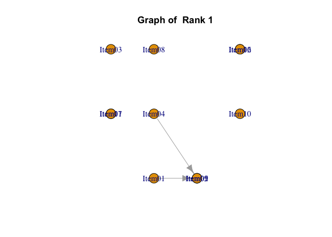<!-- -->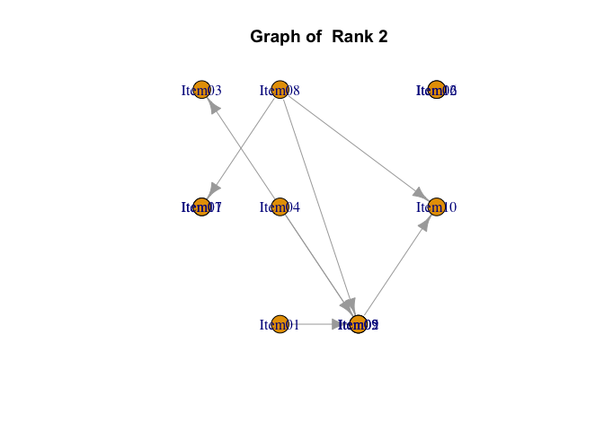<!-- --><!-- -->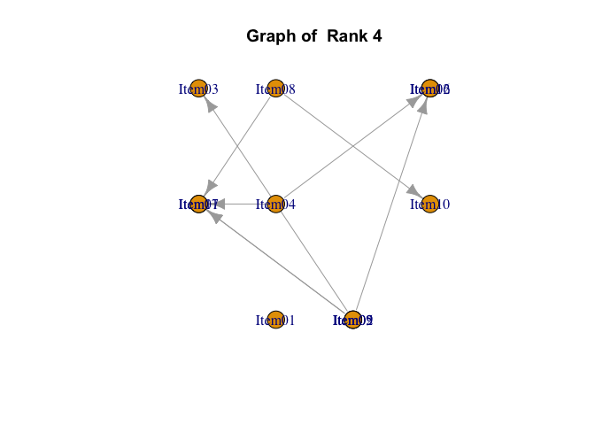<!-- -->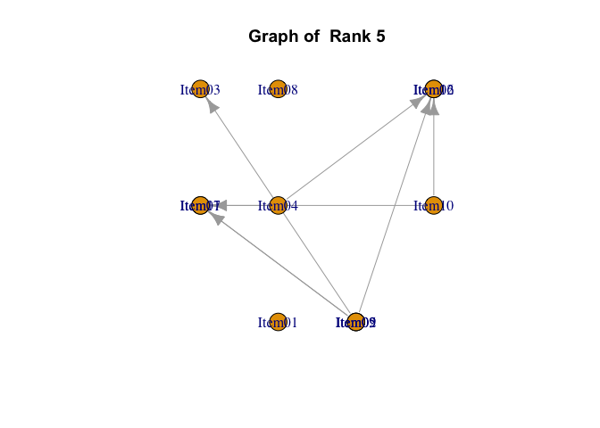<!-- -->

    ## 
    ## Parameter Learning
    ##      Item Rank PIRP 1 PIRP 2 PIRP 3 PIRP 4
    ## 1  Item01    1  0.456                     
    ## 2  Item02    1  0.030  0.444              
    ## 3  Item03    1  0.083                     
    ## 4  Item04    1  0.421                     
    ## 5  Item05    1  0.101  0.240              
    ## 6  Item06    1  0.025                     
    ## 7  Item07    1  0.016                     
    ## 8  Item08    1  0.286                     
    ## 9  Item09    1  0.326                     
    ## 10 Item10    1  0.181                     
    ## 11 Item11    1  0.106                     
    ## 12 Item12    1  0.055                     
    ## 13 Item01    2  0.549                     
    ## 14 Item02    2  0.035  0.568              
    ## 15 Item03    2  0.020  0.459              
    ## 16 Item04    2  0.495                     
    ## 17 Item05    2  0.148  0.351              
    ## 18 Item06    2  0.066                     
    ## 19 Item07    2  0.045                     
    ## 20 Item08    2  0.407                     
    ## 21 Item09    2  0.264  0.734              
    ## 22 Item10    2  0.081  0.133  0.159  0.745
    ## 23 Item11    2  0.041  0.445              
    ## 24 Item12    2  0.086                     
    ## 25 Item01    3  0.683                     
    ## 26 Item02    3  0.040  0.728              
    ## 27 Item03    3  0.032  0.617              
    ## 28 Item04    3  0.612                     
    ## 29 Item05    3  0.227  0.556              
    ## 30 Item06    3  0.205                     
    ## 31 Item07    3  0.156                     
    ## 32 Item08    3  0.581                     
    ## 33 Item09    3  0.330  0.845              
    ## 34 Item10    3  0.092  0.160  0.211  0.843
    ## 35 Item11    3  0.056  0.636              
    ## 36 Item12    3  0.152                     
    ## 37 Item01    4  0.836                     
    ## 38 Item02    4  0.720                     
    ## 39 Item03    4  0.058  0.713              
    ## 40 Item04    4  0.740                     
    ## 41 Item05    4  0.635                     
    ## 42 Item06    4  0.008  0.105  0.023  0.684
    ## 43 Item07    4  0.010  0.031  0.039  0.542
    ## 44 Item08    4  0.760                     
    ## 45 Item09    4  0.805                     
    ## 46 Item10    4  0.150  0.844              
    ## 47 Item11    4  0.064  0.124  0.105  0.825
    ## 48 Item12    4  0.227                     
    ## 49 Item01    5  0.931                     
    ## 50 Item02    5  0.869                     
    ## 51 Item03    5  0.099  0.789              
    ## 52 Item04    5  0.846                     
    ## 53 Item05    5  0.811                     
    ## 54 Item06    5  0.015  0.125  0.040  0.788
    ## 55 Item07    5  0.016  0.034  0.064  0.650
    ## 56 Item08    5  0.880                     
    ## 57 Item09    5  0.912                     
    ## 58 Item10    5  0.825                     
    ## 59 Item11    5  0.082  0.190  0.216  0.915
    ## 60 Item12    5  0.153  0.341              
    ## 
    ## Conditional Correct Response Rate
    ##     Child Item Rank N of Parents   Parent Items       PIRP Conditional CRR
    ## 1       Item01    1            0     No Parents No Pattern         0.45558
    ## 2       Item02    1            1         Item01          0         0.03025
    ## 3       Item02    1            1         Item01          1         0.44394
    ## 4       Item03    1            0     No Parents No Pattern         0.08278
    ## 5       Item04    1            0     No Parents No Pattern         0.42148
    ## 6       Item05    1            1         Item04          0         0.10127
    ## 7       Item05    1            1         Item04          1         0.24025
    ## 8       Item06    1            0     No Parents No Pattern         0.02499
    ## 9       Item07    1            0     No Parents No Pattern         0.01574
    ## 10      Item08    1            0     No Parents No Pattern         0.28642
    ## 11      Item09    1            0     No Parents No Pattern         0.32630
    ## 12      Item10    1            0     No Parents No Pattern         0.18092
    ## 13      Item11    1            0     No Parents No Pattern         0.10575
    ## 14      Item12    1            0     No Parents No Pattern         0.05523
    ## 15      Item01    2            0     No Parents No Pattern         0.54940
    ## 16      Item02    2            1         Item01          0         0.03471
    ## 17      Item02    2            1         Item01          1         0.56821
    ## 18      Item03    2            1         Item02          0         0.02016
    ## 19      Item03    2            1         Item02          1         0.45853
    ## 20      Item04    2            0     No Parents No Pattern         0.49508
    ## 21      Item05    2            1         Item04          0         0.14771
    ## 22      Item05    2            1         Item04          1         0.35073
    ## 23      Item06    2            0     No Parents No Pattern         0.06647
    ## 24      Item07    2            0     No Parents No Pattern         0.04491
    ## 25      Item08    2            0     No Parents No Pattern         0.40721
    ## 26      Item09    2            1         Item08          0         0.26431
    ## 27      Item09    2            1         Item08          1         0.73427
    ## 28      Item10    2            2 Item08, Item09         00         0.08098
    ## 29      Item10    2            2 Item08, Item09         01         0.13279
    ## 30      Item10    2            2 Item08, Item09         10         0.15937
    ## 31      Item10    2            2 Item08, Item09         11         0.74499
    ## 32      Item11    2            1         Item08          0         0.04094
    ## 33      Item11    2            1         Item08          1         0.44457
    ## 34      Item12    2            0     No Parents No Pattern         0.08574
    ## 35      Item01    3            0     No Parents No Pattern         0.68342
    ## 36      Item02    3            1         Item01          0         0.04020
    ## 37      Item02    3            1         Item01          1         0.72757
    ## 38      Item03    3            1         Item02          0         0.03175
    ## 39      Item03    3            1         Item02          1         0.61691
    ## 40      Item04    3            0     No Parents No Pattern         0.61195
    ## 41      Item05    3            1         Item04          0         0.22705
    ## 42      Item05    3            1         Item04          1         0.55588
    ## 43      Item06    3            0     No Parents No Pattern         0.20488
    ## 44      Item07    3            0     No Parents No Pattern         0.15633
    ## 45      Item08    3            0     No Parents No Pattern         0.58065
    ## 46      Item09    3            1         Item08          0         0.32967
    ## 47      Item09    3            1         Item08          1         0.84549
    ## 48      Item10    3            2 Item08, Item09         00         0.09192
    ## 49      Item10    3            2 Item08, Item09         01         0.15977
    ## 50      Item10    3            2 Item08, Item09         10         0.21087
    ## 51      Item10    3            2 Item08, Item09         11         0.84330
    ## 52      Item11    3            1         Item08          0         0.05581
    ## 53      Item11    3            1         Item08          1         0.63598
    ## 54      Item12    3            0     No Parents No Pattern         0.15169
    ## 55      Item01    4            0     No Parents No Pattern         0.83557
    ## 56      Item02    4            0     No Parents No Pattern         0.71950
    ## 57      Item03    4            1         Item02          0         0.05808
    ## 58      Item03    4            1         Item02          1         0.71297
    ## 59      Item04    4            0     No Parents No Pattern         0.73957
    ## 60      Item05    4            0     No Parents No Pattern         0.63526
    ## 61      Item06    4            2 Item04, Item05         00         0.00816
    ## 62      Item06    4            2 Item04, Item05         01         0.10474
    ## 63      Item06    4            2 Item04, Item05         10         0.02265
    ## 64      Item06    4            2 Item04, Item05         11         0.68419
    ## 65      Item07    4            2 Item04, Item05         00         0.00984
    ## 66      Item07    4            2 Item04, Item05         01         0.03091
    ## 67      Item07    4            2 Item04, Item05         10         0.03850
    ## 68      Item07    4            2 Item04, Item05         11         0.54195
    ## 69      Item08    4            0     No Parents No Pattern         0.75976
    ## 70      Item09    4            0     No Parents No Pattern         0.80490
    ## 71      Item10    4            1         Item08          0         0.14956
    ## 72      Item10    4            1         Item08          1         0.84430
    ## 73      Item11    4            2 Item08, Item09         00         0.06376
    ## 74      Item11    4            2 Item08, Item09         01         0.12384
    ## 75      Item11    4            2 Item08, Item09         10         0.10494
    ## 76      Item11    4            2 Item08, Item09         11         0.82451
    ## 77      Item12    4            0     No Parents No Pattern         0.22688
    ## 78      Item01    5            0     No Parents No Pattern         0.93131
    ## 79      Item02    5            0     No Parents No Pattern         0.86923
    ## 80      Item03    5            1         Item02          0         0.09865
    ## 81      Item03    5            1         Item02          1         0.78854
    ## 82      Item04    5            0     No Parents No Pattern         0.84621
    ## 83      Item05    5            0     No Parents No Pattern         0.81118
    ## 84      Item06    5            2 Item04, Item05         00         0.01452
    ## 85      Item06    5            2 Item04, Item05         01         0.12528
    ## 86      Item06    5            2 Item04, Item05         10         0.04000
    ## 87      Item06    5            2 Item04, Item05         11         0.78805
    ## 88      Item07    5            2 Item04, Item05         00         0.01570
    ## 89      Item07    5            2 Item04, Item05         01         0.03361
    ## 90      Item07    5            2 Item04, Item05         10         0.06363
    ## 91      Item07    5            2 Item04, Item05         11         0.65039
    ## 92      Item08    5            0     No Parents No Pattern         0.88028
    ## 93      Item09    5            0     No Parents No Pattern         0.91209
    ## 94      Item10    5            0     No Parents No Pattern         0.82476
    ## 95      Item11    5            2 Item09, Item10         00         0.08248
    ## 96      Item11    5            2 Item09, Item10         01         0.18951
    ## 97      Item11    5            2 Item09, Item10         10         0.21590
    ## 98      Item11    5            2 Item09, Item10         11         0.91466
    ## 99      Item12    5            1         Item10          0         0.15301
    ## 100     Item12    5            1         Item10          1         0.34114
    ## 
    ## Marginal Item Reference Profile
    ##        Rank 1 Rank 2 Rank 3 Rank 4 Rank 5
    ## Item01 0.4556 0.5494  0.683  0.836  0.931
    ## Item02 0.2099 0.2964  0.474  0.720  0.869
    ## Item03 0.0828 0.1397  0.316  0.554  0.741
    ## Item04 0.4215 0.4951  0.612  0.740  0.846
    ## Item05 0.1555 0.2393  0.432  0.635  0.811
    ## Item06 0.0250 0.0665  0.205  0.385  0.631
    ## Item07 0.0157 0.0449  0.156  0.304  0.517
    ## Item08 0.2864 0.4072  0.581  0.760  0.880
    ## Item09 0.3263 0.4409  0.624  0.805  0.912
    ## Item10 0.1809 0.2977  0.498  0.650  0.825
    ## Item11 0.1057 0.1926  0.387  0.565  0.808
    ## Item12 0.0552 0.0857  0.152  0.227  0.317
    ## 
    ## IRP Indices
    ##        Alpha          A Beta         B Gamma C
    ## Item01     3 0.15215133    1 0.4555806     0 0
    ## Item02     3 0.24578705    3 0.4737140     0 0
    ## Item03     3 0.23808314    4 0.5544465     0 0
    ## Item04     3 0.12762155    2 0.4950757     0 0
    ## Item05     3 0.20322441    3 0.4320364     0 0
    ## Item06     4 0.24595102    4 0.3851075     0 0
    ## Item07     4 0.21361675    5 0.5173874     0 0
    ## Item08     3 0.17910918    3 0.5806476     0 0
    ## Item09     2 0.18320368    2 0.4408936     0 0
    ## Item10     2 0.20070396    3 0.4984108     0 0
    ## Item11     4 0.24332189    4 0.5650492     0 0
    ## Item12     4 0.09047482    5 0.3173548     0 0
    ## [1] "Strongly ordinal alignment condition was satisfied."
    ## 
    ## Test reference Profile and Latent Rank Distribution
    ##                                Rank 1   Rank 2  Rank 3  Rank 4   Rank 5
    ## Test Reference Profile          2.321    3.255   5.121   7.179    9.090
    ## Latent Rank Ditribution      1829.000  593.000 759.000 569.000 1250.000
    ## Rank Membership Distribution 1121.838 1087.855 873.796 835.528 1080.983
    ## [1] "Weakly ordinal alignment condition was satisfied."
    ## 
    ## Model Fit Indices
    ##                     value
    ## model_log_like -26657.783
    ## bench_log_like -21318.465
    ## null_log_like  -37736.228
    ## model_Chi_sq    10678.636
    ## null_Chi_sq     32835.527
    ## model_df           56.000
    ## null_df           144.000
    ## NFI                 0.675
    ## RFI                 0.164
    ## IFI                 0.676
    ## TLI                 0.164
    ## CFI                 0.675
    ## RMSEA               0.195
    ## AIC             10566.636
    ## CAIC            10201.662
    ## BIC             10201.673

Of course, it also supports various types of plots.

``` r
plot(result.LDLRA, type = "IRP", nc = 4, nr = 3)
```

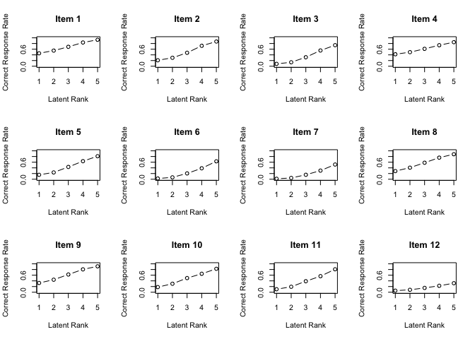<!-- -->

``` r
plot(result.LDLRA, type = "TRP")
```

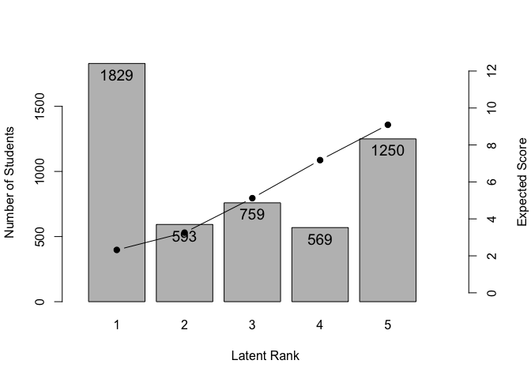<!-- -->

``` r
plot(result.LDLRA, type = "LRD")
```

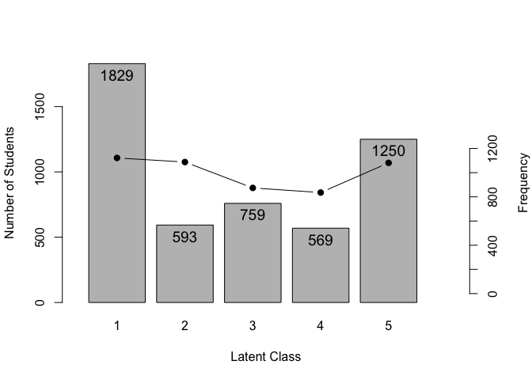<!-- -->

### Structure Learning for LDLRA with GA(PBIL)

You can learn item-interaction graphs for each rank using the PBIL
algorithm. In addition to various options, the learning process requires
a very long computation time. It’s also important to note that the
result is merely one of the feasible solutions, and it’s not necessarily
the optimal solution.

``` r
result.LDLRA.PBIL <- StrLearningPBIL_LDLRA(J35S515,
  seed = 123,
  ncls = 5,
  method = "R",
  elitism = 1,
  successiveLimit = 15
)
result.LDLRA.PBIL
```

    ## Adjacency Matrix
    ## [[1]]
    ##        Item01 Item02 Item03 Item04 Item05 Item06 Item07 Item08 Item09 Item10
    ## Item01      0      0      0      0      0      0      1      0      0      0
    ## Item02      0      0      0      0      0      0      0      0      0      0
    ## Item03      0      0      0      0      0      0      0      0      1      0
    ## Item04      0      0      0      0      0      0      0      0      0      0
    ## Item05      0      0      0      0      0      0      0      0      0      0
    ## Item06      0      0      0      0      0      0      0      0      0      0
    ## Item07      0      0      0      0      0      0      0      0      0      0
    ## Item08      0      0      0      0      0      0      0      0      0      0
    ## Item09      0      0      0      0      0      0      0      0      0      0
    ## Item10      0      0      0      0      0      0      0      0      0      0
    ## Item11      0      0      0      0      0      0      0      0      0      0
    ## Item12      0      0      0      0      0      0      0      0      0      0
    ## Item13      0      0      0      0      0      0      0      0      0      0
    ## Item14      0      0      0      0      0      0      0      0      0      0
    ## Item15      0      0      0      0      0      0      0      0      0      0
    ## Item16      0      0      0      0      0      0      0      0      0      0
    ## Item17      0      0      0      0      0      0      0      0      0      0
    ## Item18      0      0      0      0      0      0      0      0      0      0
    ## Item19      0      0      0      0      0      0      0      0      0      0
    ## Item20      0      0      0      0      0      0      0      0      0      0
    ## Item21      0      1      0      0      0      0      0      0      0      0
    ## Item22      0      0      0      0      0      0      0      0      0      0
    ## Item23      0      0      0      0      0      0      0      0      0      0
    ## Item24      0      0      0      0      0      0      0      0      0      0
    ## Item25      0      0      0      0      0      0      0      0      0      0
    ## Item26      0      0      0      0      0      0      0      0      0      0
    ## Item27      0      0      0      0      0      0      0      0      0      0
    ## Item28      0      0      0      0      0      0      0      0      0      0
    ## Item29      0      0      0      0      0      0      0      0      0      0
    ## Item30      0      0      0      0      0      0      0      0      0      0
    ## Item31      0      0      0      0      0      0      0      0      0      0
    ## Item32      0      0      0      0      0      0      0      0      0      0
    ## Item33      0      0      0      0      0      0      0      0      0      0
    ## Item34      0      0      0      0      0      0      0      0      0      0
    ## Item35      0      0      0      0      0      0      0      0      0      0
    ##        Item11 Item12 Item13 Item14 Item15 Item16 Item17 Item18 Item19 Item20
    ## Item01      0      0      0      0      0      0      0      0      0      0
    ## Item02      0      0      0      0      0      0      0      0      0      0
    ## Item03      0      0      0      0      0      0      0      0      0      0
    ## Item04      0      0      0      0      0      0      0      0      0      0
    ## Item05      0      0      0      0      0      0      0      0      0      0
    ## Item06      0      0      0      0      0      0      0      0      0      0
    ## Item07      0      0      0      0      0      0      0      0      0      0
    ## Item08      0      0      0      0      0      0      0      0      0      0
    ## Item09      0      0      0      0      0      0      0      0      0      0
    ## Item10      0      0      0      0      0      0      0      0      0      0
    ## Item11      0      0      0      0      0      0      0      0      0      0
    ## Item12      0      0      0      0      0      0      0      0      0      0
    ## Item13      0      0      0      0      0      0      0      0      1      0
    ## Item14      0      0      0      0      0      0      0      0      0      0
    ## Item15      0      0      0      0      0      0      0      0      0      0
    ## Item16      0      0      0      0      0      0      0      0      0      0
    ## Item17      0      0      0      0      0      0      0      0      0      0
    ## Item18      0      0      0      0      0      0      0      0      0      0
    ## Item19      0      0      0      0      0      0      0      0      0      0
    ## Item20      0      0      0      0      0      0      0      0      0      0
    ## Item21      0      0      0      0      0      0      0      0      0      0
    ## Item22      0      0      0      0      0      0      0      0      0      0
    ## Item23      0      0      0      0      0      0      0      0      0      0
    ## Item24      0      0      0      0      0      0      0      0      0      0
    ## Item25      0      0      0      0      0      0      0      0      0      0
    ## Item26      0      0      0      0      0      0      0      0      0      0
    ## Item27      0      0      0      0      0      0      0      0      0      0
    ## Item28      0      0      0      0      0      0      0      0      0      0
    ## Item29      0      0      0      0      0      0      0      0      0      0
    ## Item30      0      0      0      0      0      0      0      0      0      0
    ## Item31      0      0      0      0      0      0      0      0      0      0
    ## Item32      0      0      0      0      0      0      0      0      0      0
    ## Item33      0      0      0      0      0      0      0      0      0      0
    ## Item34      0      0      0      0      0      0      0      0      0      0
    ## Item35      0      0      0      0      0      0      0      0      0      0
    ##        Item21 Item22 Item23 Item24 Item25 Item26 Item27 Item28 Item29 Item30
    ## Item01      0      0      1      0      0      0      0      0      0      0
    ## Item02      0      0      0      0      0      0      0      0      0      0
    ## Item03      0      0      0      0      0      0      0      0      0      0
    ## Item04      0      0      0      0      0      0      0      0      0      0
    ## Item05      0      0      0      0      0      0      0      1      0      0
    ## Item06      0      0      0      0      0      0      0      0      0      0
    ## Item07      0      0      0      0      0      0      0      0      1      0
    ## Item08      0      0      0      0      0      0      0      0      0      0
    ## Item09      0      0      0      0      0      0      0      0      0      0
    ## Item10      0      0      0      0      0      0      0      0      0      0
    ## Item11      0      0      0      0      0      0      0      0      0      0
    ## Item12      0      0      0      0      0      0      0      0      0      0
    ## Item13      0      0      0      0      0      0      0      0      0      0
    ## Item14      0      0      0      0      0      0      0      0      0      0
    ## Item15      0      0      0      0      0      0      0      0      0      0
    ## Item16      0      0      0      0      0      0      0      0      0      0
    ## Item17      0      0      0      0      0      0      0      0      0      0
    ## Item18      0      0      0      0      0      0      0      0      0      0
    ## Item19      0      0      0      0      0      0      0      0      0      0
    ## Item20      0      0      0      0      0      0      0      0      0      0
    ## Item21      0      0      0      0      0      0      0      0      0      0
    ## Item22      0      0      0      0      0      0      0      0      0      0
    ## Item23      0      0      0      0      0      0      0      0      0      0
    ## Item24      0      0      0      0      0      0      0      0      0      0
    ## Item25      0      0      0      0      0      0      0      0      0      0
    ## Item26      0      0      0      0      0      0      0      0      0      0
    ## Item27      0      0      0      0      0      0      0      0      0      0
    ## Item28      0      0      0      0      0      0      0      0      0      0
    ## Item29      0      0      0      0      0      0      0      0      0      0
    ## Item30      0      0      0      0      0      0      0      0      0      0
    ## Item31      1      0      0      0      0      0      0      0      0      0
    ## Item32      0      0      0      0      0      0      0      0      0      0
    ## Item33      0      0      0      0      0      0      0      0      0      0
    ## Item34      0      0      0      0      0      0      0      0      0      0
    ## Item35      0      0      0      0      0      0      0      0      0      0
    ##        Item31 Item32 Item33 Item34 Item35
    ## Item01      1      1      0      0      0
    ## Item02      0      0      0      0      0
    ## Item03      0      0      0      0      0
    ## Item04      0      0      0      0      0
    ## Item05      0      0      0      0      0
    ## Item06      0      0      0      0      0
    ## Item07      0      0      0      0      0
    ## Item08      0      0      0      0      0
    ## Item09      0      0      0      0      0
    ## Item10      0      0      0      0      0
    ## Item11      0      0      0      0      0
    ## Item12      0      0      0      0      0
    ## Item13      0      0      0      1      0
    ## Item14      0      0      0      0      0
    ## Item15      0      0      0      0      0
    ## Item16      0      0      0      0      0
    ## Item17      0      0      0      0      0
    ## Item18      0      0      0      0      0
    ## Item19      0      0      0      0      0
    ## Item20      0      0      0      0      0
    ## Item21      0      0      0      0      0
    ## Item22      0      0      0      0      0
    ## Item23      0      0      0      0      0
    ## Item24      0      0      0      0      0
    ## Item25      0      0      0      0      0
    ## Item26      0      0      0      0      0
    ## Item27      0      0      0      0      0
    ## Item28      0      0      0      0      0
    ## Item29      0      0      0      0      0
    ## Item30      0      0      0      0      0
    ## Item31      0      1      0      0      0
    ## Item32      0      0      0      0      0
    ## Item33      0      0      0      0      0
    ## Item34      0      0      0      0      0
    ## Item35      0      0      0      0      0
    ## 
    ## [[2]]
    ##        Item01 Item02 Item03 Item04 Item05 Item06 Item07 Item08 Item09 Item10
    ## Item01      0      0      0      0      0      0      0      0      0      0
    ## Item02      0      0      0      0      0      0      0      0      0      0
    ## Item03      0      0      0      0      0      0      0      0      0      0
    ## Item04      0      0      0      0      0      0      0      0      0      0
    ## Item05      0      0      0      0      0      0      0      0      0      0
    ## Item06      0      0      0      0      0      0      0      0      0      0
    ## Item07      0      0      0      0      0      0      0      0      0      0
    ## Item08      0      0      0      0      0      0      0      0      0      0
    ## Item09      0      0      0      0      0      0      0      0      0      0
    ## Item10      0      0      0      0      0      0      0      0      0      0
    ## Item11      0      0      0      0      0      0      0      0      1      0
    ## Item12      0      0      0      0      0      0      0      0      0      0
    ## Item13      0      0      0      0      0      0      0      0      0      0
    ## Item14      0      0      0      0      0      0      0      0      0      0
    ## Item15      0      0      0      0      0      0      0      0      0      0
    ## Item16      0      0      0      0      0      0      0      0      0      0
    ## Item17      0      0      0      0      0      0      0      0      0      0
    ## Item18      0      0      0      0      0      0      0      0      0      0
    ## Item19      0      0      0      0      0      0      0      0      0      0
    ## Item20      0      0      0      0      0      0      0      0      0      0
    ## Item21      0      0      0      0      0      0      0      0      0      0
    ## Item22      0      0      0      0      0      0      0      0      0      0
    ## Item23      0      0      0      0      0      0      0      0      0      0
    ## Item24      0      0      0      0      0      0      0      0      0      0
    ## Item25      0      0      0      0      0      0      0      0      0      0
    ## Item26      0      0      0      0      0      0      0      0      1      0
    ## Item27      0      0      0      0      0      0      0      0      0      0
    ## Item28      0      0      0      0      0      0      0      0      0      0
    ## Item29      0      0      0      0      0      0      0      0      0      0
    ## Item30      0      0      0      0      0      0      0      0      0      0
    ## Item31      0      0      0      0      0      0      0      0      0      0
    ## Item32      0      0      0      0      0      0      0      1      0      0
    ## Item33      0      0      0      0      0      0      0      0      0      0
    ## Item34      0      0      0      0      0      0      0      0      0      0
    ## Item35      0      0      0      0      0      0      0      0      0      0
    ##        Item11 Item12 Item13 Item14 Item15 Item16 Item17 Item18 Item19 Item20
    ## Item01      0      0      0      0      0      0      0      0      0      0
    ## Item02      0      0      0      0      0      0      0      0      0      0
    ## Item03      0      0      0      0      0      0      0      0      0      0
    ## Item04      0      0      0      0      0      0      0      0      0      0
    ## Item05      0      0      0      0      0      0      0      0      0      0
    ## Item06      0      0      0      0      0      0      0      0      0      0
    ## Item07      0      0      0      0      0      0      0      0      0      0
    ## Item08      0      0      0      0      0      0      0      0      0      0
    ## Item09      0      0      0      0      0      0      0      0      0      0
    ## Item10      0      0      0      0      0      0      0      0      0      0
    ## Item11      0      0      0      0      0      0      0      0      0      0
    ## Item12      0      0      0      0      0      0      0      0      0      0
    ## Item13      0      0      0      0      0      0      0      0      0      0
    ## Item14      0      0      0      0      0      0      0      0      0      0
    ## Item15      0      0      0      0      0      0      0      0      0      0
    ## Item16      0      0      0      0      0      0      0      0      0      0
    ## Item17      0      0      0      0      0      0      0      0      0      0
    ## Item18      0      0      0      0      0      0      0      0      0      0
    ## Item19      0      0      0      0      0      0      0      0      0      0
    ## Item20      0      0      0      0      0      0      0      0      0      0
    ## Item21      0      0      0      0      0      0      0      0      0      0
    ## Item22      0      0      0      0      0      0      0      0      0      0
    ## Item23      0      0      0      0      0      0      0      0      0      0
    ## Item24      0      0      0      0      0      0      0      0      0      0
    ## Item25      0      0      0      0      0      0      0      0      0      0
    ## Item26      0      0      0      0      0      0      1      0      0      0
    ## Item27      0      0      0      0      0      0      0      0      0      0
    ## Item28      0      0      0      0      0      0      0      0      0      0
    ## Item29      0      0      0      0      0      0      0      0      0      0
    ## Item30      0      0      0      0      0      0      0      0      0      0
    ## Item31      0      0      0      0      0      0      0      0      0      1
    ## Item32      0      0      0      0      0      0      0      0      0      0
    ## Item33      0      0      0      0      0      0      0      0      0      0
    ## Item34      0      0      0      0      0      0      0      0      0      0
    ## Item35      0      0      0      0      0      0      0      0      0      0
    ##        Item21 Item22 Item23 Item24 Item25 Item26 Item27 Item28 Item29 Item30
    ## Item01      0      0      0      0      0      0      0      0      0      0
    ## Item02      0      0      0      0      0      0      0      0      0      0
    ## Item03      0      0      0      0      0      0      0      0      0      0
    ## Item04      0      0      0      0      0      0      0      0      0      0
    ## Item05      0      0      0      0      0      0      0      0      0      0
    ## Item06      0      0      0      0      0      0      0      0      0      0
    ## Item07      0      0      0      0      0      0      0      0      0      0
    ## Item08      0      0      0      0      0      0      0      0      0      0
    ## Item09      0      0      0      0      0      0      0      0      0      0
    ## Item10      0      0      0      0      0      0      0      0      0      0
    ## Item11      0      0      0      0      0      0      1      0      0      0
    ## Item12      0      0      0      0      0      0      0      1      0      0
    ## Item13      0      0      0      0      0      0      0      0      0      0
    ## Item14      0      0      0      0      0      0      0      0      0      0
    ## Item15      0      0      0      0      0      0      0      0      0      0
    ## Item16      0      0      0      0      0      0      0      0      0      0
    ## Item17      0      0      0      0      0      0      0      0      0      0
    ## Item18      0      0      0      0      0      0      0      0      0      0
    ## Item19      0      0      0      0      0      0      0      0      0      0
    ## Item20      0      0      0      0      0      0      0      0      0      0
    ## Item21      0      0      0      0      0      0      0      0      0      0
    ## Item22      0      0      0      0      0      0      0      0      0      0
    ## Item23      0      1      0      0      0      0      0      0      0      0
    ## Item24      0      0      0      0      1      0      0      0      0      0
    ## Item25      0      0      0      0      0      0      0      0      0      0
    ## Item26      0      0      0      0      0      0      0      0      0      0
    ## Item27      0      0      0      0      0      0      0      0      0      0
    ## Item28      0      0      0      0      0      0      0      0      0      0
    ## Item29      0      0      0      0      0      0      0      0      0      0
    ## Item30      0      0      0      0      0      0      0      0      0      0
    ## Item31      1      0      0      0      0      1      0      0      0      0
    ## Item32      0      0      1      0      0      0      0      0      0      0
    ## Item33      0      0      0      0      0      0      0      0      0      0
    ## Item34      0      0      0      0      0      0      0      0      0      0
    ## Item35      0      0      0      0      0      0      0      0      0      0
    ##        Item31 Item32 Item33 Item34 Item35
    ## Item01      1      1      0      0      0
    ## Item02      0      0      0      0      0
    ## Item03      0      0      0      0      0
    ## Item04      0      0      0      0      0
    ## Item05      0      0      0      0      0
    ## Item06      0      0      0      0      0
    ## Item07      0      0      0      0      0
    ## Item08      0      0      0      0      0
    ## Item09      0      0      0      0      1
    ## Item10      0      0      0      0      0
    ## Item11      0      0      0      0      0
    ## Item12      0      0      0      0      0
    ## Item13      0      0      0      0      0
    ## Item14      0      0      0      0      0
    ## Item15      0      0      0      0      0
    ## Item16      0      0      0      0      0
    ## Item17      0      0      0      0      0
    ## Item18      0      0      0      0      0
    ## Item19      0      0      0      0      0
    ## Item20      0      0      0      0      0
    ## Item21      0      0      0      0      0
    ## Item22      0      0      0      0      0
    ## Item23      0      0      0      0      0
    ## Item24      0      0      0      0      0
    ## Item25      0      0      0      0      0
    ## Item26      0      0      0      0      0
    ## Item27      0      0      0      0      0
    ## Item28      0      0      0      0      0
    ## Item29      0      0      0      0      0
    ## Item30      0      0      0      0      0
    ## Item31      0      1      0      0      0
    ## Item32      0      0      0      0      0
    ## Item33      0      0      0      0      0
    ## Item34      0      0      0      0      0
    ## Item35      0      0      0      0      0
    ## 
    ## [[3]]
    ##        Item01 Item02 Item03 Item04 Item05 Item06 Item07 Item08 Item09 Item10
    ## Item01      0      0      0      0      1      0      0      0      0      0
    ## Item02      0      0      0      0      0      0      0      0      0      0
    ## Item03      0      0      0      0      0      0      0      0      0      0
    ## Item04      0      0      0      0      0      0      0      0      0      0
    ## Item05      0      0      0      0      0      1      0      0      0      0
    ## Item06      0      0      0      0      0      0      0      0      0      0
    ## Item07      0      0      0      0      0      0      0      0      0      0
    ## Item08      0      0      0      0      0      0      0      0      0      0
    ## Item09      0      0      0      0      0      0      0      0      0      0
    ## Item10      0      0      0      0      0      0      0      0      0      0
    ## Item11      0      0      0      0      0      0      0      0      0      0
    ## Item12      0      0      0      0      0      0      0      0      0      0
    ## Item13      0      0      0      0      0      0      0      0      0      0
    ## Item14      0      0      0      0      0      0      0      0      0      0
    ## Item15      0      0      0      0      0      0      0      0      0      0
    ## Item16      0      0      0      0      0      0      0      0      0      0
    ## Item17      0      0      0      0      0      0      0      0      0      0
    ## Item18      0      0      0      0      0      0      0      0      0      0
    ## Item19      0      0      0      0      0      0      0      0      0      0
    ## Item20      0      0      0      0      0      0      0      0      0      0
    ## Item21      0      0      0      0      0      0      0      0      0      0
    ## Item22      0      0      0      0      0      0      0      0      0      0
    ## Item23      0      0      0      0      0      1      0      1      0      0
    ## Item24      0      0      0      0      0      0      0      0      0      0
    ## Item25      0      0      1      0      0      0      0      0      0      0
    ## Item26      0      0      0      0      0      0      0      0      1      0
    ## Item27      0      0      0      0      0      0      0      0      1      0
    ## Item28      0      0      0      0      0      0      0      0      0      0
    ## Item29      0      0      0      0      0      0      0      0      0      0
    ## Item30      0      0      0      0      0      0      0      0      0      0
    ## Item31      0      0      0      0      0      0      0      0      0      0
    ## Item32      0      0      0      0      0      0      0      0      0      0
    ## Item33      0      0      0      0      0      0      0      0      0      0
    ## Item34      0      0      0      0      0      0      0      0      0      0
    ## Item35      0      0      0      0      0      0      0      0      0      0
    ##        Item11 Item12 Item13 Item14 Item15 Item16 Item17 Item18 Item19 Item20
    ## Item01      0      0      0      0      0      0      0      0      0      0
    ## Item02      0      0      0      0      0      0      0      0      0      0
    ## Item03      0      0      0      0      0      0      0      0      0      0
    ## Item04      0      0      0      0      0      0      0      0      0      0
    ## Item05      0      0      0      0      0      0      0      0      0      0
    ## Item06      0      0      0      0      0      0      0      0      0      0
    ## Item07      0      0      0      0      0      0      0      0      0      0
    ## Item08      0      0      0      0      0      0      0      0      0      0
    ## Item09      0      0      0      0      0      0      0      0      0      0
    ## Item10      0      0      0      0      0      0      0      0      0      0
    ## Item11      0      0      0      0      1      0      0      0      0      0
    ## Item12      0      0      0      0      0      0      0      0      0      0
    ## Item13      0      0      0      1      0      0      0      0      0      0
    ## Item14      0      0      0      0      0      0      0      0      0      0
    ## Item15      0      0      0      0      0      0      0      0      0      0
    ## Item16      0      0      0      0      0      0      0      0      0      0
    ## Item17      0      0      0      0      0      0      0      0      0      0
    ## Item18      0      0      0      0      0      0      0      0      0      0
    ## Item19      0      0      0      0      0      0      0      0      0      0
    ## Item20      0      0      0      0      0      0      0      0      0      0
    ## Item21      0      0      0      0      0      0      0      0      0      0
    ## Item22      0      0      0      0      0      0      0      0      0      0
    ## Item23      0      0      0      0      0      0      0      0      0      0
    ## Item24      0      0      0      1      0      0      0      0      0      0
    ## Item25      0      0      0      0      0      0      0      0      0      0
    ## Item26      0      0      0      0      0      0      0      0      0      0
    ## Item27      0      0      0      0      0      0      0      0      0      0
    ## Item28      0      0      0      0      0      0      0      0      0      0
    ## Item29      0      0      0      0      0      0      0      0      0      0
    ## Item30      0      0      0      0      0      0      0      0      0      0
    ## Item31      0      0      0      0      0      0      0      0      0      0
    ## Item32      0      0      0      0      0      0      0      0      0      0
    ## Item33      0      0      0      0      0      0      0      0      0      0
    ## Item34      0      0      0      0      0      0      0      0      0      0
    ## Item35      0      0      0      0      0      0      0      0      0      0
    ##        Item21 Item22 Item23 Item24 Item25 Item26 Item27 Item28 Item29 Item30
    ## Item01      1      0      0      0      0      0      0      0      0      0
    ## Item02      0      0      0      0      0      0      0      0      0      0
    ## Item03      0      0      0      0      0      0      0      0      0      0
    ## Item04      0      0      0      0      0      0      0      0      1      0
    ## Item05      0      0      0      0      0      0      0      0      0      0
    ## Item06      0      0      0      0      0      0      0      0      0      0
    ## Item07      0      0      0      0      0      0      0      0      0      0
    ## Item08      0      0      0      0      0      0      0      0      0      0
    ## Item09      0      0      0      0      0      0      0      0      0      0
    ## Item10      0      0      0      0      0      0      0      0      0      0
    ## Item11      0      0      0      0      0      0      0      0      0      0
    ## Item12      0      0      0      0      0      0      0      0      0      0
    ## Item13      0      0      0      0      0      0      0      0      0      0
    ## Item14      0      0      0      0      0      0      0      0      0      0
    ## Item15      0      0      0      0      0      0      0      0      0      0
    ## Item16      0      0      0      0      0      0      0      0      0      0
    ## Item17      0      0      0      0      0      0      0      0      0      0
    ## Item18      0      0      0      0      0      0      0      0      0      0
    ## Item19      0      0      0      0      0      0      0      0      0      0
    ## Item20      0      0      0      0      0      0      0      0      0      0
    ## Item21      0      0      0      0      0      0      0      0      0      0
    ## Item22      0      0      0      0      0      0      0      0      0      0
    ## Item23      0      1      0      0      0      0      0      0      0      0
    ## Item24      0      0      0      0      0      0      0      0      0      0
    ## Item25      0      0      0      0      0      0      0      0      0      0
    ## Item26      0      0      0      0      0      0      1      0      0      0
    ## Item27      0      0      0      0      0      0      0      0      0      0
    ## Item28      0      0      0      0      0      0      0      0      0      0
    ## Item29      0      0      0      0      0      0      0      0      0      0
    ## Item30      0      0      0      0      0      0      0      0      0      0
    ## Item31      1      0      1      0      1      0      0      0      0      0
    ## Item32      0      0      0      0      0      0      0      0      0      0
    ## Item33      0      0      0      0      0      0      0      0      0      0
    ## Item34      0      0      0      0      0      0      0      1      0      0
    ## Item35      0      0      0      0      0      0      0      0      0      0
    ##        Item31 Item32 Item33 Item34 Item35
    ## Item01      1      0      0      0      0
    ## Item02      0      0      0      0      0
    ## Item03      0      0      0      0      0
    ## Item04      0      0      0      0      0
    ## Item05      0      0      0      0      0
    ## Item06      0      0      0      0      0
    ## Item07      0      0      0      0      0
    ## Item08      0      0      0      0      0
    ## Item09      0      0      0      0      0
    ## Item10      0      0      0      0      0
    ## Item11      0      0      0      0      0
    ## Item12      0      0      0      0      0
    ## Item13      0      0      0      0      0
    ## Item14      0      0      0      0      0
    ## Item15      0      0      0      0      0
    ## Item16      0      0      0      0      0
    ## Item17      0      0      0      0      0
    ## Item18      0      0      0      0      0
    ## Item19      0      0      0      0      0
    ## Item20      0      0      0      0      0
    ## Item21      0      0      0      0      0
    ## Item22      0      0      0      0      0
    ## Item23      0      0      0      0      0
    ## Item24      0      0      0      0      0
    ## Item25      0      0      1      0      0
    ## Item26      0      0      0      0      0
    ## Item27      0      0      0      0      0
    ## Item28      0      0      0      0      0
    ## Item29      0      0      0      0      0
    ## Item30      0      0      0      0      0
    ## Item31      0      0      0      0      0
    ## Item32      0      0      0      0      0
    ## Item33      0      0      0      0      0
    ## Item34      0      0      0      0      0
    ## Item35      0      0      0      0      0
    ## 
    ## [[4]]
    ##        Item01 Item02 Item03 Item04 Item05 Item06 Item07 Item08 Item09 Item10
    ## Item01      0      0      0      0      0      0      0      0      0      0
    ## Item02      0      0      0      0      0      0      0      0      0      0
    ## Item03      0      0      0      1      0      0      0      0      0      0
    ## Item04      0      0      0      0      0      0      0      0      0      0
    ## Item05      0      0      0      0      0      0      0      0      0      0
    ## Item06      0      0      0      0      0      0      0      0      0      0
    ## Item07      0      0      0      0      0      0      0      0      0      0
    ## Item08      0      0      0      0      0      0      0      0      0      0
    ## Item09      0      0      0      0      0      0      0      0      0      0
    ## Item10      0      0      0      0      0      0      0      0      0      0
    ## Item11      0      0      0      0      1      0      0      0      0      0
    ## Item12      0      0      0      0      0      0      0      0      0      0
    ## Item13      0      0      0      0      0      0      0      0      0      0
    ## Item14      0      0      0      0      0      0      0      0      0      0
    ## Item15      0      0      0      0      0      0      0      0      0      0
    ## Item16      0      0      0      0      0      0      0      0      0      0
    ## Item17      0      0      0      0      0      0      0      0      0      0
    ## Item18      0      0      0      0      0      0      0      0      0      0
    ## Item19      0      0      0      0      0      0      0      0      0      0
    ## Item20      0      0      0      0      0      0      0      0      0      0
    ## Item21      0      0      0      0      0      0      0      0      0      0
    ## Item22      0      0      0      0      0      0      0      0      0      0
    ## Item23      0      0      0      1      0      0      0      0      0      0
    ## Item24      0      0      0      0      0      0      0      0      0      0
    ## Item25      0      0      0      0      0      0      0      0      0      0
    ## Item26      0      0      0      0      0      0      0      0      0      0
    ## Item27      0      0      0      0      0      0      0      0      0      0
    ## Item28      0      0      0      0      0      0      0      0      0      0
    ## Item29      0      0      0      0      0      0      0      0      0      0
    ## Item30      0      0      0      0      0      0      0      0      0      0
    ## Item31      0      0      0      0      0      0      0      0      0      0
    ## Item32      0      0      0      0      0      0      0      0      0      0
    ## Item33      0      0      0      0      0      0      0      0      0      0
    ## Item34      0      0      0      0      0      0      0      0      0      0
    ## Item35      0      0      0      0      0      0      0      0      0      0
    ##        Item11 Item12 Item13 Item14 Item15 Item16 Item17 Item18 Item19 Item20
    ## Item01      0      0      0      0      0      0      0      0      0      0
    ## Item02      0      0      0      0      0      0      0      0      0      0
    ## Item03      0      0      0      0      0      0      0      0      0      0
    ## Item04      0      0      0      0      0      0      0      0      0      0
    ## Item05      0      0      0      0      0      1      0      0      0      0
    ## Item06      0      0      0      0      0      0      0      0      0      0
    ## Item07      0      0      0      0      0      0      0      0      0      0
    ## Item08      0      0      0      0      0      0      1      0      0      0
    ## Item09      0      0      0      0      0      0      0      0      0      0
    ## Item10      0      0      0      0      0      0      0      0      0      1
    ## Item11      0      0      0      0      0      0      0      0      0      0
    ## Item12      0      0      0      0      0      0      0      0      0      0
    ## Item13      0      0      0      0      0      0      0      1      0      0
    ## Item14      0      0      0      0      0      0      0      0      0      0
    ## Item15      0      0      0      0      0      0      0      0      0      0
    ## Item16      0      0      0      0      0      0      0      0      0      0
    ## Item17      0      0      0      0      0      0      0      0      0      0
    ## Item18      0      0      0      0      0      0      0      0      0      0
    ## Item19      0      0      0      0      0      0      0      0      0      0
    ## Item20      0      0      0      0      0      0      0      0      0      0
    ## Item21      0      0      1      0      0      0      0      0      0      0
    ## Item22      0      0      0      0      0      0      0      0      0      0
    ## Item23      0      0      0      0      0      0      0      0      0      0
    ## Item24      0      0      0      0      0      0      0      0      0      0
    ## Item25      0      0      0      0      0      0      0      0      0      0
    ## Item26      0      0      0      0      0      0      0      0      0      0
    ## Item27      0      0      0      0      0      0      0      0      0      0
    ## Item28      0      0      0      0      0      0      0      0      0      0
    ## Item29      0      0      0      0      0      0      0      0      0      0
    ## Item30      0      0      0      0      0      0      0      0      0      0
    ## Item31      0      0      0      0      0      0      0      0      0      0
    ## Item32      0      0      0      0      0      0      0      0      0      0
    ## Item33      0      0      0      0      0      0      0      0      0      0
    ## Item34      0      0      0      0      0      0      0      0      0      0
    ## Item35      0      0      0      0      0      0      0      0      0      0
    ##        Item21 Item22 Item23 Item24 Item25 Item26 Item27 Item28 Item29 Item30
    ## Item01      0      0      0      0      0      0      0      0      0      0
    ## Item02      0      0      0      0      0      0      0      0      0      0
    ## Item03      0      0      0      0      0      0      0      0      0      0
    ## Item04      0      0      0      0      0      0      0      0      0      0
    ## Item05      0      0      0      0      0      0      0      0      0      0
    ## Item06      0      0      0      0      0      0      0      0      0      0
    ## Item07      0      0      0      0      0      0      0      0      0      0
    ## Item08      0      0      0      0      0      0      0      0      0      0
    ## Item09      0      0      0      0      0      0      0      0      0      0
    ## Item10      0      0      0      0      0      0      0      0      0      0
    ## Item11      0      0      0      0      0      0      0      0      0      0
    ## Item12      0      0      0      0      0      0      0      0      0      0
    ## Item13      0      0      0      0      0      0      0      0      0      0
    ## Item14      0      0      0      0      0      0      0      0      0      0
    ## Item15      0      0      0      0      0      0      0      0      0      0
    ## Item16      0      0      0      0      0      0      0      0      0      0
    ## Item17      0      0      0      0      0      0      0      0      0      0
    ## Item18      0      0      0      0      0      0      0      0      0      0
    ## Item19      0      0      0      0      0      0      0      0      0      0
    ## Item20      0      0      0      0      0      0      0      0      0      0
    ## Item21      0      0      0      0      0      0      0      0      0      0
    ## Item22      0      0      0      0      0      0      0      0      0      0
    ## Item23      0      1      0      0      0      0      0      0      0      0
    ## Item24      0      0      0      0      1      0      0      0      0      0
    ## Item25      0      0      0      0      0      0      0      0      0      0
    ## Item26      0      0      0      0      0      0      0      0      0      0
    ## Item27      0      0      0      0      0      0      0      0      0      0
    ## Item28      0      0      0      0      0      0      0      0      0      0
    ## Item29      0      0      0      0      0      0      0      0      0      0
    ## Item30      0      0      0      0      0      0      0      0      0      0
    ## Item31      0      0      1      0      0      0      0      0      0      0
    ## Item32      1      0      0      1      0      0      0      0      0      0
    ## Item33      0      0      0      0      0      0      0      0      0      0
    ## Item34      0      0      0      0      0      0      0      0      0      0
    ## Item35      0      0      0      0      0      0      0      0      0      0
    ##        Item31 Item32 Item33 Item34 Item35
    ## Item01      1      1      0      0      0
    ## Item02      0      0      0      0      0
    ## Item03      0      0      0      0      0
    ## Item04      0      0      0      0      0
    ## Item05      0      0      0      0      0
    ## Item06      0      0      0      0      0
    ## Item07      0      0      0      0      0
    ## Item08      0      0      0      0      0
    ## Item09      0      0      0      0      0
    ## Item10      0      0      0      0      0
    ## Item11      0      0      0      0      1
    ## Item12      0      0      0      0      0
    ## Item13      0      0      0      0      0
    ## Item14      0      0      0      0      0
    ## Item15      0      0      0      0      0
    ## Item16      0      0      0      0      1
    ## Item17      0      0      0      1      0
    ## Item18      0      0      0      0      0
    ## Item19      0      0      0      0      0
    ## Item20      0      0      0      0      0
    ## Item21      0      0      0      0      0
    ## Item22      0      0      0      0      0
    ## Item23      0      0      0      0      0
    ## Item24      0      0      0      0      0
    ## Item25      0      0      0      0      0
    ## Item26      0      0      0      0      0
    ## Item27      0      0      0      0      0
    ## Item28      0      0      0      0      0
    ## Item29      0      0      0      0      0
    ## Item30      0      0      0      0      0
    ## Item31      0      0      0      0      0
    ## Item32      0      0      0      0      0
    ## Item33      0      0      0      0      0
    ## Item34      0      0      0      0      0
    ## Item35      0      0      0      0      0
    ## 
    ## [[5]]
    ##        Item01 Item02 Item03 Item04 Item05 Item06 Item07 Item08 Item09 Item10
    ## Item01      0      0      0      0      0      0      0      0      0      0
    ## Item02      0      0      0      0      0      0      0      0      0      0
    ## Item03      0      0      0      0      0      0      0      0      0      0
    ## Item04      0      0      0      0      0      0      0      0      0      0
    ## Item05      0      0      0      0      0      0      0      0      0      0
    ## Item06      0      0      0      0      0      0      0      0      0      0
    ## Item07      0      0      0      0      0      0      0      1      0      0
    ## Item08      0      0      0      0      0      0      0      0      0      0
    ## Item09      0      0      0      0      0      0      0      0      0      1
    ## Item10      0      0      0      0      0      0      0      0      0      0
    ## Item11      0      0      0      0      0      1      0      0      0      0
    ## Item12      0      0      0      0      0      0      0      0      0      0
    ## Item13      0      0      0      0      0      0      0      0      0      0
    ## Item14      0      0      0      0      0      0      0      0      0      0
    ## Item15      0      0      0      0      0      0      0      0      0      0
    ## Item16      0      0      0      0      0      0      0      0      0      0
    ## Item17      0      0      0      0      1      0      0      0      0      0
    ## Item18      0      0      0      0      0      0      0      0      0      0
    ## Item19      0      0      0      0      0      0      0      0      0      0
    ## Item20      0      0      0      0      0      0      0      0      0      0
    ## Item21      0      0      0      0      0      0      0      0      0      0
    ## Item22      0      0      0      0      0      0      0      0      0      0
    ## Item23      0      0      0      0      0      0      0      0      0      0
    ## Item24      0      0      0      0      0      0      0      0      0      0
    ## Item25      0      0      0      0      0      0      0      0      0      0
    ## Item26      0      0      0      0      0      0      0      0      0      0
    ## Item27      0      0      0      0      0      0      0      0      0      0
    ## Item28      0      0      0      0      0      0      0      0      0      0
    ## Item29      0      0      0      0      0      0      0      0      0      0
    ## Item30      0      0      0      0      0      0      0      0      0      0
    ## Item31      0      0      0      0      0      0      0      0      0      0
    ## Item32      0      0      0      0      0      0      0      0      0      0
    ## Item33      0      0      0      0      0      0      0      0      0      0
    ## Item34      0      0      0      0      0      0      0      0      0      0
    ## Item35      0      0      0      0      0      0      0      0      0      0
    ##        Item11 Item12 Item13 Item14 Item15 Item16 Item17 Item18 Item19 Item20
    ## Item01      0      0      0      0      0      0      0      0      0      0
    ## Item02      0      0      0      0      0      0      0      0      0      0
    ## Item03      0      0      0      0      0      0      0      0      0      0
    ## Item04      0      0      0      0      0      0      0      0      1      0
    ## Item05      0      0      0      0      0      0      0      1      0      0
    ## Item06      0      0      0      0      0      0      0      0      0      0
    ## Item07      0      0      0      0      0      0      0      0      0      0
    ## Item08      0      1      0      0      0      0      0      0      0      0
    ## Item09      0      0      0      0      0      0      0      0      0      0
    ## Item10      0      0      0      0      0      0      0      0      0      0
    ## Item11      0      0      0      0      0      0      0      0      1      0
    ## Item12      0      0      0      0      0      0      0      0      0      0
    ## Item13      0      0      0      0      0      0      0      0      0      0
    ## Item14      0      0      0      0      0      0      0      0      0      0
    ## Item15      0      0      0      0      0      0      0      0      0      0
    ## Item16      0      0      0      0      0      0      0      0      0      0
    ## Item17      0      0      0      0      0      0      0      0      0      0
    ## Item18      0      0      0      0      0      0      0      0      0      0
    ## Item19      0      0      0      0      0      0      0      0      0      0
    ## Item20      0      0      0      0      0      0      0      0      0      0
    ## Item21      0      0      0      0      0      0      0      0      0      0
    ## Item22      0      0      0      0      0      0      0      0      0      0
    ## Item23      0      0      0      0      0      0      0      0      0      0
    ## Item24      0      0      0      0      0      0      0      0      0      0
    ## Item25      0      0      0      0      0      0      0      1      0      0
    ## Item26      0      0      0      0      0      0      0      0      0      0
    ## Item27      0      0      0      0      0      0      0      0      0      0
    ## Item28      0      0      0      0      0      0      0      0      0      0
    ## Item29      0      0      0      0      0      0      0      0      0      0
    ## Item30      0      0      0      0      0      0      0      0      0      0
    ## Item31      0      0      0      0      0      0      0      0      0      0
    ## Item32      0      0      0      0      0      0      0      0      0      0
    ## Item33      0      0      0      0      0      0      0      0      0      0
    ## Item34      0      0      0      0      0      0      0      0      0      0
    ## Item35      0      0      0      0      0      0      0      0      0      0
    ##        Item21 Item22 Item23 Item24 Item25 Item26 Item27 Item28 Item29 Item30
    ## Item01      0      0      0      0      0      0      0      0      0      0
    ## Item02      0      0      0      0      0      0      0      0      0      0
    ## Item03      0      0      0      0      0      0      0      0      0      0
    ## Item04      0      0      0      0      0      0      0      0      0      0
    ## Item05      0      0      0      0      0      0      0      0      0      0
    ## Item06      0      0      0      0      0      0      0      0      0      0
    ## Item07      0      0      0      0      0      0      0      0      0      0
    ## Item08      0      0      0      0      0      0      0      1      0      0
    ## Item09      0      0      0      0      0      0      0      0      0      0
    ## Item10      0      0      0      0      0      0      0      0      0      0
    ## Item11      0      0      0      0      0      0      0      0      0      0
    ## Item12      0      0      0      0      0      0      0      0      0      0
    ## Item13      0      0      0      0      0      0      0      0      0      0
    ## Item14      0      0      0      0      0      0      0      0      0      0
    ## Item15      0      0      0      0      0      0      0      0      0      0
    ## Item16      0      0      0      0      0      0      0      0      0      1
    ## Item17      0      0      0      0      0      0      0      0      0      0
    ## Item18      0      0      0      0      0      0      0      0      0      0
    ## Item19      0      0      0      0      0      0      0      0      0      0
    ## Item20      0      0      0      0      0      0      0      0      0      0
    ## Item21      0      0      1      0      0      0      0      0      0      0
    ## Item22      0      0      0      0      0      0      0      0      0      0
    ## Item23      0      1      0      0      0      0      0      0      0      0
    ## Item24      0      0      0      0      0      0      0      0      0      0
    ## Item25      0      0      0      0      0      0      0      0      0      0
    ## Item26      0      0      0      0      0      0      0      0      0      0
    ## Item27      0      0      0      0      0      0      0      0      0      0
    ## Item28      0      0      0      0      0      0      0      0      0      0
    ## Item29      0      0      0      0      0      0      0      0      0      0
    ## Item30      0      0      0      0      0      0      0      0      0      0
    ## Item31      1      0      0      0      0      0      0      0      0      0
    ## Item32      1      0      0      0      0      0      0      0      0      0
    ## Item33      0      0      0      0      0      0      0      0      0      0
    ## Item34      0      0      0      0      0      0      0      0      0      0
    ## Item35      0      0      0      0      0      0      0      0      0      0
    ##        Item31 Item32 Item33 Item34 Item35
    ## Item01      0      0      0      0      0
    ## Item02      0      0      0      0      0
    ## Item03      0      0      0      0      0
    ## Item04      0      0      0      0      0
    ## Item05      0      0      0      0      0
    ## Item06      0      0      0      0      0
    ## Item07      0      0      0      0      0
    ## Item08      0      0      0      0      0
    ## Item09      0      0      0      0      0
    ## Item10      0      0      0      0      0
    ## Item11      0      0      0      0      0
    ## Item12      0      0      0      0      0
    ## Item13      0      0      0      0      0
    ## Item14      0      0      0      0      0
    ## Item15      0      0      0      0      0
    ## Item16      0      0      0      0      0
    ## Item17      0      0      0      0      0
    ## Item18      0      0      0      0      0
    ## Item19      0      0      0      0      0
    ## Item20      0      0      0      0      0
    ## Item21      0      0      0      0      0
    ## Item22      0      0      0      0      0
    ## Item23      0      0      0      0      0
    ## Item24      0      0      0      0      0
    ## Item25      0      0      0      0      0
    ## Item26      0      0      0      0      0
    ## Item27      0      0      0      0      0
    ## Item28      0      0      0      0      0
    ## Item29      0      0      0      0      0
    ## Item30      0      0      0      0      0
    ## Item31      0      1      0      0      0
    ## Item32      0      0      0      0      0
    ## Item33      0      0      0      0      0
    ## Item34      0      0      0      0      0
    ## Item35      0      0      0      0      0

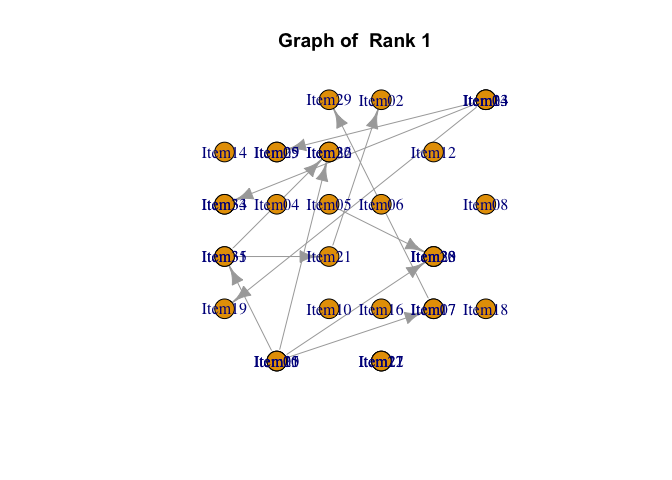<!-- -->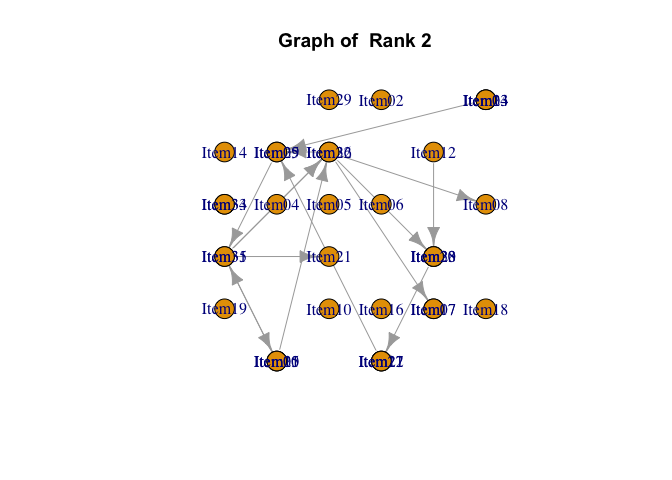<!-- -->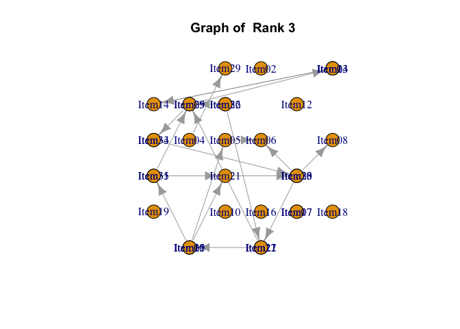<!-- -->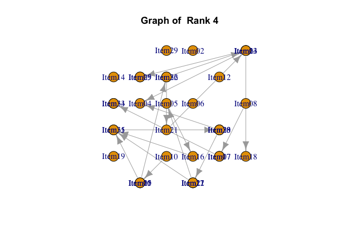<!-- -->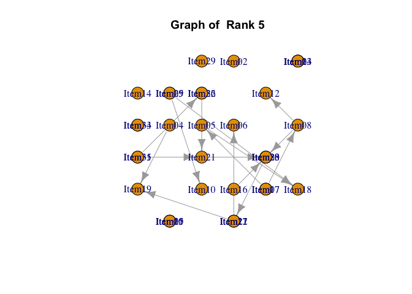<!-- -->

    ## 
    ## Parameter Learning
    ##       Item Rank PIRP 1 PIRP 2 PIRP 3 PIRP 4
    ## 1   Item01    1  0.710                     
    ## 2   Item02    1  0.073  0.256              
    ## 3   Item03    1  0.236                     
    ## 4   Item04    1  0.079                     
    ## 5   Item05    1  0.061                     
    ## 6   Item06    1  0.040                     
    ## 7   Item07    1  0.398  0.429              
    ## 8   Item08    1  0.258                     
    ## 9   Item09    1  0.227  0.246              
    ## 10  Item10    1  0.192                     
    ## 11  Item11    1  0.133                     
    ## 12  Item12    1  0.111                     
    ## 13  Item13    1  0.088                     
    ## 14  Item14    1  0.013                     
    ## 15  Item15    1  0.014                     
    ## 16  Item16    1  0.058                     
    ## 17  Item17    1  0.125                     
    ## 18  Item18    1  0.030                     
    ## 19  Item19    1  0.035  0.079              
    ## 20  Item20    1  0.028                     
    ## 21  Item21    1  0.174  0.298              
    ## 22  Item22    1  0.226                     
    ## 23  Item23    1  0.301  0.304              
    ## 24  Item24    1  0.231                     
    ## 25  Item25    1  0.133                     
    ## 26  Item26    1  0.092                     
    ## 27  Item27    1  0.106                     
    ## 28  Item28    1  0.017  0.112              
    ## 29  Item29    1  0.061  0.069              
    ## 30  Item30    1  0.027                     
    ## 31  Item31    1  0.645  0.706              
    ## 32  Item32    1  0.484  0.801  0.543  0.809
    ## 33  Item33    1  0.312                     
    ## 34  Item34    1  0.183  0.239              
    ## 35  Item35    1  0.098                     
    ## 36  Item01    2  0.802                     
    ## 37  Item02    2  0.231                     
    ## 38  Item03    2  0.331                     
    ## 39  Item04    2  0.157                     
    ## 40  Item05    2  0.124                     
    ## 41  Item06    2  0.094                     
    ## 42  Item07    2  0.480                     
    ## 43  Item08    2  0.276  0.285              
    ## 44  Item09    2  0.239  0.302  0.348  0.436
    ## 45  Item10    2  0.258                     
    ## 46  Item11    2  0.282                     
    ## 47  Item12    2  0.173                     
    ## 48  Item13    2  0.114                     
    ## 49  Item14    2  0.030                     
    ## 50  Item15    2  0.020                     
    ## 51  Item16    2  0.081                     
    ## 52  Item17    2  0.143  0.216              
    ## 53  Item18    2  0.026                     
    ## 54  Item19    2  0.029                     
    ## 55  Item20    2  0.050  0.036              
    ## 56  Item21    2  0.307  0.522              
    ## 57  Item22    2  0.317  0.586              
    ## 58  Item23    2  0.361  0.456              
    ## 59  Item24    2  0.386                     
    ## 60  Item25    2  0.133  0.520              
    ## 61  Item26    2  0.167  0.242              
    ## 62  Item27    2  0.158  0.331              
    ## 63  Item28    2  0.046  0.149              
    ## 64  Item29    2  0.100                     
    ## 65  Item30    2  0.040                     
    ## 66  Item31    2  0.659  0.773              
    ## 67  Item32    2  0.497  0.782  0.564  0.839
    ## 68  Item33    2  0.354                     
    ## 69  Item34    2  0.196                     
    ## 70  Item35    2  0.131  0.106              
    ## 71  Item01    3  0.877                     
    ## 72  Item02    3  0.417                     
    ## 73  Item03    3  0.434  0.523              
    ## 74  Item04    3  0.308                     
    ## 75  Item05    3  0.097  0.284              
    ## 76  Item06    3  0.047  0.024  0.775  0.778
    ## 77  Item07    3  0.577                     
    ## 78  Item08    3  0.327  0.354              
    ## 79  Item09    3  0.301  0.311  0.440  0.503
    ## 80  Item10    3  0.366                     
    ## 81  Item11    3  0.501                     
    ## 82  Item12    3  0.316                     
    ## 83  Item13    3  0.201                     
    ## 84  Item14    3  0.041  0.072  0.271  0.437
    ## 85  Item15    3  0.024  0.133              
    ## 86  Item16    3  0.185                     
    ## 87  Item17    3  0.247                     
    ## 88  Item18    3  0.041                     
    ## 89  Item19    3  0.045                     
    ## 90  Item20    3  0.050                     
    ## 91  Item21    3  0.366  0.390  0.502  0.781
    ## 92  Item22    3  0.416  0.787              
    ## 93  Item23    3  0.436  0.669              
    ## 94  Item24    3  0.598                     
    ## 95  Item25    3  0.354  0.548              
    ## 96  Item26    3  0.456                     
    ## 97  Item27    3  0.098  0.761              
    ## 98  Item28    3  0.163  0.295              
    ## 99  Item29    3  0.171  0.301              
    ## 100 Item30    3  0.082                     
    ## 101 Item31    3  0.662  0.833              
    ## 102 Item32    3  0.814                     
    ## 103 Item33    3  0.366  0.480              
    ## 104 Item34    3  0.232                     
    ## 105 Item35    3  0.155                     
    ## 106 Item01    4  0.950                     
    ## 107 Item02    4  0.595                     
    ## 108 Item03    4  0.618                     
    ## 109 Item04    4  0.157  0.082  0.677  0.695
    ## 110 Item05    4  0.168  0.449              
    ## 111 Item06    4  0.329                     
    ## 112 Item07    4  0.688                     
    ## 113 Item08    4  0.408                     
    ## 114 Item09    4  0.499                     
    ## 115 Item10    4  0.470                     
    ## 116 Item11    4  0.740                     
    ## 117 Item12    4  0.496                     
    ## 118 Item13    4  0.198  0.334              
    ## 119 Item14    4  0.194                     
    ## 120 Item15    4  0.128                     
    ## 121 Item16    4  0.248  0.417              
    ## 122 Item17    4  0.335  0.410              
    ## 123 Item18    4  0.019  0.182              
    ## 124 Item19    4  0.066                     
    ## 125 Item20    4  0.038  0.128              
    ## 126 Item21    4  0.802  0.912              
    ## 127 Item22    4  0.636  0.912              
    ## 128 Item23    4  0.672  0.858              
    ## 129 Item24    4  0.757  0.849              
    ## 130 Item25    4  0.253  0.883              
    ## 131 Item26    4  0.751                     
    ## 132 Item27    4  0.656                     
    ## 133 Item28    4  0.363                     
    ## 134 Item29    4  0.340                     
    ## 135 Item30    4  0.131                     
    ## 136 Item31    4  0.685  0.900              
    ## 137 Item32    4  0.640  0.860              
    ## 138 Item33    4  0.520                     
    ## 139 Item34    4  0.207  0.344              
    ## 140 Item35    4  0.157  0.269  0.166  0.327
    ## 141 Item01    5  0.967                     
    ## 142 Item02    5  0.739                     
    ## 143 Item03    5  0.732                     
    ## 144 Item04    5  0.614                     
    ## 145 Item05    5  0.457  0.591              
    ## 146 Item06    5  0.157  0.527              
    ## 147 Item07    5  0.759                     
    ## 148 Item08    5  0.454  0.511              
    ## 149 Item09    5  0.627                     
    ## 150 Item10    5  0.319  0.710              
    ## 151 Item11    5  0.885                     
    ## 152 Item12    5  0.628  0.723              
    ## 153 Item13    5  0.502                     
    ## 154 Item14    5  0.335                     
    ## 155 Item15    5  0.244                     
    ## 156 Item16    5  0.492                     
    ## 157 Item17    5  0.533                     
    ## 158 Item18    5  0.171  0.048  0.181  0.211
    ## 159 Item19    5  0.104  0.031  0.229  0.206
    ## 160 Item20    5  0.131                     
    ## 161 Item21    5  0.631  0.799  0.901  0.971
    ## 162 Item22    5  0.727  0.959              
    ## 163 Item23    5  0.622  0.941              
    ## 164 Item24    5  0.941                     
    ## 165 Item25    5  0.915                     
    ## 166 Item26    5  0.902                     
    ## 167 Item27    5  0.824                     
    ## 168 Item28    5  0.488  0.614              
    ## 169 Item29    5  0.496                     
    ## 170 Item30    5  0.101  0.309              
    ## 171 Item31    5  0.930                     
    ## 172 Item32    5  0.628  0.899              
    ## 173 Item33    5  0.616                     
    ## 174 Item34    5  0.318                     
    ## 175 Item35    5  0.260                     
    ## 
    ## Conditional Correct Response Rate
    ##     Child Item Rank N of Parents   Parent Items       PIRP Conditional CRR
    ## 1       Item01    1            0     No Parents No Pattern          0.7104
    ## 2       Item02    1            1         Item21          0          0.0725
    ## 3       Item02    1            1         Item21          1          0.2563
    ## 4       Item03    1            0     No Parents No Pattern          0.2360
    ## 5       Item04    1            0     No Parents No Pattern          0.0789
    ## 6       Item05    1            0     No Parents No Pattern          0.0608
    ## 7       Item06    1            0     No Parents No Pattern          0.0400
    ## 8       Item07    1            1         Item01          0          0.3979
    ## 9       Item07    1            1         Item01          1          0.4292
    ## 10      Item08    1            0     No Parents No Pattern          0.2581
    ## 11      Item09    1            1         Item03          0          0.2275
    ## 12      Item09    1            1         Item03          1          0.2465
    ## 13      Item10    1            0     No Parents No Pattern          0.1916
    ## 14      Item11    1            0     No Parents No Pattern          0.1325
    ## 15      Item12    1            0     No Parents No Pattern          0.1111
    ## 16      Item13    1            0     No Parents No Pattern          0.0884
    ## 17      Item14    1            0     No Parents No Pattern          0.0134
    ## 18      Item15    1            0     No Parents No Pattern          0.0139
    ## 19      Item16    1            0     No Parents No Pattern          0.0578
    ## 20      Item17    1            0     No Parents No Pattern          0.1253
    ## 21      Item18    1            0     No Parents No Pattern          0.0303
    ## 22      Item19    1            1         Item13          0          0.0354
    ## 23      Item19    1            1         Item13          1          0.0795
    ## 24      Item20    1            0     No Parents No Pattern          0.0283
    ## 25      Item21    1            1         Item31          0          0.1737
    ## 26      Item21    1            1         Item31          1          0.2978
    ## 27      Item22    1            0     No Parents No Pattern          0.2256
    ## 28      Item23    1            1         Item01          0          0.3009
    ## 29      Item23    1            1         Item01          1          0.3036
    ## 30      Item24    1            0     No Parents No Pattern          0.2312
    ## 31      Item25    1            0     No Parents No Pattern          0.1329
    ## 32      Item26    1            0     No Parents No Pattern          0.0922
    ## 33      Item27    1            0     No Parents No Pattern          0.1058
    ## 34      Item28    1            1         Item05          0          0.0166
    ## 35      Item28    1            1         Item05          1          0.1120
    ## 36      Item29    1            1         Item07          0          0.0611
    ## 37      Item29    1            1         Item07          1          0.0693
    ## 38      Item30    1            0     No Parents No Pattern          0.0275
    ## 39      Item31    1            1         Item01          0          0.6446
    ## 40      Item31    1            1         Item01          1          0.7056
    ## 41      Item32    1            2 Item01, Item31         00          0.4841
    ## 42      Item32    1            2 Item01, Item31         01          0.8011
    ## 43      Item32    1            2 Item01, Item31         10          0.5430
    ## 44      Item32    1            2 Item01, Item31         11          0.8090
    ## 45      Item33    1            0     No Parents No Pattern          0.3122
    ## 46      Item34    1            1         Item13          0          0.1826
    ## 47      Item34    1            1         Item13          1          0.2390
    ## 48      Item35    1            0     No Parents No Pattern          0.0985
    ## 49      Item01    2            0     No Parents No Pattern          0.8019
    ## 50      Item02    2            0     No Parents No Pattern          0.2314
    ## 51      Item03    2            0     No Parents No Pattern          0.3315
    ## 52      Item04    2            0     No Parents No Pattern          0.1574
    ## 53      Item05    2            0     No Parents No Pattern          0.1245
    ## 54      Item06    2            0     No Parents No Pattern          0.0938
    ## 55      Item07    2            0     No Parents No Pattern          0.4805
    ## 56      Item08    2            1         Item32          0          0.2758
    ## 57      Item08    2            1         Item32          1          0.2853
    ## 58      Item09    2            2 Item11, Item26         00          0.2390
    ## 59      Item09    2            2 Item11, Item26         01          0.3025
    ## 60      Item09    2            2 Item11, Item26         10          0.3484
    ## 61      Item09    2            2 Item11, Item26         11          0.4357
    ## 62      Item10    2            0     No Parents No Pattern          0.2584
    ## 63      Item11    2            0     No Parents No Pattern          0.2817
    ## 64      Item12    2            0     No Parents No Pattern          0.1729
    ## 65      Item13    2            0     No Parents No Pattern          0.1141
    ## 66      Item14    2            0     No Parents No Pattern          0.0304
    ## 67      Item15    2            0     No Parents No Pattern          0.0204
    ## 68      Item16    2            0     No Parents No Pattern          0.0814
    ## 69      Item17    2            1         Item26          0          0.1429
    ## 70      Item17    2            1         Item26          1          0.2164
    ## 71      Item18    2            0     No Parents No Pattern          0.0261
    ## 72      Item19    2            0     No Parents No Pattern          0.0287
    ## 73      Item20    2            1         Item31          0          0.0498
    ## 74      Item20    2            1         Item31          1          0.0362
    ## 75      Item21    2            1         Item31          0          0.3073
    ## 76      Item21    2            1         Item31          1          0.5221
    ## 77      Item22    2            1         Item23          0          0.3171
    ## 78      Item22    2            1         Item23          1          0.5862
    ## 79      Item23    2            1         Item32          0          0.3612
    ## 80      Item23    2            1         Item32          1          0.4558
    ## 81      Item24    2            0     No Parents No Pattern          0.3861
    ## 82      Item25    2            1         Item24          0          0.1334
    ## 83      Item25    2            1         Item24          1          0.5204
    ## 84      Item26    2            1         Item31          0          0.1670
    ## 85      Item26    2            1         Item31          1          0.2420
    ## 86      Item27    2            1         Item11          0          0.1581
    ## 87      Item27    2            1         Item11          1          0.3310
    ## 88      Item28    2            1         Item12          0          0.0458
    ## 89      Item28    2            1         Item12          1          0.1493
    ## 90      Item29    2            0     No Parents No Pattern          0.1001
    ## 91      Item30    2            0     No Parents No Pattern          0.0402
    ## 92      Item31    2            1         Item01          0          0.6591
    ## 93      Item31    2            1         Item01          1          0.7730
    ## 94      Item32    2            2 Item01, Item31         00          0.4973
    ## 95      Item32    2            2 Item01, Item31         01          0.7824
    ## 96      Item32    2            2 Item01, Item31         10          0.5641
    ## 97      Item32    2            2 Item01, Item31         11          0.8388
    ## 98      Item33    2            0     No Parents No Pattern          0.3538
    ## 99      Item34    2            0     No Parents No Pattern          0.1957
    ## 100     Item35    2            1         Item09          0          0.1307
    ## 101     Item35    2            1         Item09          1          0.1056
    ## 102     Item01    3            0     No Parents No Pattern          0.8766
    ## 103     Item02    3            0     No Parents No Pattern          0.4172
    ## 104     Item03    3            1         Item25          0          0.4344
    ## 105     Item03    3            1         Item25          1          0.5228
    ## 106     Item04    3            0     No Parents No Pattern          0.3078
    ## 107     Item05    3            1         Item01          0          0.0972
    ## 108     Item05    3            1         Item01          1          0.2836
    ## 109     Item06    3            2 Item05, Item23         00          0.0471
    ## 110     Item06    3            2 Item05, Item23         01          0.0239
    ## 111     Item06    3            2 Item05, Item23         10          0.7752
    ## 112     Item06    3            2 Item05, Item23         11          0.7779
    ## 113     Item07    3            0     No Parents No Pattern          0.5768
    ## 114     Item08    3            1         Item23          0          0.3271
    ## 115     Item08    3            1         Item23          1          0.3542
    ## 116     Item09    3            2 Item26, Item27         00          0.3008
    ## 117     Item09    3            2 Item26, Item27         01          0.3107
    ## 118     Item09    3            2 Item26, Item27         10          0.4403
    ## 119     Item09    3            2 Item26, Item27         11          0.5028
    ## 120     Item10    3            0     No Parents No Pattern          0.3665
    ## 121     Item11    3            0     No Parents No Pattern          0.5008
    ## 122     Item12    3            0     No Parents No Pattern          0.3162
    ## 123     Item13    3            0     No Parents No Pattern          0.2012
    ## 124     Item14    3            2 Item13, Item24         00          0.0414
    ## 125     Item14    3            2 Item13, Item24         01          0.0721
    ## 126     Item14    3            2 Item13, Item24         10          0.2709
    ## 127     Item14    3            2 Item13, Item24         11          0.4372
    ## 128     Item15    3            1         Item11          0          0.0244
    ## 129     Item15    3            1         Item11          1          0.1329
    ## 130     Item16    3            0     No Parents No Pattern          0.1848
    ## 131     Item17    3            0     No Parents No Pattern          0.2474
    ## 132     Item18    3            0     No Parents No Pattern          0.0408
    ## 133     Item19    3            0     No Parents No Pattern          0.0450
    ## 134     Item20    3            0     No Parents No Pattern          0.0495
    ## 135     Item21    3            2 Item01, Item31         00          0.3659
    ## 136     Item21    3            2 Item01, Item31         01          0.3898
    ## 137     Item21    3            2 Item01, Item31         10          0.5020
    ## 138     Item21    3            2 Item01, Item31         11          0.7812
    ## 139     Item22    3            1         Item23          0          0.4160
    ## 140     Item22    3            1         Item23          1          0.7868
    ## 141     Item23    3            1         Item31          0          0.4360
    ## 142     Item23    3            1         Item31          1          0.6688
    ## 143     Item24    3            0     No Parents No Pattern          0.5984
    ## 144     Item25    3            1         Item31          0          0.3543
    ## 145     Item25    3            1         Item31          1          0.5483
    ## 146     Item26    3            0     No Parents No Pattern          0.4555
    ## 147     Item27    3            1         Item26          0          0.0977
    ## 148     Item27    3            1         Item26          1          0.7606
    ## 149     Item28    3            1         Item34          0          0.1633
    ## 150     Item28    3            1         Item34          1          0.2946
    ## 151     Item29    3            1         Item04          0          0.1713
    ## 152     Item29    3            1         Item04          1          0.3011
    ## 153     Item30    3            0     No Parents No Pattern          0.0821
    ## 154     Item31    3            1         Item01          0          0.6618
    ## 155     Item31    3            1         Item01          1          0.8333
    ## 156     Item32    3            0     No Parents No Pattern          0.8141
    ## 157     Item33    3            1         Item25          0          0.3665
    ## 158     Item33    3            1         Item25          1          0.4800
    ## 159     Item34    3            0     No Parents No Pattern          0.2321
    ## 160     Item35    3            0     No Parents No Pattern          0.1546
    ## 161     Item01    4            0     No Parents No Pattern          0.9497
    ## 162     Item02    4            0     No Parents No Pattern          0.5947
    ## 163     Item03    4            0     No Parents No Pattern          0.6182
    ## 164     Item04    4            2 Item03, Item23         00          0.1572
    ## 165     Item04    4            2 Item03, Item23         01          0.0821
    ## 166     Item04    4            2 Item03, Item23         10          0.6769
    ## 167     Item04    4            2 Item03, Item23         11          0.6946
    ## 168     Item05    4            1         Item11          0          0.1677
    ## 169     Item05    4            1         Item11          1          0.4492
    ## 170     Item06    4            0     No Parents No Pattern          0.3285
    ## 171     Item07    4            0     No Parents No Pattern          0.6876
    ## 172     Item08    4            0     No Parents No Pattern          0.4083
    ## 173     Item09    4            0     No Parents No Pattern          0.4991
    ## 174     Item10    4            0     No Parents No Pattern          0.4701
    ## 175     Item11    4            0     No Parents No Pattern          0.7402
    ## 176     Item12    4            0     No Parents No Pattern          0.4962
    ## 177     Item13    4            1         Item21          0          0.1981
    ## 178     Item13    4            1         Item21          1          0.3335
    ## 179     Item14    4            0     No Parents No Pattern          0.1940
    ## 180     Item15    4            0     No Parents No Pattern          0.1281
    ## 181     Item16    4            1         Item05          0          0.2483
    ## 182     Item16    4            1         Item05          1          0.4170
    ## 183     Item17    4            1         Item08          0          0.3349
    ## 184     Item17    4            1         Item08          1          0.4103
    ## 185     Item18    4            1         Item13          0          0.0188
    ## 186     Item18    4            1         Item13          1          0.1821
    ## 187     Item19    4            0     No Parents No Pattern          0.0657
    ## 188     Item20    4            1         Item10          0          0.0383
    ## 189     Item20    4            1         Item10          1          0.1284
    ## 190     Item21    4            1         Item32          0          0.8020
    ## 191     Item21    4            1         Item32          1          0.9118
    ## 192     Item22    4            1         Item23          0          0.6357
    ## 193     Item22    4            1         Item23          1          0.9125
    ## 194     Item23    4            1         Item31          0          0.6720
    ## 195     Item23    4            1         Item31          1          0.8585
    ## 196     Item24    4            1         Item32          0          0.7567
    ## 197     Item24    4            1         Item32          1          0.8491
    ## 198     Item25    4            1         Item24          0          0.2533
    ## 199     Item25    4            1         Item24          1          0.8835
    ## 200     Item26    4            0     No Parents No Pattern          0.7507
    ## 201     Item27    4            0     No Parents No Pattern          0.6559
    ## 202     Item28    4            0     No Parents No Pattern          0.3633
    ## 203     Item29    4            0     No Parents No Pattern          0.3401
    ## 204     Item30    4            0     No Parents No Pattern          0.1310
    ## 205     Item31    4            1         Item01          0          0.6849
    ## 206     Item31    4            1         Item01          1          0.9001
    ## 207     Item32    4            1         Item01          0          0.6398
    ## 208     Item32    4            1         Item01          1          0.8596
    ## 209     Item33    4            0     No Parents No Pattern          0.5199
    ## 210     Item34    4            1         Item17          0          0.2075
    ## 211     Item34    4            1         Item17          1          0.3444
    ## 212     Item35    4            2 Item11, Item16         00          0.1565
    ## 213     Item35    4            2 Item11, Item16         01          0.2690
    ## 214     Item35    4            2 Item11, Item16         10          0.1658
    ## 215     Item35    4            2 Item11, Item16         11          0.3272
    ## 216     Item01    5            0     No Parents No Pattern          0.9674
    ## 217     Item02    5            0     No Parents No Pattern          0.7392
    ## 218     Item03    5            0     No Parents No Pattern          0.7320
    ## 219     Item04    5            0     No Parents No Pattern          0.6143
    ## 220     Item05    5            1         Item17          0          0.4570
    ## 221     Item05    5            1         Item17          1          0.5908
    ## 222     Item06    5            1         Item11          0          0.1572
    ## 223     Item06    5            1         Item11          1          0.5268
    ## 224     Item07    5            0     No Parents No Pattern          0.7591
    ## 225     Item08    5            1         Item07          0          0.4539
    ## 226     Item08    5            1         Item07          1          0.5110
    ## 227     Item09    5            0     No Parents No Pattern          0.6270
    ## 228     Item10    5            1         Item09          0          0.3187
    ## 229     Item10    5            1         Item09          1          0.7098
    ## 230     Item11    5            0     No Parents No Pattern          0.8853
    ## 231     Item12    5            1         Item08          0          0.6280
    ## 232     Item12    5            1         Item08          1          0.7234
    ## 233     Item13    5            0     No Parents No Pattern          0.5022
    ## 234     Item14    5            0     No Parents No Pattern          0.3348
    ## 235     Item15    5            0     No Parents No Pattern          0.2438
    ## 236     Item16    5            0     No Parents No Pattern          0.4923
    ## 237     Item17    5            0     No Parents No Pattern          0.5326
    ## 238     Item18    5            2 Item05, Item25         00          0.1711
    ## 239     Item18    5            2 Item05, Item25         01          0.0482
    ## 240     Item18    5            2 Item05, Item25         10          0.1809
    ## 241     Item18    5            2 Item05, Item25         11          0.2111
    ## 242     Item19    5            2 Item04, Item11         00          0.1040
    ## 243     Item19    5            2 Item04, Item11         01          0.0311
    ## 244     Item19    5            2 Item04, Item11         10          0.2288
    ## 245     Item19    5            2 Item04, Item11         11          0.2065
    ## 246     Item20    5            0     No Parents No Pattern          0.1309
    ## 247     Item21    5            2 Item31, Item32         00          0.6312
    ## 248     Item21    5            2 Item31, Item32         01          0.7986
    ## 249     Item21    5            2 Item31, Item32         10          0.9008
    ## 250     Item21    5            2 Item31, Item32         11          0.9715
    ## 251     Item22    5            1         Item23          0          0.7273
    ## 252     Item22    5            1         Item23          1          0.9585
    ## 253     Item23    5            1         Item21          0          0.6220
    ## 254     Item23    5            1         Item21          1          0.9412
    ## 255     Item24    5            0     No Parents No Pattern          0.9410
    ## 256     Item25    5            0     No Parents No Pattern          0.9148
    ## 257     Item26    5            0     No Parents No Pattern          0.9019
    ## 258     Item27    5            0     No Parents No Pattern          0.8242
    ## 259     Item28    5            1         Item08          0          0.4880
    ## 260     Item28    5            1         Item08          1          0.6142
    ## 261     Item29    5            0     No Parents No Pattern          0.4960
    ## 262     Item30    5            1         Item16          0          0.1008
    ## 263     Item30    5            1         Item16          1          0.3090
    ## 264     Item31    5            0     No Parents No Pattern          0.9299
    ## 265     Item32    5            1         Item31          0          0.6278
    ## 266     Item32    5            1         Item31          1          0.8989
    ## 267     Item33    5            0     No Parents No Pattern          0.6160
    ## 268     Item34    5            0     No Parents No Pattern          0.3181
    ## 269     Item35    5            0     No Parents No Pattern          0.2602
    ## 
    ## Marginal Item Reference Profile
    ##        Rank 1 Rank 2 Rank 3 Rank 4 Rank 5
    ## Item01 0.7104 0.8019 0.8766 0.9497  0.967
    ## Item02 0.0957 0.2314 0.4172 0.5947  0.739
    ## Item03 0.2360 0.3315 0.4774 0.6182  0.732
    ## Item04 0.0789 0.1574 0.3078 0.4316  0.614
    ## Item05 0.0608 0.1245 0.2751 0.3886  0.550
    ## Item06 0.0400 0.0938 0.2827 0.3285  0.520
    ## Item07 0.4183 0.4805 0.5768 0.6876  0.759
    ## Item08 0.2581 0.2834 0.3445 0.4083  0.501
    ## Item09 0.2308 0.2753 0.3750 0.4991  0.627
    ## Item10 0.1916 0.2584 0.3665 0.4701  0.606
    ## Item11 0.1325 0.2817 0.5008 0.7402  0.885
    ## Item12 0.1111 0.1729 0.3162 0.4962  0.682
    ## Item13 0.0884 0.1141 0.2012 0.3305  0.502
    ## Item14 0.0134 0.0304 0.1007 0.1940  0.335
    ## Item15 0.0139 0.0204 0.0888 0.1281  0.244
    ## Item16 0.0578 0.0814 0.1848 0.2941  0.492
    ## Item17 0.1253 0.1548 0.2474 0.3624  0.533
    ## Item18 0.0303 0.0261 0.0408 0.0487  0.155
    ## Item19 0.0384 0.0287 0.0450 0.0657  0.161
    ## Item20 0.0283 0.0391 0.0495 0.0758  0.131
    ## Item21 0.2576 0.4755 0.7174 0.8948  0.955
    ## Item22 0.2256 0.4260 0.6539 0.8968  0.955
    ## Item23 0.3027 0.4369 0.6292 0.8418  0.939
    ## Item24 0.2312 0.3861 0.5984 0.8347  0.941
    ## Item25 0.1329 0.2833 0.5152 0.8528  0.915
    ## Item26 0.0922 0.2257 0.4555 0.7507  0.902
    ## Item27 0.1058 0.1985 0.3572 0.6559  0.824
    ## Item28 0.0180 0.0589 0.1966 0.3633  0.559
    ## Item29 0.0643 0.1001 0.2182 0.3401  0.496
    ## Item30 0.0275 0.0402 0.0821 0.1310  0.239
    ## Item31 0.6844 0.7566 0.8254 0.8934  0.930
    ## Item32 0.7139 0.7705 0.8141 0.8527  0.886
    ## Item33 0.3122 0.3538 0.4217 0.5199  0.616
    ## Item34 0.1866 0.1957 0.2321 0.2429  0.318
    ## Item35 0.0985 0.1239 0.1546 0.1967  0.260
    ## 
    ## IRP Indices
    ##        Alpha          A Beta         B Gamma            C
    ## Item01     1 0.09147897    1 0.7104169  0.00  0.000000000
    ## Item02     2 0.18575838    3 0.4171962  0.00  0.000000000
    ## Item03     2 0.14596474    3 0.4774193  0.00  0.000000000
    ## Item04     4 0.18270703    4 0.4316332  0.00  0.000000000
    ## Item05     4 0.16182210    5 0.5504280  0.00  0.000000000
    ## Item06     4 0.19192621    5 0.5204344  0.00  0.000000000
    ## Item07     3 0.11078674    2 0.4804693  0.00  0.000000000
    ## Item08     4 0.09271153    5 0.5009651  0.00  0.000000000
    ## Item09     4 0.12790164    4 0.4991280  0.00  0.000000000
    ## Item10     4 0.13606029    4 0.4700913  0.00  0.000000000
    ## Item11     3 0.23945895    3 0.5007893  0.00  0.000000000
    ## Item12     4 0.18559983    4 0.4961763  0.00  0.000000000
    ## Item13     4 0.17168271    5 0.5022082  0.00  0.000000000
    ## Item14     4 0.14087675    5 0.3348446  0.00  0.000000000
    ## Item15     4 0.11578699    5 0.2438481  0.00  0.000000000
    ## Item16     4 0.19823273    5 0.4923369  0.00  0.000000000
    ## Item17     4 0.17017469    5 0.5325965  0.00  0.000000000
    ## Item18     4 0.10679453    5 0.1554454  0.25 -0.004248974
    ## Item19     4 0.09483464    5 0.1605088  0.25 -0.009740845
    ## Item20     4 0.05504400    5 0.1308940  0.00  0.000000000
    ## Item21     2 0.24190430    2 0.4755097  0.00  0.000000000
    ## Item22     3 0.24291837    2 0.4259656  0.00  0.000000000
    ## Item23     3 0.21261028    2 0.4369185  0.00  0.000000000
    ## Item24     3 0.23639488    3 0.5983545  0.00  0.000000000
    ## Item25     3 0.33752441    3 0.5152274  0.00  0.000000000
    ## Item26     3 0.29514977    3 0.4555486  0.00  0.000000000
    ## Item27     3 0.29864648    3 0.3572087  0.00  0.000000000
    ## Item28     4 0.19588834    5 0.5591385  0.00  0.000000000
    ## Item29     4 0.15593083    5 0.4960204  0.00  0.000000000
    ## Item30     4 0.10842632    5 0.2394654  0.00  0.000000000
    ## Item31     1 0.07218040    1 0.6843920  0.00  0.000000000
    ## Item32     1 0.05661584    1 0.7139340  0.00  0.000000000
    ## Item33     3 0.09815971    4 0.5199007  0.00  0.000000000
    ## Item34     4 0.07524326    5 0.3181130  0.00  0.000000000
    ## Item35     4 0.06353034    5 0.2601808  0.00  0.000000000
    ## 
    ## Test reference Profile and Latent Rank Distribution
    ##                               Rank 1 Rank 2 Rank 3 Rank 4  Rank 5
    ## Test Reference Profile         6.413  8.819 12.947 17.380  21.472
    ## Latent Rank Ditribution      181.000 60.000 83.000 82.000 109.000
    ## Rank Membership Distribution 165.388 78.163 81.015 80.658 109.777
    ## [1] "Weakly ordinal alignment condition was satisfied."
    ## 
    ## Model Fit Indices
    ##                    value
    ## model_log_like -7796.306
    ## bench_log_like -5891.314
    ## null_log_like  -9862.114
    ## model_Chi_sq    3809.985
    ## null_Chi_sq     7941.601
    ## model_df         921.000
    ## null_df         1155.000
    ## NFI                0.520
    ## RFI                0.398
    ## IFI                0.588
    ## TLI                0.466
    ## CFI                0.574
    ## RMSEA              0.078
    ## AIC             1967.985
    ## CAIC           -1942.680
    ## BIC            -1940.893

## Local Dependence Biclustering

## Local Dependence Biclustering (LDB)

Local Dependence Biclustering combines biclustering and Bayesian network
models. The model requires three main components: - Number of latent
classes/ranks - Field assignments for items - Network structure between
fields at each rank

Here’s an example implementation:

``` r
# Create field configuration vector (assign items to fields)
conf <- c(1, 6, 6, 8, 9, 9, 4, 7, 7, 7, 5, 8, 9, 10, 10, 9, 9, 10, 10, 10, 2, 2, 3, 3, 5, 5, 6, 9, 9, 10, 1, 1, 7, 9, 10)

# Create edge data for network structure between fields
edges_data <- data.frame(
  "From Field (Parent) >>>" = c(
    6, 4, 5, 1, 1, 4, # Class/Rank 2
    3, 4, 6, 2, 4, 4, # Class/Rank 3
    3, 6, 4, 1, # Class/Rank 4
    7, 9, 6, 7 # Class/Rank 5
  ),
  ">>> To Field (Child)" = c(
    8, 7, 8, 7, 2, 5, # Class/Rank 2
    5, 8, 8, 4, 6, 7, # Class/Rank 3
    5, 8, 5, 8, # Class/Rank 4
    10, 10, 8, 9 # Class/Rank 5
  ),
  "At Class/Rank (Locus)" = c(
    2, 2, 2, 2, 2, 2, # Class/Rank 2
    3, 3, 3, 3, 3, 3, # Class/Rank 3
    4, 4, 4, 4, # Class/Rank 4
    5, 5, 5, 5 # Class/Rank 5
  )
)

# Save edge data to temporary file
edgeFile <- tempfile(fileext = ".csv")
write.csv(edges_data, file = edgeFile, row.names = FALSE)
```

Additionally, as mentioned in the text (Shojima, 2022), it is often the
case that seeking the network structure exploratively does not yield
appropriate results, so it has not been implemented.

``` r
result.LDB <- LDB(U = J35S515, ncls = 5, conf = conf, adj_file = edgeFile)
result.LDB
```

    ## Adjacency Matrix
    ## [[1]]
    ##         Field01 Field02 Field03 Field04 Field05 Field06 Field07 Field08 Field09
    ## Field01       0       0       0       0       0       0       0       0       0
    ## Field02       0       0       0       0       0       0       0       0       0
    ## Field03       0       0       0       0       0       0       0       0       0
    ## Field04       0       0       0       0       0       0       0       0       0
    ## Field05       0       0       0       0       0       0       0       0       0
    ## Field06       0       0       0       0       0       0       0       0       0
    ## Field07       0       0       0       0       0       0       0       0       0
    ## Field08       0       0       0       0       0       0       0       0       0
    ## Field09       0       0       0       0       0       0       0       0       0
    ## Field10       0       0       0       0       0       0       0       0       0
    ##         Field10
    ## Field01       0
    ## Field02       0
    ## Field03       0
    ## Field04       0
    ## Field05       0
    ## Field06       0
    ## Field07       0
    ## Field08       0
    ## Field09       0
    ## Field10       0
    ## 
    ## [[2]]
    ##         Field01 Field02 Field03 Field04 Field05 Field06 Field07 Field08 Field09
    ## Field01       0       1       0       0       0       0       1       0       0
    ## Field02       0       0       0       0       0       0       0       0       0
    ## Field03       0       0       0       0       0       0       0       0       0
    ## Field04       0       0       0       0       1       0       1       0       0
    ## Field05       0       0       0       0       0       0       0       1       0
    ## Field06       0       0       0       0       0       0       0       1       0
    ## Field07       0       0       0       0       0       0       0       0       0
    ## Field08       0       0       0       0       0       0       0       0       0
    ## Field09       0       0       0       0       0       0       0       0       0
    ## Field10       0       0       0       0       0       0       0       0       0
    ##         Field10
    ## Field01       0
    ## Field02       0
    ## Field03       0
    ## Field04       0
    ## Field05       0
    ## Field06       0
    ## Field07       0
    ## Field08       0
    ## Field09       0
    ## Field10       0
    ## 
    ## [[3]]
    ##         Field01 Field02 Field03 Field04 Field05 Field06 Field07 Field08 Field09
    ## Field01       0       0       0       0       0       0       0       0       0
    ## Field02       0       0       0       1       0       0       0       0       0
    ## Field03       0       0       0       0       1       0       0       0       0
    ## Field04       0       0       0       0       0       1       1       1       0
    ## Field05       0       0       0       0       0       0       0       0       0
    ## Field06       0       0       0       0       0       0       0       1       0
    ## Field07       0       0       0       0       0       0       0       0       0
    ## Field08       0       0       0       0       0       0       0       0       0
    ## Field09       0       0       0       0       0       0       0       0       0
    ## Field10       0       0       0       0       0       0       0       0       0
    ##         Field10
    ## Field01       0
    ## Field02       0
    ## Field03       0
    ## Field04       0
    ## Field05       0
    ## Field06       0
    ## Field07       0
    ## Field08       0
    ## Field09       0
    ## Field10       0
    ## 
    ## [[4]]
    ##         Field01 Field02 Field03 Field04 Field05 Field06 Field07 Field08 Field09
    ## Field01       0       0       0       0       0       0       0       1       0
    ## Field02       0       0       0       0       0       0       0       0       0
    ## Field03       0       0       0       0       1       0       0       0       0
    ## Field04       0       0       0       0       1       0       0       0       0
    ## Field05       0       0       0       0       0       0       0       0       0
    ## Field06       0       0       0       0       0       0       0       1       0
    ## Field07       0       0       0       0       0       0       0       0       0
    ## Field08       0       0       0       0       0       0       0       0       0
    ## Field09       0       0       0       0       0       0       0       0       0
    ## Field10       0       0       0       0       0       0       0       0       0
    ##         Field10
    ## Field01       0
    ## Field02       0
    ## Field03       0
    ## Field04       0
    ## Field05       0
    ## Field06       0
    ## Field07       0
    ## Field08       0
    ## Field09       0
    ## Field10       0
    ## 
    ## [[5]]
    ##         Field01 Field02 Field03 Field04 Field05 Field06 Field07 Field08 Field09
    ## Field01       0       0       0       0       0       0       0       0       0
    ## Field02       0       0       0       0       0       0       0       0       0
    ## Field03       0       0       0       0       0       0       0       0       0
    ## Field04       0       0       0       0       0       0       0       0       0
    ## Field05       0       0       0       0       0       0       0       0       0
    ## Field06       0       0       0       0       0       0       0       1       0
    ## Field07       0       0       0       0       0       0       0       0       1
    ## Field08       0       0       0       0       0       0       0       0       0
    ## Field09       0       0       0       0       0       0       0       0       0
    ## Field10       0       0       0       0       0       0       0       0       0
    ##         Field10
    ## Field01       0
    ## Field02       0
    ## Field03       0
    ## Field04       0
    ## Field05       0
    ## Field06       0
    ## Field07       1
    ## Field08       0
    ## Field09       1
    ## Field10       0

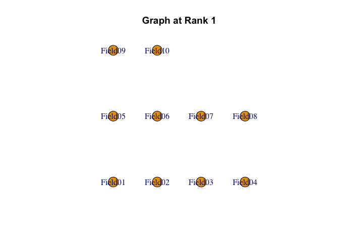<!-- --><!-- -->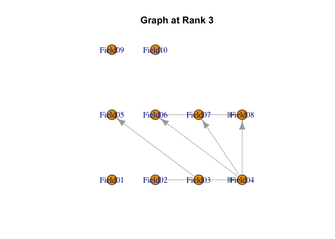<!-- -->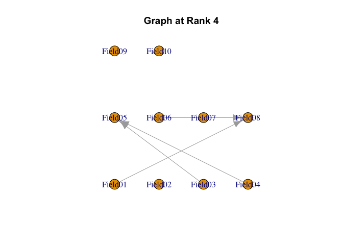<!-- --><!-- -->

    ## 
    ## Parameter Learning
    ## Rank 1 
    ##         PIRP 0 PIRP 1 PIRP 2 PIRP 3 PIRP 4 PIRP 5 PIRP 6 PIRP 7 PIRP 8 PIRP 9
    ## Field01 0.6538                                                               
    ## Field02 0.0756                                                               
    ## Field03 0.1835                                                               
    ## Field04 0.3819                                                               
    ## Field05 0.0500                                                               
    ## Field06 0.0985                                                               
    ## Field07 0.2176                                                               
    ## Field08 0.0608                                                               
    ## Field09 0.0563                                                               
    ## Field10 0.0237                                                               
    ##         PIRP 10 PIRP 11 PIRP 12
    ## Field01                        
    ## Field02                        
    ## Field03                        
    ## Field04                        
    ## Field05                        
    ## Field06                        
    ## Field07                        
    ## Field08                        
    ## Field09                        
    ## Field10                        
    ## Rank 2 
    ##         PIRP 0 PIRP 1 PIRP 2 PIRP 3 PIRP 4 PIRP 5 PIRP 6 PIRP 7 PIRP 8 PIRP 9
    ## Field01 0.8216                                                               
    ## Field02 0.1463 0.3181  0.383  0.597                                          
    ## Field03 0.3320                                                               
    ## Field04 0.4931                                                               
    ## Field05 0.1596 0.2552                                                        
    ## Field06 0.2541                                                               
    ## Field07 0.1232 0.2926  0.217  0.306  0.376                                   
    ## Field08 0.0648 0.0887  0.236  0.443  0.196  0.285  0.624                     
    ## Field09 0.1101                                                               
    ## Field10 0.0359                                                               
    ##         PIRP 10 PIRP 11 PIRP 12
    ## Field01                        
    ## Field02                        
    ## Field03                        
    ## Field04                        
    ## Field05                        
    ## Field06                        
    ## Field07                        
    ## Field08                        
    ## Field09                        
    ## Field10                        
    ## Rank 3 
    ##         PIRP 0 PIRP 1 PIRP 2 PIRP 3 PIRP 4 PIRP 5 PIRP 6 PIRP 7 PIRP 8 PIRP 9
    ## Field01 0.8923                                                               
    ## Field02 0.8736                                                               
    ## Field03 0.8030                                                               
    ## Field04 0.4730  0.492  0.650                                                 
    ## Field05 0.2732  0.319  0.714                                                 
    ## Field06 0.4025  0.486                                                        
    ## Field07 0.3162  0.408                                                        
    ## Field08 0.1028  0.166  0.177  0.439   0.59                                   
    ## Field09 0.1799                                                               
    ## Field10 0.0431                                                               
    ##         PIRP 10 PIRP 11 PIRP 12
    ## Field01                        
    ## Field02                        
    ## Field03                        
    ## Field04                        
    ## Field05                        
    ## Field06                        
    ## Field07                        
    ## Field08                        
    ## Field09                        
    ## Field10                        
    ## Rank 4 
    ##          PIRP 0   PIRP 1 PIRP 2 PIRP 3 PIRP 4 PIRP 5 PIRP 6 PIRP 7 PIRP 8
    ## Field01 0.91975                                                          
    ## Field02 0.97126                                                          
    ## Field03 0.96955                                                          
    ## Field04 0.70098                                                          
    ## Field05 0.28691 0.476702  0.911  0.952                                   
    ## Field06 0.72620                                                          
    ## Field07 0.48152                                                          
    ## Field08 0.00353 0.000122  0.370  0.370  0.401  0.532  0.779              
    ## Field09 0.36220                                                          
    ## Field10 0.08630                                                          
    ##         PIRP 9 PIRP 10 PIRP 11 PIRP 12
    ## Field01                               
    ## Field02                               
    ## Field03                               
    ## Field04                               
    ## Field05                               
    ## Field06                               
    ## Field07                               
    ## Field08                               
    ## Field09                               
    ## Field10                               
    ## Rank 5 
    ##         PIRP 0 PIRP 1 PIRP 2 PIRP 3 PIRP 4 PIRP 5 PIRP 6 PIRP 7 PIRP 8 PIRP 9
    ## Field01 0.9627                                                               
    ## Field02 0.9959                                                               
    ## Field03 0.9947                                                               
    ## Field04 0.8654                                                               
    ## Field05 0.9939                                                               
    ## Field06 0.9178                                                               
    ## Field07 0.7334                                                               
    ## Field08 0.5109 0.4442 0.5939 0.9174                                          
    ## Field09 0.4062 0.5193 0.6496 0.6786  0.851                                   
    ## Field10 0.0874 0.0278 0.0652 0.0429  0.110  0.117  0.118  0.163  0.217  0.275
    ##         PIRP 10 PIRP 11 PIRP 12
    ## Field01                        
    ## Field02                        
    ## Field03                        
    ## Field04                        
    ## Field05                        
    ## Field06                        
    ## Field07                        
    ## Field08                        
    ## Field09                        
    ## Field10   0.262   0.257    0.95
    ## 
    ## Marginal Rankluster Reference Matrix
    ##         Rank 1 Rank 2 Rank 3 Rank 4 Rank 5
    ## Field01 0.6538 0.8216 0.8923 0.9198  0.963
    ## Field02 0.0756 0.5069 0.8736 0.9713  0.996
    ## Field03 0.1835 0.3320 0.8030 0.9696  0.995
    ## Field04 0.3819 0.4931 0.6271 0.7010  0.865
    ## Field05 0.0500 0.2072 0.6182 0.9263  0.994
    ## Field06 0.0985 0.2541 0.4550 0.7262  0.918
    ## Field07 0.2176 0.3119 0.3738 0.4815  0.733
    ## Field08 0.0608 0.1723 0.2718 0.5700  0.863
    ## Field09 0.0563 0.1101 0.1799 0.3622  0.715
    ## Field10 0.0237 0.0359 0.0431 0.0863  0.377
    ## 
    ## IRP Indices
    ##         Alpha         A Beta         B Gamma C
    ## Field01     1 0.1677977    1 0.6538429     0 0
    ## Field02     1 0.4312713    2 0.5068824     0 0
    ## Field03     2 0.4710088    2 0.3320336     0 0
    ## Field04     4 0.1643891    2 0.4930958     0 0
    ## Field05     2 0.4110466    3 0.6182062     0 0
    ## Field06     3 0.2712108    3 0.4549879     0 0
    ## Field07     4 0.2518684    4 0.4815211     0 0
    ## Field08     3 0.2982121    4 0.5699954     0 0
    ## Field09     4 0.3528379    4 0.3621986     0 0
    ## Field10     4 0.2906998    5 0.3769977     0 0
    ##                               Rank 1  Rank 2  Rank 3 Rank 4 Rank 5
    ## Test Reference Profile         4.915   8.744  13.657 18.867 26.488
    ## Latent Rank Ditribution      163.000  91.000 102.000 91.000 68.000
    ## Rank Membership Dsitribution 148.275 103.002 105.606 86.100 72.017
    ## 
    ## Latent Field Distribution
    ##            Field 1 Field 2 Field 3 Field 4 Field 5 Field 6 Field 7 Field 8
    ## N of Items       3       2       2       1       3       3       4       2
    ##            Field 9 Field 10
    ## N of Items       8        7
    ## 
    ## Model Fit Indices
    ##                    value
    ## model_log_like -6804.899
    ## bench_log_like -5891.314
    ## null_log_like  -9862.114
    ## model_Chi_sq    1827.169
    ## null_Chi_sq     7941.601
    ## model_df        1088.000
    ## null_df         1155.000
    ## NFI                0.770
    ## RFI                0.756
    ## IFI                0.892
    ## TLI                0.884
    ## CFI                0.891
    ## RMSEA              0.036
    ## AIC             -348.831
    ## CAIC           -4968.595
    ## BIC            -4966.485

    ## Strongly ordinal alignment condition was satisfied.

Of course, it also supports various types of plots.

``` r
# Show bicluster structure
plot(result.LDB, type = "Array")
```

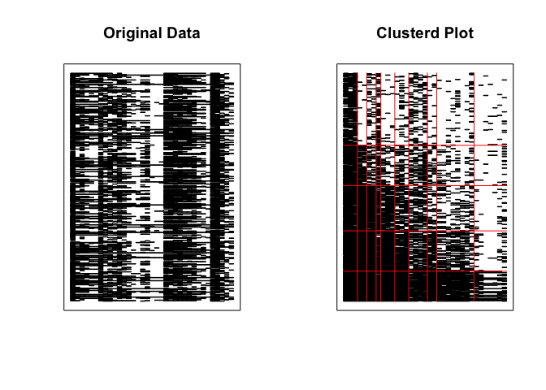<!-- -->

``` r
# Test Response Profile
plot(result.LDB, type = "TRP")
```

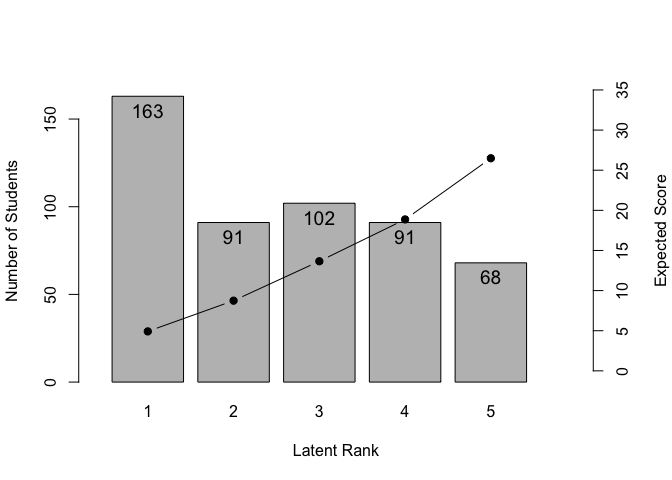<!-- -->

``` r
# Latent Rank Distribution
plot(result.LDB, type = "LRD")
```

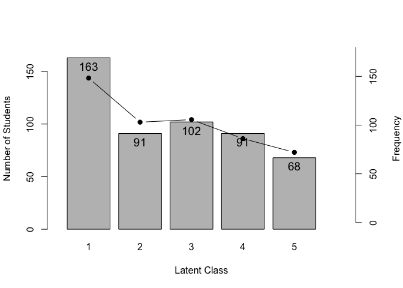<!-- -->

``` r
# Rank Membership Profiles for first 9 students
plot(result.LDB, type = "RMP", students = 1:9, nc = 3, nr = 3)
```

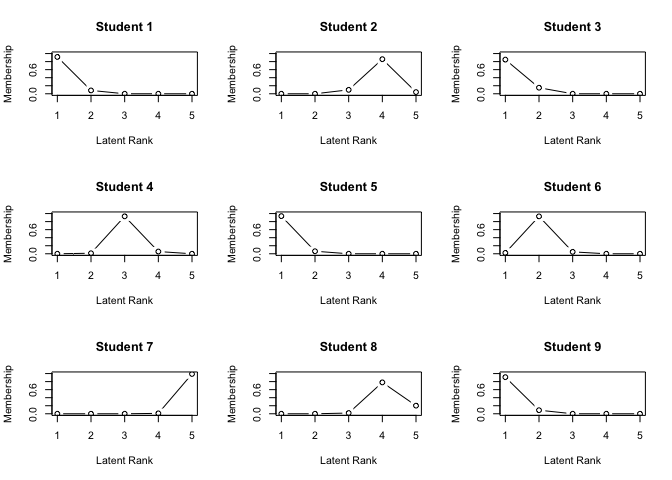<!-- -->

``` r
# Field Reference Profiles
plot(result.LDB, type = "FRP", nc = 3, nr = 2)
```

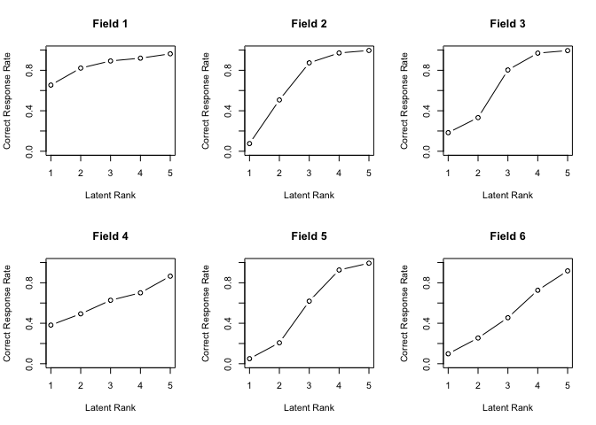<!-- -->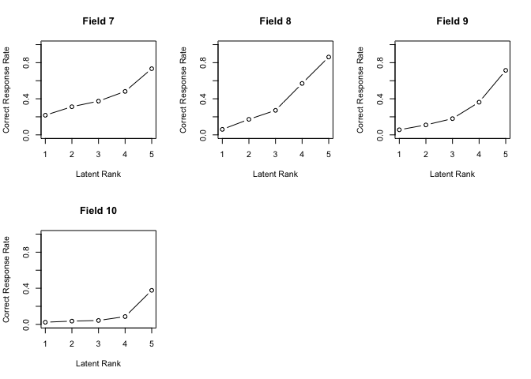<!-- -->

In this model, you can draw a Field PIRP Profile that visualizes the
correct answer count for each rank and each field.

``` r
plot(result.LDB, type = "FieldPIRP")
```

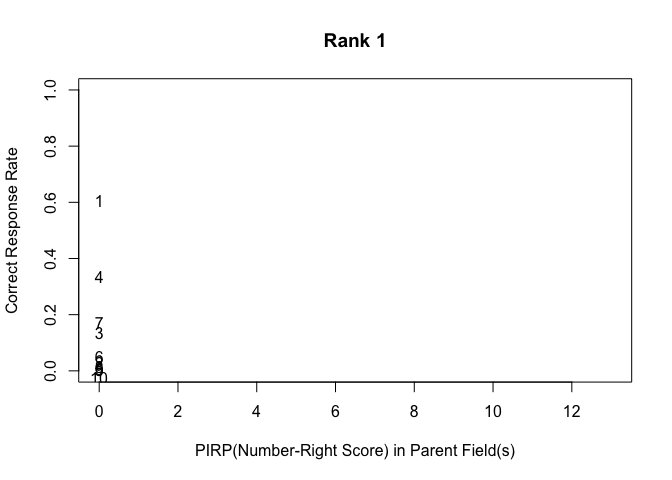<!-- -->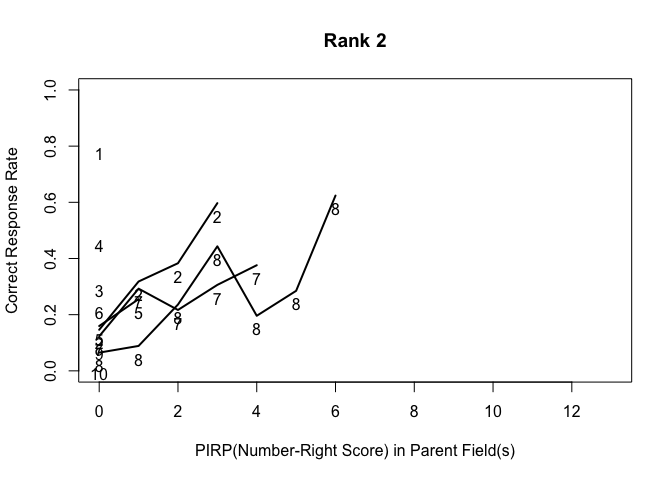<!-- -->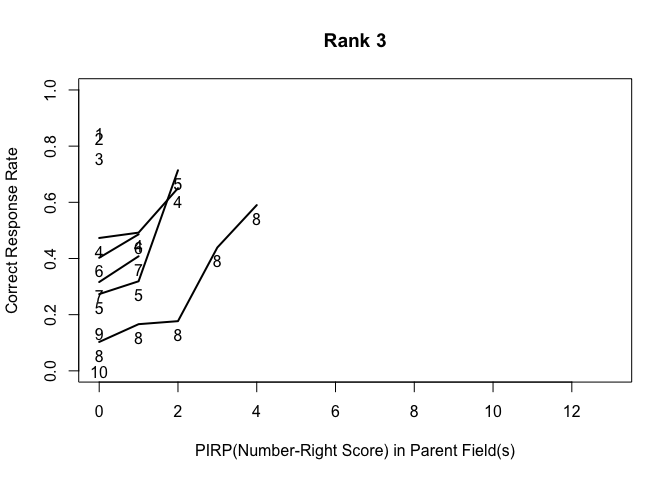<!-- -->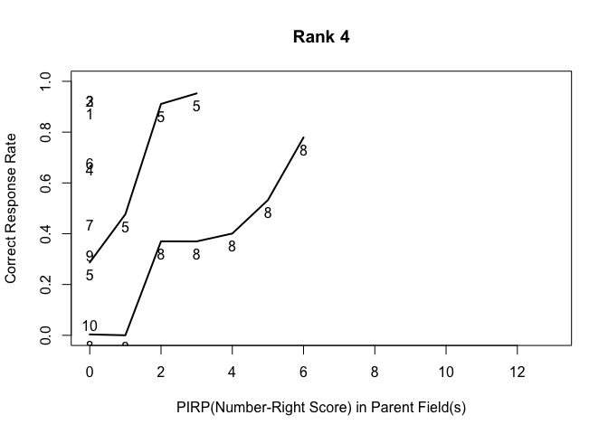<!-- -->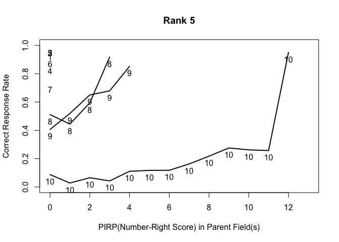<!-- -->

## Bicluster Network Model

Bicluster Network Model: BINET is a model that combines the Bayesian
network model and Biclustering. BINET is very similar to LDB and LDR.

The most significant difference is that in LDB, the nodes represent the
fields, whereas in BINET, they represent the class. BINET explores the
local dependency structure among latent classes at each latent field,
where each field is a locus.

To execute this analysis, in addition to the dataset, the same field
correspondence file used during exploratory Biclustering is required, as
well as an adjacency matrix between classes.

``` r
# Create field configuration vector for item assignment
conf <- c(1, 5, 5, 5, 9, 9, 6, 6, 6, 6, 2, 7, 7, 11, 11, 7, 7, 12, 12, 12, 2, 2, 3, 3, 4, 4, 4, 8, 8, 12, 1, 1, 6, 10, 10)

# Create edge data for network structure between classes
edges_data <- data.frame(
  "From Class (Parent) >>>" = c(
    1, 2, 3, 4, 5, 7, # Dependencies in various fields
    2, 4, 6, 8, 10,
    6, 6, 11, 8, 9, 12
  ),
  ">>> To Class (Child)" = c(
    2, 4, 5, 5, 6, 11, # Target classes
    3, 7, 9, 12, 12,
    10, 8, 12, 12, 11, 13
  ),
  "At Field (Locus)" = c(
    1, 2, 2, 3, 4, 4, # Field locations
    5, 5, 5, 5, 5,
    7, 8, 8, 9, 9, 12
  )
)

# Save edge data to temporary file
edgeFile <- tempfile(fileext = ".csv")
write.csv(edges_data, file = edgeFile, row.names = FALSE)
```

The model requires three components:

1.  Field assignments for items (conf vector)
2.  Network structure between classes for each field
3.  Number of classes and fields

``` r
# Fit Bicluster Network Model
result.BINET <- BINET(
  U = J35S515,
  ncls = 13, # Maximum class number from edges (13)
  nfld = 12, # Maximum field number from conf (12)
  conf = conf, # Field configuration vector
  adj_file = edgeFile # Network structure file
)

# Display model results
print(result.BINET)
```

    ## Total Graph
    ##         Class01 Class02 Class03 Class04 Class05 Class06 Class07 Class08 Class09
    ## Class01       0       1       0       0       0       0       0       0       0
    ## Class02       0       0       1       1       0       0       0       0       0
    ## Class03       0       0       0       0       1       0       0       0       0
    ## Class04       0       0       0       0       1       0       1       0       0
    ## Class05       0       0       0       0       0       1       0       0       0
    ## Class06       0       0       0       0       0       0       0       1       1
    ## Class07       0       0       0       0       0       0       0       0       0
    ## Class08       0       0       0       0       0       0       0       0       0
    ## Class09       0       0       0       0       0       0       0       0       0
    ## Class10       0       0       0       0       0       0       0       0       0
    ## Class11       0       0       0       0       0       0       0       0       0
    ## Class12       0       0       0       0       0       0       0       0       0
    ## Class13       0       0       0       0       0       0       0       0       0
    ##         Class10 Class11 Class12 Class13
    ## Class01       0       0       0       0
    ## Class02       0       0       0       0
    ## Class03       0       0       0       0
    ## Class04       0       0       0       0
    ## Class05       0       0       0       0
    ## Class06       1       0       0       0
    ## Class07       0       1       0       0
    ## Class08       0       0       1       0
    ## Class09       0       1       0       0
    ## Class10       0       0       1       0
    ## Class11       0       0       1       0
    ## Class12       0       0       0       1
    ## Class13       0       0       0       0

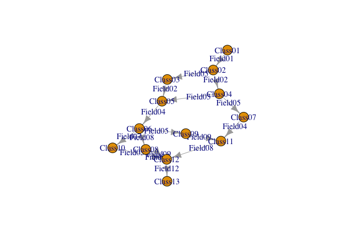<!-- -->

    ## Estimation of Parameter set
    ## Field 1 
    ##          PSRP 1 PSRP 2 PSRP 3 PSRP 4
    ## Class 1   0.000                     
    ## Class 2   0.554  0.558  0.649       
    ## Class 3   0.740                     
    ## Class 4   0.859                     
    ## Class 5   0.875                     
    ## Class 6   0.910                     
    ## Class 7   0.868                     
    ## Class 8   0.889                     
    ## Class 9   0.961                     
    ## Class 10  0.932                     
    ## Class 11  0.898                     
    ## Class 12  0.975                     
    ## Class 13  1.000                     
    ## Field 2 
    ##          PSRP 1 PSRP 2 PSRP 3 PSRP 4
    ## Class 1  0.0000                     
    ## Class 2  0.0090                     
    ## Class 3  0.0396                     
    ## Class 4  0.6813  0.785  0.637       
    ## Class 5  0.4040  0.728  0.696       
    ## Class 6  0.6877                     
    ## Class 7  0.8316                     
    ## Class 8  0.8218                     
    ## Class 9  1.0000                     
    ## Class 10 0.9836                     
    ## Class 11 1.0000                     
    ## Class 12 1.0000                     
    ## Class 13 1.0000                     
    ## Field 3 
    ##          PSRP 1 PSRP 2 PSRP 3 PSRP 4
    ## Class 1   0.000                     
    ## Class 2   0.177                     
    ## Class 3   0.219                     
    ## Class 4   0.206                     
    ## Class 5   0.189  0.253              
    ## Class 6   1.000                     
    ## Class 7   1.000                     
    ## Class 8   1.000                     
    ## Class 9   0.986                     
    ## Class 10  1.000                     
    ## Class 11  0.973                     
    ## Class 12  1.000                     
    ## Class 13  1.000                     
    ## Field 4 
    ##          PSRP 1 PSRP 2 PSRP 3 PSRP 4
    ## Class 1  0.0000                     
    ## Class 2  0.0127                     
    ## Class 3  0.1228                     
    ## Class 4  0.0468                     
    ## Class 5  0.1131                     
    ## Class 6  0.6131  0.436  0.179       
    ## Class 7  0.9775                     
    ## Class 8  0.9539                     
    ## Class 9  0.9751                     
    ## Class 10 0.9660                     
    ## Class 11 0.9411  0.925  0.757       
    ## Class 12 1.0000                     
    ## Class 13 1.0000                     
    ## Field 5 
    ##          PSRP 1 PSRP 2  PSRP 3 PSRP 4
    ## Class 1  0.0000                      
    ## Class 2  0.0157                      
    ## Class 3  0.0731  0.330 0.06789       
    ## Class 4  0.9626                      
    ## Class 5  0.1028                      
    ## Class 6  0.2199                      
    ## Class 7  0.1446  0.265 0.00602       
    ## Class 8  0.9403                      
    ## Class 9  0.2936  0.298 0.12080       
    ## Class 10 0.8255                      
    ## Class 11 0.9123                      
    ## Class 12 1.0000  1.000 1.00000       
    ## Class 13 1.0000                      
    ## Field 6 
    ##          PSRP 1 PSRP 2 PSRP 3 PSRP 4
    ## Class 1   0.000                     
    ## Class 2   0.236                     
    ## Class 3   0.275                     
    ## Class 4   0.449                     
    ## Class 5   0.414                     
    ## Class 6   0.302                     
    ## Class 7   0.415                     
    ## Class 8   0.469                     
    ## Class 9   0.560                     
    ## Class 10  0.564                     
    ## Class 11  0.614                     
    ## Class 12  0.764                     
    ## Class 13  1.000                     
    ## Field 7 
    ##          PSRP 1 PSRP 2 PSRP 3 PSRP 4
    ## Class 1  0.0000                     
    ## Class 2  0.0731                     
    ## Class 3  0.0810                     
    ## Class 4  0.1924                     
    ## Class 5  0.1596                     
    ## Class 6  0.1316                     
    ## Class 7  0.1263                     
    ## Class 8  0.1792                     
    ## Class 9  0.7542                     
    ## Class 10 0.9818  0.883  0.933  0.975
    ## Class 11 0.3047                     
    ## Class 12 0.7862                     
    ## Class 13 1.0000                     
    ## Field 8 
    ##            PSRP 1 PSRP 2 PSRP 3 PSRP 4
    ## Class 1  0.00e+00                     
    ## Class 2  9.83e-05                     
    ## Class 3  3.70e-02                     
    ## Class 4  3.91e-02                     
    ## Class 5  4.21e-02                     
    ## Class 6  6.88e-02                     
    ## Class 7  4.56e-01                     
    ## Class 8  1.65e-01  0.192              
    ## Class 9  6.15e-01                     
    ## Class 10 3.88e-01                     
    ## Class 11 3.16e-01                     
    ## Class 12 1.00e+00  1.000              
    ## Class 13 1.00e+00                     
    ## Field 9 
    ##            PSRP 1 PSRP 2 PSRP 3 PSRP 4
    ## Class 1  0.00e+00                     
    ## Class 2  3.13e-16                     
    ## Class 3  1.61e-02                     
    ## Class 4  6.15e-01                     
    ## Class 5  3.46e-02                     
    ## Class 6  5.26e-02                     
    ## Class 7  1.44e-11                     
    ## Class 8  2.09e-01                     
    ## Class 9  1.90e-17                     
    ## Class 10 8.09e-01                     
    ## Class 11 1.00e+00  1.000              
    ## Class 12 7.81e-01  0.703              
    ## Class 13 1.00e+00                     
    ## Field 10 
    ##          PSRP 1 PSRP 2 PSRP 3 PSRP 4
    ## Class 1  0.0000                     
    ## Class 2  0.0952                     
    ## Class 3  0.1798                     
    ## Class 4  0.1741                     
    ## Class 5  0.1594                     
    ## Class 6  0.1789                     
    ## Class 7  0.1208                     
    ## Class 8  0.1550                     
    ## Class 9  0.2228                     
    ## Class 10 0.2602                     
    ## Class 11 0.1724                     
    ## Class 12 0.3109                     
    ## Class 13 1.0000                     
    ## Field 11 
    ##            PSRP 1 PSRP 2 PSRP 3 PSRP 4
    ## Class 1  0.00e+00                     
    ## Class 2  6.13e-14                     
    ## Class 3  8.84e-07                     
    ## Class 4  8.14e-02                     
    ## Class 5  2.46e-02                     
    ## Class 6  2.13e-02                     
    ## Class 7  2.56e-02                     
    ## Class 8  3.84e-16                     
    ## Class 9  2.44e-01                     
    ## Class 10 4.30e-01                     
    ## Class 11 3.84e-02                     
    ## Class 12 5.86e-01                     
    ## Class 13 1.00e+00                     
    ## Field 12 
    ##            PSRP 1 PSRP 2 PSRP 3 PSRP 4
    ## Class 1  0.00e+00                     
    ## Class 2  2.35e-03                     
    ## Class 3  5.57e-02                     
    ## Class 4  1.50e-18                     
    ## Class 5  2.02e-02                     
    ## Class 6  1.67e-02                     
    ## Class 7  1.93e-02                     
    ## Class 8  4.62e-02                     
    ## Class 9  1.85e-02                     
    ## Class 10 2.54e-02                     
    ## Class 11 5.76e-15                     
    ## Class 12 2.26e-01                     
    ## Class 13 1.00e+00      1      1      1
    ## Local Dependence Passing Student Rate
    ##     Field Field Item 1 Field Item 2 Field Item 3 Field Item 4 Parent Class
    ## 1   1.000       Item01       Item31       Item32                     1.000
    ## 2   2.000       Item11       Item21       Item22                     2.000
    ## 3   2.000       Item11       Item21       Item22                     3.000
    ## 4   3.000       Item23       Item24                                  4.000
    ## 5   4.000       Item25       Item26       Item27                     5.000
    ## 6   4.000       Item25       Item26       Item27                     7.000
    ## 7   5.000       Item02       Item03       Item04                     2.000
    ## 8   5.000       Item02       Item03       Item04                     4.000
    ## 9   5.000       Item02       Item03       Item04                     6.000
    ## 10  5.000       Item02       Item03       Item04                     8.000
    ## 11  5.000       Item02       Item03       Item04                    10.000
    ## 12  7.000       Item12       Item13       Item16       Item17        6.000
    ## 13  8.000       Item28       Item29                                  6.000
    ## 14  8.000       Item28       Item29                                 11.000
    ## 15  9.000       Item05       Item06                                  8.000
    ## 16  9.000       Item05       Item06                                  9.000
    ## 17 12.000       Item18       Item19       Item20       Item30       12.000
    ##    Parent CCR 1 Parent CCR 2 Parent CCR 3 Parent CCR 4 Child Class Child CCR 1
    ## 1         0.000        0.000        0.000                    2.000       0.554
    ## 2         0.005        0.018        0.003                    4.000       0.681
    ## 3         0.034        0.068        0.016                    5.000       0.404
    ## 4         0.221        0.190                                 5.000       0.189
    ## 5         0.147        0.050        0.142                    6.000       0.613
    ## 6         0.999        0.991        0.943                   11.000       0.941
    ## 7         0.005        0.040        0.002                    3.000       0.073
    ## 8         0.996        0.998        0.893                    7.000       0.145
    ## 9         0.263        0.334        0.063                    9.000       0.294
    ## 10        0.980        0.958        0.882                   12.000       1.000
    ## 11        0.943        0.800        0.733                   12.000       1.000
    ## 12        0.181        0.146        0.037        0.162      10.000       0.982
    ## 13        0.009        0.129                                 8.000       0.165
    ## 14        0.359        0.273                                12.000       1.000
    ## 15        0.266        0.152                                12.000       0.781
    ## 16        0.000        0.000                                11.000       1.000
    ## 17        0.158        0.178        0.217        0.352      13.000       1.000
    ##    Child CCR 2 Child CCR 3 Child CCR 4
    ## 1        0.558       0.649            
    ## 2        0.785       0.637            
    ## 3        0.728       0.696            
    ## 4        0.253                        
    ## 5        0.436       0.179            
    ## 6        0.925       0.757            
    ## 7        0.330       0.068            
    ## 8        0.265       0.006            
    ## 9        0.298       0.121            
    ## 10       1.000       1.000            
    ## 11       1.000       1.000            
    ## 12       0.883       0.933       0.975
    ## 13       0.192                        
    ## 14       1.000                        
    ## 15       0.703                        
    ## 16       1.000                        
    ## 17       1.000       1.000       1.000
    ## Marginal Bicluster Reference Matrix
    ##         Class1 Class2 Class3 Class4 Class5 Class6 Class7 Class8 Class9 Class10
    ## Field1       0  0.587  0.740  0.859  0.875  0.910  0.868  0.889  0.961   0.932
    ## Field2       0  0.009  0.040  0.701  0.609  0.688  0.832  0.822  1.000   0.984
    ## Field3       0  0.177  0.219  0.206  0.221  1.000  1.000  1.000  0.986   1.000
    ## Field4       0  0.013  0.123  0.047  0.113  0.410  0.978  0.954  0.975   0.966
    ## Field5       0  0.016  0.157  0.963  0.103  0.220  0.138  0.940  0.237   0.825
    ## Field6       0  0.236  0.275  0.449  0.414  0.302  0.415  0.469  0.560   0.564
    ## Field7       0  0.073  0.081  0.192  0.160  0.132  0.126  0.179  0.754   0.943
    ## Field8       0  0.000  0.037  0.039  0.042  0.069  0.456  0.179  0.615   0.388
    ## Field9       0  0.000  0.016  0.615  0.035  0.053  0.000  0.209  0.000   0.809
    ## Field10      0  0.095  0.180  0.174  0.159  0.179  0.121  0.155  0.223   0.260
    ## Field11      0  0.000  0.000  0.081  0.025  0.021  0.026  0.000  0.244   0.430
    ## Field12      0  0.002  0.056  0.000  0.020  0.017  0.019  0.046  0.019   0.025
    ##         Class11 Class12 Class13
    ## Field1    0.898   0.975       1
    ## Field2    1.000   1.000       1
    ## Field3    0.973   1.000       1
    ## Field4    0.874   1.000       1
    ## Field5    0.912   1.000       1
    ## Field6    0.614   0.764       1
    ## Field7    0.305   0.786       1
    ## Field8    0.316   1.000       1
    ## Field9    1.000   0.742       1
    ## Field10   0.172   0.311       1
    ## Field11   0.038   0.586       1
    ## Field12   0.000   0.226       1
    ##                               Class 1 Class 2 Class 3 Class 4 Class 5 Class 6
    ## Test Reference Profile          0.000   3.900   6.001  12.951   8.853  11.428
    ## Latent Class Ditribution        2.000  95.000  73.000  37.000  60.000  44.000
    ## Class Membership Dsitribution   1.987  82.567  86.281  37.258  60.781  43.222
    ##                               Class 7 Class 8 Class 9 Class 10 Class 11
    ## Test Reference Profile         14.305  17.148  19.544   23.589   20.343
    ## Latent Class Ditribution       43.000  30.000  34.000   18.000   37.000
    ## Class Membership Dsitribution  43.062  30.087  34.435   20.063   34.811
    ##                               Class 12 Class 13
    ## Test Reference Profile          27.076       35
    ## Latent Class Ditribution        27.000       15
    ## Class Membership Dsitribution   25.445       15
    ## 
    ## Model Fit Indices
    ##                Multigroup Model Saturated Moodel
    ## model_log_like -5786.942        -5786.942       
    ## bench_log_like -5891.314        0               
    ## null_log_like  -9862.114        -9862.114       
    ## model_Chi_sq   -208.744         11573.88        
    ## null_Chi_sq    7941.601         19724.23        
    ## model_df       1005             16895           
    ## null_df        1155             17045           
    ## NFI            1                0.4132149       
    ## RFI            1                0.4080052       
    ## IFI            1                1               
    ## TLI            1                1               
    ## CFI            1                1               
    ## RMSEA          0                0               
    ## AIC            -2218.744        -22216.12       
    ## CAIC           -6486.081        -93954.09       
    ## BIC            -6484.132        -93921.32

Of course, it also supports various types of plots.

``` r
# Show bicluster structure
plot(result.BINET, type = "Array")
```

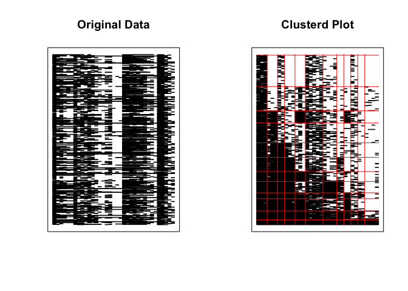<!-- -->

``` r
# Test Response Profile
plot(result.BINET, type = "TRP")
```

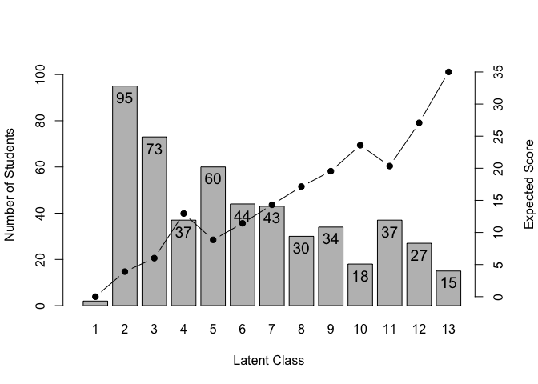<!-- -->

``` r
# Latent Rank Distribution
plot(result.BINET, type = "LRD")
```

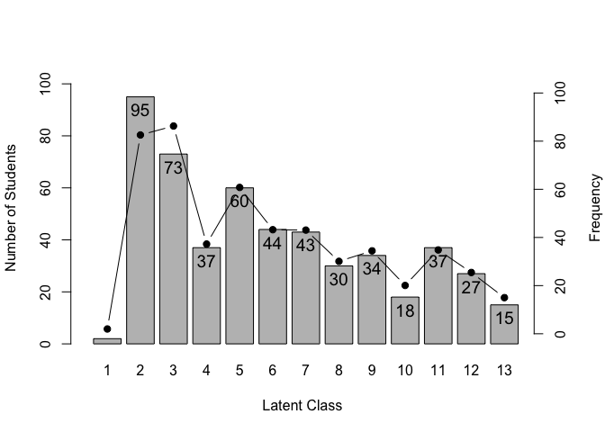<!-- -->

``` r
# Rank Membership Profiles for first 9 students
plot(result.BINET, type = "RMP", students = 1:9, nc = 3, nr = 3)
```

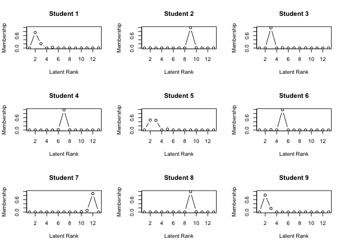<!-- -->

``` r
# Field Reference Profiles
plot(result.BINET, type = "FRP", nc = 3, nr = 2)
```

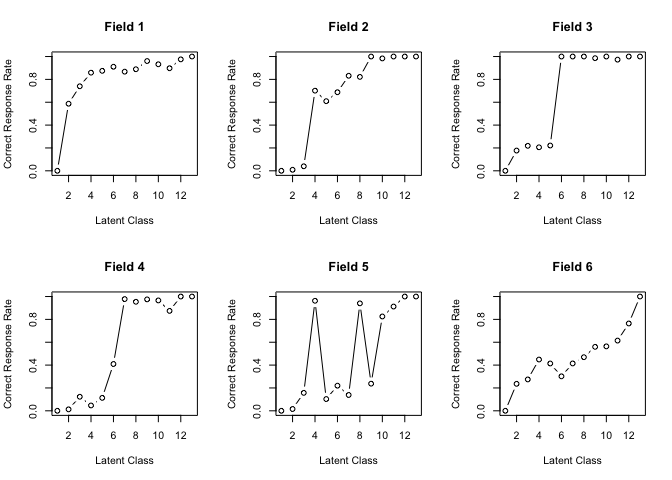<!-- -->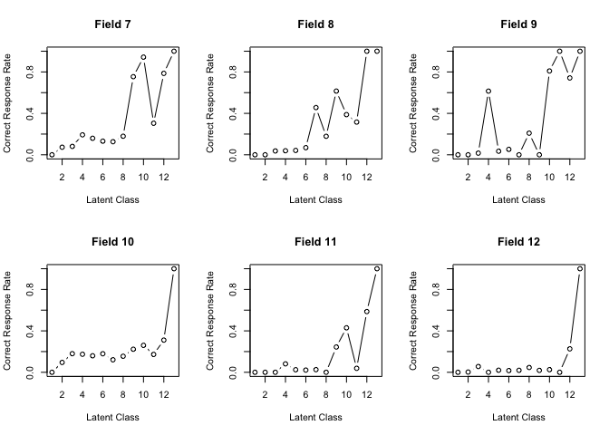<!-- -->

LDPSR plot shows all Passing Student Rates for all locally dependent
classes compared with their respective parents.

``` r
# Locally Dependent Passing Student Rates
plot(result.BINET, type = "LDPSR", nc = 3, nr = 2)
```

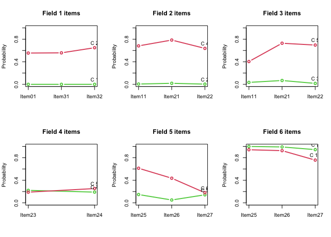<!-- -->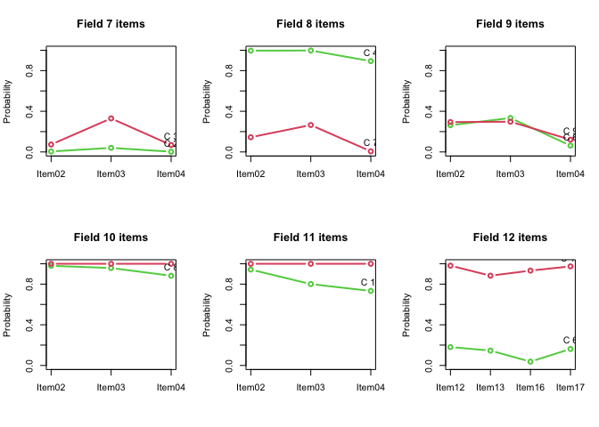<!-- -->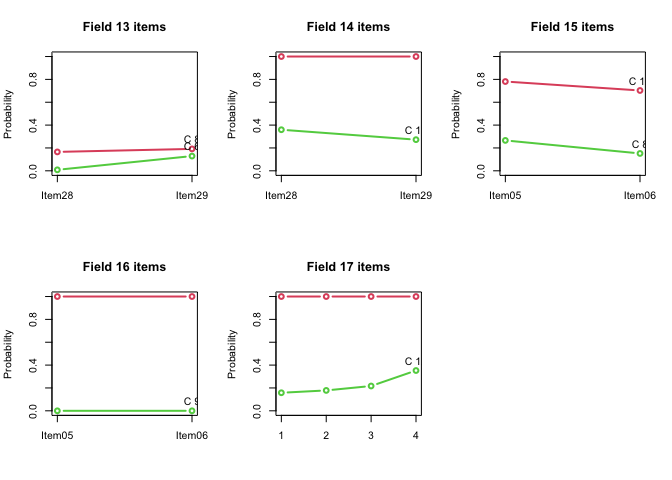<!-- -->

## Table of Model and Plotting Option Correspondence

| model/type   | IIC | ICC | TIC | IRP | FRP | TRP | LCD/LRD | CMP/RMP | ARRAY | FieldPIRP | LDPSR |
|--------------|-----|-----|-----|-----|-----|-----|---------|---------|-------|-----------|-------|
| IRT          | ◯   | ◯   | ◯   |     |     |     |         |         |       |           |       |
| LCA          |     |     |     | ◯   | ◯   | ◯   | ◯       | ◯       |       |           |       |
| LRA          |     |     |     | ◯   | ◯   | ◯   | ◯       | ◯       |       |           |       |
| Biclustering |     |     |     | ◯   | ◯   | ◯   | ◯       | ◯       | ◯     |           |       |
| IRM          |     |     |     |     | ◯   | ◯   |         |         | ◯     |           |       |
| LDLRA        |     |     |     | ◯   |     |     | ◯       | ◯       |       |           |       |
| LDB          |     |     |     |     | ◯   | ◯   | ◯       | ◯       | ◯     | ◯         |       |
| BINET        |     |     |     |     | ◯   | ◯   | ◯       | ◯       | ◯     |           | ◯     |

## Reference

Shojima, Kojiro (2022) Test Data Engineering: Latent Rank Analysis,
Biclustering, and Bayesian Network (Behaviormetrics: Quantitative
Approaches to Human Behavior, 13),Springer.

## Citation

[](https://doi.org/10.5281/zenodo.11529926)
