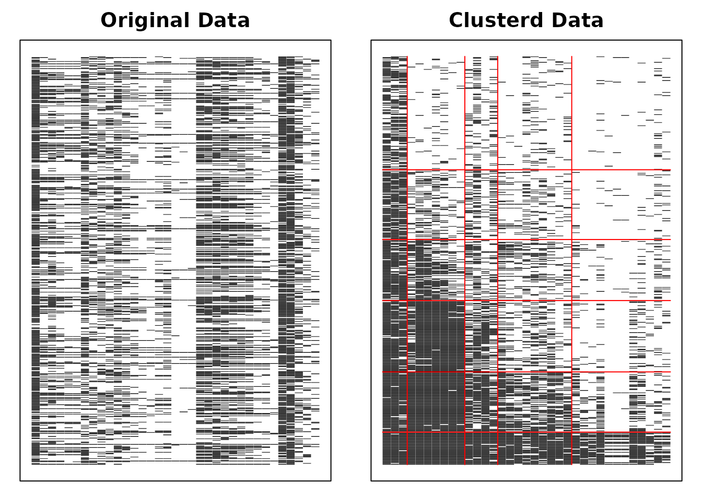
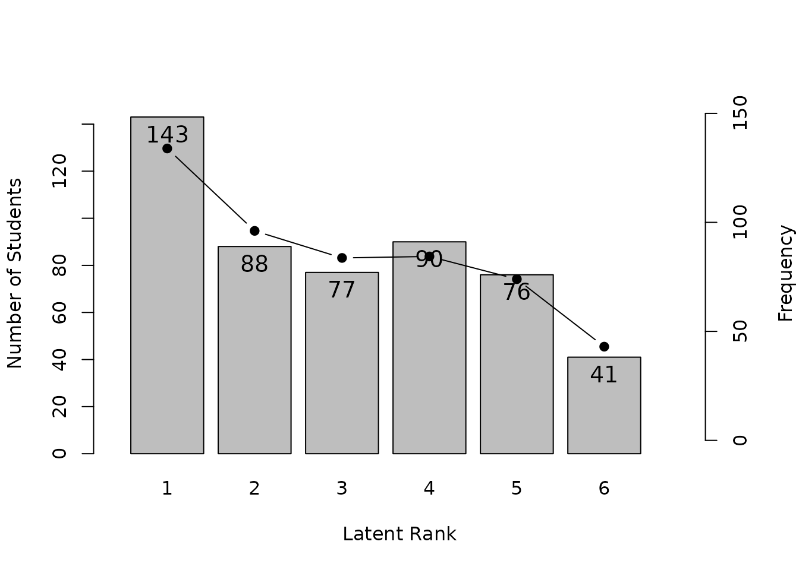
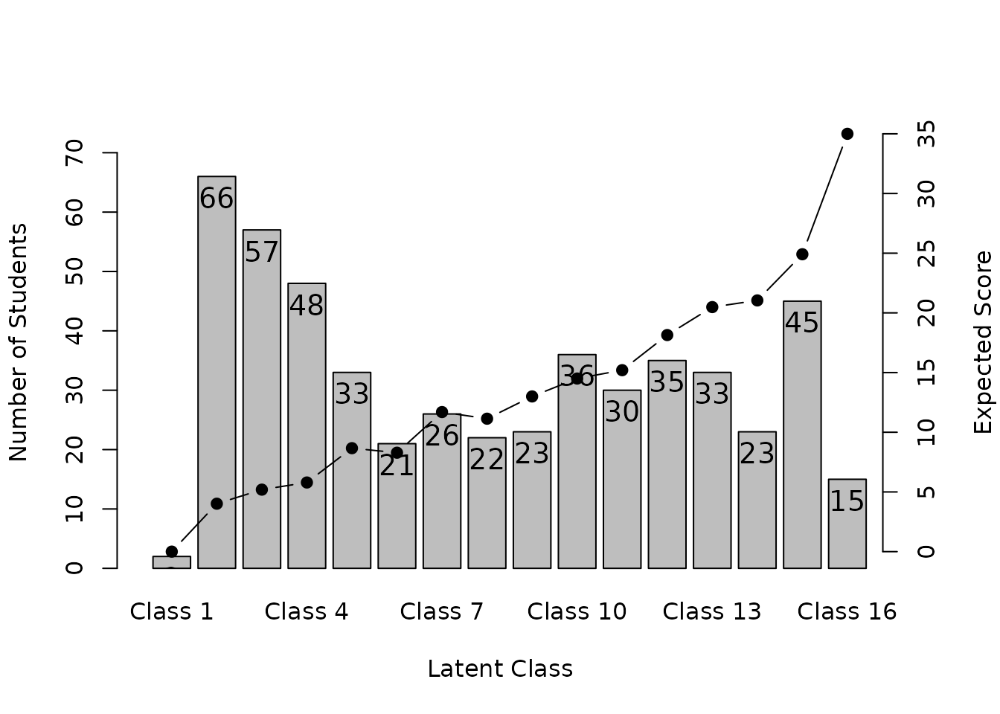
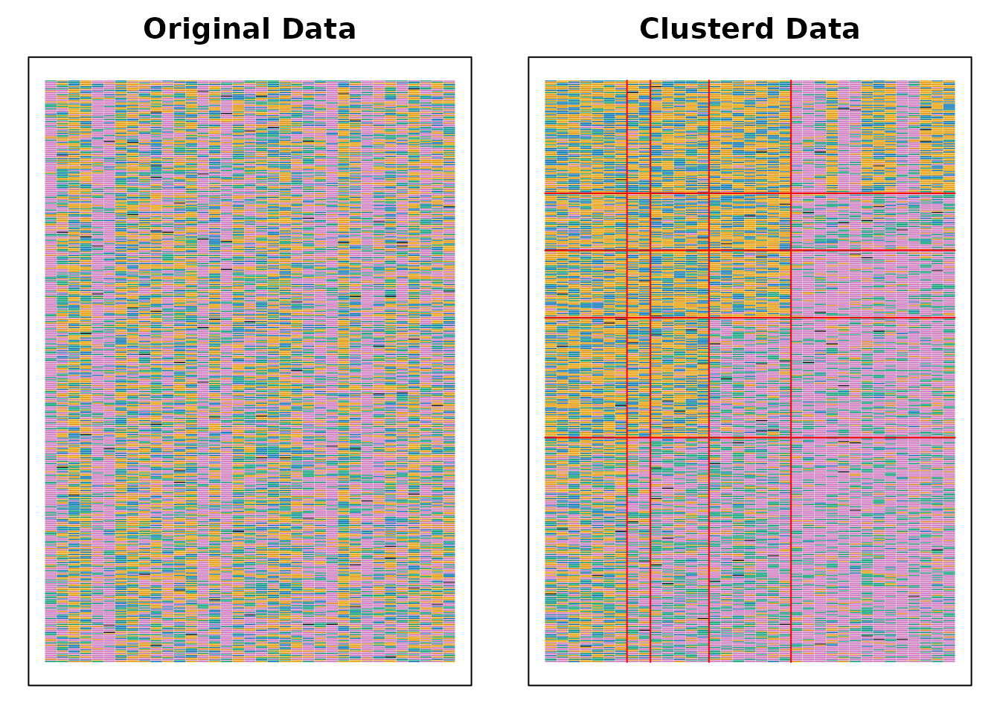
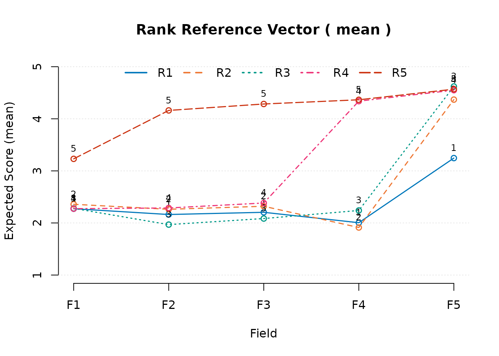
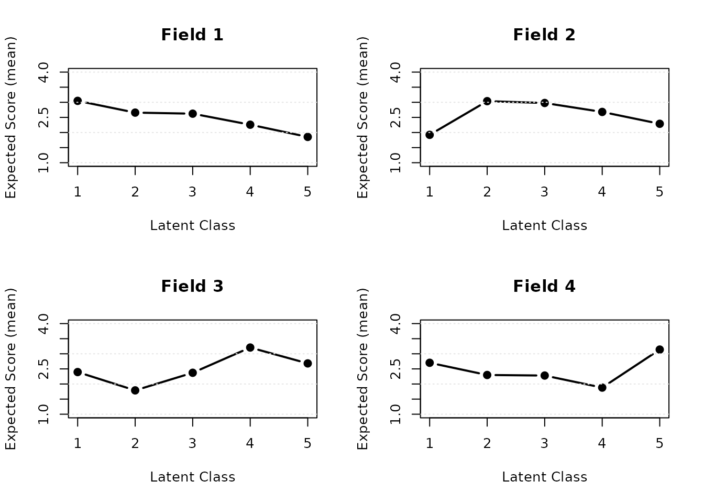
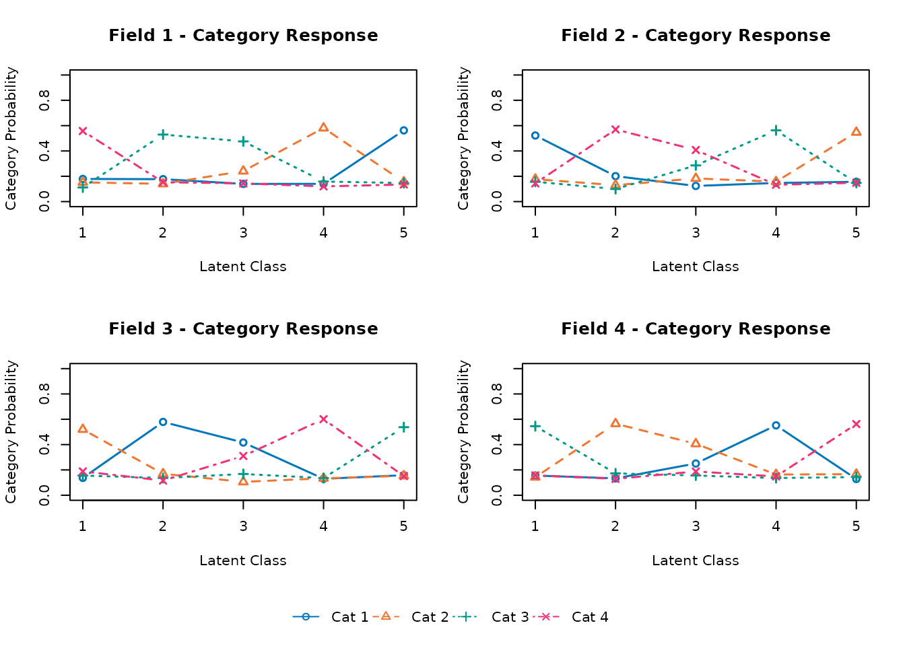
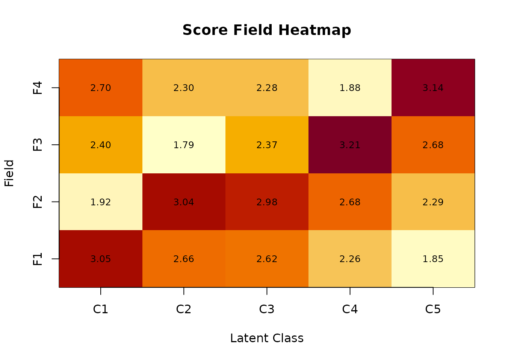

# Biclustering and Ranklustering

``` r
library(exametrika)
```

## Biclustering and Ranklustering

Biclustering and Ranklustering simultaneously cluster items into fields
and examinees into classes/ranks. The difference is specified via the
`method` option:

- `method = "B"`: Biclustering (no filtering matrix)
- `method = "R"`: Ranklustering (with filtering matrix for ordered
  ranks)

### Biclustering

``` r
Biclustering(J35S515, nfld = 5, ncls = 6, method = "B")
#> Biclustering Analysis
#> 
#> Biclustering Reference Matrix Profile
#>        Class1 Class2 Class3 Class4 Class5 Class6
#> Field1 0.6236 0.8636 0.8718  0.898  0.952  1.000
#> Field2 0.0627 0.3332 0.4255  0.919  0.990  1.000
#> Field3 0.2008 0.5431 0.2281  0.475  0.706  1.000
#> Field4 0.0495 0.2455 0.0782  0.233  0.648  0.983
#> Field5 0.0225 0.0545 0.0284  0.043  0.160  0.983
#> 
#> Field Reference Profile Indices
#>        Alpha     A Beta     B Gamma       C
#> Field1     1 0.240    1 0.624   0.0  0.0000
#> Field2     3 0.493    3 0.426   0.0  0.0000
#> Field3     1 0.342    4 0.475   0.2 -0.3149
#> Field4     4 0.415    5 0.648   0.2 -0.1673
#> Field5     5 0.823    5 0.160   0.2 -0.0261
#> 
#>                               Class 1 Class 2 Class 3 Class 4 Class 5 Class 6
#> Test Reference Profile          4.431  11.894   8.598  16.002  23.326  34.713
#> Latent Class Ditribution      157.000  64.000  82.000 106.000  89.000  17.000
#> Class Membership Distribution 146.105  73.232  85.753 106.414  86.529  16.968
#> 
#> Field Membership Profile
#>          CRR   LFE Field1 Field2 Field3 Field4 Field5
#> Item01 0.850 1.000  1.000  0.000  0.000  0.000  0.000
#> Item31 0.812 1.000  1.000  0.000  0.000  0.000  0.000
#> Item32 0.808 1.000  1.000  0.000  0.000  0.000  0.000
#> Item21 0.616 2.000  0.000  1.000  0.000  0.000  0.000
#> Item23 0.600 2.000  0.000  1.000  0.000  0.000  0.000
#> Item22 0.586 2.000  0.000  1.000  0.000  0.000  0.000
#> Item24 0.567 2.000  0.000  1.000  0.000  0.000  0.000
#> Item25 0.491 2.000  0.000  1.000  0.000  0.000  0.000
#> Item11 0.476 2.000  0.000  1.000  0.000  0.000  0.000
#> Item26 0.452 2.000  0.000  1.000  0.000  0.000  0.000
#> Item27 0.414 2.000  0.000  1.000  0.000  0.000  0.000
#> Item07 0.573 3.000  0.000  0.000  1.000  0.000  0.000
#> Item03 0.458 3.000  0.000  0.000  1.000  0.000  0.000
#> Item33 0.437 3.000  0.000  0.000  1.000  0.000  0.000
#> Item02 0.392 3.000  0.000  0.000  1.000  0.000  0.000
#> Item09 0.390 3.000  0.000  0.000  1.000  0.000  0.000
#> Item10 0.353 3.000  0.000  0.000  1.000  0.000  0.000
#> Item08 0.350 3.000  0.000  0.000  1.000  0.000  0.000
#> Item12 0.340 4.000  0.000  0.000  0.000  1.000  0.000
#> Item04 0.303 4.000  0.000  0.000  0.000  1.000  0.000
#> Item17 0.276 4.000  0.000  0.000  0.000  1.000  0.000
#> Item05 0.250 4.000  0.000  0.000  0.000  1.000  0.000
#> Item13 0.237 4.000  0.000  0.000  0.000  1.000  0.000
#> Item34 0.229 4.000  0.000  0.000  0.000  1.000  0.000
#> Item29 0.227 4.000  0.000  0.000  0.000  1.000  0.000
#> Item28 0.221 4.000  0.000  0.000  0.000  1.000  0.000
#> Item06 0.216 4.000  0.000  0.000  0.000  1.000  0.000
#> Item16 0.216 4.000  0.000  0.000  0.000  1.000  0.000
#> Item35 0.155 5.000  0.000  0.000  0.000  0.000  1.000
#> Item14 0.126 5.000  0.000  0.000  0.000  0.000  1.000
#> Item15 0.087 5.000  0.000  0.000  0.000  0.000  1.000
#> Item30 0.085 5.000  0.000  0.000  0.000  0.000  1.000
#> Item20 0.054 5.000  0.000  0.000  0.000  0.000  1.000
#> Item19 0.052 5.000  0.000  0.000  0.000  0.000  1.000
#> Item18 0.049 5.000  0.000  0.000  0.000  0.000  1.000
#> Latent Field Distribution
#>            Field 1 Field 2 Field 3 Field 4 Field 5
#> N of Items       3       8       7      10       7
#> 
#> Model Fit Indices
#> Number of Latent Class : 6
#> Number of Latent Field: 5
#> Number of EM cycle: 33 
#>                    value
#> model_log_like -6884.582
#> bench_log_like -5891.314
#> null_log_like  -9862.114
#> model_Chi_sq    1986.535
#> null_Chi_sq     7941.601
#> model_df        1160.000
#> null_df         1155.000
#> NFI                0.750
#> RFI                0.751
#> IFI                0.878
#> TLI                0.879
#> CFI                0.878
#> RMSEA              0.037
#> AIC             -333.465
#> CAIC           -6416.699
#> BIC            -5256.699
```

### Ranklustering

``` r
result.Ranklustering <- Biclustering(J35S515, nfld = 5, ncls = 6, method = "R")
```

``` r
plot(result.Ranklustering, type = "Array")
```



``` r
plot(result.Ranklustering, type = "FRP", nc = 2, nr = 3)
```


``` r
plot(result.Ranklustering, type = "RRV")
```


``` r
plot(result.Ranklustering, type = "RMP", students = 1:9, nc = 3, nr = 3)
```


``` r
plot(result.Ranklustering, type = "LRD")
```



## Finding Optimal Number of Classes and Fields

### Grid Search

[`GridSearch()`](https://kosugitti.github.io/exametrika/reference/GridSearch.md)
systematically evaluates multiple parameter combinations and selects the
best-fitting model:

``` r
result <- GridSearch(J35S515, method = "R", max_ncls = 10, max_nfld = 10, index = "BIC")
result$optimal_ncls
#> [1] 10
result$optimal_nfld
#> [1] 9
result$optimal_result
#> Ranklustering Analysis
#> 
#> Ranklustering Reference Matrix Profile
#>         Rank1  Rank2 Rank3  Rank4  Rank5  Rank6  Rank7  Rank8 Rank9 Rank10
#> Field1 0.6293 0.6949 0.805 0.8868 0.8935 0.8949 0.9130 0.9309 0.954  0.983
#> Field2 0.3655 0.4036 0.491 0.5766 0.5917 0.6638 0.6896 0.7209 0.828  0.934
#> Field3 0.1096 0.1750 0.341 0.5814 0.8399 0.9715 0.9879 0.9834 0.992  0.999
#> Field4 0.0402 0.0734 0.149 0.2751 0.5257 0.7908 0.9204 0.9675 0.987  0.997
#> Field5 0.1400 0.2239 0.400 0.5113 0.4337 0.4456 0.6136 0.7735 0.862  0.954
#> Field6 0.2042 0.2335 0.310 0.3687 0.3524 0.3855 0.4526 0.5416 0.683  0.847
#> Field7 0.0331 0.0779 0.216 0.3341 0.2813 0.3265 0.5447 0.7354 0.851  0.953
#> Field8 0.0469 0.0628 0.113 0.1634 0.1581 0.1858 0.3098 0.4820 0.669  0.863
#> Field9 0.0198 0.0277 0.038 0.0465 0.0418 0.0411 0.0576 0.0936 0.254  0.610
#> 
#> Field Reference Profile Indices
#>        Alpha     A Beta     B Gamma        C
#> Field1     2 0.110    1 0.629 0.000  0.00000
#> Field2     8 0.107    3 0.491 0.000  0.00000
#> Field3     4 0.258    4 0.581 0.111 -0.00450
#> Field4     5 0.265    5 0.526 0.000  0.00000
#> Field5     2 0.176    4 0.511 0.111 -0.07753
#> Field6     9 0.164    8 0.542 0.111 -0.01637
#> Field7     6 0.218    7 0.545 0.111 -0.05287
#> Field8     9 0.194    8 0.482 0.111 -0.00529
#> Field9     9 0.356   10 0.610 0.222 -0.00545
#> 
#>                              Rank 1 Rank 2 Rank 3 Rank 4 Rank 5 Rank 6 Rank 7
#> Test Reference Profile        4.423   5.57  8.321 11.285 12.979 15.139 18.002
#> Latent Rank Ditribution      97.000  68.00 50.000 55.000 43.000 52.000 40.000
#> Rank Membership Distribution 84.313  73.47 56.943 56.018 45.097 50.171 44.110
#>                              Rank 8 Rank 9 Rank 10
#> Test Reference Profile       20.975 24.881  30.239
#> Latent Rank Ditribution      49.000 35.000  26.000
#> Rank Membership Distribution 45.133 33.582  26.161
#> 
#> Field Membership Profile
#>          CRR   LFE Field1 Field2 Field3 Field4 Field5 Field6 Field7 Field8
#> Item01 0.850 1.000  1.000  0.000  0.000  0.000  0.000  0.000  0.000  0.000
#> Item31 0.812 1.000  1.000  0.000  0.000  0.000  0.000  0.000  0.000  0.000
#> Item32 0.808 1.000  1.000  0.000  0.000  0.000  0.000  0.000  0.000  0.000
#> Item07 0.573 2.000  0.000  1.000  0.000  0.000  0.000  0.000  0.000  0.000
#> Item21 0.616 3.000  0.000  0.000  1.000  0.000  0.000  0.000  0.000  0.000
#> Item23 0.600 3.000  0.000  0.000  1.000  0.000  0.000  0.000  0.000  0.000
#> Item22 0.586 3.000  0.000  0.000  1.000  0.000  0.000  0.000  0.000  0.000
#> Item24 0.567 3.000  0.000  0.000  1.000  0.000  0.000  0.000  0.000  0.000
#> Item25 0.491 4.000  0.000  0.000  0.000  1.000  0.000  0.000  0.000  0.000
#> Item11 0.476 4.000  0.000  0.000  0.000  1.000  0.000  0.000  0.000  0.000
#> Item26 0.452 4.000  0.000  0.000  0.000  1.000  0.000  0.000  0.000  0.000
#> Item27 0.414 4.000  0.000  0.000  0.000  1.000  0.000  0.000  0.000  0.000
#> Item03 0.458 5.000  0.000  0.000  0.000  0.000  1.000  0.000  0.000  0.000
#> Item33 0.437 6.000  0.000  0.000  0.000  0.000  0.000  1.000  0.000  0.000
#> Item09 0.390 6.000  0.000  0.000  0.000  0.000  0.000  1.000  0.000  0.000
#> Item10 0.353 6.000  0.000  0.000  0.000  0.000  0.000  1.000  0.000  0.000
#> Item08 0.350 6.000  0.000  0.000  0.000  0.000  0.000  1.000  0.000  0.000
#> Item02 0.392 7.000  0.000  0.000  0.000  0.000  0.000  0.000  1.000  0.000
#> Item12 0.340 7.000  0.000  0.000  0.000  0.000  0.000  0.000  1.000  0.000
#> Item04 0.303 7.000  0.000  0.000  0.000  0.000  0.000  0.000  1.000  0.000
#> Item17 0.276 8.000  0.000  0.000  0.000  0.000  0.000  0.000  0.000  1.000
#> Item05 0.250 8.000  0.000  0.000  0.000  0.000  0.000  0.000  0.000  1.000
#> Item13 0.237 8.000  0.000  0.000  0.000  0.000  0.000  0.000  0.000  1.000
#> Item34 0.229 8.000  0.000  0.000  0.000  0.000  0.000  0.000  0.000  1.000
#> Item29 0.227 8.000  0.000  0.000  0.000  0.000  0.000  0.000  0.000  1.000
#> Item28 0.221 8.000  0.000  0.000  0.000  0.000  0.000  0.000  0.000  1.000
#> Item06 0.216 8.000  0.000  0.000  0.000  0.000  0.000  0.000  0.000  1.000
#> Item16 0.216 8.000  0.000  0.000  0.000  0.000  0.000  0.000  0.000  1.000
#> Item35 0.155 9.000  0.000  0.000  0.000  0.000  0.000  0.000  0.000  0.001
#> Item14 0.126 9.000  0.000  0.000  0.000  0.000  0.000  0.000  0.000  0.000
#> Item15 0.087 9.000  0.000  0.000  0.000  0.000  0.000  0.000  0.000  0.000
#> Item30 0.085 9.000  0.000  0.000  0.000  0.000  0.000  0.000  0.000  0.000
#> Item20 0.054 9.000  0.000  0.000  0.000  0.000  0.000  0.000  0.000  0.000
#> Item19 0.052 9.000  0.000  0.000  0.000  0.000  0.000  0.000  0.000  0.000
#> Item18 0.049 9.000  0.000  0.000  0.000  0.000  0.000  0.000  0.000  0.000
#>        Field9
#> Item01  0.000
#> Item31  0.000
#> Item32  0.000
#> Item07  0.000
#> Item21  0.000
#> Item23  0.000
#> Item22  0.000
#> Item24  0.000
#> Item25  0.000
#> Item11  0.000
#> Item26  0.000
#> Item27  0.000
#> Item03  0.000
#> Item33  0.000
#> Item09  0.000
#> Item10  0.000
#> Item08  0.000
#> Item02  0.000
#> Item12  0.000
#> Item04  0.000
#> Item17  0.000
#> Item05  0.000
#> Item13  0.000
#> Item34  0.000
#> Item29  0.000
#> Item28  0.000
#> Item06  0.000
#> Item16  0.000
#> Item35  0.999
#> Item14  1.000
#> Item15  1.000
#> Item30  1.000
#> Item20  1.000
#> Item19  1.000
#> Item18  1.000
#> Latent Field Distribution
#>            Field 1 Field 2 Field 3 Field 4 Field 5 Field 6 Field 7 Field 8
#> N of Items       3       1       4       4       1       4       3       8
#>            Field 9
#> N of Items       7
#> 
#> Model Fit Indices
#> Number of Latent Rank : 10
#> Number of Latent Field: 9
#> Number of EM cycle: 8 
#>                    value
#> model_log_like -6776.501
#> bench_log_like -5891.314
#> null_log_like  -9862.114
#> model_Chi_sq    1770.373
#> null_Chi_sq     7941.601
#> model_df        1133.300
#> null_df         1155.000
#> NFI                0.777
#> RFI                0.773
#> IFI                0.906
#> TLI                0.904
#> CFI                0.906
#> RMSEA              0.033
#> AIC             -496.227
#> CAIC           -6439.441
#> BIC            -5306.141
#> Weakly Ordinal Alignment Condition is Satisfied.
```

### Infinite Relational Model (IRM)

The IRM uses the Chinese Restaurant Process to automatically determine
the optimal number of fields and classes:

``` r
result.IRM <- Biclustering_IRM(J35S515, gamma_c = 1, gamma_f = 1, verbose = TRUE)
plot(result.IRM, type = "Array")
```


``` r
plot(result.IRM, type = "FRP", nc = 3)
```


``` r
plot(result.IRM, type = "TRP")
```



## Biclustering for Polytomous Data

### Ordinal Data

``` r
result.B.ord <- Biclustering(J35S500, ncls = 5, nfld = 5, method = "R")
result.B.ord
#> Ranklustering Analysis
#> 
#> Ranklustering Reference Matrix Profile
#> For category 1 
#>         Rank 1 Rank 2 Rank 3 Rank 4 Rank 5
#> Field 1  0.334  0.354 0.3501 0.3429 0.1982
#> Field 2  0.405  0.331 0.3909 0.3510 0.0333
#> Field 3  0.359  0.324 0.3681 0.3397 0.0224
#> Field 4  0.412  0.454 0.3914 0.0185 0.0137
#> Field 5  0.251  0.028 0.0129 0.0147 0.0156
#> For category 2 
#>         Rank 1 Rank 2 Rank 3 Rank 4 Rank 5
#> Field 1  0.300 0.2461  0.280 0.2799 0.1556
#> Field 2  0.303 0.2997  0.338 0.2948 0.0381
#> Field 3  0.299 0.3085  0.331 0.2601 0.0468
#> Field 4  0.302 0.2889  0.265 0.0422 0.0350
#> Field 5  0.156 0.0532  0.011 0.0223 0.0230
#> For category 3 
#>         Rank 1 Rank 2 Rank 3 Rank 4 Rank 5
#> Field 1  0.179 0.1893 0.1759 0.2001 0.1483
#> Field 2  0.101 0.2080 0.2139 0.1621 0.1674
#> Field 3  0.173 0.1663 0.1731 0.1704 0.1023
#> Field 4  0.190 0.1692 0.1543 0.1058 0.0967
#> Field 5  0.093 0.0709 0.0592 0.0627 0.0560
#> For category 4 
#>         Rank 1 Rank 2 Rank 3 Rank 4 Rank 5
#> Field 1 0.1335 0.1096 0.1280 0.1141  0.213
#> Field 2 0.1065 0.0983 0.0266 0.0996  0.257
#> Field 3 0.1147 0.1234 0.1036 0.1371  0.281
#> Field 4 0.0622 0.0667 0.0907 0.2488  0.282
#> Field 5 0.0971 0.2182 0.1762 0.1993  0.188
#> For category 5 
#>         Rank 1 Rank 2 Rank 3 Rank 4 Rank 5
#> Field 1 0.0535 0.1013 0.0660 0.0631  0.285
#> Field 2 0.0842 0.0629 0.0307 0.0925  0.504
#> Field 3 0.0537 0.0773 0.0243 0.0927  0.547
#> Field 4 0.0340 0.0214 0.0985 0.5847  0.573
#> Field 5 0.4030 0.6297 0.7406 0.7010  0.717
#>                              Rank 1 Rank 2 Rank 3  Rank 4  Rank 5
#> Test Reference Profile       10.527 11.932 11.810  15.173  22.488
#> Latent Rank Ditribution      97.000 49.000 58.000 103.000 193.000
#> Rank Membership Distribution 97.995 49.936 55.738 105.120 191.211
#> Latent Field Distribution
#>            Field 1 Field 2 Field 3 Field 4 Field 5
#> N of Items       7       2       5       7      14
#> Boundary field reference profile
#> Weighted
#>         Rank 1 Rank 2 Rank 3 Rank 4 Rank 5
#> Field 1  1.864  1.846  1.824  1.852  3.466
#> Field 2  1.616  1.875  1.666  1.767  4.627
#> Field 3  1.760  1.876  1.714  1.865  4.721
#> Field 4  1.596  1.484  1.671  4.782  4.755
#> Field 5  3.692  4.851  4.933  4.907  4.920
#> Observed
#>         Rank 1 Rank 2 Rank 3 Rank 4 Rank 5
#> Field 1  2.270  2.379  2.251  2.280  3.179
#> Field 2  2.149  2.337  1.897  2.180  4.119
#> Field 3  2.196  2.331  2.066  2.243  4.248
#> Field 4  2.000  1.880  2.222  4.298  4.338
#> Field 5  3.222  4.327  4.618  4.537  4.550
#> 
#> Field Reference Profile Indices
#> (Based on normalized expected scores: (E[score]-1)/(maxQ-1))
#>   Alpha     A Beta     B Gamma       C
#> 1     4 0.239    5 0.558  0.50 -0.0210
#> 2     4 0.468    4 0.322  0.25 -0.0735
#> 3     4 0.475    4 0.346  0.25 -0.0589
#> 4     3 0.525    3 0.310  0.25 -0.0230
#> 5     1 0.281    1 0.561  0.25 -0.0177
#> 
#> Model Fit Indices
#> Number of Latent Rank : 5
#> Number of Latent Field: 5
#> Number of EM cycle: 7 
#>                     value
#> model_log_like -20929.785
#> bench_log_like      0.000
#> null_log_like  -23559.334
#> model_Chi_sq    41859.569
#> null_Chi_sq     47118.667
#> model_df        17416.444
#> null_df         17465.000
#> NFI                 0.112
#> RFI                 0.109
#> IFI                 0.177
#> TLI                 0.173
#> CFI                 0.176
#> RMSEA               0.053
#> AIC              7026.680
#> CAIC           -83793.252
#> BIC            -66376.808
#> LogLik         -20929.785
plot(result.B.ord, type = "Array")
```



FRP (Field Reference Profile) shows the expected score per field across
latent ranks:

``` r
plot(result.B.ord, type = "FRP", nc = 3, nr = 2)
```


FCRP (Field Category Response Profile) shows category probabilities
across ranks. The `style` parameter can be `"line"` or `"bar"`:

``` r
plot(result.B.ord, type = "FCRP", nc = 3, nr = 2)
```


``` r
plot(result.B.ord, type = "FCRP", style = "bar", nc = 3, nr = 2)
```


FCBR (Field Cumulative Boundary Reference) shows cumulative boundary
probabilities (ordinal only):

``` r
plot(result.B.ord, type = "FCBR", nc = 3, nr = 2)
```


ScoreField and RRV plots:

``` r
plot(result.B.ord, type = "ScoreField")
```


``` r
plot(result.B.ord, type = "RRV")
```



### Nominal Data

``` r
result.B.nom <- Biclustering(J20S600, ncls = 5, nfld = 4)
result.B.nom
#> Biclustering Reference Matrix Profile
#> For category 1 
#>         Class 1 Class 2 Class 3 Class 4 Class 5
#> Field 1   0.179   0.177   0.140   0.140   0.562
#> Field 2   0.522   0.201   0.124   0.147   0.156
#> Field 3   0.137   0.579   0.416   0.130   0.158
#> Field 4   0.156   0.133   0.251   0.552   0.128
#> For category 2 
#>         Class 1 Class 2 Class 3 Class 4 Class 5
#> Field 1   0.152   0.140   0.241   0.581   0.156
#> Field 2   0.177   0.130   0.183   0.157   0.547
#> Field 3   0.520   0.169   0.105   0.134   0.153
#> Field 4   0.142   0.565   0.406   0.164   0.166
#> For category 3 
#>         Class 1 Class 2 Class 3 Class 4 Class 5
#> Field 1   0.112  0.5296   0.476   0.159   0.146
#> Field 2   0.157  0.0992   0.286   0.563   0.148
#> Field 3   0.156  0.1360   0.168   0.136   0.538
#> Field 4   0.545  0.1727   0.156   0.136   0.143
#> For category 4 
#>         Class 1 Class 2 Class 3 Class 4 Class 5
#> Field 1   0.557   0.153   0.144   0.120   0.135
#> Field 2   0.144   0.570   0.408   0.133   0.149
#> Field 3   0.188   0.116   0.310   0.601   0.151
#> Field 4   0.156   0.129   0.187   0.149   0.562
#>                               Class 1 Class 2 Class 3 Class 4 Class 5
#> Latent Class Ditribution      122.000  79.000  48.000 116.000 235.000
#> Class Membership Distribution 121.939  76.326  57.859 111.444 232.433
#> Latent Field Distribution
#>            Field 1 Field 2 Field 3 Field 4
#> N of Items       5       5       5       5
#> 
#> Model Fit Indices
#> Number of Latent Class : 5
#> Number of Latent Field: 4
#> Number of EM cycle: 9 
#>                     value
#> model_log_like -13935.073
#> bench_log_like      0.000
#> null_log_like  -16424.042
#> model_Chi_sq    27870.147
#> null_Chi_sq     32848.085
#> model_df        11940.000
#> null_df         11980.000
#> NFI                 0.152
#> RFI                 0.149
#> IFI                 0.238
#> TLI                 0.234
#> CFI                 0.237
#> RMSEA               0.047
#> AIC              3990.147
#> CAIC           -60449.193
#> BIC            -48509.193
#> LogLik         -13935.073
plot(result.B.nom, type = "Array")
```


Nominal Biclustering supports FRP, FCRP, ScoreField, and RRV (but not
FCBR):

``` r
plot(result.B.nom, type = "FRP", nc = 2, nr = 2)
```



``` r
plot(result.B.nom, type = "FCRP", nc = 2, nr = 2)
```



``` r
plot(result.B.nom, type = "FCRP", style = "bar", nc = 2, nr = 2)
```


``` r
plot(result.B.nom, type = "ScoreField")
```



``` r
plot(result.B.nom, type = "RRV")
```


## Reference

Shojima, K. (2022). *Test Data Engineering*. Springer.
