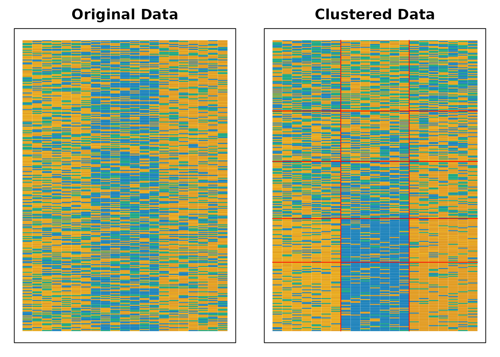
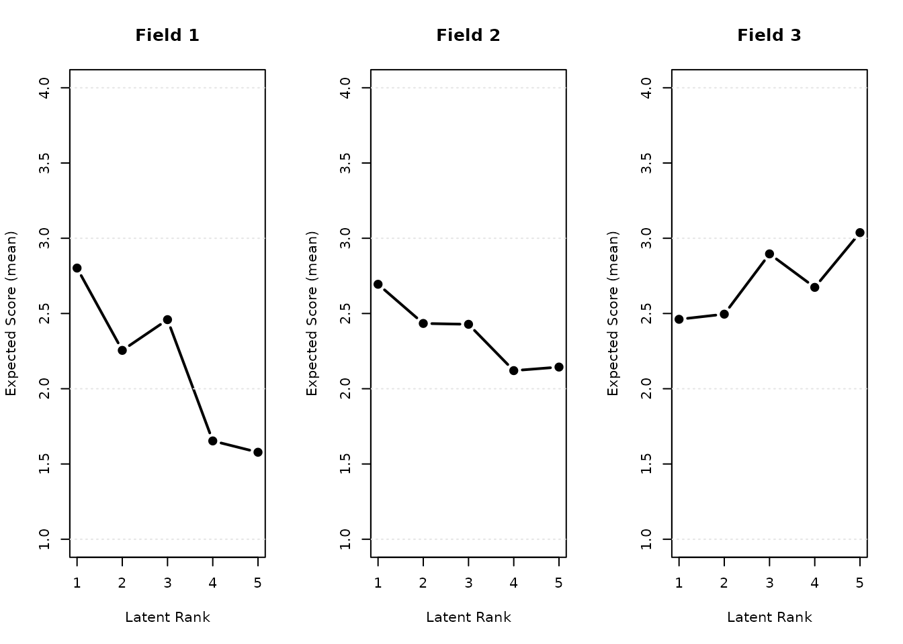
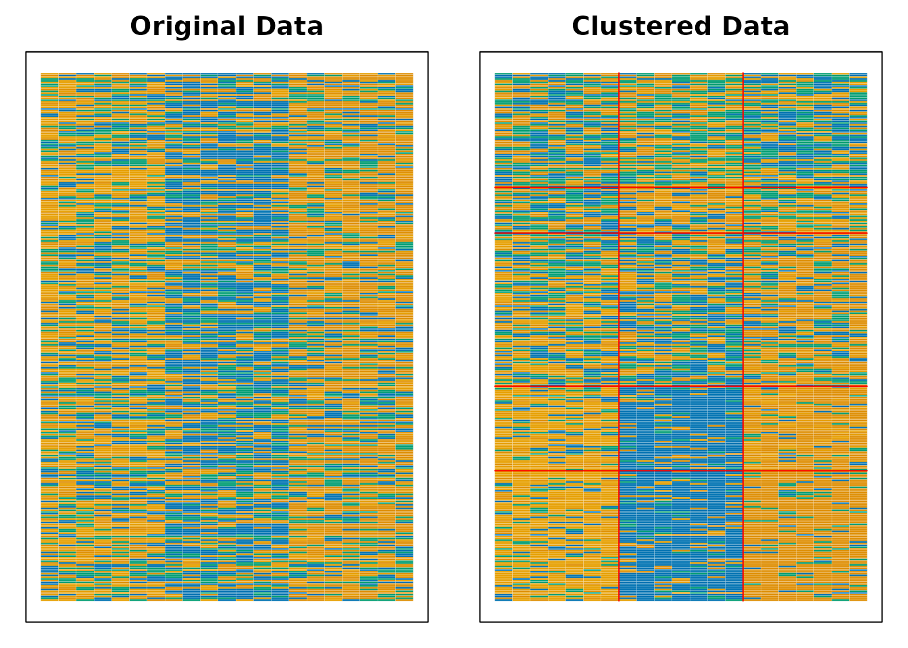
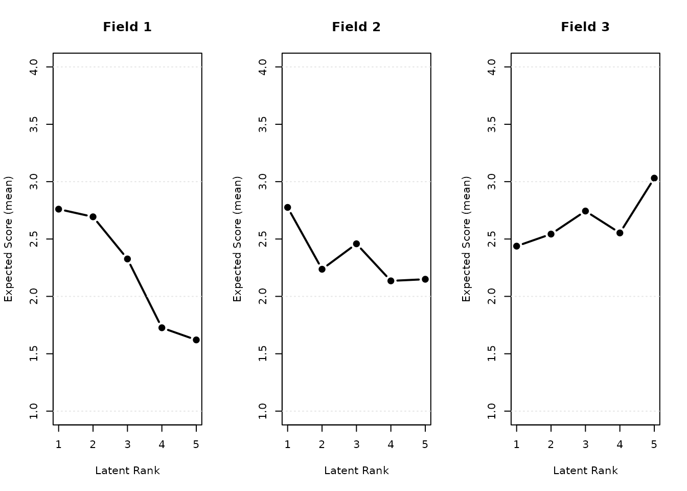

# Biclustering and Ranklustering

> **Note**: Some computationally intensive examples below are shown with
> `eval=FALSE` to keep CRAN build times short. For full rendered output,
> see the [pkgdown
> site](https://kosugitti.github.io/exametrika/articles/biclustering.html).

``` r

library(exametrika)
```

## Biclustering and Ranklustering

Biclustering and Ranklustering simultaneously cluster items into fields
and examinees into classes/ranks. The difference is specified via the
`method` option:

- `method = "B"`: Biclustering (no filtering matrix)
- `method = "R"`: Ranklustering (with filtering matrix for ordered
  ranks)

### Biclustering

``` r

Biclustering(J35S515, nfld = 5, ncls = 6, method = "B")
#> Biclustering Analysis
#> 
#> Biclustering Reference Matrix Profile
#>        Class1 Class2 Class3 Class4 Class5 Class6
#> Field1 0.6236 0.8636 0.8718  0.898  0.952  1.000
#> Field2 0.0627 0.3332 0.4255  0.919  0.990  1.000
#> Field3 0.2008 0.5431 0.2281  0.475  0.706  1.000
#> Field4 0.0495 0.2455 0.0782  0.233  0.648  0.983
#> Field5 0.0225 0.0545 0.0284  0.043  0.160  0.983
#> 
#> Field Reference Profile Indices
#>        Alpha     A Beta     B Gamma       C
#> Field1     1 0.240    1 0.624   0.0  0.0000
#> Field2     3 0.493    3 0.426   0.0  0.0000
#> Field3     1 0.342    4 0.475   0.2 -0.3149
#> Field4     4 0.415    5 0.648   0.2 -0.1673
#> Field5     5 0.823    5 0.160   0.2 -0.0261
#> 
#>                               Class 1 Class 2 Class 3 Class 4 Class 5 Class 6
#> Test Reference Profile          4.431  11.894   8.598  16.002  23.326  34.713
#> Latent Class Ditribution      157.000  64.000  82.000 106.000  89.000  17.000
#> Class Membership Distribution 146.105  73.232  85.753 106.414  86.529  16.968
#> 
#> Field Membership Profile
#>          CRR LFE Field1 Field2 Field3 Field4 Field5
#> Item01 0.850   1  1.000  0.000  0.000  0.000  0.000
#> Item31 0.812   1  1.000  0.000  0.000  0.000  0.000
#> Item32 0.808   1  1.000  0.000  0.000  0.000  0.000
#> Item21 0.616   2  0.000  1.000  0.000  0.000  0.000
#> Item23 0.600   2  0.000  1.000  0.000  0.000  0.000
#> Item22 0.586   2  0.000  1.000  0.000  0.000  0.000
#> Item24 0.567   2  0.000  1.000  0.000  0.000  0.000
#> Item25 0.491   2  0.000  1.000  0.000  0.000  0.000
#> Item11 0.476   2  0.000  1.000  0.000  0.000  0.000
#> Item26 0.452   2  0.000  1.000  0.000  0.000  0.000
#> Item27 0.414   2  0.000  1.000  0.000  0.000  0.000
#> Item07 0.573   3  0.000  0.000  1.000  0.000  0.000
#> Item03 0.458   3  0.000  0.000  1.000  0.000  0.000
#> Item33 0.437   3  0.000  0.000  1.000  0.000  0.000
#> Item02 0.392   3  0.000  0.000  1.000  0.000  0.000
#> Item09 0.390   3  0.000  0.000  1.000  0.000  0.000
#> Item10 0.353   3  0.000  0.000  1.000  0.000  0.000
#> Item08 0.350   3  0.000  0.000  1.000  0.000  0.000
#> Item12 0.340   4  0.000  0.000  0.000  1.000  0.000
#> Item04 0.303   4  0.000  0.000  0.000  1.000  0.000
#> Item17 0.276   4  0.000  0.000  0.000  1.000  0.000
#> Item05 0.250   4  0.000  0.000  0.000  1.000  0.000
#> Item13 0.237   4  0.000  0.000  0.000  1.000  0.000
#> Item34 0.229   4  0.000  0.000  0.000  1.000  0.000
#> Item29 0.227   4  0.000  0.000  0.000  1.000  0.000
#> Item28 0.221   4  0.000  0.000  0.000  1.000  0.000
#> Item06 0.216   4  0.000  0.000  0.000  1.000  0.000
#> Item16 0.216   4  0.000  0.000  0.000  1.000  0.000
#> Item35 0.155   5  0.000  0.000  0.000  0.000  1.000
#> Item14 0.126   5  0.000  0.000  0.000  0.000  1.000
#> Item15 0.087   5  0.000  0.000  0.000  0.000  1.000
#> Item30 0.085   5  0.000  0.000  0.000  0.000  1.000
#> Item20 0.054   5  0.000  0.000  0.000  0.000  1.000
#> Item19 0.052   5  0.000  0.000  0.000  0.000  1.000
#> Item18 0.049   5  0.000  0.000  0.000  0.000  1.000
#> Latent Field Distribution
#>            Field 1 Field 2 Field 3 Field 4 Field 5
#> N of Items       3       8       7      10       7
#> 
#> Model Fit Indices
#> Number of Latent Class : 6
#> Number of Latent Field: 5
#> Number of EM cycle: 33 
#>                    value
#> model_log_like -6884.582
#> bench_log_like -5891.314
#> null_log_like  -9862.114
#> model_Chi_sq    1986.535
#> null_Chi_sq     7941.601
#> model_df        1160.000
#> null_df         1155.000
#> NFI                0.750
#> RFI                0.751
#> IFI                0.878
#> TLI                0.879
#> CFI                0.878
#> RMSEA              0.037
#> AIC             -333.465
#> CAIC           -6416.699
#> BIC            -5256.699
```

### Ranklustering

``` r

result.Ranklustering <- Biclustering(J35S515, nfld = 5, ncls = 6, method = "R")
```

``` r

plot(result.Ranklustering, type = "Array")
```


``` r

plot(result.Ranklustering, type = "FRP", nc = 2, nr = 3)
```


``` r

plot(result.Ranklustering, type = "RRV")
```


``` r

plot(result.Ranklustering, type = "RMP", students = 1:9, nc = 3, nr = 3)
```


``` r

plot(result.Ranklustering, type = "LRD")
```


## Finding Optimal Number of Classes and Fields

### Grid Search

[`GridSearch()`](https://kosugitti.github.io/exametrika/reference/GridSearch.md)
systematically evaluates multiple parameter combinations and selects the
best-fitting model:

``` r

result <- GridSearch(J35S515, method = "R", max_ncls = 10, max_nfld = 10, index = "BIC")
result$optimal_ncls
result$optimal_nfld
result$optimal_result
```

### Infinite Relational Model (IRM)

The IRM uses the Chinese Restaurant Process to automatically determine
the optimal number of fields and classes:

``` r

result.IRM <- Biclustering_IRM(J35S515, gamma_c = 1, gamma_f = 1, verbose = TRUE)
plot(result.IRM, type = "Array")
plot(result.IRM, type = "FRP", nc = 3)
plot(result.IRM, type = "TRP")
```

## Biclustering for Polytomous Data

### Ordinal Data

``` r

result.B.ord <- Biclustering(J35S500, ncls = 5, nfld = 5, method = "R")
result.B.ord
plot(result.B.ord, type = "Array")
```

FRP (Field Reference Profile) shows the expected score per field across
latent ranks:

``` r

plot(result.B.ord, type = "FRP", nc = 3, nr = 2)
```

FCRP (Field Category Response Profile) shows category probabilities
across ranks. The `style` parameter can be `"line"` or `"bar"`:

``` r

plot(result.B.ord, type = "FCRP", nc = 3, nr = 2)
plot(result.B.ord, type = "FCRP", style = "bar", nc = 3, nr = 2)
```

FCBR (Field Cumulative Boundary Reference) shows cumulative boundary
probabilities (ordinal only):

``` r

plot(result.B.ord, type = "FCBR", nc = 3, nr = 2)
```

ScoreField and RRV plots:

``` r

plot(result.B.ord, type = "ScoreField")
plot(result.B.ord, type = "RRV")
```

### Nominal Data

``` r

result.B.nom <- Biclustering(J20S600, ncls = 5, nfld = 4)
result.B.nom
plot(result.B.nom, type = "Array")
```

Nominal Biclustering supports FRP, FCRP, ScoreField, and RRV (but not
FCBR):

``` r

plot(result.B.nom, type = "FRP", nc = 2, nr = 2)
plot(result.B.nom, type = "FCRP", nc = 2, nr = 2)
plot(result.B.nom, type = "FCRP", style = "bar", nc = 2, nr = 2)
plot(result.B.nom, type = "ScoreField")
plot(result.B.nom, type = "RRV")
```

### Rated Data (Multiple-Choice with Correct Answers)

Rated data has both multiple response categories and correct answers.
[`Biclustering.rated()`](https://kosugitti.github.io/exametrika/reference/Biclustering.md)
internally runs nominal Biclustering, then sorts classes by correct
response rate:

``` r

result.B.rated <- Biclustering(J21S300, ncls = 5, nfld = 3, method = "R", maxiter = 300)
result.B.rated
#> Ranklustering Analysis (Rated) [MIC]
#> 
#> Ranklustering Reference Matrix Profile (Nominal)
#> For category 1 
#>         Rank 1 Rank 2 Rank 3 Rank 4 Rank 5
#> Field 1  0.106  0.350 0.2827 0.6621 0.7081
#> Field 2  0.257  0.242 0.1836 0.0714 0.0754
#> Field 3  0.267  0.221 0.0967 0.1615 0.0041
#> For category 2 
#>         Rank 1 Rank 2 Rank 3 Rank 4 Rank 5
#> Field 1  0.283  0.257  0.228 0.1220 0.0974
#> Field 2  0.118  0.291  0.415 0.7994 0.7760
#> Field 3  0.308  0.216  0.129 0.0691 0.0602
#> For category 3 
#>         Rank 1 Rank 2 Rank 3 Rank 4 Rank 5
#> Field 1  0.314  0.182  0.237 0.1165 0.1030
#> Field 2  0.300  0.257  0.191 0.0665 0.0777
#> Field 3  0.121  0.411  0.555 0.7038 0.8299
#> For category 4 
#>         Rank 1 Rank 2 Rank 3 Rank 4 Rank 5
#> Field 1  0.297  0.211  0.252 0.0994 0.0915
#> Field 2  0.325  0.210  0.211 0.0627 0.0709
#> Field 3  0.304  0.153  0.219 0.0657 0.1059
#> 
#> Field Reference Profile (Binary)
#>         Rank 1 Rank 2 Rank 3 Rank 4 Rank 5
#> Field 1  0.102  0.390  0.252  0.660  0.702
#> Field 2  0.115  0.280  0.424  0.803  0.775
#> Field 3  0.121  0.393  0.574  0.657  0.835
#> 
#> Field Reference Profile Indices
#>        Alpha     A Beta     B Gamma       C
#> Field1     3 0.409    2 0.390  0.25 -0.1383
#> Field2     3 0.379    3 0.424  0.25 -0.0285
#> Field3     1 0.272    3 0.574  0.00  0.0000
#> 
#>                              Rank 1 Rank 2 Rank 3 Rank 4 Rank 5
#> Test Reference Profile        2.370  7.442  8.746 14.844 16.183
#> Latent Rank Ditribution      73.000 52.000 59.000 45.000 71.000
#> Rank Membership Distribution 69.457 57.704 59.047 57.877 55.914
#> 
#> Field Membership Profile
#>          CRR LFE Field1 Field2 Field3
#> Item01 0.440   1  1.000  0.000  0.000
#> Item02 0.430   1  1.000  0.000  0.000
#> Item07 0.417   1  1.000  0.000  0.000
#> Item06 0.407   1  1.000  0.000  0.000
#> Item03 0.400   1  1.000  0.000  0.000
#> Item04 0.380   1  1.000  0.000  0.000
#> Item05 0.377   1  1.000  0.000  0.000
#> Item09 0.510   2  0.000  1.000  0.000
#> Item13 0.473   2  0.000  1.000  0.000
#> Item12 0.470   2  0.000  1.000  0.000
#> Item14 0.463   2  0.000  1.000  0.000
#> Item11 0.460   2  0.000  1.000  0.000
#> Item08 0.450   2  0.000  1.000  0.000
#> Item10 0.420   2  0.000  1.000  0.000
#> Item18 0.530   3  0.000  0.000  1.000
#> Item21 0.527   3  0.000  0.000  1.000
#> Item16 0.520   3  0.000  0.000  1.000
#> Item15 0.510   3  0.000  0.000  1.000
#> Item19 0.500   3  0.000  0.000  1.000
#> Item20 0.497   3  0.000  0.000  1.000
#> Item17 0.463   3  0.000  0.000  1.000
#> Latent Field Distribution
#>            Field 1 Field 2 Field 3
#> N of Items       7       7       7
#> 
#> Model Fit Indices (Binary)
#> Number of Latent Rank : 5
#> Number of Latent Field: 3
#> Number of EM cycle: 296 
#>                    value
#> model_log_like -3293.331
#> bench_log_like -3079.142
#> null_log_like  -4318.046
#> model_Chi_sq     428.376
#> null_Chi_sq     2477.806
#> model_df         336.000
#> null_df          420.000
#> NFI                0.827
#> RFI                0.784
#> IFI                0.957
#> TLI                0.944
#> CFI                0.955
#> RMSEA              0.030
#> AIC             -243.624
#> CAIC           -1824.094
#> BIC            -1488.094
#> 
#> Model Fit Indices (Nominal)
#>                    value
#> model_log_like -7013.548
#> AIC            14117.095
#> CAIC           14328.766
#> BIC            14283.766
#> Weakly Ordinal Alignment Condition is Satisfied.
plot(result.B.rated, type = "Array")
```



``` r

plot(result.B.rated, type = "FRP", nc = 3, nr = 1)
```



Two layers of fit indices are reported: binary (with CFI/RMSEA) and
nominal (AIC/BIC/CAIC only). Access them via `result$TestFitIndices` and
`result$TestFitIndices_nominal`.

### Rated IRM

The IRM also supports rated data:

``` r

result.IRM.rated <- Biclustering_IRM(J21S300, gamma_c = 1, gamma_f = 1, verbose = FALSE)
plot(result.IRM.rated, type = "Array")
```



``` r

plot(result.IRM.rated, type = "FRP", nc = 3, nr = 1)
```



## Distractor Analysis

[`DistractorAnalysis()`](https://kosugitti.github.io/exametrika/reference/DistractorAnalysis.md)
examines how examinees in each rank/class respond to each item’s
categories. It computes observed frequencies, proportions, chi-square
statistics, p-values, and Cramer’s V (effect size) for each item-by-rank
cell.

``` r

result.B.rated <- Biclustering(J21S300, ncls = 5, nfld = 3, method = "R", maxiter = 300)
da <- DistractorAnalysis(result.B.rated)

# Full output (grouped by field for Biclustering)
print(da)

# Filter by items and/or ranks
print(da, items = 1:7, ranks = c(1, 5))

# Plot distractor bar charts
plot(da, items = 1:6, nc = 3, nr = 2)
```

[`DistractorAnalysis()`](https://kosugitti.github.io/exametrika/reference/DistractorAnalysis.md)
also works with
[`LRA()`](https://kosugitti.github.io/exametrika/reference/LRA.md)
results for rated data:

``` r

result.LRA.rated <- LRA(J21S300, nrank = 5, mic = TRUE)
da_lra <- DistractorAnalysis(result.LRA.rated)
print(da_lra, items = 1:3)
plot(da_lra, items = 1:6, nc = 3, nr = 2)
```

## Reference

Shojima, K. (2022). *Test Data Engineering*. Springer.
