# exametrika 日本語ガイド

> 日本語チュートリアルは
> [こちら](https://kosugitti.github.io/slides/BMS2025spring/docs/)
> もご参照ください。

## 概要

`exametrika`パッケージは、教育テストデータを分析するための包括的なテストデータエンジニアリングツールを提供します。荘島（2022）で説明されている方法に基づき、このパッケージは研究者と実務家に以下の機能を提供します：

- テスト応答パターンと項目特性の分析
- 様々な心理測定モデルを用いた受験者の分類
- テストデータにおける潜在構造の調査
- 項目間の局所依存性の検討
- 項目関係のネットワーク分析

## 機能

本パッケージは以下の心理測定モデルと技法を実装しています：

#### 古典的手法

- 古典的テスト理論（CTT）
  - 項目の難易度と識別力
  - テストの信頼性と妥当性
- 項目反応理論（IRT）
  - 2PL、3PL、4PLモデル
  - 項目特性曲線
  - テスト情報関数

#### 潜在構造分析

- 潜在クラス分析（LCA）
  - クラスメンバーシップの推定
  - 項目応答プロファイル
- 潜在ランク分析（LRA）
  - 順序付き潜在クラス
  - ランク遷移確率
- バイクラスタリングとランククラスタリング
  - 項目と受験者の同時クラスタリング
  - フィールド固有の応答パターン
- 無限関係モデル（IRM）
  - 最適なクラス/フィールド数の決定
  - ノンパラメトリッククラスタリング

## モデルの概要

### 局所依存モデル

本パッケージは、テストデータにおける局所依存性をモデル化する3つの相補的なアプローチを実装しています：

1.  **局所依存潜在ランク分析（LDLRA）**
    - 項目間の依存関係が異なる習熟度ランクでどのように変化するかを分析
    - 項目間の関係が学習者の能力レベルによって変化すると予想される場合に適している
    - LRAとベイジアンネットワークの長所を組み合わせたモデル
2.  **局所依存バイクラスタリング（LDB）**
    - 各ランク内における項目フィールド間の関係に焦点
    - 項目が自然なグループ（フィールド）を形成し、階層的な関係を持つ場合に最適
    - バイクラスタリングとフィールドレベルの依存構造を統合
3.  **バイクラスターネットワークモデル（BINET）**
    - 各フィールド内でのクラス遷移を検討
    - 複雑なクラス進行パターンの理解に最適
    - バイクラスタリングとクラスレベルのネットワーク分析を組み合わせたモデル

### モデル選択ガイド

| モデル | 主な焦点               | 適用場面                                       |
|--------|------------------------|------------------------------------------------|
| LDLRA  | 項目レベルの依存関係   | 項目関係が習熟度によって変化する場合           |
| LDB    | フィールドレベルの構造 | 項目が自然なグループを形成し依存関係を持つ場合 |
| BINET  | クラス進行             | フィールド内に複雑な学習パターンが存在する場合 |

## インストール

``` r
# CRANからインストール
install.packages("exametrika")

# または開発版をGitHubからインストール
if (!require("devtools")) install.packages("devtools")
devtools::install_github("kosugitti/exametrika")
```

### 依存パッケージ

本パッケージには以下が必要です：

- R (\>= 4.1.0)
- igraph (ネットワーク分析用)
- その他の依存パッケージは自動的にインストールされます

## データ形式と使用方法

### 基本的な使用方法

``` r
library(exametrika)
```

### データ要件

Exametrikaは2値データと多値データの両方に対応しています：

- 2値データ（0/1）
  - 0：誤答
  - 1：正答
- 多値データ
  - 順序のある反応カテゴリ
  - 複数の得点レベル
- 欠測値
  - NA値がサポートされています
  - カスタムの欠測値コードを指定可能

### データフォーマット

`dataFormat`関数は分析用の入力データを前処理します：

``` r
data <- dataFormat(J15S500)
str(data)
#> List of 7
#>  $ ID           : chr [1:500] "Student001" "Student002" "Student003" "Student004" ...
#>  $ ItemLabel    : chr [1:15] "Item01" "Item02" "Item03" "Item04" ...
#>  $ Z            : num [1:500, 1:15] 1 1 1 1 1 1 1 1 1 1 ...
#>   ..- attr(*, "dimnames")=List of 2
#>   .. ..$ : NULL
#>   .. ..$ : chr [1:15] "Item01" "Item02" "Item03" "Item04" ...
#>  $ w            : num [1:15] 1 1 1 1 1 1 1 1 1 1 ...
#>  $ response.type: chr "binary"
#>  $ categories   : Named int [1:15] 2 2 2 2 2 2 2 2 2 2 ...
#>   ..- attr(*, "names")= chr [1:15] "Item01" "Item02" "Item03" "Item04" ...
#>  $ U            : num [1:500, 1:15] 0 1 1 1 1 1 0 0 1 1 ...
#>   ..- attr(*, "dimnames")=List of 2
#>   .. ..$ : NULL
#>   .. ..$ : chr [1:15] "Item01" "Item02" "Item03" "Item04" ...
#>  - attr(*, "class")= chr [1:2] "exametrika" "exametrikaData"
```

### サンプルデータセット

本パッケージには、荘島（2022）からの様々なサンプルデータセットが学習用に含まれています：

- **命名規則**：JxxSxxx形式（J：項目数、S：サンプルサイズ）

| データセット | 項目数 | 受験者数 | 種別        | 用途                  |
|--------------|-------:|---------:|-------------|-----------------------|
| J5S10        |      5 |       10 | 2値         | クイックテスト        |
| J5S1000      |      5 |    1,000 | 順序        | GRM                   |
| J12S5000     |     12 |    5,000 | 2値         | LDLRA                 |
| J15S500      |     15 |      500 | 2値         | IRT, LCA              |
| J15S3810     |     15 |    3,810 | 順序(4件法) | 順序LRA               |
| J20S400      |     20 |      400 | 2値         | BNM                   |
| J20S600      |     20 |      600 | 名義(4cat)  | 名義Biclustering      |
| J35S500      |     35 |      500 | 順序(5件法) | 順序Biclustering      |
| J35S515      |     35 |      515 | 2値         | Biclustering, Network |
| J35S5000     |     35 |    5,000 | 多肢選択    | 名義LRA               |

## 使用例

### テスト統計量

``` r
TestStatistics(J15S500)
#> Test Statistics
#>                   value
#> TestLength   15.0000000
#> SampleSize  500.0000000
#> Mean          9.6640000
#> SEofMean      0.1190738
#> Variance      7.0892826
#> SD            2.6625707
#> Skewness     -0.4116220
#> Kurtosis     -0.4471624
#> Min           2.0000000
#> Max          15.0000000
#> Range        13.0000000
#> Q1.25%        8.0000000
#> Median.50%   10.0000000
#> Q3.75%       12.0000000
#> IQR           4.0000000
#> Stanine.4%    5.0000000
#> Stanine.11%   6.0000000
#> Stanine.23%   7.0000000
#> Stanine.40%   9.0000000
#> Stanine.60%  11.0000000
#> Stanine.77%  12.0000000
#> Stanine.89%  13.0000000
#> Stanine.96%  14.0000000
```

### 項目統計量

``` r
ItemStatistics(J15S500)
#> Item Statistics
#>    ItemLabel  NR   CRR  ODDs Threshold Entropy ITCrr
#> 1     Item01 500 0.746 2.937    -0.662   0.818 0.375
#> 2     Item02 500 0.754 3.065    -0.687   0.805 0.393
#> 3     Item03 500 0.726 2.650    -0.601   0.847 0.321
#> 4     Item04 500 0.776 3.464    -0.759   0.767 0.503
#> 5     Item05 500 0.804 4.102    -0.856   0.714 0.329
#> 6     Item06 500 0.864 6.353    -1.098   0.574 0.377
#> 7     Item07 500 0.716 2.521    -0.571   0.861 0.483
#> 8     Item08 500 0.588 1.427    -0.222   0.978 0.405
#> 9     Item09 500 0.364 0.572     0.348   0.946 0.225
#> 10    Item10 500 0.662 1.959    -0.418   0.923 0.314
#> 11    Item11 500 0.286 0.401     0.565   0.863 0.455
#> 12    Item12 500 0.274 0.377     0.601   0.847 0.468
#> 13    Item13 500 0.634 1.732    -0.342   0.948 0.471
#> 14    Item14 500 0.764 3.237    -0.719   0.788 0.485
#> 15    Item15 500 0.706 2.401    -0.542   0.874 0.413
```

### CTT

``` r
CTT(J15S500)
#> Realiability
#>                 name value
#> 1  Alpha(Covariance) 0.625
#> 2         Alpha(Phi) 0.630
#> 3 Alpha(Tetrachoric) 0.771
#> 4  Omega(Covariance) 0.632
#> 5         Omega(Phi) 0.637
#> 6 Omega(Tetrachoric) 0.779
#> 
#> Reliability Excluding Item
#>    IfDeleted Alpha.Covariance Alpha.Phi Alpha.Tetrachoric
#> 1     Item01            0.613     0.618             0.762
#> 2     Item02            0.609     0.615             0.759
#> 3     Item03            0.622     0.628             0.770
#> 4     Item04            0.590     0.595             0.742
#> 5     Item05            0.617     0.624             0.766
#> 6     Item06            0.608     0.613             0.754
#> 7     Item07            0.594     0.600             0.748
#> 8     Item08            0.611     0.616             0.762
#> 9     Item09            0.642     0.645             0.785
#> 10    Item10            0.626     0.630             0.773
#> 11    Item11            0.599     0.606             0.751
#> 12    Item12            0.597     0.603             0.748
#> 13    Item13            0.597     0.604             0.753
#> 14    Item14            0.593     0.598             0.745
#> 15    Item15            0.607     0.612             0.759
```

### IRT

IRT関数は、ロジスティックモデルを用いてパラメータを推定します。`model`オプションで指定でき、2PL、3PL、4PLモデルに対応しています。

``` r
result.IRT <- IRT(J15S500, model = 3)
result.IRT
#> Item Parameters
#>        slope location lowerAsym PSD(slope) PSD(location) PSD(lowerAsym)
#> Item01 0.818   -0.834    0.2804      0.182         0.628         0.1702
#> Item02 0.860   -1.119    0.1852      0.157         0.471         0.1488
#> Item03 0.657   -0.699    0.3048      0.162         0.798         0.1728
#> Item04 1.550   -0.949    0.1442      0.227         0.216         0.1044
#> Item05 0.721   -1.558    0.2584      0.148         0.700         0.1860
#> Item06 1.022   -1.876    0.1827      0.171         0.423         0.1577
#> Item07 1.255   -0.655    0.1793      0.214         0.289         0.1165
#> Item08 0.748   -0.155    0.1308      0.148         0.394         0.1077
#> Item09 1.178    2.287    0.2930      0.493         0.423         0.0440
#> Item10 0.546   -0.505    0.2221      0.131         0.779         0.1562
#> Item11 1.477    1.090    0.0628      0.263         0.120         0.0321
#> Item12 1.479    1.085    0.0462      0.245         0.115         0.0276
#> Item13 0.898   -0.502    0.0960      0.142         0.272         0.0858
#> Item14 1.418   -0.788    0.2260      0.248         0.291         0.1252
#> Item15 0.908   -0.812    0.1531      0.159         0.383         0.1254
#> 
#> Item Fit Indices
#>        model_log_like bench_log_like null_log_like model_Chi_sq null_Chi_sq
#> Item01       -262.979       -240.190      -283.343       45.578      86.307
#> Item02       -253.405       -235.436      -278.949       35.937      87.025
#> Item03       -280.640       -260.906      -293.598       39.468      65.383
#> Item04       -204.884       -192.072      -265.962       25.623     147.780
#> Item05       -232.135       -206.537      -247.403       51.197      81.732
#> Item06       -173.669       -153.940      -198.817       39.459      89.755
#> Item07       -250.905       -228.379      -298.345       45.053     139.933
#> Item08       -314.781       -293.225      -338.789       43.111      91.127
#> Item09       -321.920       -300.492      -327.842       42.856      54.700
#> Item10       -309.318       -288.198      -319.850       42.240      63.303
#> Item11       -248.409       -224.085      -299.265       48.647     150.360
#> Item12       -238.877       -214.797      -293.598       48.160     157.603
#> Item13       -293.472       -262.031      -328.396       62.882     132.730
#> Item14       -223.473       -204.953      -273.212       37.040     136.519
#> Item15       -271.903       -254.764      -302.847       34.279      96.166
#>        model_df null_df   NFI   RFI   IFI   TLI   CFI RMSEA    AIC    CAIC
#> Item01       11      13 0.472 0.376 0.541 0.443 0.528 0.079 23.578 -33.783
#> Item02       11      13 0.587 0.512 0.672 0.602 0.663 0.067 13.937 -43.424
#> Item03       11      13 0.396 0.287 0.477 0.358 0.457 0.072 17.468 -39.893
#> Item04       11      13 0.827 0.795 0.893 0.872 0.892 0.052  3.623 -53.737
#> Item05       11      13 0.374 0.260 0.432 0.309 0.415 0.086 29.197 -28.164
#> Item06       11      13 0.560 0.480 0.639 0.562 0.629 0.072 17.459 -39.902
#> Item07       11      13 0.678 0.620 0.736 0.683 0.732 0.079 23.053 -34.308
#> Item08       11      13 0.527 0.441 0.599 0.514 0.589 0.076 21.111 -36.250
#> Item09       11      13 0.217 0.074 0.271 0.097 0.236 0.076 20.856 -36.505
#> Item10       11      13 0.333 0.211 0.403 0.266 0.379 0.075 20.240 -37.121
#> Item11       11      13 0.676 0.618 0.730 0.676 0.726 0.083 26.647 -30.714
#> Item12       11      13 0.694 0.639 0.747 0.696 0.743 0.082 26.160 -31.200
#> Item13       11      13 0.526 0.440 0.574 0.488 0.567 0.097 40.882 -16.479
#> Item14       11      13 0.729 0.679 0.793 0.751 0.789 0.069 15.040 -42.321
#> Item15       11      13 0.644 0.579 0.727 0.669 0.720 0.065 12.279 -45.082
#>            BIC
#> Item01 -22.783
#> Item02 -32.424
#> Item03 -28.893
#> Item04 -42.737
#> Item05 -17.164
#> Item06 -28.902
#> Item07 -23.308
#> Item08 -25.250
#> Item09 -25.505
#> Item10 -26.121
#> Item11 -19.714
#> Item12 -20.200
#> Item13  -5.479
#> Item14 -31.321
#> Item15 -34.082
#> 
#> Model Fit Indices
#>                    value
#> model_log_like -3880.769
#> bench_log_like -3560.005
#> null_log_like  -4350.217
#> model_Chi_sq     641.528
#> null_Chi_sq     1580.424
#> model_df         165.000
#> null_df          195.000
#> NFI                0.594
#> RFI                0.520
#> IFI                0.663
#> TLI                0.594
#> CFI                0.656
#> RMSEA              0.076
#> AIC              311.528
#> CAIC            -548.882
#> BIC             -383.882
```

``` r
head(result.IRT$ability)
#>           ID         EAP       PSD
#> 1 Student001 -0.75526732 0.5805699
#> 2 Student002 -0.17398802 0.5473603
#> 3 Student003  0.01382237 0.5530501
#> 4 Student004  0.57628081 0.5749105
#> 5 Student005 -0.97449554 0.5915604
#> 6 Student006  0.85232969 0.5820544
```

``` r
plot(result.IRT, type = "IRF", items = 1:6, nc = 2, nr = 3)
```


``` r
plot(result.IRT, type = "IRF", overlay = TRUE)
```

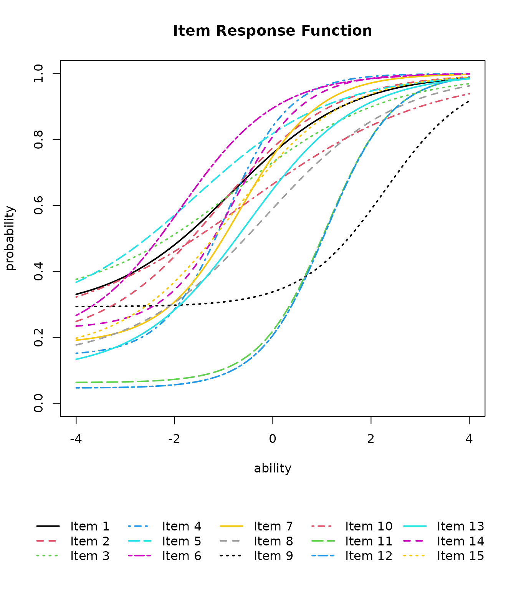

``` r
plot(result.IRT, type = "IIC", items = 1:6, nc = 2, nr = 3)
```


``` r
plot(result.IRT, type = "TRF")
```


``` r
plot(result.IRT, type = "TIC")
```


### GRM

Graded Response
Model（Samejima,1969）はIRTを多値反応モデルに展開したものです。

``` r
result.GRM <- GRM(J5S1000)
#> Parameters: 18 | Initial LL: -6252.352 
#> initial  value 6252.351598 
#> iter  10 value 6032.463982
#> iter  20 value 6010.861094
#> final  value 6008.297278 
#> converged
result.GRM
#> Item Parameter
#>    Slope Threshold1 Threshold2 Threshold3
#> V1 0.928     -1.662     0.0551       1.65
#> V2 1.234     -0.984     1.1297         NA
#> V3 0.917     -1.747    -0.0826       1.39
#> V4 1.479     -0.971     0.8901         NA
#> V5 0.947     -1.449     0.0302       1.62
#> 
#> Item Fit Indices
#>    model_log_like bench_log_like null_log_like model_Chi_sq null_Chi_sq
#> V1      -1297.780      -1086.461     -1363.667      422.638     554.411
#> V2       -947.222       -840.063     -1048.636      214.317     417.145
#> V3      -1307.044      -1096.756     -1373.799      420.575     554.085
#> V4       -936.169       -819.597     -1062.099      233.142     485.003
#> V5      -1308.149      -1096.132     -1377.883      424.033     563.502
#>    model_df null_df   NFI   RFI   IFI   TLI   CFI RMSEA     AIC    CAIC     BIC
#> V1       46      45 0.238 0.254 0.259 0.277 0.261 0.091 330.638  58.881 104.881
#> V2       31      30 0.486 0.503 0.525 0.542 0.526 0.077 152.317 -30.823   0.177
#> V3       46      45 0.241 0.257 0.263 0.280 0.264 0.090 328.575  56.819 102.819
#> V4       31      30 0.519 0.535 0.555 0.570 0.556 0.081 171.142 -11.998  19.002
#> V5       46      45 0.248 0.264 0.270 0.287 0.271 0.091 332.033  60.277 106.277
#> 
#> Model Fit Indices
#>                    value
#> model_log_like -5796.363
#> bench_log_like -4939.010
#> null_log_like  -6226.083
#> model_Chi_sq    1714.706
#> null_Chi_sq     2574.146
#> model_df         200.000
#> null_df          195.000
#> NFI                0.334
#> RFI                0.351
#> IFI                0.362
#> TLI                0.379
#> CFI                0.363
#> RMSEA              0.087
#> AIC             1314.706
#> CAIC             133.155
#> BIC              333.155
```

``` r
plot(result.GRM, type = "IRF", nc = 2)
```

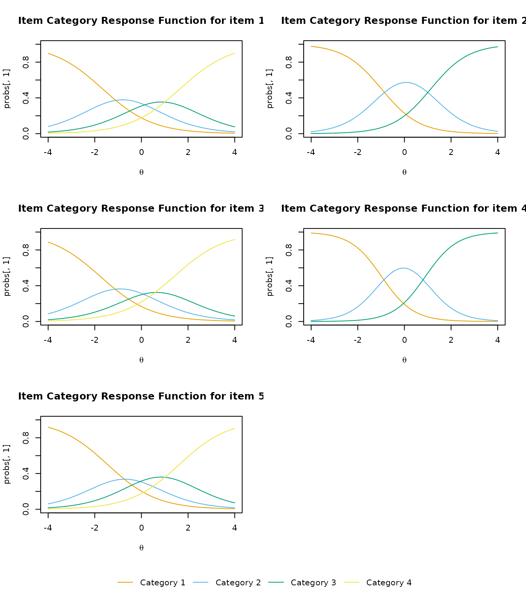

``` r
plot(result.GRM, type = "IIF", nc = 2)
```


``` r
plot(result.GRM, type = "TIF")
```


### LCA

潜在クラス分析では、データセットとクラス数の指定が必要です。

``` r
result.LCA <- LCA(J15S500, ncls = 5)
head(result.LCA$Students)
#>            Membership 1 Membership 2 Membership 3 Membership 4 Membership 5
#> Student001 0.7839477684  0.171152798  0.004141844 4.075759e-02 3.744590e-12
#> Student002 0.0347378747  0.051502214  0.836022799 7.773694e-02 1.698776e-07
#> Student003 0.0146307878  0.105488644  0.801853496 3.343026e-02 4.459682e-02
#> Student004 0.0017251650  0.023436459  0.329648386 3.656488e-01 2.795412e-01
#> Student005 0.2133830569  0.784162066  0.001484616 2.492073e-08 9.702355e-04
#> Student006 0.0003846482  0.001141448  0.001288901 8.733869e-01 1.237981e-01
#>            Estimate
#> Student001        1
#> Student002        3
#> Student003        3
#> Student004        4
#> Student005        2
#> Student006        4
```

``` r
plot(result.LCA, type = "IRP", items = 1:6, nc = 2, nr = 3)
```


``` r
plot(result.LCA, type = "CMP", students = 1:9, nc = 3, nr = 3)
```


``` r
plot(result.LCA, type = "TRP")
```


``` r
plot(result.LCA, type = "LCD")
```


### LRA

潜在ランク分析では、データセットとランク数の指定が必要です。

``` r
result.LRA <- LRA(J15S500, nrank = 6)
head(result.LRA$Students)
#>            Membership 1 Membership 2 Membership 3 Membership 4 Membership 5
#> Student001 0.2704649921  0.357479353   0.27632327  0.084988078  0.010069050
#> Student002 0.0276546965  0.157616072   0.47438958  0.279914853  0.053715813
#> Student003 0.0228189795  0.138860955   0.37884545  0.284817610  0.120794858
#> Student004 0.0020140858  0.015608542   0.09629429  0.216973334  0.362406292
#> Student005 0.5582996437  0.397431414   0.03841668  0.003365601  0.001443909
#> Student006 0.0003866603  0.003168853   0.04801344  0.248329964  0.428747502
#>            Membership 6 Estimate Rank-Up Odds Rank-Down Odds
#> Student001 0.0006752546        2    0.7729769      0.7565891
#> Student002 0.0067089816        3    0.5900527      0.3322503
#> Student003 0.0538621490        3    0.7518042      0.3665372
#> Student004 0.3067034562        5    0.8462973      0.5987019
#> Student005 0.0010427491        1    0.7118604             NA
#> Student006 0.2713535842        5    0.6328983      0.5791986
```

``` r
plot(result.LRA, type = "IRP", items = 1:6, nc = 2, nr = 3)
```


``` r
plot(result.LRA, type = "RMP", students = 1:9, nc = 3, nr = 3)
```


``` r
plot(result.LRA, type = "TRP")
```


``` r
plot(result.LRA, type = "LRD")
```

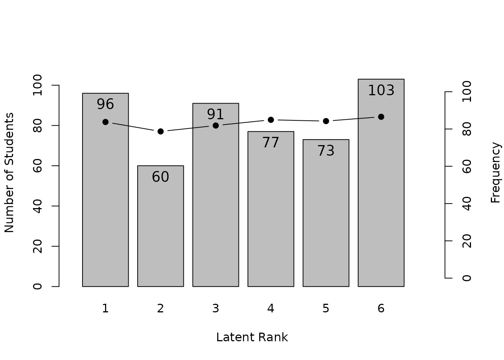

### LRA 順序尺度データへの適用

``` r
result.LRAord <- LRA(J15S3810, nrank = 3, mic = TRUE)
```

``` r
plot(result.LRAord, type = "ScoreFreq")
```


``` r
plot(result.LRAord, type = "ScoreRank")
```


``` r
plot(result.LRAord, type = "ICBR", items = 1:4, nc = 2, nr = 2)
```


``` r
plot(result.LRAord, type = "ICRP", items = 1:4, nc = 2, nr = 2)
```


``` r
plot(result.LRAord, type = "RMP", students = 1:9, nc = 3, nr = 3)
```


### LRA 名義尺度データへの適用

``` r
result.LRArated <- LRA(J35S5000, nrank = 10, mic = TRUE)
```

``` r
plot(result.LRArated, type = "ScoreFreq")
```


``` r
plot(result.LRArated, type = "ScoreRank")
```


``` r
plot(result.LRArated, type = "ICRP", items = 1:4, nc = 2, nr = 2)
```


### バイクラスタリング

``` r
Biclustering(J35S515, nfld = 5, ncls = 6, method = "B")
#> Biclustering Analysis
#> 
#> Biclustering Reference Matrix Profile
#>        Class1 Class2 Class3 Class4 Class5 Class6
#> Field1 0.6236 0.8636 0.8718  0.898  0.952  1.000
#> Field2 0.0627 0.3332 0.4255  0.919  0.990  1.000
#> Field3 0.2008 0.5431 0.2281  0.475  0.706  1.000
#> Field4 0.0495 0.2455 0.0782  0.233  0.648  0.983
#> Field5 0.0225 0.0545 0.0284  0.043  0.160  0.983
#> 
#> Field Reference Profile Indices
#>        Alpha     A Beta     B Gamma       C
#> Field1     1 0.240    1 0.624   0.0  0.0000
#> Field2     3 0.493    3 0.426   0.0  0.0000
#> Field3     1 0.342    4 0.475   0.2 -0.3149
#> Field4     4 0.415    5 0.648   0.2 -0.1673
#> Field5     5 0.823    5 0.160   0.2 -0.0261
#> 
#>                               Class 1 Class 2 Class 3 Class 4 Class 5 Class 6
#> Test Reference Profile          4.431  11.894   8.598  16.002  23.326  34.713
#> Latent Class Ditribution      157.000  64.000  82.000 106.000  89.000  17.000
#> Class Membership Distribution 146.105  73.232  85.753 106.414  86.529  16.968
#> 
#> Field Membership Profile
#>          CRR   LFE Field1 Field2 Field3 Field4 Field5
#> Item01 0.850 1.000  1.000  0.000  0.000  0.000  0.000
#> Item31 0.812 1.000  1.000  0.000  0.000  0.000  0.000
#> Item32 0.808 1.000  1.000  0.000  0.000  0.000  0.000
#> Item21 0.616 2.000  0.000  1.000  0.000  0.000  0.000
#> Item23 0.600 2.000  0.000  1.000  0.000  0.000  0.000
#> Item22 0.586 2.000  0.000  1.000  0.000  0.000  0.000
#> Item24 0.567 2.000  0.000  1.000  0.000  0.000  0.000
#> Item25 0.491 2.000  0.000  1.000  0.000  0.000  0.000
#> Item11 0.476 2.000  0.000  1.000  0.000  0.000  0.000
#> Item26 0.452 2.000  0.000  1.000  0.000  0.000  0.000
#> Item27 0.414 2.000  0.000  1.000  0.000  0.000  0.000
#> Item07 0.573 3.000  0.000  0.000  1.000  0.000  0.000
#> Item03 0.458 3.000  0.000  0.000  1.000  0.000  0.000
#> Item33 0.437 3.000  0.000  0.000  1.000  0.000  0.000
#> Item02 0.392 3.000  0.000  0.000  1.000  0.000  0.000
#> Item09 0.390 3.000  0.000  0.000  1.000  0.000  0.000
#> Item10 0.353 3.000  0.000  0.000  1.000  0.000  0.000
#> Item08 0.350 3.000  0.000  0.000  1.000  0.000  0.000
#> Item12 0.340 4.000  0.000  0.000  0.000  1.000  0.000
#> Item04 0.303 4.000  0.000  0.000  0.000  1.000  0.000
#> Item17 0.276 4.000  0.000  0.000  0.000  1.000  0.000
#> Item05 0.250 4.000  0.000  0.000  0.000  1.000  0.000
#> Item13 0.237 4.000  0.000  0.000  0.000  1.000  0.000
#> Item34 0.229 4.000  0.000  0.000  0.000  1.000  0.000
#> Item29 0.227 4.000  0.000  0.000  0.000  1.000  0.000
#> Item28 0.221 4.000  0.000  0.000  0.000  1.000  0.000
#> Item06 0.216 4.000  0.000  0.000  0.000  1.000  0.000
#> Item16 0.216 4.000  0.000  0.000  0.000  1.000  0.000
#> Item35 0.155 5.000  0.000  0.000  0.000  0.000  1.000
#> Item14 0.126 5.000  0.000  0.000  0.000  0.000  1.000
#> Item15 0.087 5.000  0.000  0.000  0.000  0.000  1.000
#> Item30 0.085 5.000  0.000  0.000  0.000  0.000  1.000
#> Item20 0.054 5.000  0.000  0.000  0.000  0.000  1.000
#> Item19 0.052 5.000  0.000  0.000  0.000  0.000  1.000
#> Item18 0.049 5.000  0.000  0.000  0.000  0.000  1.000
#> Latent Field Distribution
#>            Field 1 Field 2 Field 3 Field 4 Field 5
#> N of Items       3       8       7      10       7
#> 
#> Model Fit Indices
#> Number of Latent Class : 6
#> Number of Latent Field: 5
#> Number of EM cycle: 33 
#>                    value
#> model_log_like -6884.582
#> bench_log_like -5891.314
#> null_log_like  -9862.114
#> model_Chi_sq    1986.535
#> null_Chi_sq     7941.601
#> model_df        1160.000
#> null_df         1155.000
#> NFI                0.750
#> RFI                0.751
#> IFI                0.878
#> TLI                0.879
#> CFI                0.878
#> RMSEA              0.037
#> AIC             -333.465
#> CAIC           -6416.699
#> BIC            -5256.699
```

``` r
result.Ranklustering <- Biclustering(J35S515, nfld = 5, ncls = 6, method = "R")
plot(result.Ranklustering, type = "Array")
```

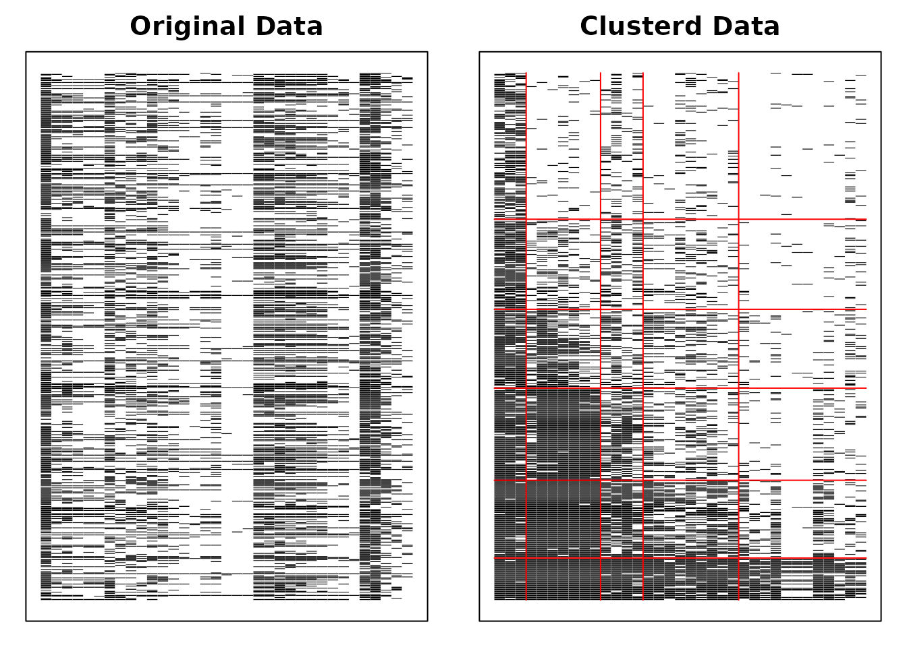

``` r
plot(result.Ranklustering, type = "FRP", nc = 2, nr = 3)
```


``` r
plot(result.Ranklustering, type = "RRV")
```


``` r
plot(result.Ranklustering, type = "RMP", students = 1:9, nc = 3, nr = 3)
```


``` r
plot(result.Ranklustering, type = "LRD")
```

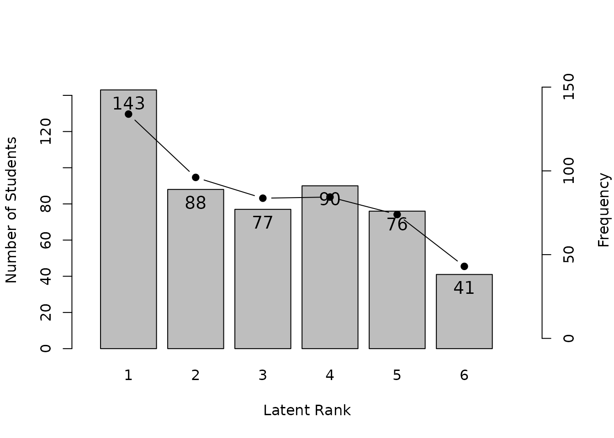

### グリッドサーチ

``` r
result <- GridSearch(J35S515, method = "R", max_ncls = 10, max_nfld = 10, index = "BIC")
result$optimal_ncls
#> [1] 10
result$optimal_nfld
#> [1] 9
plot(result$optimal_result, type = "Array")
```

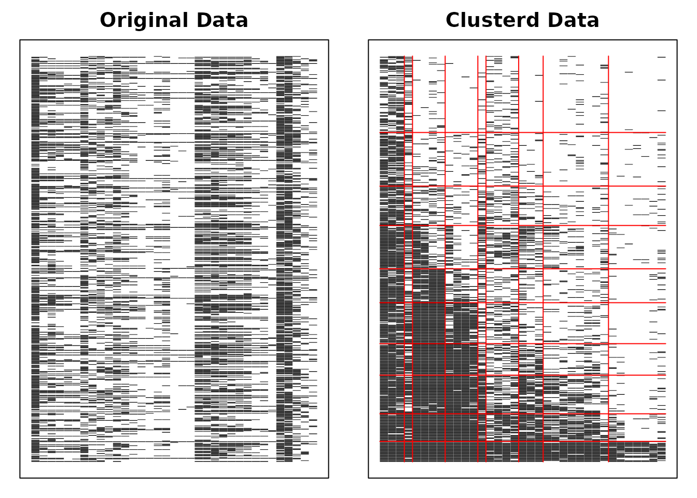

### 無限関係モデル

``` r
result.IRM <- Biclustering_IRM(J35S515, gamma_c = 1, gamma_f = 1, verbose = TRUE)
plot(result.IRM, type = "Array")
```

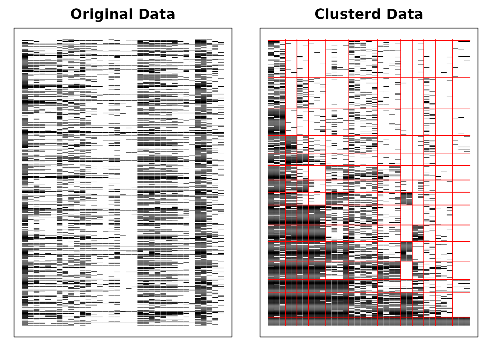

``` r
plot(result.IRM, type = "FRP", nc = 3)
```


``` r
plot(result.IRM, type = "TRP")
```


### 多段階反応データ用のバイクラスタリング

#### 順序尺度データ

``` r
result.B.ord <- Biclustering(J35S500, ncls = 5, nfld = 5, method = "R")
result.B.ord
#> Ranklustering Analysis
#> 
#> Ranklustering Reference Matrix Profile
#> For category 1 
#>         Rank 1 Rank 2 Rank 3 Rank 4 Rank 5
#> Field 1  0.334  0.354 0.3501 0.3429 0.1982
#> Field 2  0.405  0.331 0.3909 0.3510 0.0333
#> Field 3  0.359  0.324 0.3681 0.3397 0.0224
#> Field 4  0.412  0.454 0.3914 0.0185 0.0137
#> Field 5  0.251  0.028 0.0129 0.0147 0.0156
#> For category 2 
#>         Rank 1 Rank 2 Rank 3 Rank 4 Rank 5
#> Field 1  0.300 0.2461  0.280 0.2799 0.1556
#> Field 2  0.303 0.2997  0.338 0.2948 0.0381
#> Field 3  0.299 0.3085  0.331 0.2601 0.0468
#> Field 4  0.302 0.2889  0.265 0.0422 0.0350
#> Field 5  0.156 0.0532  0.011 0.0223 0.0230
#> For category 3 
#>         Rank 1 Rank 2 Rank 3 Rank 4 Rank 5
#> Field 1  0.179 0.1893 0.1759 0.2001 0.1483
#> Field 2  0.101 0.2080 0.2139 0.1621 0.1674
#> Field 3  0.173 0.1663 0.1731 0.1704 0.1023
#> Field 4  0.190 0.1692 0.1543 0.1058 0.0967
#> Field 5  0.093 0.0709 0.0592 0.0627 0.0560
#> For category 4 
#>         Rank 1 Rank 2 Rank 3 Rank 4 Rank 5
#> Field 1 0.1335 0.1096 0.1280 0.1141  0.213
#> Field 2 0.1065 0.0983 0.0266 0.0996  0.257
#> Field 3 0.1147 0.1234 0.1036 0.1371  0.281
#> Field 4 0.0622 0.0667 0.0907 0.2488  0.282
#> Field 5 0.0971 0.2182 0.1762 0.1993  0.188
#> For category 5 
#>         Rank 1 Rank 2 Rank 3 Rank 4 Rank 5
#> Field 1 0.0535 0.1013 0.0660 0.0631  0.285
#> Field 2 0.0842 0.0629 0.0307 0.0925  0.504
#> Field 3 0.0537 0.0773 0.0243 0.0927  0.547
#> Field 4 0.0340 0.0214 0.0985 0.5847  0.573
#> Field 5 0.4030 0.6297 0.7406 0.7010  0.717
#>                              Rank 1 Rank 2 Rank 3  Rank 4  Rank 5
#> Test Reference Profile       10.527 11.932 11.810  15.173  22.488
#> Latent Rank Ditribution      97.000 49.000 58.000 103.000 193.000
#> Rank Membership Distribution 97.995 49.936 55.738 105.120 191.211
#> Latent Field Distribution
#>            Field 1 Field 2 Field 3 Field 4 Field 5
#> N of Items       7       2       5       7      14
#> Boundary field reference profile
#> Weighted
#>         Rank 1 Rank 2 Rank 3 Rank 4 Rank 5
#> Field 1  1.864  1.846  1.824  1.852  3.466
#> Field 2  1.616  1.875  1.666  1.767  4.627
#> Field 3  1.760  1.876  1.714  1.865  4.721
#> Field 4  1.596  1.484  1.671  4.782  4.755
#> Field 5  3.692  4.851  4.933  4.907  4.920
#> Observed
#>         Rank 1 Rank 2 Rank 3 Rank 4 Rank 5
#> Field 1  2.270  2.379  2.251  2.280  3.179
#> Field 2  2.149  2.337  1.897  2.180  4.119
#> Field 3  2.196  2.331  2.066  2.243  4.248
#> Field 4  2.000  1.880  2.222  4.298  4.338
#> Field 5  3.222  4.327  4.618  4.537  4.550
#> 
#> Field Reference Profile Indices
#> (Based on normalized expected scores: (E[score]-1)/(maxQ-1))
#>   Alpha     A Beta     B Gamma       C
#> 1     4 0.239    5 0.558  0.50 -0.0210
#> 2     4 0.468    4 0.322  0.25 -0.0735
#> 3     4 0.475    4 0.346  0.25 -0.0589
#> 4     3 0.525    3 0.310  0.25 -0.0230
#> 5     1 0.281    1 0.561  0.25 -0.0177
#> 
#> Model Fit Indices
#> Number of Latent Rank : 5
#> Number of Latent Field: 5
#> Number of EM cycle: 7 
#>                     value
#> model_log_like -20929.785
#> bench_log_like      0.000
#> null_log_like  -23559.334
#> model_Chi_sq    41859.569
#> null_Chi_sq     47118.667
#> model_df        17416.444
#> null_df         17465.000
#> NFI                 0.112
#> RFI                 0.109
#> IFI                 0.177
#> TLI                 0.173
#> CFI                 0.176
#> RMSEA               0.053
#> AIC              7026.680
#> CAIC           -83793.252
#> BIC            -66376.808
#> LogLik         -20929.785
plot(result.B.ord, type = "Array")
```


``` r
plot(result.B.ord, type = "FRP", nc = 3, nr = 2)
```

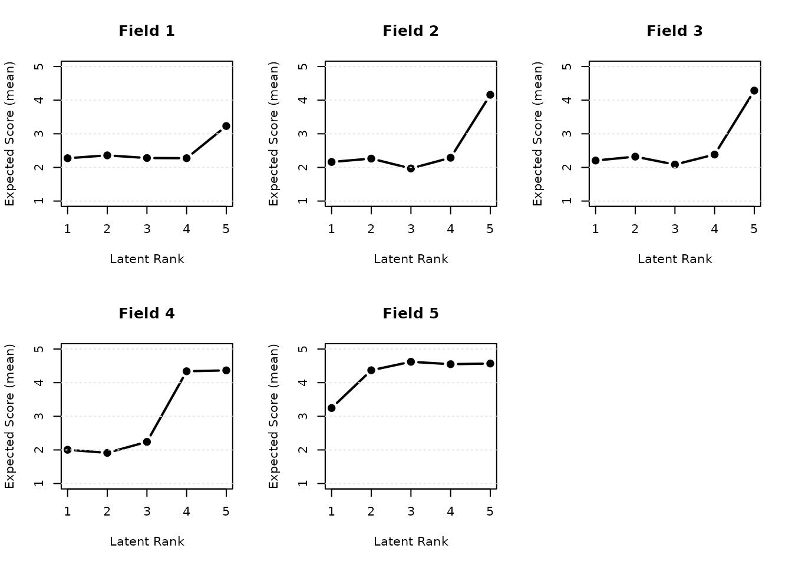

``` r
plot(result.B.ord, type = "FCRP", nc = 3, nr = 2)
```

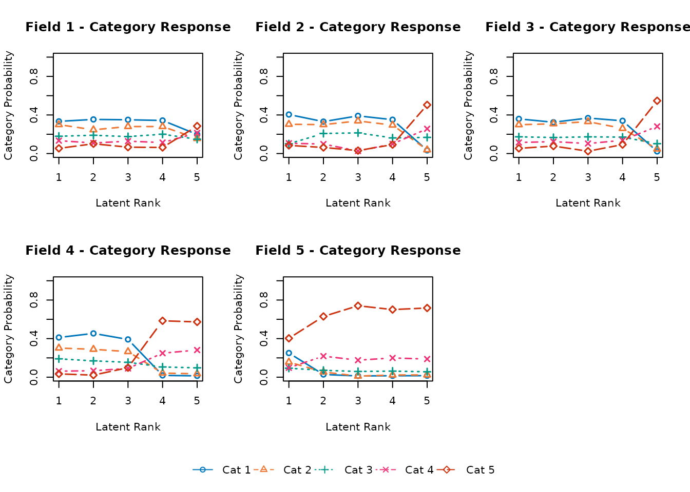

``` r
plot(result.B.ord, type = "FCRP", style = "bar", nc = 3, nr = 2)
```

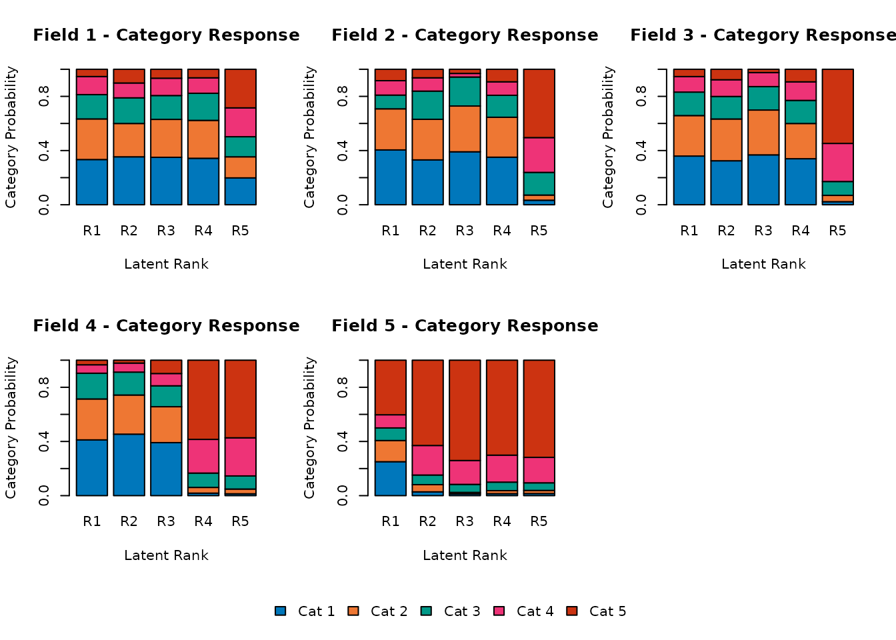

``` r
plot(result.B.ord, type = "FCBR", nc = 3, nr = 2)
```

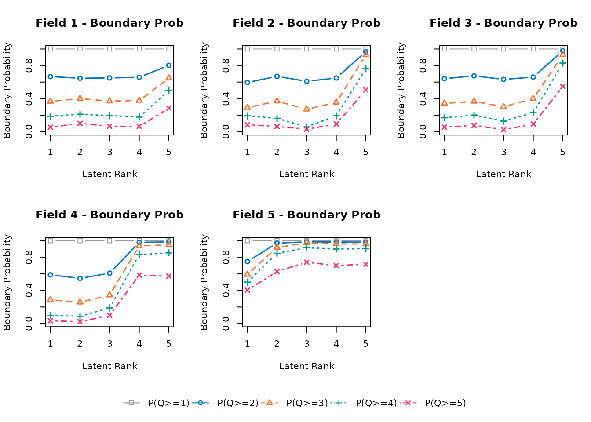

``` r
plot(result.B.ord, type = "ScoreField")
```

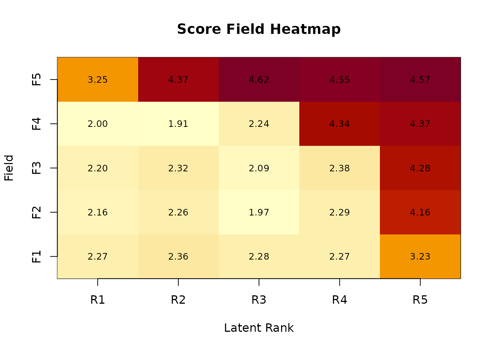

``` r
plot(result.B.ord, type = "RRV")
```


#### 名義尺度データ

``` r
result.B.nom <- Biclustering(J20S600, ncls = 5, nfld = 4)
result.B.nom
#> Biclustering Reference Matrix Profile
#> For category 1 
#>         Class 1 Class 2 Class 3 Class 4 Class 5
#> Field 1   0.179   0.177   0.140   0.140   0.562
#> Field 2   0.522   0.201   0.124   0.147   0.156
#> Field 3   0.137   0.579   0.416   0.130   0.158
#> Field 4   0.156   0.133   0.251   0.552   0.128
#> For category 2 
#>         Class 1 Class 2 Class 3 Class 4 Class 5
#> Field 1   0.152   0.140   0.241   0.581   0.156
#> Field 2   0.177   0.130   0.183   0.157   0.547
#> Field 3   0.520   0.169   0.105   0.134   0.153
#> Field 4   0.142   0.565   0.406   0.164   0.166
#> For category 3 
#>         Class 1 Class 2 Class 3 Class 4 Class 5
#> Field 1   0.112  0.5296   0.476   0.159   0.146
#> Field 2   0.157  0.0992   0.286   0.563   0.148
#> Field 3   0.156  0.1360   0.168   0.136   0.538
#> Field 4   0.545  0.1727   0.156   0.136   0.143
#> For category 4 
#>         Class 1 Class 2 Class 3 Class 4 Class 5
#> Field 1   0.557   0.153   0.144   0.120   0.135
#> Field 2   0.144   0.570   0.408   0.133   0.149
#> Field 3   0.188   0.116   0.310   0.601   0.151
#> Field 4   0.156   0.129   0.187   0.149   0.562
#>                               Class 1 Class 2 Class 3 Class 4 Class 5
#> Latent Class Ditribution      122.000  79.000  48.000 116.000 235.000
#> Class Membership Distribution 121.939  76.326  57.859 111.444 232.433
#> Latent Field Distribution
#>            Field 1 Field 2 Field 3 Field 4
#> N of Items       5       5       5       5
#> 
#> Model Fit Indices
#> Number of Latent Class : 5
#> Number of Latent Field: 4
#> Number of EM cycle: 9 
#>                     value
#> model_log_like -13940.683
#> bench_log_like      0.000
#> null_log_like  -16424.042
#> model_Chi_sq    27881.366
#> null_Chi_sq     32848.085
#> model_df        11940.000
#> null_df         11980.000
#> NFI                 0.151
#> RFI                 0.148
#> IFI                 0.238
#> TLI                 0.234
#> CFI                 0.236
#> RMSEA               0.047
#> AIC              4001.366
#> CAIC           -60437.974
#> BIC            -48497.974
#> LogLik         -13940.683
plot(result.B.nom, type = "Array")
```

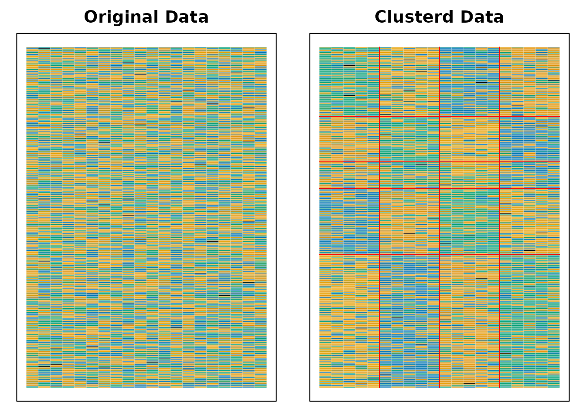

``` r
plot(result.B.nom, type = "FRP", nc = 2, nr = 2)
```


``` r
plot(result.B.nom, type = "FCRP", nc = 2, nr = 2)
```


``` r
plot(result.B.nom, type = "FCRP", style = "bar", nc = 2, nr = 2)
```

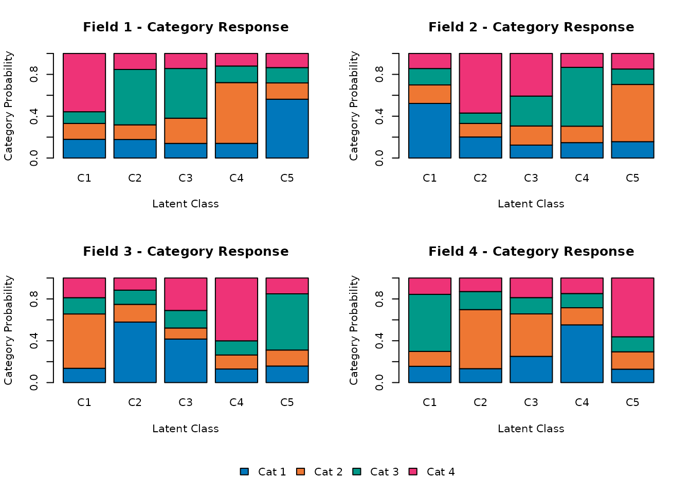

``` r
plot(result.B.nom, type = "ScoreField")
```


``` r
plot(result.B.nom, type = "RRV")
```

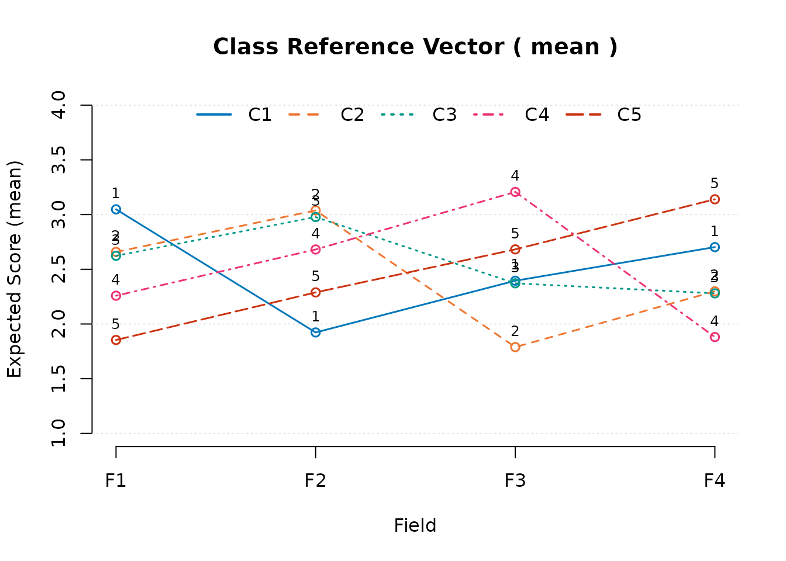

### ベイジアンネットワークモデル

``` r
library(igraph)
DAG <- matrix(
  c(
    "Item01", "Item02", "Item02", "Item03", "Item02", "Item04",
    "Item03", "Item05", "Item04", "Item05"
  ),
  ncol = 2, byrow = TRUE
)
g <- igraph::graph_from_data_frame(DAG)
adj_mat <- as.matrix(igraph::get.adjacency(g))
```

``` r
result.BNM <- BNM(J5S10, adj_matrix = adj_mat)
result.BNM
#> Adjacency Matrix
#>        Item01 Item02 Item03 Item04 Item05
#> Item01      0      1      0      0      0
#> Item02      0      0      1      1      0
#> Item03      0      0      0      0      1
#> Item04      0      0      0      0      1
#> Item05      0      0      0      0      0
#> [1] "Your graph is an acyclic graph."
#> [1] "Your graph is connected DAG."
```

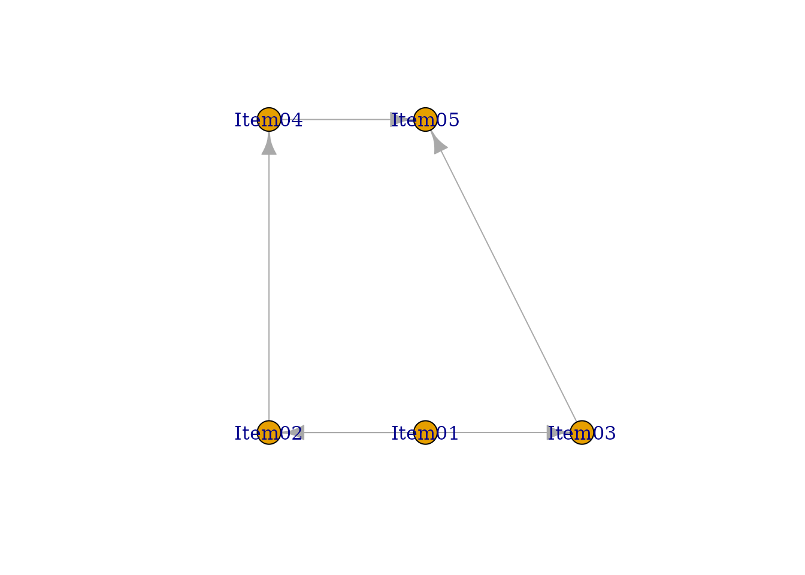

    #> 
    #> Parameter Learning
    #>        PIRP 1 PIRP 2 PIRP 3 PIRP 4
    #> Item01  0.600                     
    #> Item02  0.250    0.5              
    #> Item03  0.833    1.0              
    #> Item04  0.167    0.5              
    #> Item05  0.000    NaN  0.333  0.667
    #> 
    #> Conditional Correct Response Rate
    #>    Child Item N of Parents   Parent Items       PIRP Conditional CRR
    #> 1      Item01            0     No Parents No Pattern       0.6000000
    #> 2      Item02            1         Item01          0       0.2500000
    #> 3      Item02            1         Item01          1       0.5000000
    #> 4      Item03            1         Item02          0       0.8333333
    #> 5      Item03            1         Item02          1       1.0000000
    #> 6      Item04            1         Item02          0       0.1666667
    #> 7      Item04            1         Item02          1       0.5000000
    #> 8      Item05            2 Item03, Item04         00       0.0000000
    #> 9      Item05            2 Item03, Item04         01        NaN(0/0)
    #> 10     Item05            2 Item03, Item04         10       0.3333333
    #> 11     Item05            2 Item03, Item04         11       0.6666667
    #> 
    #> Model Fit Indices
    #>                  value
    #> model_log_like -27.046
    #> bench_log_like  -8.935
    #> null_log_like  -28.882
    #> model_Chi_sq    36.222
    #> null_Chi_sq     39.894
    #> model_df        20.000
    #> null_df         25.000
    #> NFI              0.092
    #> RFI              0.000
    #> IFI              0.185
    #> TLI              0.000
    #> CFI              0.000
    #> RMSEA            0.300
    #> AIC             -3.778
    #> CAIC           -29.829
    #> BIC             -9.829

#### 遺伝的アルゴリズムによる構造学習

``` r
BNM_GA(J5S10,
  population = 20, Rs = 0.5, Rm = 0.002, maxParents = 2,
  maxGeneration = 100, crossover = 2, elitism = 2
)
#> Adjacency Matrix
#>        Item01 Item02 Item03 Item04 Item05
#> Item01      0      0      0      1      0
#> Item02      0      0      0      0      0
#> Item03      0      0      0      0      0
#> Item04      0      0      0      0      0
#> Item05      0      0      0      0      0
#> [1] "Your graph is an acyclic graph."
#> [1] "Your graph is connected DAG."
```

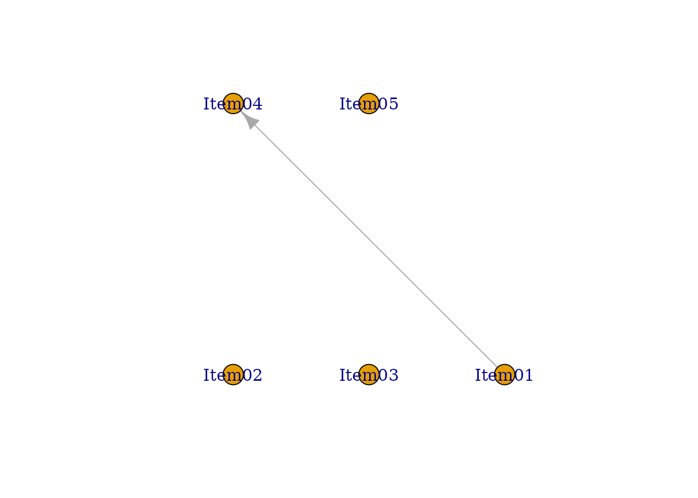

    #> 
    #> Parameter Learning
    #>        PIRP 1 PIRP 2
    #> Item01    0.6       
    #> Item02    0.4       
    #> Item03    0.9       
    #> Item04    0.0    0.5
    #> Item05    0.4       
    #> 
    #> Conditional Correct Response Rate
    #>   Child Item N of Parents Parent Items       PIRP Conditional CRR
    #> 1     Item01            0   No Parents No Pattern       0.6000000
    #> 2     Item02            0   No Parents No Pattern       0.4000000
    #> 3     Item03            0   No Parents No Pattern       0.9000000
    #> 4     Item04            1       Item01          0       0.0000000
    #> 5     Item04            1       Item01          1       0.5000000
    #> 6     Item05            0   No Parents No Pattern       0.4000000
    #> 
    #> Model Fit Indices
    #>                  value
    #> model_log_like -27.600
    #> bench_log_like  -8.935
    #> null_log_like  -28.882
    #> model_Chi_sq    37.330
    #> null_Chi_sq     39.894
    #> model_df        24.000
    #> null_df         25.000
    #> NFI              0.064
    #> RFI              0.025
    #> IFI              0.161
    #> TLI              0.068
    #> CFI              0.105
    #> RMSEA            0.248
    #> AIC            -10.670
    #> CAIC           -41.932
    #> BIC            -17.932

#### PBILによる構造学習

``` r
BNM_PBIL(J5S10,
  population = 20, Rs = 0.5, Rm = 0.005, maxParents = 2,
  alpha = 0.05, estimate = 4
)
#> Adjacency Matrix
#>        Item01 Item02 Item03 Item04 Item05
#> Item01      0      0      0      1      0
#> Item02      0      0      0      0      0
#> Item03      1      0      0      0      0
#> Item04      0      0      0      0      0
#> Item05      0      0      0      0      0
#> [1] "Your graph is an acyclic graph."
#> [1] "Your graph is connected DAG."
```

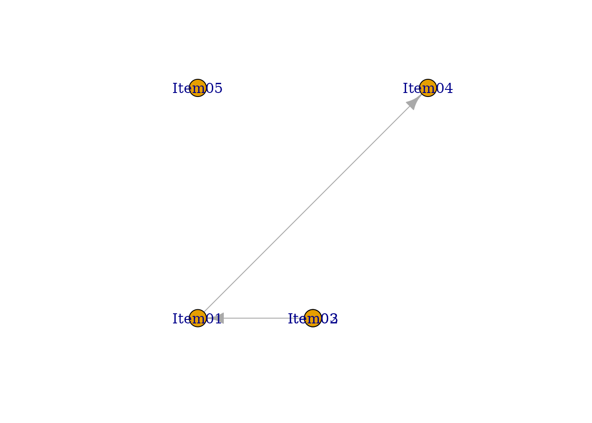

    #> 
    #> Parameter Learning
    #>        PIRP 1 PIRP 2
    #> Item01    0.0  0.667
    #> Item02    0.4       
    #> Item03    0.9       
    #> Item04    0.0  0.500
    #> Item05    0.4       
    #> 
    #> Conditional Correct Response Rate
    #>   Child Item N of Parents Parent Items       PIRP Conditional CRR
    #> 1     Item01            1       Item03          0       0.0000000
    #> 2     Item01            1       Item03          1       0.6666667
    #> 3     Item02            0   No Parents No Pattern       0.4000000
    #> 4     Item03            0   No Parents No Pattern       0.9000000
    #> 5     Item04            1       Item01          0       0.0000000
    #> 6     Item04            1       Item01          1       0.5000000
    #> 7     Item05            0   No Parents No Pattern       0.4000000
    #> 
    #> Model Fit Indices
    #>                  value
    #> model_log_like -26.599
    #> bench_log_like  -8.935
    #> null_log_like  -28.882
    #> model_Chi_sq    35.327
    #> null_Chi_sq     39.894
    #> model_df        23.000
    #> null_df         25.000
    #> NFI              0.114
    #> RFI              0.037
    #> IFI              0.270
    #> TLI              0.100
    #> CFI              0.172
    #> RMSEA            0.244
    #> AIC            -10.673
    #> CAIC           -40.633
    #> BIC            -17.633

### 局所依存潜在ランク分析

``` r
DAG_dat <- matrix(c(
  "From", "To", "Rank",
  "Item01", "Item02", 1, "Item04", "Item05", 1,
  "Item01", "Item02", 2, "Item02", "Item03", 2,
  "Item04", "Item05", 2, "Item08", "Item09", 2,
  "Item08", "Item10", 2, "Item09", "Item10", 2, "Item08", "Item11", 2,
  "Item01", "Item02", 3, "Item02", "Item03", 3,
  "Item04", "Item05", 3, "Item08", "Item09", 3,
  "Item08", "Item10", 3, "Item09", "Item10", 3, "Item08", "Item11", 3,
  "Item02", "Item03", 4, "Item04", "Item06", 4,
  "Item04", "Item07", 4, "Item05", "Item06", 4,
  "Item05", "Item07", 4, "Item08", "Item10", 4,
  "Item08", "Item11", 4, "Item09", "Item11", 4,
  "Item02", "Item03", 5, "Item04", "Item06", 5,
  "Item04", "Item07", 5, "Item05", "Item06", 5,
  "Item05", "Item07", 5, "Item09", "Item11", 5,
  "Item10", "Item11", 5, "Item10", "Item12", 5
), ncol = 3, byrow = TRUE)

edgeFile <- tempfile(fileext = ".csv")
write.csv(DAG_dat, edgeFile, row.names = FALSE, quote = TRUE)
```

``` r
result.LDLRA <- LDLRA(J12S5000, ncls = 5, adj_file = edgeFile)
result.LDLRA
#> Adjacency Matrix
#> [[1]]
#>        Item01 Item02 Item03 Item04 Item05 Item06 Item07 Item08 Item09 Item10
#> Item01      0      1      0      0      0      0      0      0      0      0
#> Item02      0      0      0      0      0      0      0      0      0      0
#> Item03      0      0      0      0      0      0      0      0      0      0
#> Item04      0      0      0      0      1      0      0      0      0      0
#> Item05      0      0      0      0      0      0      0      0      0      0
#> Item06      0      0      0      0      0      0      0      0      0      0
#> Item07      0      0      0      0      0      0      0      0      0      0
#> Item08      0      0      0      0      0      0      0      0      0      0
#> Item09      0      0      0      0      0      0      0      0      0      0
#> Item10      0      0      0      0      0      0      0      0      0      0
#> Item11      0      0      0      0      0      0      0      0      0      0
#> Item12      0      0      0      0      0      0      0      0      0      0
#>        Item11 Item12
#> Item01      0      0
#> Item02      0      0
#> Item03      0      0
#> Item04      0      0
#> Item05      0      0
#> Item06      0      0
#> Item07      0      0
#> Item08      0      0
#> Item09      0      0
#> Item10      0      0
#> Item11      0      0
#> Item12      0      0
#> 
#> [[2]]
#>        Item01 Item02 Item03 Item04 Item05 Item06 Item07 Item08 Item09 Item10
#> Item01      0      1      0      0      0      0      0      0      0      0
#> Item02      0      0      1      0      0      0      0      0      0      0
#> Item03      0      0      0      0      0      0      0      0      0      0
#> Item04      0      0      0      0      1      0      0      0      0      0
#> Item05      0      0      0      0      0      0      0      0      0      0
#> Item06      0      0      0      0      0      0      0      0      0      0
#> Item07      0      0      0      0      0      0      0      0      0      0
#> Item08      0      0      0      0      0      0      0      0      1      1
#> Item09      0      0      0      0      0      0      0      0      0      1
#> Item10      0      0      0      0      0      0      0      0      0      0
#> Item11      0      0      0      0      0      0      0      0      0      0
#> Item12      0      0      0      0      0      0      0      0      0      0
#>        Item11 Item12
#> Item01      0      0
#> Item02      0      0
#> Item03      0      0
#> Item04      0      0
#> Item05      0      0
#> Item06      0      0
#> Item07      0      0
#> Item08      1      0
#> Item09      0      0
#> Item10      0      0
#> Item11      0      0
#> Item12      0      0
#> 
#> [[3]]
#>        Item01 Item02 Item03 Item04 Item05 Item06 Item07 Item08 Item09 Item10
#> Item01      0      1      0      0      0      0      0      0      0      0
#> Item02      0      0      1      0      0      0      0      0      0      0
#> Item03      0      0      0      0      0      0      0      0      0      0
#> Item04      0      0      0      0      1      0      0      0      0      0
#> Item05      0      0      0      0      0      0      0      0      0      0
#> Item06      0      0      0      0      0      0      0      0      0      0
#> Item07      0      0      0      0      0      0      0      0      0      0
#> Item08      0      0      0      0      0      0      0      0      1      1
#> Item09      0      0      0      0      0      0      0      0      0      1
#> Item10      0      0      0      0      0      0      0      0      0      0
#> Item11      0      0      0      0      0      0      0      0      0      0
#> Item12      0      0      0      0      0      0      0      0      0      0
#>        Item11 Item12
#> Item01      0      0
#> Item02      0      0
#> Item03      0      0
#> Item04      0      0
#> Item05      0      0
#> Item06      0      0
#> Item07      0      0
#> Item08      1      0
#> Item09      0      0
#> Item10      0      0
#> Item11      0      0
#> Item12      0      0
#> 
#> [[4]]
#>        Item01 Item02 Item03 Item04 Item05 Item06 Item07 Item08 Item09 Item10
#> Item01      0      0      0      0      0      0      0      0      0      0
#> Item02      0      0      1      0      0      0      0      0      0      0
#> Item03      0      0      0      0      0      0      0      0      0      0
#> Item04      0      0      0      0      0      1      1      0      0      0
#> Item05      0      0      0      0      0      1      1      0      0      0
#> Item06      0      0      0      0      0      0      0      0      0      0
#> Item07      0      0      0      0      0      0      0      0      0      0
#> Item08      0      0      0      0      0      0      0      0      0      1
#> Item09      0      0      0      0      0      0      0      0      0      0
#> Item10      0      0      0      0      0      0      0      0      0      0
#> Item11      0      0      0      0      0      0      0      0      0      0
#> Item12      0      0      0      0      0      0      0      0      0      0
#>        Item11 Item12
#> Item01      0      0
#> Item02      0      0
#> Item03      0      0
#> Item04      0      0
#> Item05      0      0
#> Item06      0      0
#> Item07      0      0
#> Item08      1      0
#> Item09      1      0
#> Item10      0      0
#> Item11      0      0
#> Item12      0      0
#> 
#> [[5]]
#>        Item01 Item02 Item03 Item04 Item05 Item06 Item07 Item08 Item09 Item10
#> Item01      0      0      0      0      0      0      0      0      0      0
#> Item02      0      0      1      0      0      0      0      0      0      0
#> Item03      0      0      0      0      0      0      0      0      0      0
#> Item04      0      0      0      0      0      1      1      0      0      0
#> Item05      0      0      0      0      0      1      1      0      0      0
#> Item06      0      0      0      0      0      0      0      0      0      0
#> Item07      0      0      0      0      0      0      0      0      0      0
#> Item08      0      0      0      0      0      0      0      0      0      0
#> Item09      0      0      0      0      0      0      0      0      0      0
#> Item10      0      0      0      0      0      0      0      0      0      0
#> Item11      0      0      0      0      0      0      0      0      0      0
#> Item12      0      0      0      0      0      0      0      0      0      0
#>        Item11 Item12
#> Item01      0      0
#> Item02      0      0
#> Item03      0      0
#> Item04      0      0
#> Item05      0      0
#> Item06      0      0
#> Item07      0      0
#> Item08      0      0
#> Item09      1      0
#> Item10      1      1
#> Item11      0      0
#> Item12      0      0
```

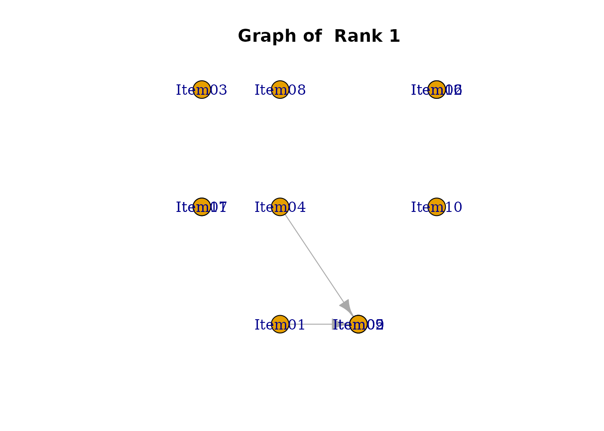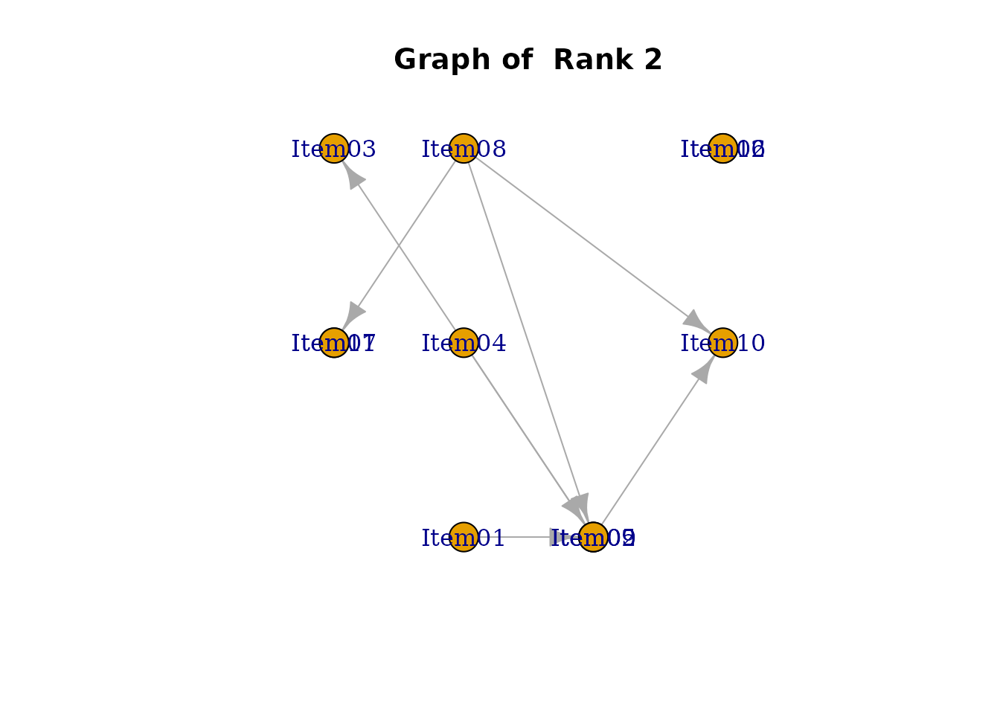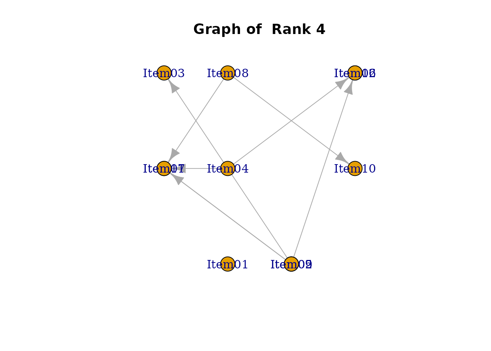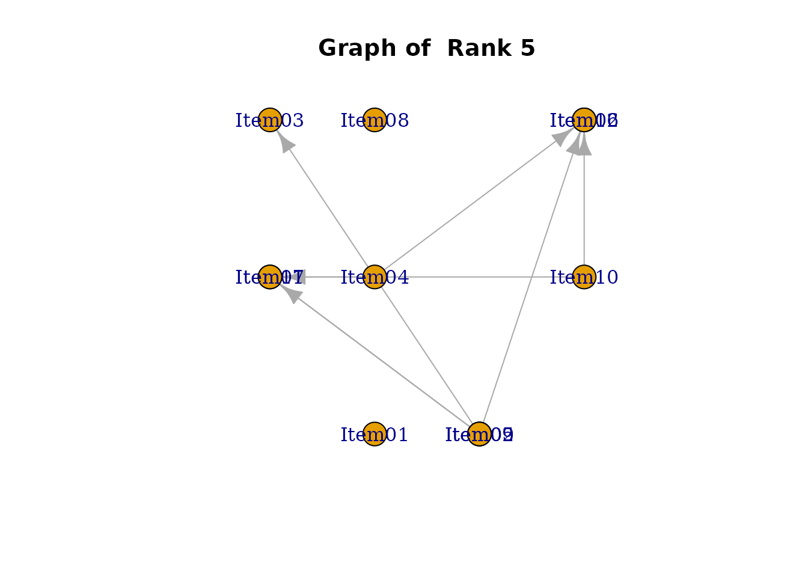

    #> 
    #> Parameter Learning
    #>      Item Rank PIRP 1 PIRP 2 PIRP 3 PIRP 4
    #> 1  Item01    1  0.456                     
    #> 2  Item02    1  0.030  0.444              
    #> 3  Item03    1  0.083                     
    #> 4  Item04    1  0.421                     
    #> 5  Item05    1  0.101  0.240              
    #> 6  Item06    1  0.025                     
    #> 7  Item07    1  0.016                     
    #> 8  Item08    1  0.286                     
    #> 9  Item09    1  0.326                     
    #> 10 Item10    1  0.181                     
    #> 11 Item11    1  0.106                     
    #> 12 Item12    1  0.055                     
    #> 13 Item01    2  0.549                     
    #> 14 Item02    2  0.035  0.568              
    #> 15 Item03    2  0.020  0.459              
    #> 16 Item04    2  0.495                     
    #> 17 Item05    2  0.148  0.351              
    #> 18 Item06    2  0.066                     
    #> 19 Item07    2  0.045                     
    #> 20 Item08    2  0.407                     
    #> 21 Item09    2  0.264  0.734              
    #> 22 Item10    2  0.081  0.133  0.159  0.745
    #> 23 Item11    2  0.041  0.445              
    #> 24 Item12    2  0.086                     
    #> 25 Item01    3  0.683                     
    #> 26 Item02    3  0.040  0.728              
    #> 27 Item03    3  0.032  0.617              
    #> 28 Item04    3  0.612                     
    #> 29 Item05    3  0.227  0.556              
    #> 30 Item06    3  0.205                     
    #> 31 Item07    3  0.156                     
    #> 32 Item08    3  0.581                     
    #> 33 Item09    3  0.330  0.845              
    #> 34 Item10    3  0.092  0.160  0.211  0.843
    #> 35 Item11    3  0.056  0.636              
    #> 36 Item12    3  0.152                     
    #> 37 Item01    4  0.836                     
    #> 38 Item02    4  0.720                     
    #> 39 Item03    4  0.058  0.713              
    #> 40 Item04    4  0.740                     
    #> 41 Item05    4  0.635                     
    #> 42 Item06    4  0.008  0.105  0.023  0.684
    #> 43 Item07    4  0.010  0.031  0.039  0.542
    #> 44 Item08    4  0.760                     
    #> 45 Item09    4  0.805                     
    #> 46 Item10    4  0.150  0.844              
    #> 47 Item11    4  0.064  0.124  0.105  0.825
    #> 48 Item12    4  0.227                     
    #> 49 Item01    5  0.931                     
    #> 50 Item02    5  0.869                     
    #> 51 Item03    5  0.099  0.789              
    #> 52 Item04    5  0.846                     
    #> 53 Item05    5  0.811                     
    #> 54 Item06    5  0.015  0.125  0.040  0.788
    #> 55 Item07    5  0.016  0.034  0.064  0.650
    #> 56 Item08    5  0.880                     
    #> 57 Item09    5  0.912                     
    #> 58 Item10    5  0.825                     
    #> 59 Item11    5  0.082  0.190  0.216  0.915
    #> 60 Item12    5  0.153  0.341              
    #> 
    #> Conditional Correct Response Rate
    #>     Child Item Rank N of Parents   Parent Items       PIRP Conditional CRR
    #> 1       Item01    1            0     No Parents No Pattern         0.45558
    #> 2       Item02    1            1         Item01          0         0.03025
    #> 3       Item02    1            1         Item01          1         0.44394
    #> 4       Item03    1            0     No Parents No Pattern         0.08278
    #> 5       Item04    1            0     No Parents No Pattern         0.42148
    #> 6       Item05    1            1         Item04          0         0.10127
    #> 7       Item05    1            1         Item04          1         0.24025
    #> 8       Item06    1            0     No Parents No Pattern         0.02499
    #> 9       Item07    1            0     No Parents No Pattern         0.01574
    #> 10      Item08    1            0     No Parents No Pattern         0.28642
    #> 11      Item09    1            0     No Parents No Pattern         0.32630
    #> 12      Item10    1            0     No Parents No Pattern         0.18092
    #> 13      Item11    1            0     No Parents No Pattern         0.10575
    #> 14      Item12    1            0     No Parents No Pattern         0.05523
    #> 15      Item01    2            0     No Parents No Pattern         0.54940
    #> 16      Item02    2            1         Item01          0         0.03471
    #> 17      Item02    2            1         Item01          1         0.56821
    #> 18      Item03    2            1         Item02          0         0.02016
    #> 19      Item03    2            1         Item02          1         0.45853
    #> 20      Item04    2            0     No Parents No Pattern         0.49508
    #> 21      Item05    2            1         Item04          0         0.14771
    #> 22      Item05    2            1         Item04          1         0.35073
    #> 23      Item06    2            0     No Parents No Pattern         0.06647
    #> 24      Item07    2            0     No Parents No Pattern         0.04491
    #> 25      Item08    2            0     No Parents No Pattern         0.40721
    #> 26      Item09    2            1         Item08          0         0.26431
    #> 27      Item09    2            1         Item08          1         0.73427
    #> 28      Item10    2            2 Item08, Item09         00         0.08098
    #> 29      Item10    2            2 Item08, Item09         01         0.13279
    #> 30      Item10    2            2 Item08, Item09         10         0.15937
    #> 31      Item10    2            2 Item08, Item09         11         0.74499
    #> 32      Item11    2            1         Item08          0         0.04094
    #> 33      Item11    2            1         Item08          1         0.44457
    #> 34      Item12    2            0     No Parents No Pattern         0.08574
    #> 35      Item01    3            0     No Parents No Pattern         0.68342
    #> 36      Item02    3            1         Item01          0         0.04020
    #> 37      Item02    3            1         Item01          1         0.72757
    #> 38      Item03    3            1         Item02          0         0.03175
    #> 39      Item03    3            1         Item02          1         0.61691
    #> 40      Item04    3            0     No Parents No Pattern         0.61195
    #> 41      Item05    3            1         Item04          0         0.22705
    #> 42      Item05    3            1         Item04          1         0.55588
    #> 43      Item06    3            0     No Parents No Pattern         0.20488
    #> 44      Item07    3            0     No Parents No Pattern         0.15633
    #> 45      Item08    3            0     No Parents No Pattern         0.58065
    #> 46      Item09    3            1         Item08          0         0.32967
    #> 47      Item09    3            1         Item08          1         0.84549
    #> 48      Item10    3            2 Item08, Item09         00         0.09192
    #> 49      Item10    3            2 Item08, Item09         01         0.15977
    #> 50      Item10    3            2 Item08, Item09         10         0.21087
    #> 51      Item10    3            2 Item08, Item09         11         0.84330
    #> 52      Item11    3            1         Item08          0         0.05581
    #> 53      Item11    3            1         Item08          1         0.63598
    #> 54      Item12    3            0     No Parents No Pattern         0.15169
    #> 55      Item01    4            0     No Parents No Pattern         0.83557
    #> 56      Item02    4            0     No Parents No Pattern         0.71950
    #> 57      Item03    4            1         Item02          0         0.05808
    #> 58      Item03    4            1         Item02          1         0.71297
    #> 59      Item04    4            0     No Parents No Pattern         0.73957
    #> 60      Item05    4            0     No Parents No Pattern         0.63526
    #> 61      Item06    4            2 Item04, Item05         00         0.00816
    #> 62      Item06    4            2 Item04, Item05         01         0.10474
    #> 63      Item06    4            2 Item04, Item05         10         0.02265
    #> 64      Item06    4            2 Item04, Item05         11         0.68419
    #> 65      Item07    4            2 Item04, Item05         00         0.00984
    #> 66      Item07    4            2 Item04, Item05         01         0.03091
    #> 67      Item07    4            2 Item04, Item05         10         0.03850
    #> 68      Item07    4            2 Item04, Item05         11         0.54195
    #> 69      Item08    4            0     No Parents No Pattern         0.75976
    #> 70      Item09    4            0     No Parents No Pattern         0.80490
    #> 71      Item10    4            1         Item08          0         0.14956
    #> 72      Item10    4            1         Item08          1         0.84430
    #> 73      Item11    4            2 Item08, Item09         00         0.06376
    #> 74      Item11    4            2 Item08, Item09         01         0.12384
    #> 75      Item11    4            2 Item08, Item09         10         0.10494
    #> 76      Item11    4            2 Item08, Item09         11         0.82451
    #> 77      Item12    4            0     No Parents No Pattern         0.22688
    #> 78      Item01    5            0     No Parents No Pattern         0.93131
    #> 79      Item02    5            0     No Parents No Pattern         0.86923
    #> 80      Item03    5            1         Item02          0         0.09865
    #> 81      Item03    5            1         Item02          1         0.78854
    #> 82      Item04    5            0     No Parents No Pattern         0.84621
    #> 83      Item05    5            0     No Parents No Pattern         0.81118
    #> 84      Item06    5            2 Item04, Item05         00         0.01452
    #> 85      Item06    5            2 Item04, Item05         01         0.12528
    #> 86      Item06    5            2 Item04, Item05         10         0.04000
    #> 87      Item06    5            2 Item04, Item05         11         0.78805
    #> 88      Item07    5            2 Item04, Item05         00         0.01570
    #> 89      Item07    5            2 Item04, Item05         01         0.03361
    #> 90      Item07    5            2 Item04, Item05         10         0.06363
    #> 91      Item07    5            2 Item04, Item05         11         0.65039
    #> 92      Item08    5            0     No Parents No Pattern         0.88028
    #> 93      Item09    5            0     No Parents No Pattern         0.91209
    #> 94      Item10    5            0     No Parents No Pattern         0.82476
    #> 95      Item11    5            2 Item09, Item10         00         0.08248
    #> 96      Item11    5            2 Item09, Item10         01         0.18951
    #> 97      Item11    5            2 Item09, Item10         10         0.21590
    #> 98      Item11    5            2 Item09, Item10         11         0.91466
    #> 99      Item12    5            1         Item10          0         0.15301
    #> 100     Item12    5            1         Item10          1         0.34114
    #> 
    #> Marginal Item Reference Profile
    #>        Rank 1 Rank 2 Rank 3 Rank 4 Rank 5
    #> Item01 0.4556 0.5494  0.683  0.836  0.931
    #> Item02 0.2099 0.2964  0.474  0.720  0.869
    #> Item03 0.0828 0.1397  0.316  0.554  0.741
    #> Item04 0.4215 0.4951  0.612  0.740  0.846
    #> Item05 0.1555 0.2393  0.432  0.635  0.811
    #> Item06 0.0250 0.0665  0.205  0.385  0.631
    #> Item07 0.0157 0.0449  0.156  0.304  0.517
    #> Item08 0.2864 0.4072  0.581  0.760  0.880
    #> Item09 0.3263 0.4409  0.624  0.805  0.912
    #> Item10 0.1809 0.2977  0.498  0.650  0.825
    #> Item11 0.1057 0.1926  0.387  0.565  0.808
    #> Item12 0.0552 0.0857  0.152  0.227  0.317
    #> 
    #> IRP Indices
    #>        Alpha          A Beta         B Gamma C
    #> Item01     3 0.15215133    1 0.4555806     0 0
    #> Item02     3 0.24578705    3 0.4737140     0 0
    #> Item03     3 0.23808314    4 0.5544465     0 0
    #> Item04     3 0.12762155    2 0.4950757     0 0
    #> Item05     3 0.20322441    3 0.4320364     0 0
    #> Item06     4 0.24595102    4 0.3851075     0 0
    #> Item07     4 0.21361675    5 0.5173874     0 0
    #> Item08     3 0.17910918    3 0.5806476     0 0
    #> Item09     2 0.18320368    2 0.4408936     0 0
    #> Item10     2 0.20070396    3 0.4984108     0 0
    #> Item11     4 0.24332189    4 0.5650492     0 0
    #> Item12     4 0.09047482    5 0.3173548     0 0
    #> [1] "Strongly ordinal alignment condition was satisfied."
    #> 
    #> Test reference Profile and Latent Rank Distribution
    #>                                Rank 1   Rank 2  Rank 3  Rank 4   Rank 5
    #> Test Reference Profile          2.321    3.255   5.121   7.179    9.090
    #> Latent Rank Ditribution      1829.000  593.000 759.000 569.000 1250.000
    #> Rank Membership Distribution 1121.838 1087.855 873.796 835.528 1080.983
    #> [1] "Weakly ordinal alignment condition was satisfied."
    #> 
    #> Model Fit Indices
    #>                     value
    #> model_log_like -26657.783
    #> bench_log_like -21318.465
    #> null_log_like  -37736.228
    #> model_Chi_sq    10678.636
    #> null_Chi_sq     32835.527
    #> model_df           56.000
    #> null_df           144.000
    #> NFI                 0.675
    #> RFI                 0.164
    #> IFI                 0.676
    #> TLI                 0.164
    #> CFI                 0.675
    #> RMSEA               0.195
    #> AIC             10566.636
    #> CAIC            10145.673
    #> BIC             10201.673

``` r
plot(result.LDLRA, type = "IRP", nc = 4, nr = 3)
```


``` r
plot(result.LDLRA, type = "TRP")
```

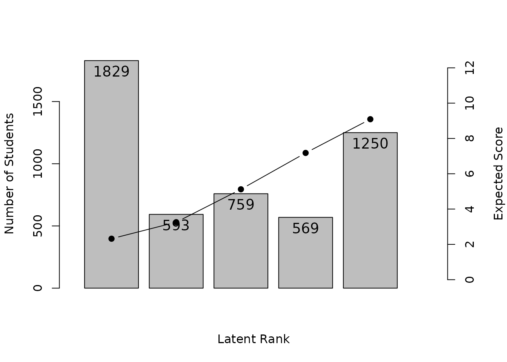

``` r
plot(result.LDLRA, type = "LRD")
```


### 局所依存バイクラスタリング

``` r
conf <- c(
  1, 6, 6, 8, 9, 9, 4, 7, 7, 7, 5, 8, 9, 10, 10,
  9, 9, 10, 10, 10, 2, 2, 3, 3, 5, 5, 6, 9, 9, 10,
  1, 1, 7, 9, 10
)

edges_data <- data.frame(
  "From Field (Parent) >>>" = c(6, 4, 5, 1, 1, 4, 3, 4, 6, 2, 4, 4, 3, 6, 4, 1, 7, 9, 6, 7),
  ">>> To Field (Child)" = c(8, 7, 8, 7, 2, 5, 5, 8, 8, 4, 6, 7, 5, 8, 5, 8, 10, 10, 8, 9),
  "At Class/Rank (Locus)" = c(2, 2, 2, 2, 2, 2, 3, 3, 3, 3, 3, 3, 4, 4, 4, 4, 5, 5, 5, 5)
)

edgeFile <- tempfile(fileext = ".csv")
write.csv(edges_data, file = edgeFile, row.names = FALSE)
```

``` r
result.LDB <- LDB(U = J35S515, ncls = 5, conf = conf, adj_file = edgeFile)
result.LDB
#> Adjacency Matrix
#> [[1]]
#>         Field01 Field02 Field03 Field04 Field05 Field06 Field07 Field08 Field09
#> Field01       0       0       0       0       0       0       0       0       0
#> Field02       0       0       0       0       0       0       0       0       0
#> Field03       0       0       0       0       0       0       0       0       0
#> Field04       0       0       0       0       0       0       0       0       0
#> Field05       0       0       0       0       0       0       0       0       0
#> Field06       0       0       0       0       0       0       0       0       0
#> Field07       0       0       0       0       0       0       0       0       0
#> Field08       0       0       0       0       0       0       0       0       0
#> Field09       0       0       0       0       0       0       0       0       0
#> Field10       0       0       0       0       0       0       0       0       0
#>         Field10
#> Field01       0
#> Field02       0
#> Field03       0
#> Field04       0
#> Field05       0
#> Field06       0
#> Field07       0
#> Field08       0
#> Field09       0
#> Field10       0
#> 
#> [[2]]
#>         Field01 Field02 Field03 Field04 Field05 Field06 Field07 Field08 Field09
#> Field01       0       1       0       0       0       0       1       0       0
#> Field02       0       0       0       0       0       0       0       0       0
#> Field03       0       0       0       0       0       0       0       0       0
#> Field04       0       0       0       0       1       0       1       0       0
#> Field05       0       0       0       0       0       0       0       1       0
#> Field06       0       0       0       0       0       0       0       1       0
#> Field07       0       0       0       0       0       0       0       0       0
#> Field08       0       0       0       0       0       0       0       0       0
#> Field09       0       0       0       0       0       0       0       0       0
#> Field10       0       0       0       0       0       0       0       0       0
#>         Field10
#> Field01       0
#> Field02       0
#> Field03       0
#> Field04       0
#> Field05       0
#> Field06       0
#> Field07       0
#> Field08       0
#> Field09       0
#> Field10       0
#> 
#> [[3]]
#>         Field01 Field02 Field03 Field04 Field05 Field06 Field07 Field08 Field09
#> Field01       0       0       0       0       0       0       0       0       0
#> Field02       0       0       0       1       0       0       0       0       0
#> Field03       0       0       0       0       1       0       0       0       0
#> Field04       0       0       0       0       0       1       1       1       0
#> Field05       0       0       0       0       0       0       0       0       0
#> Field06       0       0       0       0       0       0       0       1       0
#> Field07       0       0       0       0       0       0       0       0       0
#> Field08       0       0       0       0       0       0       0       0       0
#> Field09       0       0       0       0       0       0       0       0       0
#> Field10       0       0       0       0       0       0       0       0       0
#>         Field10
#> Field01       0
#> Field02       0
#> Field03       0
#> Field04       0
#> Field05       0
#> Field06       0
#> Field07       0
#> Field08       0
#> Field09       0
#> Field10       0
#> 
#> [[4]]
#>         Field01 Field02 Field03 Field04 Field05 Field06 Field07 Field08 Field09
#> Field01       0       0       0       0       0       0       0       1       0
#> Field02       0       0       0       0       0       0       0       0       0
#> Field03       0       0       0       0       1       0       0       0       0
#> Field04       0       0       0       0       1       0       0       0       0
#> Field05       0       0       0       0       0       0       0       0       0
#> Field06       0       0       0       0       0       0       0       1       0
#> Field07       0       0       0       0       0       0       0       0       0
#> Field08       0       0       0       0       0       0       0       0       0
#> Field09       0       0       0       0       0       0       0       0       0
#> Field10       0       0       0       0       0       0       0       0       0
#>         Field10
#> Field01       0
#> Field02       0
#> Field03       0
#> Field04       0
#> Field05       0
#> Field06       0
#> Field07       0
#> Field08       0
#> Field09       0
#> Field10       0
#> 
#> [[5]]
#>         Field01 Field02 Field03 Field04 Field05 Field06 Field07 Field08 Field09
#> Field01       0       0       0       0       0       0       0       0       0
#> Field02       0       0       0       0       0       0       0       0       0
#> Field03       0       0       0       0       0       0       0       0       0
#> Field04       0       0       0       0       0       0       0       0       0
#> Field05       0       0       0       0       0       0       0       0       0
#> Field06       0       0       0       0       0       0       0       1       0
#> Field07       0       0       0       0       0       0       0       0       1
#> Field08       0       0       0       0       0       0       0       0       0
#> Field09       0       0       0       0       0       0       0       0       0
#> Field10       0       0       0       0       0       0       0       0       0
#>         Field10
#> Field01       0
#> Field02       0
#> Field03       0
#> Field04       0
#> Field05       0
#> Field06       0
#> Field07       1
#> Field08       0
#> Field09       1
#> Field10       0
```

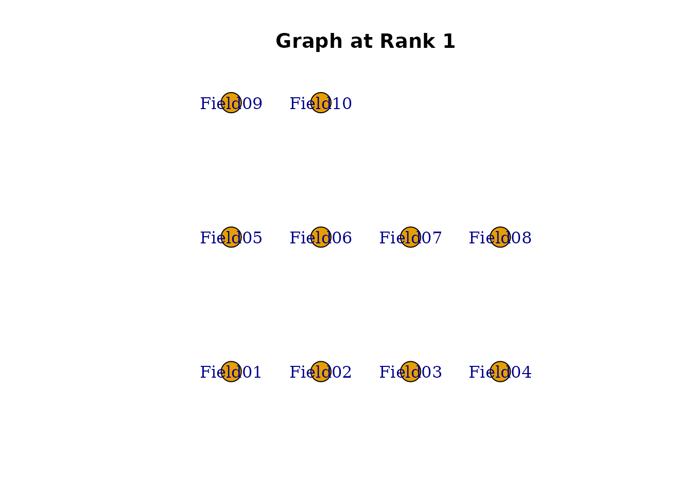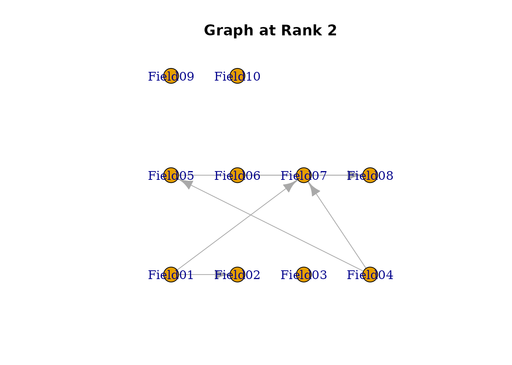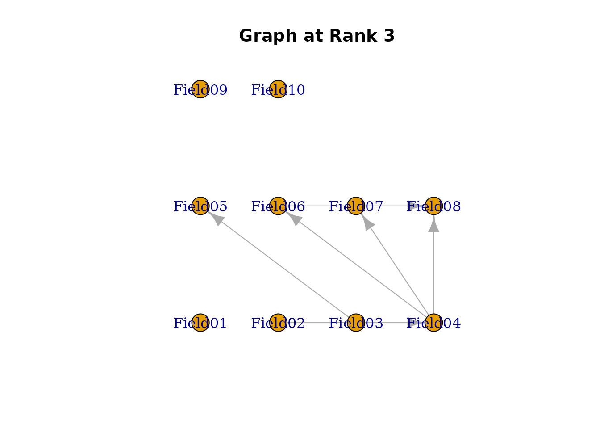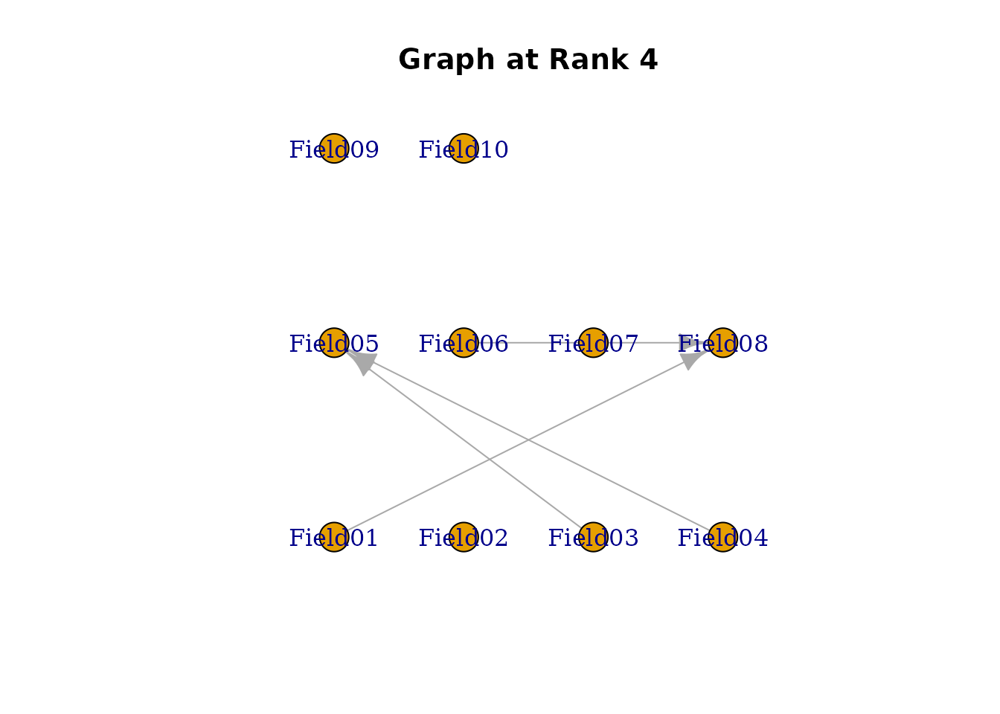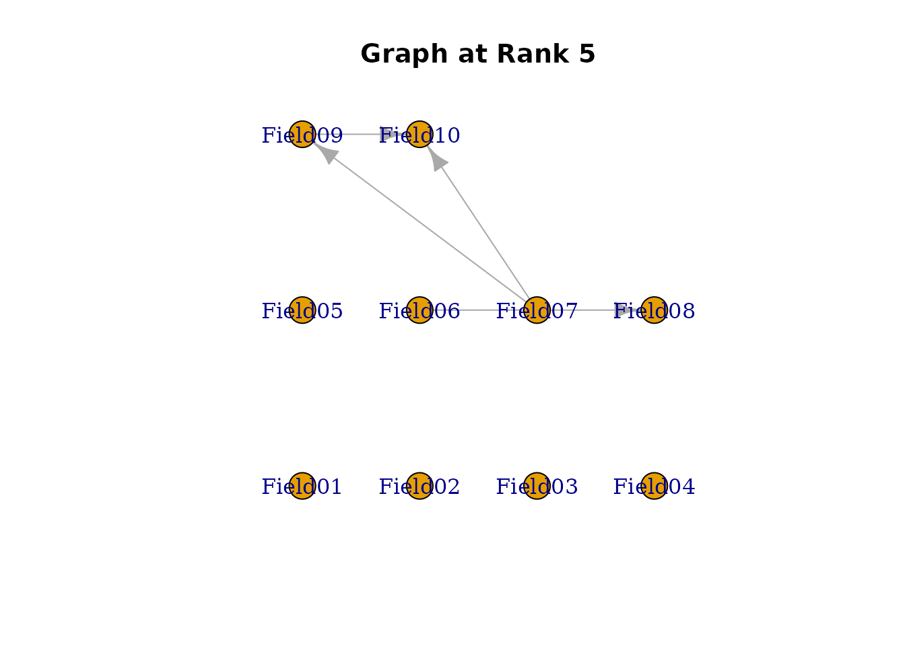

    #> 
    #> Parameter Learning
    #> Rank 1 
    #>         PIRP 0 PIRP 1 PIRP 2 PIRP 3 PIRP 4 PIRP 5 PIRP 6 PIRP 7 PIRP 8 PIRP 9
    #> Field01 0.6538                                                               
    #> Field02 0.0756                                                               
    #> Field03 0.1835                                                               
    #> Field04 0.3819                                                               
    #> Field05 0.0500                                                               
    #> Field06 0.0985                                                               
    #> Field07 0.2176                                                               
    #> Field08 0.0608                                                               
    #> Field09 0.0563                                                               
    #> Field10 0.0237                                                               
    #>         PIRP 10 PIRP 11 PIRP 12
    #> Field01                        
    #> Field02                        
    #> Field03                        
    #> Field04                        
    #> Field05                        
    #> Field06                        
    #> Field07                        
    #> Field08                        
    #> Field09                        
    #> Field10                        
    #> Rank 2 
    #>         PIRP 0 PIRP 1 PIRP 2 PIRP 3 PIRP 4 PIRP 5 PIRP 6 PIRP 7 PIRP 8 PIRP 9
    #> Field01 0.8216                                                               
    #> Field02 0.1463 0.3181  0.383  0.597                                          
    #> Field03 0.3320                                                               
    #> Field04 0.4931                                                               
    #> Field05 0.1596 0.2552                                                        
    #> Field06 0.2541                                                               
    #> Field07 0.1232 0.2926  0.217  0.306  0.376                                   
    #> Field08 0.0648 0.0887  0.236  0.443  0.196  0.285  0.624                     
    #> Field09 0.1101                                                               
    #> Field10 0.0359                                                               
    #>         PIRP 10 PIRP 11 PIRP 12
    #> Field01                        
    #> Field02                        
    #> Field03                        
    #> Field04                        
    #> Field05                        
    #> Field06                        
    #> Field07                        
    #> Field08                        
    #> Field09                        
    #> Field10                        
    #> Rank 3 
    #>         PIRP 0 PIRP 1 PIRP 2 PIRP 3 PIRP 4 PIRP 5 PIRP 6 PIRP 7 PIRP 8 PIRP 9
    #> Field01 0.8923                                                               
    #> Field02 0.8736                                                               
    #> Field03 0.8030                                                               
    #> Field04 0.4730  0.492  0.650                                                 
    #> Field05 0.2732  0.319  0.714                                                 
    #> Field06 0.4025  0.486                                                        
    #> Field07 0.3162  0.408                                                        
    #> Field08 0.1028  0.166  0.177  0.439   0.59                                   
    #> Field09 0.1799                                                               
    #> Field10 0.0431                                                               
    #>         PIRP 10 PIRP 11 PIRP 12
    #> Field01                        
    #> Field02                        
    #> Field03                        
    #> Field04                        
    #> Field05                        
    #> Field06                        
    #> Field07                        
    #> Field08                        
    #> Field09                        
    #> Field10                        
    #> Rank 4 
    #>          PIRP 0   PIRP 1 PIRP 2 PIRP 3 PIRP 4 PIRP 5 PIRP 6 PIRP 7 PIRP 8
    #> Field01 0.91975                                                          
    #> Field02 0.97126                                                          
    #> Field03 0.96955                                                          
    #> Field04 0.70098                                                          
    #> Field05 0.28691 0.476702  0.911  0.952                                   
    #> Field06 0.72620                                                          
    #> Field07 0.48152                                                          
    #> Field08 0.00353 0.000122  0.370  0.370  0.401  0.532  0.779              
    #> Field09 0.36220                                                          
    #> Field10 0.08630                                                          
    #>         PIRP 9 PIRP 10 PIRP 11 PIRP 12
    #> Field01                               
    #> Field02                               
    #> Field03                               
    #> Field04                               
    #> Field05                               
    #> Field06                               
    #> Field07                               
    #> Field08                               
    #> Field09                               
    #> Field10                               
    #> Rank 5 
    #>         PIRP 0 PIRP 1 PIRP 2 PIRP 3 PIRP 4 PIRP 5 PIRP 6 PIRP 7 PIRP 8 PIRP 9
    #> Field01 0.9627                                                               
    #> Field02 0.9959                                                               
    #> Field03 0.9947                                                               
    #> Field04 0.8654                                                               
    #> Field05 0.9939                                                               
    #> Field06 0.9178                                                               
    #> Field07 0.7334                                                               
    #> Field08 0.5109 0.4442 0.5939 0.9174                                          
    #> Field09 0.4062 0.5193 0.6496 0.6786  0.851                                   
    #> Field10 0.0874 0.0278 0.0652 0.0429  0.110  0.117  0.118  0.163  0.217  0.275
    #>         PIRP 10 PIRP 11 PIRP 12
    #> Field01                        
    #> Field02                        
    #> Field03                        
    #> Field04                        
    #> Field05                        
    #> Field06                        
    #> Field07                        
    #> Field08                        
    #> Field09                        
    #> Field10   0.262   0.257    0.95
    #> 
    #> Marginal Rankluster Reference Matrix
    #>         Rank 1 Rank 2 Rank 3 Rank 4 Rank 5
    #> Field01 0.6538 0.8216 0.8923 0.9198  0.963
    #> Field02 0.0756 0.5069 0.8736 0.9713  0.996
    #> Field03 0.1835 0.3320 0.8030 0.9696  0.995
    #> Field04 0.3819 0.4931 0.6271 0.7010  0.865
    #> Field05 0.0500 0.2072 0.6182 0.9263  0.994
    #> Field06 0.0985 0.2541 0.4550 0.7262  0.918
    #> Field07 0.2176 0.3119 0.3738 0.4815  0.733
    #> Field08 0.0608 0.1723 0.2718 0.5700  0.863
    #> Field09 0.0563 0.1101 0.1799 0.3622  0.715
    #> Field10 0.0237 0.0359 0.0431 0.0863  0.377
    #> 
    #> IRP Indices
    #>         Alpha         A Beta         B Gamma C
    #> Field01     1 0.1677977    1 0.6538429     0 0
    #> Field02     1 0.4312713    2 0.5068824     0 0
    #> Field03     2 0.4710088    2 0.3320336     0 0
    #> Field04     4 0.1643891    2 0.4930958     0 0
    #> Field05     2 0.4110466    3 0.6182062     0 0
    #> Field06     3 0.2712108    3 0.4549879     0 0
    #> Field07     4 0.2518684    4 0.4815211     0 0
    #> Field08     3 0.2982121    4 0.5699954     0 0
    #> Field09     4 0.3528379    4 0.3621986     0 0
    #> Field10     4 0.2906998    5 0.3769977     0 0
    #>                               Rank 1  Rank 2  Rank 3 Rank 4 Rank 5
    #> Test Reference Profile         4.915   8.744  13.657 18.867 26.488
    #> Latent Rank Ditribution      163.000  91.000 102.000 91.000 68.000
    #> Rank Membership Dsitribution 148.275 103.002 105.606 86.100 72.017
    #> 
    #> Latent Field Distribution
    #>            Field 1 Field 2 Field 3 Field 4 Field 5 Field 6 Field 7 Field 8
    #> N of Items       3       2       2       1       3       3       4       2
    #>            Field 9 Field 10
    #> N of Items       8        7
    #> 
    #> Model Fit Indices
    #>                    value
    #> model_log_like -6804.899
    #> bench_log_like -5891.314
    #> null_log_like  -9862.114
    #> model_Chi_sq    1827.169
    #> null_Chi_sq     7941.601
    #> model_df        1088.000
    #> null_df         1155.000
    #> NFI                0.770
    #> RFI                0.756
    #> IFI                0.892
    #> TLI                0.884
    #> CFI                0.891
    #> RMSEA              0.036
    #> AIC             -348.831
    #> CAIC           -6054.485
    #> BIC            -4966.485

``` r
plot(result.LDB, type = "Array")
```

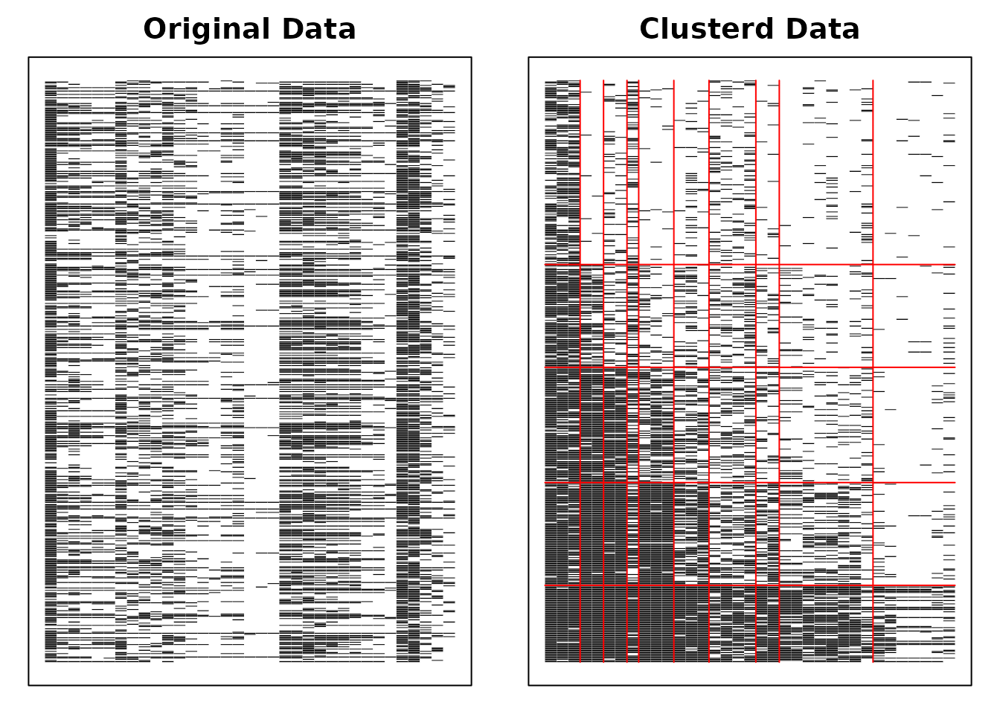

``` r
plot(result.LDB, type = "TRP")
```

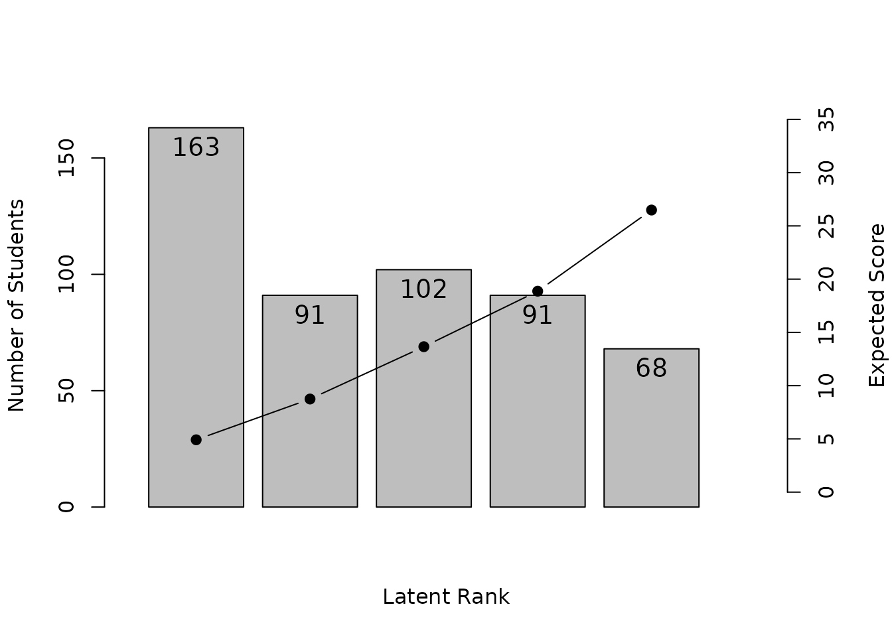

``` r
plot(result.LDB, type = "LRD")
```


``` r
plot(result.LDB, type = "RMP", students = 1:9, nc = 3, nr = 3)
```


``` r
plot(result.LDB, type = "FRP", nc = 3, nr = 2)
```


``` r
plot(result.LDB, type = "FieldPIRP")
```


### バイクラスターネットワークモデル

``` r
conf <- c(
  1, 5, 5, 5, 9, 9, 6, 6, 6, 6, 2, 7, 7, 11, 11,
  7, 7, 12, 12, 12, 2, 2, 3, 3, 4, 4, 4, 8, 8, 12,
  1, 1, 6, 10, 10
)

edges_data <- data.frame(
  "From Class (Parent) >>>" = c(1, 2, 3, 4, 5, 7, 2, 4, 6, 8, 10, 6, 6, 11, 8, 9, 12),
  ">>> To Class (Child)" = c(2, 4, 5, 5, 6, 11, 3, 7, 9, 12, 12, 10, 8, 12, 12, 11, 13),
  "At Field (Locus)" = c(1, 2, 2, 3, 4, 4, 5, 5, 5, 5, 5, 7, 8, 8, 9, 9, 12)
)

edgeFile <- tempfile(fileext = ".csv")
write.csv(edges_data, file = edgeFile, row.names = FALSE)
```

``` r
result.BINET <- BINET(
  U = J35S515, ncls = 13, nfld = 12,
  conf = conf, adj_file = edgeFile
)
print(result.BINET)
#> Total Graph
#>         Class01 Class02 Class03 Class04 Class05 Class06 Class07 Class08 Class09
#> Class01       0       1       0       0       0       0       0       0       0
#> Class02       0       0       1       1       0       0       0       0       0
#> Class03       0       0       0       0       1       0       0       0       0
#> Class04       0       0       0       0       1       0       1       0       0
#> Class05       0       0       0       0       0       1       0       0       0
#> Class06       0       0       0       0       0       0       0       1       1
#> Class07       0       0       0       0       0       0       0       0       0
#> Class08       0       0       0       0       0       0       0       0       0
#> Class09       0       0       0       0       0       0       0       0       0
#> Class10       0       0       0       0       0       0       0       0       0
#> Class11       0       0       0       0       0       0       0       0       0
#> Class12       0       0       0       0       0       0       0       0       0
#> Class13       0       0       0       0       0       0       0       0       0
#>         Class10 Class11 Class12 Class13
#> Class01       0       0       0       0
#> Class02       0       0       0       0
#> Class03       0       0       0       0
#> Class04       0       0       0       0
#> Class05       0       0       0       0
#> Class06       1       0       0       0
#> Class07       0       1       0       0
#> Class08       0       0       1       0
#> Class09       0       1       0       0
#> Class10       0       0       1       0
#> Class11       0       0       1       0
#> Class12       0       0       0       1
#> Class13       0       0       0       0
```

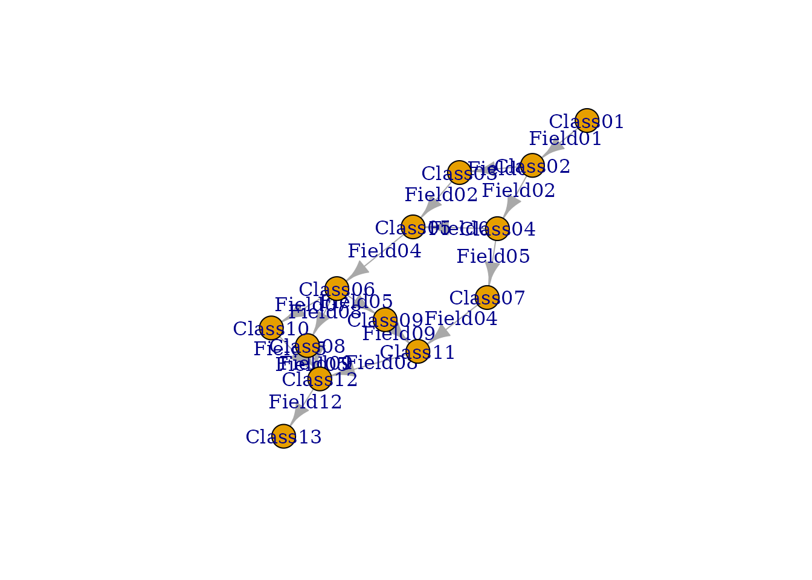

    #> Estimation of Parameter set
    #> Field 1 
    #>          PSRP 1 PSRP 2 PSRP 3 PSRP 4
    #> Class 1   0.000                     
    #> Class 2   0.554  0.558  0.649       
    #> Class 3   0.740                     
    #> Class 4   0.859                     
    #> Class 5   0.875                     
    #> Class 6   0.910                     
    #> Class 7   0.868                     
    #> Class 8   0.889                     
    #> Class 9   0.961                     
    #> Class 10  0.932                     
    #> Class 11  0.898                     
    #> Class 12  0.975                     
    #> Class 13  1.000                     
    #> Field 2 
    #>          PSRP 1 PSRP 2 PSRP 3 PSRP 4
    #> Class 1  0.0000                     
    #> Class 2  0.0090                     
    #> Class 3  0.0396                     
    #> Class 4  0.6813  0.785  0.637       
    #> Class 5  0.4040  0.728  0.696       
    #> Class 6  0.6877                     
    #> Class 7  0.8316                     
    #> Class 8  0.8218                     
    #> Class 9  1.0000                     
    #> Class 10 0.9836                     
    #> Class 11 1.0000                     
    #> Class 12 1.0000                     
    #> Class 13 1.0000                     
    #> Field 3 
    #>          PSRP 1 PSRP 2 PSRP 3 PSRP 4
    #> Class 1   0.000                     
    #> Class 2   0.177                     
    #> Class 3   0.219                     
    #> Class 4   0.206                     
    #> Class 5   0.189  0.253              
    #> Class 6   1.000                     
    #> Class 7   1.000                     
    #> Class 8   1.000                     
    #> Class 9   0.986                     
    #> Class 10  1.000                     
    #> Class 11  0.973                     
    #> Class 12  1.000                     
    #> Class 13  1.000                     
    #> Field 4 
    #>          PSRP 1 PSRP 2 PSRP 3 PSRP 4
    #> Class 1  0.0000                     
    #> Class 2  0.0127                     
    #> Class 3  0.1228                     
    #> Class 4  0.0468                     
    #> Class 5  0.1131                     
    #> Class 6  0.6131  0.436  0.179       
    #> Class 7  0.9775                     
    #> Class 8  0.9539                     
    #> Class 9  0.9751                     
    #> Class 10 0.9660                     
    #> Class 11 0.9411  0.925  0.757       
    #> Class 12 1.0000                     
    #> Class 13 1.0000                     
    #> Field 5 
    #>          PSRP 1 PSRP 2  PSRP 3 PSRP 4
    #> Class 1  0.0000                      
    #> Class 2  0.0157                      
    #> Class 3  0.0731  0.330 0.06789       
    #> Class 4  0.9626                      
    #> Class 5  0.1028                      
    #> Class 6  0.2199                      
    #> Class 7  0.1446  0.265 0.00602       
    #> Class 8  0.9403                      
    #> Class 9  0.2936  0.298 0.12080       
    #> Class 10 0.8255                      
    #> Class 11 0.9123                      
    #> Class 12 1.0000  1.000 1.00000       
    #> Class 13 1.0000                      
    #> Field 6 
    #>          PSRP 1 PSRP 2 PSRP 3 PSRP 4
    #> Class 1   0.000                     
    #> Class 2   0.236                     
    #> Class 3   0.275                     
    #> Class 4   0.449                     
    #> Class 5   0.414                     
    #> Class 6   0.302                     
    #> Class 7   0.415                     
    #> Class 8   0.469                     
    #> Class 9   0.560                     
    #> Class 10  0.564                     
    #> Class 11  0.614                     
    #> Class 12  0.764                     
    #> Class 13  1.000                     
    #> Field 7 
    #>          PSRP 1 PSRP 2 PSRP 3 PSRP 4
    #> Class 1  0.0000                     
    #> Class 2  0.0731                     
    #> Class 3  0.0810                     
    #> Class 4  0.1924                     
    #> Class 5  0.1596                     
    #> Class 6  0.1316                     
    #> Class 7  0.1263                     
    #> Class 8  0.1792                     
    #> Class 9  0.7542                     
    #> Class 10 0.9818  0.883  0.933  0.975
    #> Class 11 0.3047                     
    #> Class 12 0.7862                     
    #> Class 13 1.0000                     
    #> Field 8 
    #>            PSRP 1 PSRP 2 PSRP 3 PSRP 4
    #> Class 1  0.00e+00                     
    #> Class 2  9.83e-05                     
    #> Class 3  3.70e-02                     
    #> Class 4  3.91e-02                     
    #> Class 5  4.21e-02                     
    #> Class 6  6.88e-02                     
    #> Class 7  4.56e-01                     
    #> Class 8  1.65e-01  0.192              
    #> Class 9  6.15e-01                     
    #> Class 10 3.88e-01                     
    #> Class 11 3.16e-01                     
    #> Class 12 1.00e+00  1.000              
    #> Class 13 1.00e+00                     
    #> Field 9 
    #>            PSRP 1 PSRP 2 PSRP 3 PSRP 4
    #> Class 1  0.00e+00                     
    #> Class 2  2.47e-16                     
    #> Class 3  1.61e-02                     
    #> Class 4  6.15e-01                     
    #> Class 5  3.46e-02                     
    #> Class 6  5.26e-02                     
    #> Class 7  1.44e-11                     
    #> Class 8  2.09e-01                     
    #> Class 9  9.51e-18                     
    #> Class 10 8.09e-01                     
    #> Class 11 1.00e+00  1.000              
    #> Class 12 7.81e-01  0.703              
    #> Class 13 1.00e+00                     
    #> Field 10 
    #>          PSRP 1 PSRP 2 PSRP 3 PSRP 4
    #> Class 1  0.0000                     
    #> Class 2  0.0952                     
    #> Class 3  0.1798                     
    #> Class 4  0.1741                     
    #> Class 5  0.1594                     
    #> Class 6  0.1789                     
    #> Class 7  0.1208                     
    #> Class 8  0.1550                     
    #> Class 9  0.2228                     
    #> Class 10 0.2602                     
    #> Class 11 0.1724                     
    #> Class 12 0.3109                     
    #> Class 13 1.0000                     
    #> Field 11 
    #>            PSRP 1 PSRP 2 PSRP 3 PSRP 4
    #> Class 1  0.00e+00                     
    #> Class 2  6.09e-14                     
    #> Class 3  8.84e-07                     
    #> Class 4  8.14e-02                     
    #> Class 5  2.46e-02                     
    #> Class 6  2.13e-02                     
    #> Class 7  2.56e-02                     
    #> Class 8  2.76e-16                     
    #> Class 9  2.44e-01                     
    #> Class 10 4.30e-01                     
    #> Class 11 3.84e-02                     
    #> Class 12 5.86e-01                     
    #> Class 13 1.00e+00                     
    #> Field 12 
    #>            PSRP 1 PSRP 2 PSRP 3 PSRP 4
    #> Class 1  0.00e+00                     
    #> Class 2  2.35e-03                     
    #> Class 3  5.57e-02                     
    #> Class 4  0.00e+00                     
    #> Class 5  2.02e-02                     
    #> Class 6  1.67e-02                     
    #> Class 7  1.93e-02                     
    #> Class 8  4.62e-02                     
    #> Class 9  1.85e-02                     
    #> Class 10 2.54e-02                     
    #> Class 11 5.68e-15                     
    #> Class 12 2.26e-01                     
    #> Class 13 1.00e+00      1      1      1
    #> Local Dependence Passing Student Rate
    #>     Field Field Item 1 Field Item 2 Field Item 3 Field Item 4 Parent Class
    #> 1   1.000       Item01       Item31       Item32                     1.000
    #> 2   2.000       Item11       Item21       Item22                     2.000
    #> 3   2.000       Item11       Item21       Item22                     3.000
    #> 4   3.000       Item23       Item24                                  4.000
    #> 5   4.000       Item25       Item26       Item27                     5.000
    #> 6   4.000       Item25       Item26       Item27                     7.000
    #> 7   5.000       Item02       Item03       Item04                     2.000
    #> 8   5.000       Item02       Item03       Item04                     4.000
    #> 9   5.000       Item02       Item03       Item04                     6.000
    #> 10  5.000       Item02       Item03       Item04                     8.000
    #> 11  5.000       Item02       Item03       Item04                    10.000
    #> 12  7.000       Item12       Item13       Item16       Item17        6.000
    #> 13  8.000       Item28       Item29                                  6.000
    #> 14  8.000       Item28       Item29                                 11.000
    #> 15  9.000       Item05       Item06                                  8.000
    #> 16  9.000       Item05       Item06                                  9.000
    #> 17 12.000       Item18       Item19       Item20       Item30       12.000
    #>    Parent CCR 1 Parent CCR 2 Parent CCR 3 Parent CCR 4 Child Class Child CCR 1
    #> 1         0.000        0.000        0.000                    2.000       0.554
    #> 2         0.005        0.018        0.003                    4.000       0.681
    #> 3         0.034        0.068        0.016                    5.000       0.404
    #> 4         0.221        0.190                                 5.000       0.189
    #> 5         0.147        0.050        0.142                    6.000       0.613
    #> 6         0.999        0.991        0.943                   11.000       0.941
    #> 7         0.005        0.040        0.002                    3.000       0.073
    #> 8         0.996        0.998        0.893                    7.000       0.145
    #> 9         0.263        0.334        0.063                    9.000       0.294
    #> 10        0.980        0.958        0.882                   12.000       1.000
    #> 11        0.943        0.800        0.733                   12.000       1.000
    #> 12        0.181        0.146        0.037        0.162      10.000       0.982
    #> 13        0.009        0.129                                 8.000       0.165
    #> 14        0.359        0.273                                12.000       1.000
    #> 15        0.266        0.152                                12.000       0.781
    #> 16        0.000        0.000                                11.000       1.000
    #> 17        0.158        0.178        0.217        0.352      13.000       1.000
    #>    Child CCR 2 Child CCR 3 Child CCR 4
    #> 1        0.558       0.649            
    #> 2        0.785       0.637            
    #> 3        0.728       0.696            
    #> 4        0.253                        
    #> 5        0.436       0.179            
    #> 6        0.925       0.757            
    #> 7        0.330       0.068            
    #> 8        0.265       0.006            
    #> 9        0.298       0.121            
    #> 10       1.000       1.000            
    #> 11       1.000       1.000            
    #> 12       0.883       0.933       0.975
    #> 13       0.192                        
    #> 14       1.000                        
    #> 15       0.703                        
    #> 16       1.000                        
    #> 17       1.000       1.000       1.000
    #> Marginal Bicluster Reference Matrix
    #>         Class1 Class2 Class3 Class4 Class5 Class6 Class7 Class8 Class9 Class10
    #> Field1       0  0.587  0.740  0.859  0.875  0.910  0.868  0.889  0.961   0.932
    #> Field2       0  0.009  0.040  0.701  0.609  0.688  0.832  0.822  1.000   0.984
    #> Field3       0  0.177  0.219  0.206  0.221  1.000  1.000  1.000  0.986   1.000
    #> Field4       0  0.013  0.123  0.047  0.113  0.410  0.978  0.954  0.975   0.966
    #> Field5       0  0.016  0.157  0.963  0.103  0.220  0.138  0.940  0.237   0.825
    #> Field6       0  0.236  0.275  0.449  0.414  0.302  0.415  0.469  0.560   0.564
    #> Field7       0  0.073  0.081  0.192  0.160  0.132  0.126  0.179  0.754   0.943
    #> Field8       0  0.000  0.037  0.039  0.042  0.069  0.456  0.179  0.615   0.388
    #> Field9       0  0.000  0.016  0.615  0.035  0.053  0.000  0.209  0.000   0.809
    #> Field10      0  0.095  0.180  0.174  0.159  0.179  0.121  0.155  0.223   0.260
    #> Field11      0  0.000  0.000  0.081  0.025  0.021  0.026  0.000  0.244   0.430
    #> Field12      0  0.002  0.056  0.000  0.020  0.017  0.019  0.046  0.019   0.025
    #>         Class11 Class12 Class13
    #> Field1    0.898   0.975       1
    #> Field2    1.000   1.000       1
    #> Field3    0.973   1.000       1
    #> Field4    0.874   1.000       1
    #> Field5    0.912   1.000       1
    #> Field6    0.614   0.764       1
    #> Field7    0.305   0.786       1
    #> Field8    0.316   1.000       1
    #> Field9    1.000   0.742       1
    #> Field10   0.172   0.311       1
    #> Field11   0.038   0.586       1
    #> Field12   0.000   0.226       1
    #>                               Class 1 Class 2 Class 3 Class 4 Class 5 Class 6
    #> Test Reference Profile          0.000   3.900   6.001  12.951   8.853  11.428
    #> Latent Class Ditribution        2.000  95.000  73.000  37.000  60.000  44.000
    #> Class Membership Dsitribution   1.987  82.567  86.281  37.258  60.781  43.222
    #>                               Class 7 Class 8 Class 9 Class 10 Class 11
    #> Test Reference Profile         14.305  17.148  19.544   23.589   20.343
    #> Latent Class Ditribution       43.000  30.000  34.000   18.000   37.000
    #> Class Membership Dsitribution  43.062  30.087  34.435   20.063   34.811
    #>                               Class 12 Class 13
    #> Test Reference Profile          27.076       35
    #> Latent Class Ditribution        27.000       15
    #> Class Membership Dsitribution   25.445       15
    #> 
    #> Model Fit Indices
    #>                Multigroup Model Saturated Moodel
    #> model_log_like -5786.942        -5786.942       
    #> bench_log_like -5891.314        0               
    #> null_log_like  -9862.114        -9862.114       
    #> model_Chi_sq   -208.744         11573.88        
    #> null_Chi_sq    7941.601         19724.23        
    #> model_df       1005             16895           
    #> null_df        1155             17045           
    #> NFI            1                0.4132149       
    #> RFI            1                0.4080052       
    #> IFI            1                1               
    #> TLI            1                1               
    #> CFI            1                1               
    #> RMSEA          0                0               
    #> AIC            -2218.744        -22216.12       
    #> CAIC           -7489.132        -110816.3       
    #> BIC            -6484.132        -93921.32

``` r
plot(result.BINET, type = "Array")
```

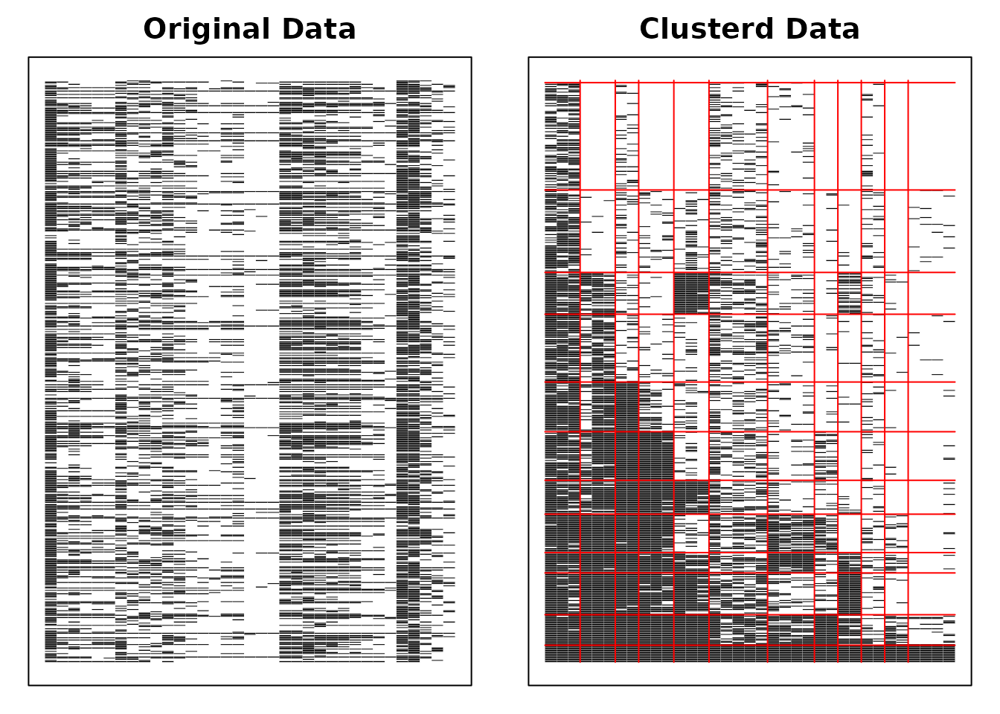

``` r
plot(result.BINET, type = "TRP")
```

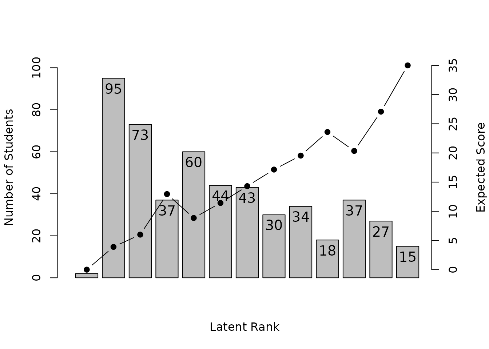

``` r
plot(result.BINET, type = "LRD")
```

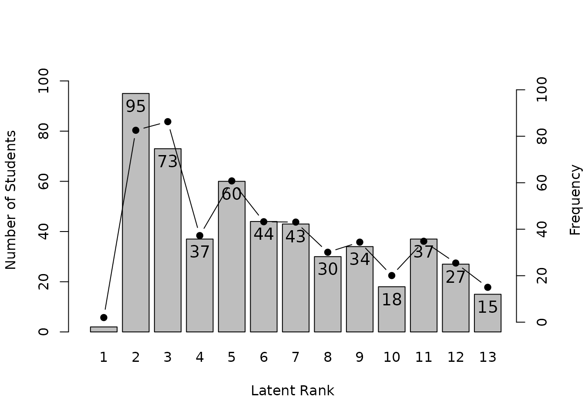

``` r
plot(result.BINET, type = "RMP", students = 1:9, nc = 3, nr = 3)
```


``` r
plot(result.BINET, type = "FRP", nc = 3, nr = 2)
```


``` r
plot(result.BINET, type = "LDPSR", nc = 3, nr = 2)
```

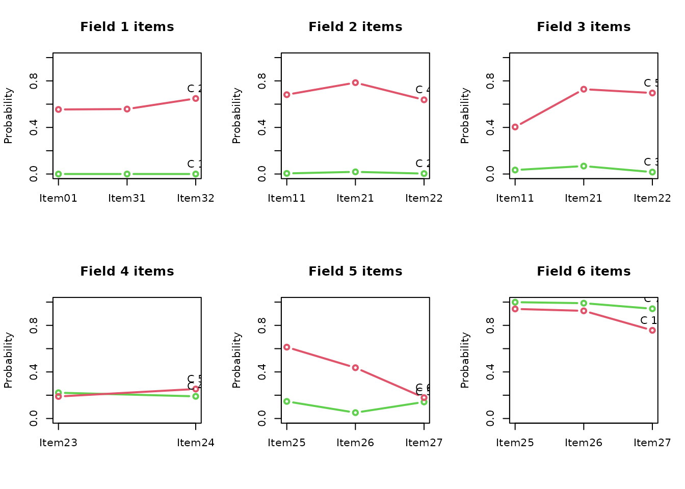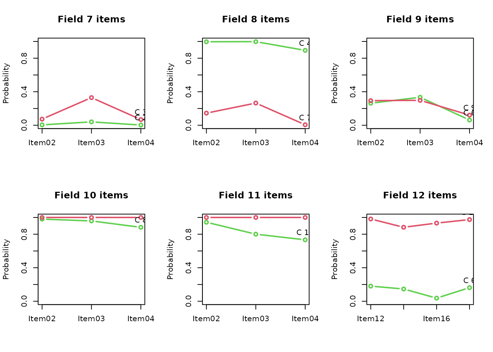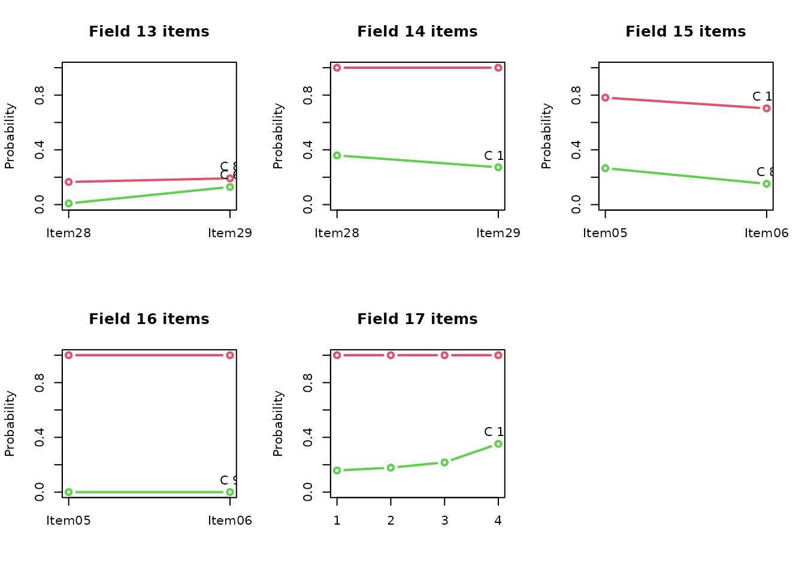

## 参考文献

Shojima, K. (2022) *Test Data Engineering: Latent Rank Analysis,
Biclustering, and Bayesian Network* (Behaviormetrics: Quantitative
Approaches to Human Behavior, 13), Springer.
