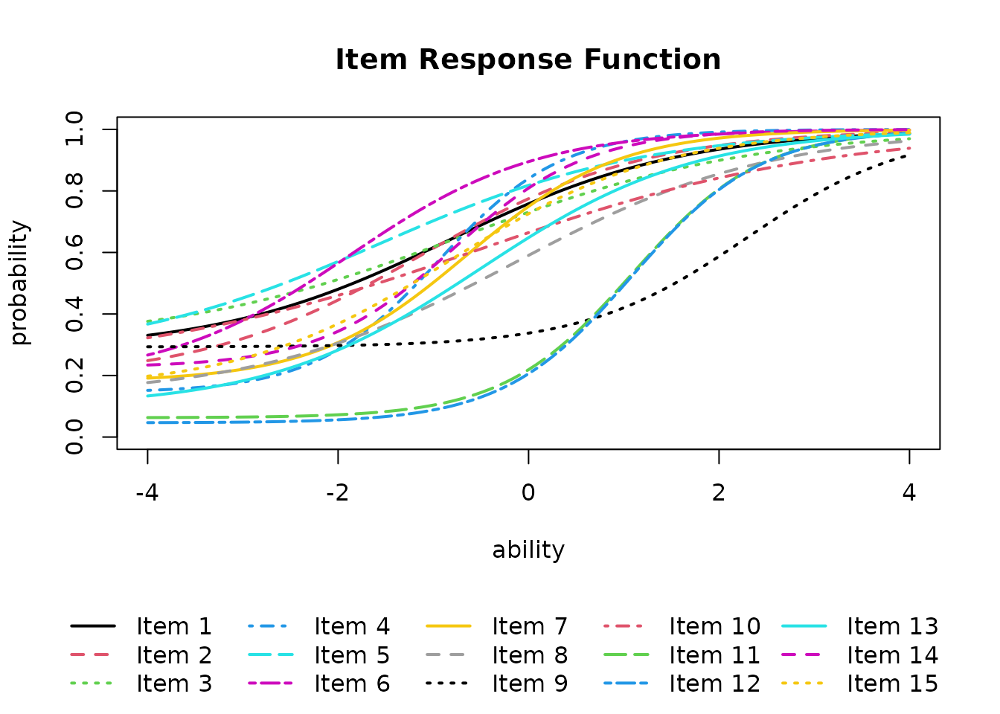
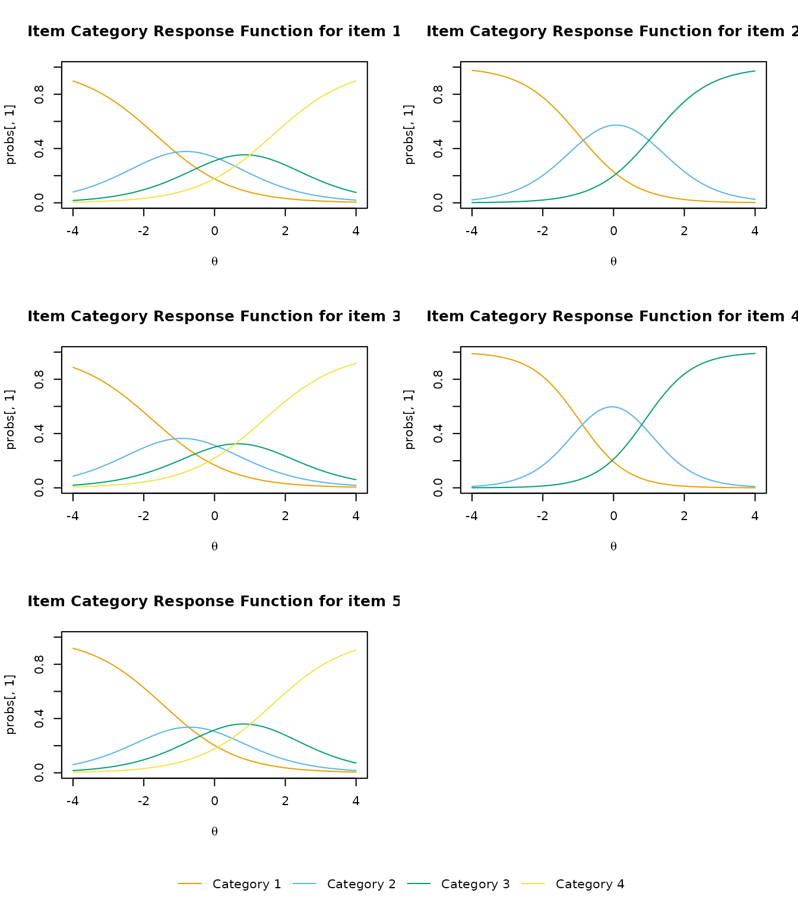

# Item Response Theory (IRT)

``` r
library(exametrika)
```

## IRT for Binary Data

The [`IRT()`](https://kosugitti.github.io/exametrika/reference/IRT.md)
function estimates item parameters using logistic models. It supports
2PL, 3PL, and 4PL models via the `model` option.

``` r
result.IRT <- IRT(J15S500, model = 3)
result.IRT
#> Item Parameters
#>        slope location lowerAsym PSD(slope) PSD(location) PSD(lowerAsym)
#> Item01 0.818   -0.834    0.2804      0.182         0.628         0.1702
#> Item02 0.860   -1.119    0.1852      0.157         0.471         0.1488
#> Item03 0.657   -0.699    0.3048      0.162         0.798         0.1728
#> Item04 1.550   -0.949    0.1442      0.227         0.216         0.1044
#> Item05 0.721   -1.558    0.2584      0.148         0.700         0.1860
#> Item06 1.022   -1.876    0.1827      0.171         0.423         0.1577
#> Item07 1.255   -0.655    0.1793      0.214         0.289         0.1165
#> Item08 0.748   -0.155    0.1308      0.148         0.394         0.1077
#> Item09 1.178    2.287    0.2930      0.493         0.423         0.0440
#> Item10 0.546   -0.505    0.2221      0.131         0.779         0.1562
#> Item11 1.477    1.090    0.0628      0.263         0.120         0.0321
#> Item12 1.479    1.085    0.0462      0.245         0.115         0.0276
#> Item13 0.898   -0.502    0.0960      0.142         0.272         0.0858
#> Item14 1.418   -0.788    0.2260      0.248         0.291         0.1252
#> Item15 0.908   -0.812    0.1531      0.159         0.383         0.1254
#> 
#> Item Fit Indices
#>        model_log_like bench_log_like null_log_like model_Chi_sq null_Chi_sq
#> Item01       -262.979       -240.190      -283.343       45.578      86.307
#> Item02       -253.405       -235.436      -278.949       35.937      87.025
#> Item03       -280.640       -260.906      -293.598       39.468      65.383
#> Item04       -204.884       -192.072      -265.962       25.623     147.780
#> Item05       -232.135       -206.537      -247.403       51.196      81.732
#> Item06       -173.669       -153.940      -198.817       39.459      89.755
#> Item07       -250.905       -228.379      -298.345       45.053     139.933
#> Item08       -314.781       -293.225      -338.789       43.111      91.127
#> Item09       -321.920       -300.492      -327.842       42.856      54.700
#> Item10       -309.318       -288.198      -319.850       42.240      63.303
#> Item11       -248.409       -224.085      -299.265       48.647     150.360
#> Item12       -238.877       -214.797      -293.598       48.160     157.603
#> Item13       -293.472       -262.031      -328.396       62.882     132.730
#> Item14       -223.473       -204.953      -273.212       37.040     136.519
#> Item15       -271.903       -254.764      -302.847       34.279      96.166
#>        model_df null_df   NFI   RFI   IFI   TLI   CFI RMSEA    AIC    CAIC
#> Item01       11      13 0.472 0.376 0.541 0.443 0.528 0.079 23.578 -33.783
#> Item02       11      13 0.587 0.512 0.672 0.602 0.663 0.067 13.937 -43.424
#> Item03       11      13 0.396 0.287 0.477 0.358 0.457 0.072 17.468 -39.893
#> Item04       11      13 0.827 0.795 0.893 0.872 0.892 0.052  3.623 -53.737
#> Item05       11      13 0.374 0.260 0.432 0.309 0.415 0.086 29.196 -28.164
#> Item06       11      13 0.560 0.480 0.639 0.562 0.629 0.072 17.459 -39.902
#> Item07       11      13 0.678 0.620 0.736 0.683 0.732 0.079 23.053 -34.308
#> Item08       11      13 0.527 0.441 0.599 0.514 0.589 0.076 21.111 -36.250
#> Item09       11      13 0.217 0.074 0.271 0.097 0.236 0.076 20.856 -36.505
#> Item10       11      13 0.333 0.211 0.403 0.266 0.379 0.075 20.240 -37.121
#> Item11       11      13 0.676 0.618 0.730 0.676 0.726 0.083 26.647 -30.713
#> Item12       11      13 0.694 0.639 0.747 0.696 0.743 0.082 26.160 -31.200
#> Item13       11      13 0.526 0.440 0.574 0.488 0.567 0.097 40.882 -16.479
#> Item14       11      13 0.729 0.679 0.793 0.751 0.789 0.069 15.040 -42.321
#> Item15       11      13 0.644 0.579 0.727 0.669 0.720 0.065 12.279 -45.082
#>            BIC
#> Item01 -22.783
#> Item02 -32.424
#> Item03 -28.893
#> Item04 -42.737
#> Item05 -17.164
#> Item06 -28.902
#> Item07 -23.308
#> Item08 -25.250
#> Item09 -25.505
#> Item10 -26.121
#> Item11 -19.713
#> Item12 -20.200
#> Item13  -5.479
#> Item14 -31.321
#> Item15 -34.082
#> 
#> Model Fit Indices
#>                    value
#> model_log_like -3880.769
#> bench_log_like -3560.005
#> null_log_like  -4350.217
#> model_Chi_sq     641.528
#> null_Chi_sq     1580.424
#> model_df         165.000
#> null_df          195.000
#> NFI                0.594
#> RFI                0.520
#> IFI                0.663
#> TLI                0.594
#> CFI                0.656
#> RMSEA              0.076
#> AIC              311.528
#> CAIC            -548.882
#> BIC             -383.882
```

The estimated ability parameters for each examinee are included in the
returned object:

``` r
head(result.IRT$ability)
#>           ID         EAP       PSD
#> 1 Student001 -0.75526633 0.5805696
#> 2 Student002 -0.17398724 0.5473604
#> 3 Student003  0.01382331 0.5530501
#> 4 Student004  0.57628203 0.5749113
#> 5 Student005 -0.97449549 0.5915605
#> 6 Student006  0.85232920 0.5820541
```

### Plot Types

IRT provides several plot types:

- **IRF**: Item Response Function (Item Characteristic Curves)
- **IIC**: Item Information Curves
- **TRF**: Test Response Function
- **TIC**: Test Information Curve

Items can be specified using the `items` argument. The layout is
controlled by `nr` (rows) and `nc` (columns).

``` r
plot(result.IRT, type = "IRF", items = 1:6, nc = 2, nr = 3)
```


``` r
plot(result.IRT, type = "IRF", overlay = TRUE)
```



``` r
plot(result.IRT, type = "IIC", items = 1:6, nc = 2, nr = 3)
```


``` r
plot(result.IRT, type = "TRF")
```


``` r
plot(result.IRT, type = "TIC")
```


## GRM: Graded Response Model

The Graded Response Model (Samejima, 1969) extends IRT to polytomous
response data. It can be applied using the
[`GRM()`](https://kosugitti.github.io/exametrika/reference/GRM.md)
function.

``` r
result.GRM <- GRM(J5S1000)
#> Parameters: 18 | Initial LL: -6252.352 
#> initial  value 6252.351598 
#> iter  10 value 6032.463982
#> iter  20 value 6010.861094
#> final  value 6008.297278 
#> converged
result.GRM
#> Item Parameter
#>    Slope Threshold1 Threshold2 Threshold3
#> V1 0.928     -1.662     0.0551       1.65
#> V2 1.234     -0.984     1.1297         NA
#> V3 0.917     -1.747    -0.0826       1.39
#> V4 1.479     -0.971     0.8901         NA
#> V5 0.947     -1.449     0.0302       1.62
#> 
#> Item Fit Indices
#>    model_log_like bench_log_like null_log_like model_Chi_sq null_Chi_sq
#> V1      -1297.780      -1086.461     -1363.667      422.638     554.411
#> V2       -947.222       -840.063     -1048.636      214.317     417.145
#> V3      -1307.044      -1096.756     -1373.799      420.575     554.085
#> V4       -936.169       -819.597     -1062.099      233.142     485.003
#> V5      -1308.149      -1096.132     -1377.883      424.033     563.502
#>    model_df null_df   NFI   RFI   IFI   TLI   CFI RMSEA     AIC    CAIC     BIC
#> V1       46      45 0.238 0.254 0.259 0.277 0.261 0.091 330.638  58.881 104.881
#> V2       31      30 0.486 0.503 0.525 0.542 0.526 0.077 152.317 -30.823   0.177
#> V3       46      45 0.241 0.257 0.263 0.280 0.264 0.090 328.575  56.819 102.819
#> V4       31      30 0.519 0.535 0.555 0.570 0.556 0.081 171.142 -11.998  19.002
#> V5       46      45 0.248 0.264 0.270 0.287 0.271 0.091 332.033  60.277 106.277
#> 
#> Model Fit Indices
#>                    value
#> model_log_like -5796.363
#> bench_log_like -4939.010
#> null_log_like  -6226.083
#> model_Chi_sq    1714.706
#> null_Chi_sq     2574.146
#> model_df         200.000
#> null_df          195.000
#> NFI                0.334
#> RFI                0.351
#> IFI                0.362
#> TLI                0.379
#> CFI                0.363
#> RMSEA              0.087
#> AIC             1314.706
#> CAIC             133.155
#> BIC              333.155
```

GRM supports similar plot types as IRT:

``` r
plot(result.GRM, type = "IRF", nc = 2)
```



``` r
plot(result.GRM, type = "IIF", nc = 2)
```


``` r
plot(result.GRM, type = "TIF")
```


## References

- Shojima, K. (2022). *Test Data Engineering*. Springer.
- Samejima, F. (1969). Estimation of latent ability using a response
  pattern of graded scores. *Psychometrika*, 34(S1), 1–97.
