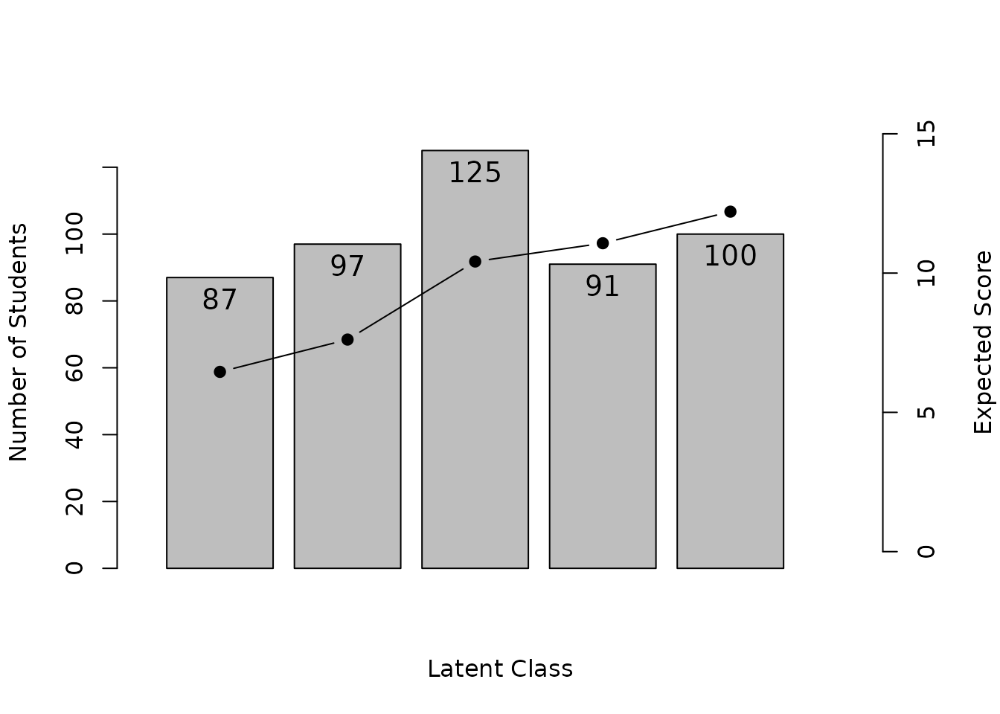
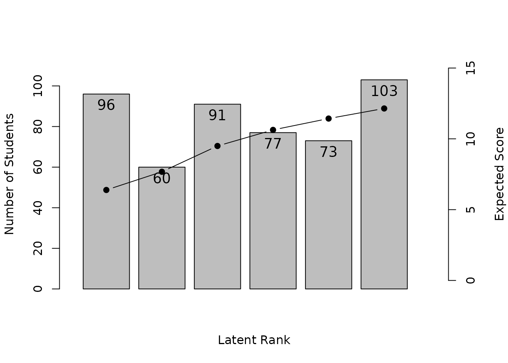
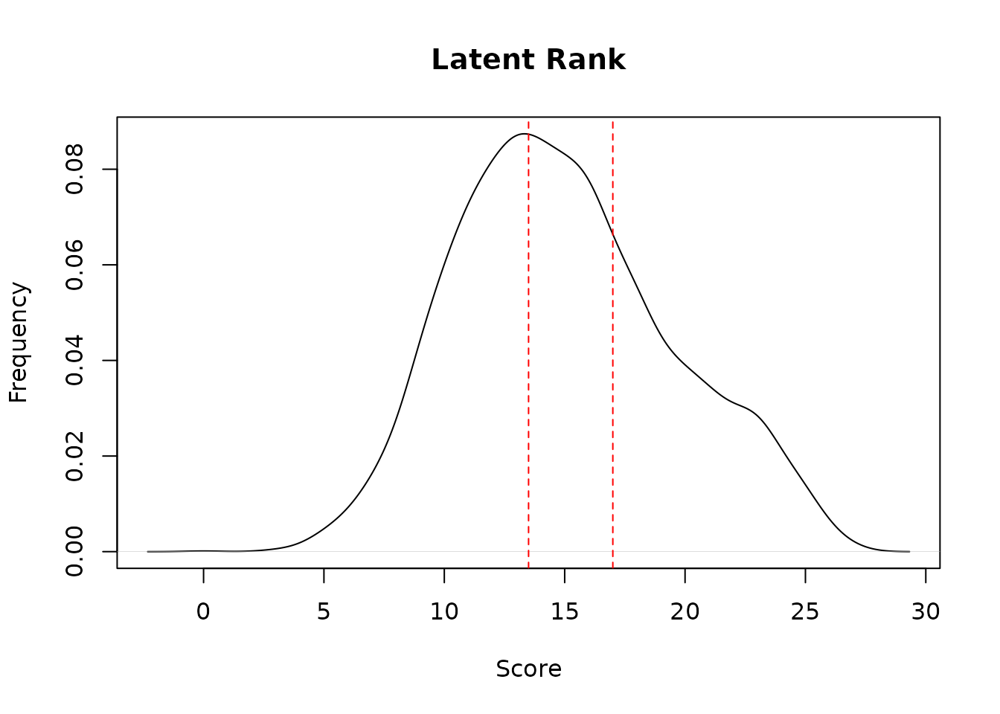
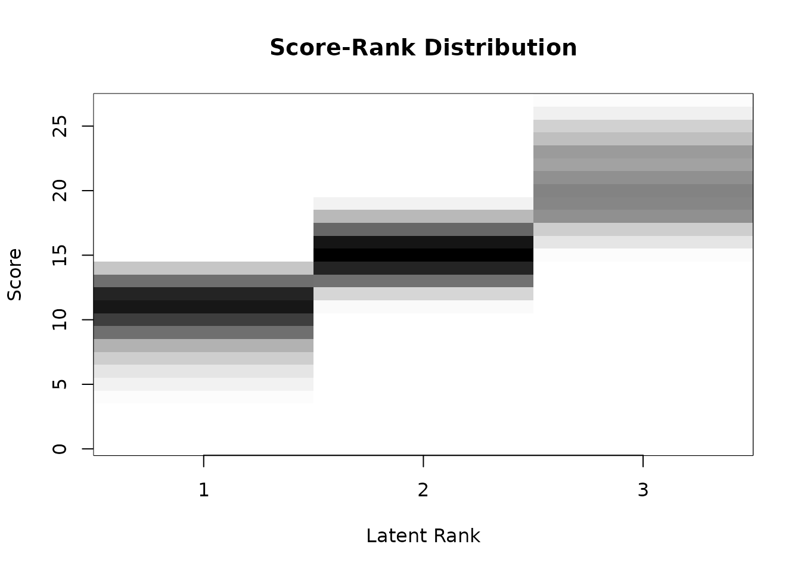
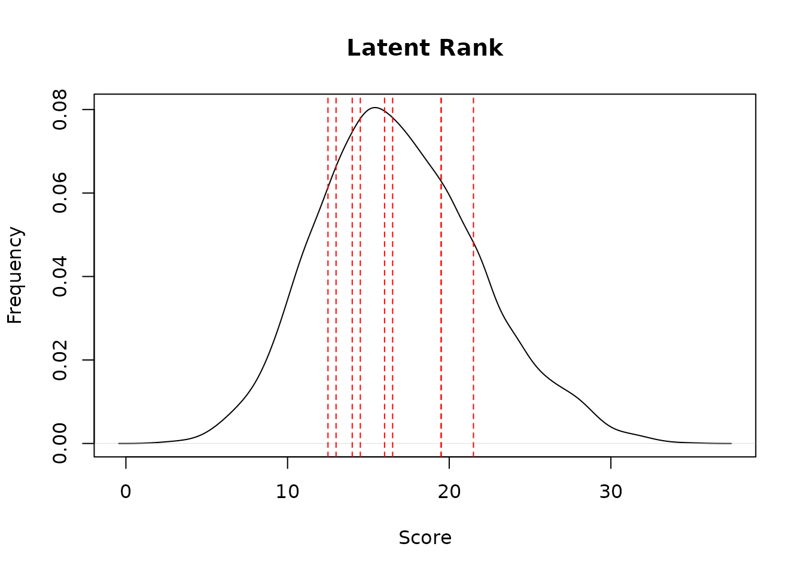
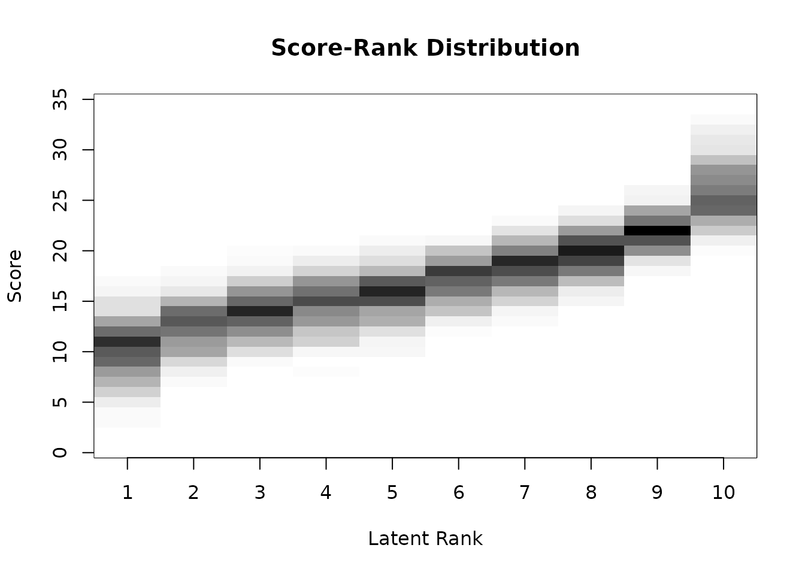

# Latent Class and Rank Analysis

``` r
library(exametrika)
```

## Latent Class Analysis (LCA)

LCA classifies examinees into unordered latent classes. Specify the
dataset and the number of classes.

``` r
LCA(J15S500, ncls = 5)
#> 
#> Item Reference Profile
#>          IRP1   IRP2    IRP3  IRP4  IRP5
#> Item01 0.5185 0.6996 0.76358 0.856 0.860
#> Item02 0.5529 0.6276 0.81161 0.888 0.855
#> Item03 0.7959 0.3205 0.93735 0.706 0.849
#> Item04 0.5069 0.5814 0.86940 0.873 1.000
#> Item05 0.6154 0.7523 0.94673 0.789 0.886
#> Item06 0.6840 0.7501 0.94822 1.000 0.907
#> Item07 0.4832 0.4395 0.83377 0.874 0.900
#> Item08 0.3767 0.3982 0.62563 0.912 0.590
#> Item09 0.3107 0.3980 0.26616 0.165 0.673
#> Item10 0.5290 0.5341 0.76134 0.677 0.781
#> Item11 0.1007 0.0497 0.00132 0.621 0.623
#> Item12 0.0355 0.1673 0.15911 0.296 0.673
#> Item13 0.2048 0.5490 0.89445 0.672 0.784
#> Item14 0.3508 0.7384 0.77159 0.904 1.000
#> Item15 0.3883 0.6077 0.82517 0.838 0.823
#> 
#> Test Profile
#>                               Class 1 Class 2 Class 3 Class 4 Class 5
#> Test Reference Profile          6.453   7.613  10.415  11.072  12.205
#> Latent Class Ditribution       87.000  97.000 125.000  91.000 100.000
#> Class Membership Distribution  90.372  97.105 105.238 102.800 104.484
#> 
#> Item Fit Indices
#>        model_log_like bench_log_like null_log_like model_Chi_sq null_Chi_sq
#> Item01       -264.179       -240.190      -283.343       47.978      86.307
#> Item02       -256.363       -235.436      -278.949       41.853      87.025
#> Item03       -237.888       -260.906      -293.598      -46.037      65.383
#> Item04       -208.536       -192.072      -265.962       32.928     147.780
#> Item05       -226.447       -206.537      -247.403       39.819      81.732
#> Item06       -164.762       -153.940      -198.817       21.644      89.755
#> Item07       -249.377       -228.379      -298.345       41.997     139.933
#> Item08       -295.967       -293.225      -338.789        5.483      91.127
#> Item09       -294.250       -300.492      -327.842      -12.484      54.700
#> Item10       -306.985       -288.198      -319.850       37.574      63.303
#> Item11       -187.202       -224.085      -299.265      -73.767     150.360
#> Item12       -232.307       -214.797      -293.598       35.020     157.603
#> Item13       -267.647       -262.031      -328.396       11.232     132.730
#> Item14       -203.468       -204.953      -273.212       -2.969     136.519
#> Item15       -268.616       -254.764      -302.847       27.705      96.166
#>        model_df null_df   NFI   RFI   IFI   TLI   CFI RMSEA     AIC     CAIC
#> Item01        9      13 0.444 0.197 0.496 0.232 0.468 0.093  29.978  -16.954
#> Item02        9      13 0.519 0.305 0.579 0.359 0.556 0.086  23.853  -23.079
#> Item03        9      13 1.000 1.000 1.000 1.000 1.000 0.000 -64.037 -110.969
#> Item04        9      13 0.777 0.678 0.828 0.744 0.822 0.073  14.928  -32.004
#> Item05        9      13 0.513 0.296 0.576 0.352 0.552 0.083  21.819  -25.112
#> Item06        9      13 0.759 0.652 0.843 0.762 0.835 0.053   3.644  -43.287
#> Item07        9      13 0.700 0.566 0.748 0.625 0.740 0.086  23.997  -22.934
#> Item08        9      13 0.940 0.913 1.000 1.000 1.000 0.000 -12.517  -59.448
#> Item09        9      13 1.000 1.000 1.000 1.000 1.000 0.000 -30.484  -77.415
#> Item10        9      13 0.406 0.143 0.474 0.179 0.432 0.080  19.574  -27.357
#> Item11        9      13 1.000 1.000 1.000 1.000 1.000 0.000 -91.767 -138.698
#> Item12        9      13 0.778 0.679 0.825 0.740 0.820 0.076  17.020  -29.912
#> Item13        9      13 0.915 0.878 0.982 0.973 0.981 0.022  -6.768  -53.699
#> Item14        9      13 1.000 1.000 1.000 1.000 1.000 0.000 -20.969  -67.901
#> Item15        9      13 0.712 0.584 0.785 0.675 0.775 0.065   9.705  -37.226
#>             BIC
#> Item01   -7.954
#> Item02  -14.079
#> Item03 -101.969
#> Item04  -23.004
#> Item05  -16.112
#> Item06  -34.287
#> Item07  -13.934
#> Item08  -50.448
#> Item09  -68.415
#> Item10  -18.357
#> Item11 -129.698
#> Item12  -20.912
#> Item13  -44.699
#> Item14  -58.901
#> Item15  -28.226
#> 
#> Model Fit Indices
#> Number of Latent class: 5
#> Number of EM cycle: 73 
#>                    value
#> model_log_like -3663.994
#> bench_log_like -3560.005
#> null_log_like  -4350.217
#> model_Chi_sq     207.977
#> null_Chi_sq     1580.424
#> model_df         135.000
#> null_df          195.000
#> NFI                0.868
#> RFI                0.810
#> IFI                0.950
#> TLI                0.924
#> CFI                0.947
#> RMSEA              0.033
#> AIC              -62.023
#> CAIC            -765.995
#> BIC             -630.995
```

The Class Membership Matrix indicates which latent class each examinee
belongs to:

``` r
result.LCA <- LCA(J15S500, ncls = 5)
head(result.LCA$Students)
#>            Membership 1 Membership 2 Membership 3 Membership 4 Membership 5
#> Student001 0.7839477684  0.171152798  0.004141844 4.075759e-02 3.744590e-12
#> Student002 0.0347378747  0.051502214  0.836022799 7.773694e-02 1.698776e-07
#> Student003 0.0146307878  0.105488644  0.801853496 3.343026e-02 4.459682e-02
#> Student004 0.0017251650  0.023436459  0.329648386 3.656488e-01 2.795412e-01
#> Student005 0.2133830569  0.784162066  0.001484616 2.492073e-08 9.702355e-04
#> Student006 0.0003846482  0.001141448  0.001288901 8.733869e-01 1.237981e-01
#>            Estimate
#> Student001        1
#> Student002        3
#> Student003        3
#> Student004        4
#> Student005        2
#> Student006        4
```

### LCA Plot Types

- **IRP**: Item Reference Profile
- **CMP**: Class Membership Profile
- **TRP**: Test Reference Profile
- **LCD**: Latent Class Distribution

``` r
plot(result.LCA, type = "IRP", items = 1:6, nc = 2, nr = 3)
```


``` r
plot(result.LCA, type = "CMP", students = 1:9, nc = 3, nr = 3)
```


``` r
plot(result.LCA, type = "TRP")
```



``` r
plot(result.LCA, type = "LCD")
```


## Latent Rank Analysis (LRA)

LRA is similar to LCA but assumes an ordering among the latent classes
(ranks). Specify the dataset and the number of ranks.

``` r
LRA(J15S500, nrank = 6)
#> estimating method is  GTM 
#> Item Reference Profile
#>          IRP1   IRP2  IRP3  IRP4  IRP5  IRP6
#> Item01 0.5851 0.6319 0.708 0.787 0.853 0.898
#> Item02 0.5247 0.6290 0.755 0.845 0.883 0.875
#> Item03 0.6134 0.6095 0.708 0.773 0.801 0.839
#> Item04 0.4406 0.6073 0.794 0.882 0.939 0.976
#> Item05 0.6465 0.7452 0.821 0.837 0.862 0.905
#> Item06 0.6471 0.7748 0.911 0.967 0.963 0.915
#> Item07 0.4090 0.5177 0.720 0.840 0.890 0.900
#> Item08 0.3375 0.4292 0.602 0.713 0.735 0.698
#> Item09 0.3523 0.3199 0.298 0.282 0.377 0.542
#> Item10 0.4996 0.5793 0.686 0.729 0.717 0.753
#> Item11 0.0958 0.0793 0.136 0.286 0.472 0.617
#> Item12 0.0648 0.0982 0.156 0.239 0.421 0.636
#> Item13 0.2908 0.4842 0.715 0.773 0.750 0.778
#> Item14 0.4835 0.5949 0.729 0.849 0.933 0.977
#> Item15 0.3981 0.5745 0.756 0.827 0.835 0.834
#> 
#> Item Reference Profile Indices
#>        Alpha      A Beta     B Gamma        C
#> Item01     3 0.0786    1 0.585   0.0  0.00000
#> Item02     2 0.1264    1 0.525   0.2 -0.00787
#> Item03     2 0.0987    2 0.610   0.2 -0.00391
#> Item04     2 0.1864    1 0.441   0.0  0.00000
#> Item05     1 0.0987    1 0.647   0.0  0.00000
#> Item06     2 0.1362    1 0.647   0.4 -0.05198
#> Item07     2 0.2028    2 0.518   0.0  0.00000
#> Item08     2 0.1731    2 0.429   0.2 -0.03676
#> Item09     5 0.1646    6 0.542   0.6 -0.07002
#> Item10     2 0.1069    1 0.500   0.2 -0.01244
#> Item11     4 0.1867    5 0.472   0.2 -0.01650
#> Item12     5 0.2146    5 0.421   0.0  0.00000
#> Item13     2 0.2310    2 0.484   0.2 -0.02341
#> Item14     2 0.1336    1 0.484   0.0  0.00000
#> Item15     2 0.1817    2 0.574   0.2 -0.00123
#> 
#> Test Profile
#>                              Rank 1 Rank 2 Rank 3 Rank 4 Rank 5  Rank 6
#> Test Reference Profile        6.389  7.675  9.496 10.631 11.432  12.144
#> Latent Rank Ditribution      96.000 60.000 91.000 77.000 73.000 103.000
#> Rank Membership Distribution 83.755 78.691 81.853 84.918 84.238  86.545
#> 
#> Item Fit Indices
#>        model_log_like bench_log_like null_log_like model_Chi_sq null_Chi_sq
#> Item01       -264.495       -240.190      -283.343       48.611      86.307
#> Item02       -253.141       -235.436      -278.949       35.409      87.025
#> Item03       -282.785       -260.906      -293.598       43.758      65.383
#> Item04       -207.082       -192.072      -265.962       30.021     147.780
#> Item05       -234.902       -206.537      -247.403       56.730      81.732
#> Item06       -168.218       -153.940      -198.817       28.556      89.755
#> Item07       -250.864       -228.379      -298.345       44.970     139.933
#> Item08       -312.621       -293.225      -338.789       38.791      91.127
#> Item09       -317.600       -300.492      -327.842       34.216      54.700
#> Item10       -309.654       -288.198      -319.850       42.910      63.303
#> Item11       -242.821       -224.085      -299.265       37.472     150.360
#> Item12       -236.522       -214.797      -293.598       43.451     157.603
#> Item13       -287.782       -262.031      -328.396       51.502     132.730
#> Item14       -221.702       -204.953      -273.212       33.499     136.519
#> Item15       -267.793       -254.764      -302.847       26.059      96.166
#>        model_df null_df   NFI   RFI   IFI   TLI   CFI RMSEA    AIC    CAIC
#> Item01    9.233      13 0.437 0.207 0.489 0.244 0.463 0.092 30.146 -17.999
#> Item02    9.233      13 0.593 0.427 0.664 0.502 0.646 0.075 16.944 -31.201
#> Item03    9.233      13 0.331 0.058 0.385 0.072 0.341 0.087 25.293 -22.852
#> Item04    9.233      13 0.797 0.714 0.850 0.783 0.846 0.067 11.555 -36.590
#> Item05    9.233      13 0.306 0.023 0.345 0.027 0.309 0.102 38.264  -9.881
#> Item06    9.233      13 0.682 0.552 0.760 0.646 0.748 0.065 10.091 -38.054
#> Item07    9.233      13 0.679 0.548 0.727 0.604 0.718 0.088 26.504 -21.641
#> Item08    9.233      13 0.574 0.401 0.639 0.467 0.622 0.080 20.326 -27.820
#> Item09    9.233      13 0.374 0.119 0.451 0.156 0.401 0.074 15.751 -32.394
#> Item10    9.233      13 0.322 0.046 0.377 0.057 0.330 0.085 24.445 -23.700
#> Item11    9.233      13 0.751 0.649 0.800 0.711 0.794 0.078 19.006 -29.139
#> Item12    9.233      13 0.724 0.612 0.769 0.667 0.763 0.086 24.985 -23.160
#> Item13    9.233      13 0.612 0.454 0.658 0.503 0.647 0.096 33.037 -15.108
#> Item14    9.233      13 0.755 0.654 0.809 0.723 0.804 0.073 15.034 -33.111
#> Item15    9.233      13 0.729 0.618 0.806 0.715 0.798 0.060  7.593 -40.552
#>            BIC
#> Item01  -8.767
#> Item02 -21.969
#> Item03 -13.620
#> Item04 -27.357
#> Item05  -0.648
#> Item06 -28.822
#> Item07 -12.408
#> Item08 -18.587
#> Item09 -23.162
#> Item10 -14.467
#> Item11 -19.906
#> Item12 -13.927
#> Item13  -5.875
#> Item14 -23.879
#> Item15 -31.319
#> 
#> Model Fit Indices
#> Number of Latent rank: 6
#> Number of EM cycle: 17 
#>                    value
#> model_log_like -3857.982
#> bench_log_like -3560.005
#> null_log_like  -4350.217
#> model_Chi_sq     595.954
#> null_Chi_sq     1580.424
#> model_df         138.491
#> null_df          195.000
#> NFI                0.623
#> RFI                0.469
#> IFI                0.683
#> TLI                0.535
#> CFI                0.670
#> RMSEA              0.081
#> AIC              318.973
#> CAIC            -403.203
#> BIC             -264.712
```

Rank membership probabilities and rank-up/rank-down odds are calculated:

``` r
result.LRA <- LRA(J15S500, nrank = 6)
head(result.LRA$Students)
#>            Membership 1 Membership 2 Membership 3 Membership 4 Membership 5
#> Student001 0.2704649921  0.357479353   0.27632327  0.084988078  0.010069050
#> Student002 0.0276546965  0.157616072   0.47438958  0.279914853  0.053715813
#> Student003 0.0228189795  0.138860955   0.37884545  0.284817610  0.120794858
#> Student004 0.0020140858  0.015608542   0.09629429  0.216973334  0.362406292
#> Student005 0.5582996437  0.397431414   0.03841668  0.003365601  0.001443909
#> Student006 0.0003866603  0.003168853   0.04801344  0.248329964  0.428747502
#>            Membership 6 Estimate Rank-Up Odds Rank-Down Odds
#> Student001 0.0006752546        2    0.7729769      0.7565891
#> Student002 0.0067089816        3    0.5900527      0.3322503
#> Student003 0.0538621490        3    0.7518042      0.3665372
#> Student004 0.3067034562        5    0.8462973      0.5987019
#> Student005 0.0010427491        1    0.7118604             NA
#> Student006 0.2713535842        5    0.6328983      0.5791986
```

``` r
plot(result.LRA, type = "IRP", items = 1:6, nc = 2, nr = 3)
```


``` r
plot(result.LRA, type = "RMP", students = 1:9, nc = 3, nr = 3)
```


``` r
plot(result.LRA, type = "TRP")
```



``` r
plot(result.LRA, type = "LRD")
```


## LRA for Ordinal Data

LRA can also handle ordinal scale data. The `mic` option enforces
monotonic increasing constraints.

``` r
result.LRAord <- LRA(J15S3810, nrank = 3, mic = TRUE)
```

Score-rank relationship visualizations:

``` r
plot(result.LRAord, type = "ScoreFreq")
```



``` r
plot(result.LRAord, type = "ScoreRank")
```



Item-rank relationship plots:

- **ICBR**: Item Category Boundary Reference – cumulative probability
  curves for each category threshold
- **ICRP**: Item Category Response Profile – probability of each
  response category across ranks

``` r
plot(result.LRAord, type = "ICBR", items = 1:4, nc = 2, nr = 2)
```


``` r
plot(result.LRAord, type = "ICRP", items = 1:4, nc = 2, nr = 2)
```


Rank membership profiles for individual examinees:

``` r
plot(result.LRAord, type = "RMP", students = 1:9, nc = 3, nr = 3)
```


## LRA for Rated/Nominal Data

For multiple-choice tests (nominal scale), LRA can analyze response
patterns including distractor choices.

``` r
result.LRArated <- LRA(J35S5000, nrank = 10, mic = TRUE)
```

``` r
plot(result.LRArated, type = "ScoreFreq")
```



``` r
plot(result.LRArated, type = "ScoreRank")
```



``` r
plot(result.LRArated, type = "ICRP", items = 1:4, nc = 2, nr = 2)
```


## Reference

Shojima, K. (2022). *Test Data Engineering*. Springer.
