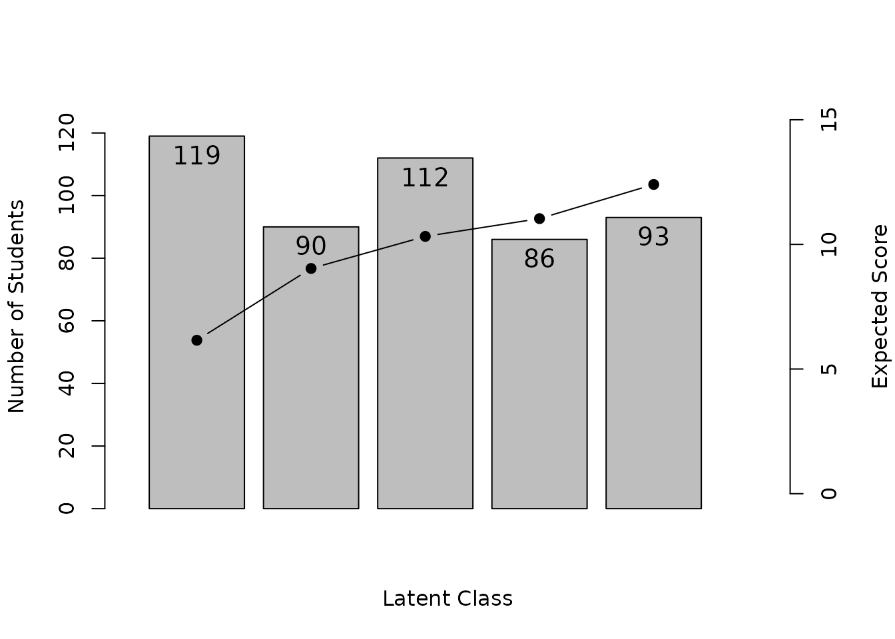
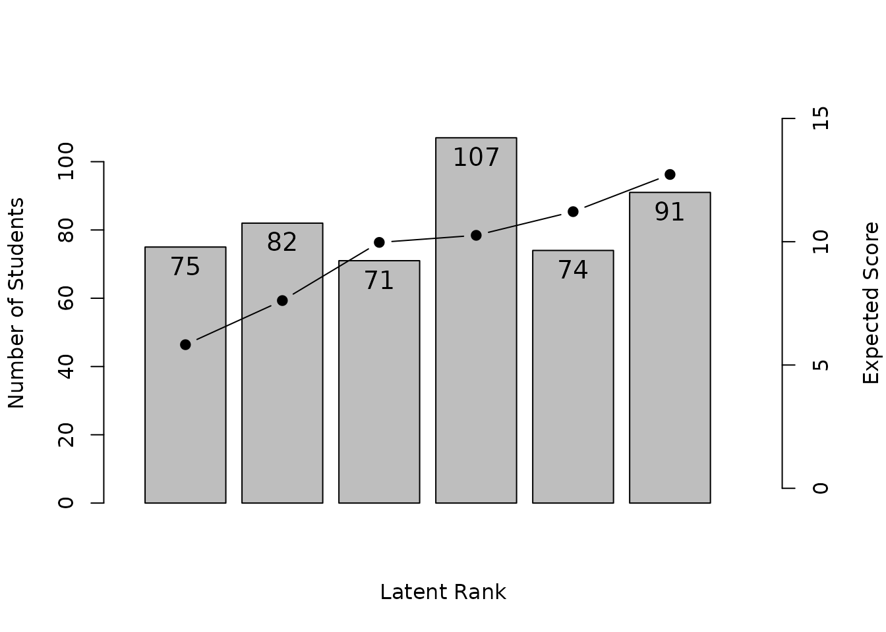

# Latent Class and Rank Analysis

> **Note**: Some computationally intensive examples below are shown with
> `eval=FALSE` to keep CRAN build times short. For full rendered output,
> see the [pkgdown
> site](https://kosugitti.github.io/exametrika/articles/latent-class-rank.html).

``` r

library(exametrika)
```

## Latent Class Analysis (LCA)

LCA classifies examinees into unordered latent classes. Specify the
dataset and the number of classes.

``` r

LCA(J15S500, ncls = 5)
#> 
#> Item Reference Profile
#>          IRP1   IRP2   IRP3   IRP4  IRP5
#> Item01 0.5899 0.6616 0.7723 0.8528 0.884
#> Item02 0.5174 0.7102 0.8282 0.8863 0.871
#> Item03 0.5913 0.6112 0.8905 0.7196 0.839
#> Item04 0.3894 0.8671 0.8214 0.8657 1.000
#> Item05 0.6729 0.6759 1.0000 0.7718 0.920
#> Item06 0.6261 0.8857 0.9478 1.0000 0.903
#> Item07 0.3530 0.7209 0.7978 0.8818 0.891
#> Item08 0.3087 0.5911 0.5724 0.9172 0.609
#> Item09 0.2856 0.5414 0.2028 0.0993 0.692
#> Item10 0.5334 0.4995 0.8109 0.6898 0.800
#> Item11 0.0977 0.0203 0.0437 0.6450 0.678
#> Item12 0.0324 0.2904 0.1232 0.2821 0.684
#> Item13 0.2753 0.5690 0.9059 0.6655 0.811
#> Item14 0.4745 0.7017 0.7876 0.9101 1.000
#> Item15 0.4076 0.6879 0.8160 0.8471 0.824
#> 
#> Test Profile
#>                               Class 1 Class 2 Class 3 Class 4 Class 5
#> Test Reference Profile          6.155   9.034  10.321  11.034  12.405
#> Latent Class Ditribution      119.000  90.000 112.000  86.000  93.000
#> Class Membership Distribution 112.597  99.086  98.336  93.200  96.780
#> 
#> Item Fit Indices
#>        model_log_like bench_log_like null_log_like model_Chi_sq null_Chi_sq
#> Item01       -265.973       -240.190      -283.343       51.567      86.307
#> Item02       -252.897       -235.436      -278.949       34.922      87.025
#> Item03       -274.316       -260.906      -293.598       26.818      65.383
#> Item04       -197.016       -192.072      -265.962        9.889     147.780
#> Item05       -210.738       -206.537      -247.403        8.402      81.732
#> Item06       -160.728       -153.940      -198.817       13.576      89.755
#> Item07       -248.566       -228.379      -298.345       40.375     139.933
#> Item08       -295.140       -293.225      -338.789        3.829      91.127
#> Item09       -275.187       -300.492      -327.842      -50.611      54.700
#> Item10       -300.309       -288.198      -319.850       24.221      63.303
#> Item11       -184.967       -224.085      -299.265      -78.237     150.360
#> Item12       -228.339       -214.797      -293.598       27.085     157.603
#> Item13       -270.948       -262.031      -328.396       17.834     132.730
#> Item14       -217.326       -204.953      -273.212       24.746     136.519
#> Item15       -269.454       -254.764      -302.847       29.380      96.166
#>        model_df null_df   NFI   RFI   IFI   TLI   CFI RMSEA     AIC     CAIC
#> Item01        9      13 0.403 0.137 0.449 0.161 0.419 0.097  33.567  -13.365
#> Item02        9      13 0.599 0.420 0.668 0.494 0.650 0.076  16.922  -30.009
#> Item03        9      13 0.590 0.408 0.684 0.509 0.660 0.063   8.818  -38.113
#> Item04        9      13 0.933 0.903 0.994 0.990 0.993 0.014  -8.111  -55.043
#> Item05        9      13 0.897 0.852 1.000 1.000 1.000 0.000  -9.598  -56.529
#> Item06        9      13 0.849 0.782 0.943 0.914 0.940 0.032  -4.424  -51.355
#> Item07        9      13 0.711 0.583 0.760 0.643 0.753 0.084  22.375  -24.556
#> Item08        9      13 0.958 0.939 1.000 1.000 1.000 0.000 -14.171  -61.102
#> Item09        9      13 1.000 1.000 1.000 1.000 1.000 0.000 -68.611 -115.542
#> Item10        9      13 0.617 0.447 0.720 0.563 0.697 0.058   6.221  -40.710
#> Item11        9      13 1.000 1.000 1.000 1.000 1.000 0.000 -96.237 -143.169
#> Item12        9      13 0.828 0.752 0.878 0.819 0.875 0.063   9.085  -37.846
#> Item13        9      13 0.866 0.806 0.929 0.893 0.926 0.044  -0.166  -47.098
#> Item14        9      13 0.819 0.738 0.877 0.816 0.873 0.059   6.746  -40.186
#> Item15        9      13 0.694 0.559 0.766 0.646 0.755 0.067  11.380  -35.552
#>             BIC
#> Item01   -4.365
#> Item02  -21.009
#> Item03  -29.113
#> Item04  -46.043
#> Item05  -47.529
#> Item06  -42.355
#> Item07  -15.556
#> Item08  -52.102
#> Item09 -106.542
#> Item10  -31.710
#> Item11 -134.169
#> Item12  -28.846
#> Item13  -38.098
#> Item14  -31.186
#> Item15  -26.552
#> 
#> Model Fit Indices
#> Number of Latent class: 5
#> Number of EM cycle: 337 
#>                    value
#> model_log_like -3651.904
#> bench_log_like -3560.005
#> null_log_like  -4350.217
#> model_Chi_sq     183.797
#> null_Chi_sq     1580.424
#> model_df         135.000
#> null_df          195.000
#> NFI                0.884
#> RFI                0.832
#> IFI                0.966
#> TLI                0.949
#> CFI                0.965
#> RMSEA              0.027
#> AIC              -86.203
#> CAIC            -790.175
#> BIC             -655.175
```

The Class Membership Matrix indicates which latent class each examinee
belongs to:

``` r

result.LCA <- LCA(J15S500, ncls = 5)
head(result.LCA$Students)
#>            Membership 1 Membership 2 Membership 3 Membership 4 Membership 5
#> Student001 0.7285244374  0.012211535  0.226232540 3.303149e-02 3.055593e-12
#> Student002 0.0220645036  0.086986302  0.830839343 6.010974e-02 1.074954e-07
#> Student003 0.0170578933  0.054109896  0.879752304 2.100872e-02 2.807118e-02
#> Student004 0.0010508039  0.223175413  0.203820488 3.286491e-01 2.433042e-01
#> Student005 0.9407961670  0.053321705  0.004873703 1.808344e-08 1.008407e-03
#> Student006 0.0002372397  0.002528968  0.029747250 8.551046e-01 1.123819e-01
#>            Estimate
#> Student001        1
#> Student002        3
#> Student003        3
#> Student004        4
#> Student005        1
#> Student006        4
```

### LCA Plot Types

- **IRP**: Item Reference Profile
- **CMP**: Class Membership Profile
- **TRP**: Test Reference Profile
- **LCD**: Latent Class Distribution

``` r

plot(result.LCA, type = "IRP", items = 1:6, nc = 2, nr = 3)
```


``` r

plot(result.LCA, type = "CMP", students = 1:9, nc = 3, nr = 3)
```


``` r

plot(result.LCA, type = "TRP")
```



``` r

plot(result.LCA, type = "LCD")
```


## Latent Rank Analysis (LRA)

LRA is similar to LCA but assumes an ordering among the latent classes
(ranks). Specify the dataset and the number of ranks.

``` r

LRA(J15S500, nrank = 6)
#> estimating method is  isotonic 
#> Item Reference Profile
#>          IRP1   IRP2   IRP3   IRP4  IRP5  IRP6
#> Item01 0.4582 0.7484 0.7484 0.7484 0.839 0.914
#> Item02 0.5601 0.5601 0.8048 0.8048 0.883 0.883
#> Item03 0.5996 0.5996 0.7590 0.7590 0.759 0.866
#> Item04 0.4668 0.4668 0.8949 0.8949 0.895 0.995
#> Item05 0.5593 0.8284 0.8284 0.8284 0.828 0.936
#> Item06 0.6196 0.7691 0.9416 0.9416 0.942 0.942
#> Item07 0.4112 0.4112 0.7402 0.8959 0.896 0.896
#> Item08 0.3485 0.3485 0.6006 0.7315 0.732 0.732
#> Item09 0.3149 0.3149 0.3149 0.3149 0.315 0.619
#> Item10 0.4438 0.6344 0.6940 0.6940 0.722 0.765
#> Item11 0.0816 0.0816 0.0816 0.0816 0.688 0.688
#> Item12 0.0653 0.0653 0.2193 0.2193 0.219 0.859
#> Item13 0.2228 0.4902 0.7527 0.7527 0.753 0.788
#> Item14 0.2894 0.7760 0.7760 0.7760 0.933 1.000
#> Item15 0.3830 0.5188 0.8164 0.8164 0.816 0.845
#> 
#> Item Reference Profile Indices
#>        Alpha     A Beta     B Gamma C
#> Item01     1 0.290    1 0.458     0 0
#> Item02     2 0.245    1 0.560     0 0
#> Item03     2 0.159    1 0.600     0 0
#> Item04     2 0.428    1 0.467     0 0
#> Item05     1 0.269    1 0.559     0 0
#> Item06     2 0.173    1 0.620     0 0
#> Item07     2 0.329    1 0.411     0 0
#> Item08     2 0.252    3 0.601     0 0
#> Item09     5 0.304    6 0.619     0 0
#> Item10     1 0.191    1 0.444     0 0
#> Item11     4 0.607    5 0.688     0 0
#> Item12     5 0.640    3 0.219     0 0
#> Item13     1 0.267    2 0.490     0 0
#> Item14     1 0.487    1 0.289     0 0
#> Item15     2 0.298    2 0.519     0 0
#> 
#> Test Profile
#>                              Rank 1 Rank 2 Rank 3  Rank 4 Rank 5 Rank 6
#> Test Reference Profile        5.824  7.613  9.973  10.259 11.219 12.727
#> Latent Rank Ditribution      75.000 82.000 71.000 107.000 74.000 91.000
#> Rank Membership Distribution 77.702 79.964 86.849  87.007 87.796 80.682
#> 
#> Item Fit Indices
#>        model_log_like bench_log_like null_log_like model_Chi_sq null_Chi_sq
#> Item01       -259.078       -240.190      -283.343       37.776      86.307
#> Item02       -254.771       -235.436      -278.949       38.669      87.025
#> Item03       -282.423       -260.906      -293.598       43.033      65.383
#> Item04       -199.586       -192.072      -265.962       15.029     147.780
#> Item05       -229.023       -206.537      -247.403       44.972      81.732
#> Item06       -170.972       -153.940      -198.817       34.064      89.755
#> Item07       -241.895       -228.379      -298.345       27.033     139.933
#> Item08       -308.979       -293.225      -338.789       31.508      91.127
#> Item09       -314.833       -300.492      -327.842       28.681      54.700
#> Item10       -308.797       -288.198      -319.850       41.198      63.303
#> Item11       -198.273       -224.085      -299.265      -51.625     150.360
#> Item12       -208.480       -214.797      -293.598      -12.633     157.603
#> Item13       -284.705       -262.031      -328.396       45.349     132.730
#> Item14       -203.455       -204.953      -273.212       -2.995     136.519
#> Item15       -266.694       -254.764      -302.847       23.862      96.166
#>        model_df null_df   NFI   RFI   IFI   TLI   CFI RMSEA     AIC     CAIC
#> Item01       10      13 0.562 0.431 0.636 0.507 0.621 0.075  17.776  -34.370
#> Item02       11      13 0.556 0.475 0.636 0.558 0.626 0.071  16.669  -40.692
#> Item03       11      13 0.342 0.222 0.411 0.277 0.388 0.076  21.033  -36.328
#> Item04       11      13 0.898 0.880 0.971 0.965 0.970 0.027  -6.971  -64.332
#> Item05       11      13 0.450 0.350 0.520 0.416 0.506 0.079  22.972  -34.389
#> Item06       11      13 0.620 0.551 0.707 0.645 0.700 0.065  12.064  -45.297
#> Item07       11      13 0.807 0.772 0.876 0.851 0.874 0.054   5.033  -52.328
#> Item08       11      13 0.654 0.591 0.744 0.690 0.738 0.061   9.508  -47.853
#> Item09       12      13 0.476 0.432 0.609 0.567 0.600 0.053   4.681  -57.895
#> Item10        9      13 0.349 0.060 0.407 0.075 0.360 0.085  23.198  -23.734
#> Item11       12      13 1.000 1.000 1.000 1.000 1.000 0.000 -75.625 -138.201
#> Item12       11      13 1.000 1.000 1.000 1.000 1.000 0.000 -34.633  -91.994
#> Item13       10      13 0.658 0.556 0.712 0.616 0.705 0.084  25.349  -26.797
#> Item14       10      13 1.000 1.000 1.000 1.000 1.000 0.000 -22.995  -75.141
#> Item15       10      13 0.752 0.677 0.839 0.783 0.833 0.053   3.862  -48.284
#>             BIC
#> Item01  -24.370
#> Item02  -29.692
#> Item03  -25.328
#> Item04  -53.332
#> Item05  -23.389
#> Item06  -34.297
#> Item07  -41.328
#> Item08  -36.853
#> Item09  -45.895
#> Item10  -14.734
#> Item11 -126.201
#> Item12  -80.994
#> Item13  -16.797
#> Item14  -65.141
#> Item15  -38.284
#> 
#> Model Fit Indices
#> Number of Latent rank: 6
#> Number of EM cycle: 65 
#>                    value
#> model_log_like -3731.964
#> bench_log_like -3560.005
#> null_log_like  -4350.217
#> model_Chi_sq     343.918
#> null_Chi_sq     1580.424
#> model_df         161.000
#> null_df          195.000
#> NFI                0.782
#> RFI                0.736
#> IFI                0.871
#> TLI                0.840
#> CFI                0.868
#> RMSEA              0.048
#> AIC               21.918
#> CAIC            -817.634
#> BIC             -656.634
```

Rank membership probabilities and rank-up/rank-down odds are calculated:

``` r

result.LRA <- LRA(J15S500, nrank = 6)
head(result.LRA$Students)
#>            Membership 1 Membership 2 Membership 3 Membership 4 Membership 5
#> Student001 0.3732015798  0.428451221   0.11219848  0.030244910  0.055903805
#> Student002 0.0200254309  0.080848295   0.57928413  0.282874219  0.036967734
#> Student003 0.0062126694  0.213151690   0.54304200  0.146385733  0.076483260
#> Student004 0.0010041013  0.009115691   0.19880904  0.293017561  0.133718573
#> Student005 0.2529143262  0.727293364   0.01394516  0.003759143  0.001964068
#> Student006 0.0001300928  0.002053329   0.04593162  0.067696979  0.766760085
#>            Membership 6 Estimate Rank-Up Odds Rank-Down Odds
#> Student001 6.653884e-09        2   0.26186990     0.87104800
#> Student002 1.950328e-07        3   0.48831688     0.13956587
#> Student003 1.472465e-02        3   0.26956613     0.39251419
#> Student004 3.643350e-01        6           NA     0.36702090
#> Student005 1.239411e-04        2   0.01917405     0.34774733
#> Student006 1.174279e-01        5   0.15314816     0.08828965
```

``` r

plot(result.LRA, type = "IRP", items = 1:6, nc = 2, nr = 3)
```


``` r

plot(result.LRA, type = "RMP", students = 1:9, nc = 3, nr = 3)
```


``` r

plot(result.LRA, type = "TRP")
```



``` r

plot(result.LRA, type = "LRD")
```


## LRA for Ordinal Data

LRA can also handle ordinal scale data. The `mic` option enforces
monotonic increasing constraints.

``` r

result.LRAord <- LRA(J15S3810, nrank = 3, mic = TRUE)
```

Score-rank relationship visualizations:

``` r

plot(result.LRAord, type = "ScoreFreq")
plot(result.LRAord, type = "ScoreRank")
```

Item-rank relationship plots:

- **ICBR**: Item Category Boundary Reference – cumulative probability
  curves for each category threshold
- **ICRP**: Item Category Response Profile – probability of each
  response category across ranks

``` r

plot(result.LRAord, type = "ICBR", items = 1:4, nc = 2, nr = 2)
plot(result.LRAord, type = "ICRP", items = 1:4, nc = 2, nr = 2)
```

Rank membership profiles for individual examinees:

``` r

plot(result.LRAord, type = "RMP", students = 1:9, nc = 3, nr = 3)
```

## LRA for Rated/Nominal Data

For multiple-choice tests (nominal scale), LRA can analyze response
patterns including distractor choices.

``` r

result.LRArated <- LRA(J35S5000, nrank = 10, mic = TRUE)
```

``` r

plot(result.LRArated, type = "ScoreFreq")
plot(result.LRArated, type = "ScoreRank")
```

``` r

plot(result.LRArated, type = "ICRP", items = 1:4, nc = 2, nr = 2)
```

## Reference

Shojima, K. (2022). *Test Data Engineering*. Springer.
